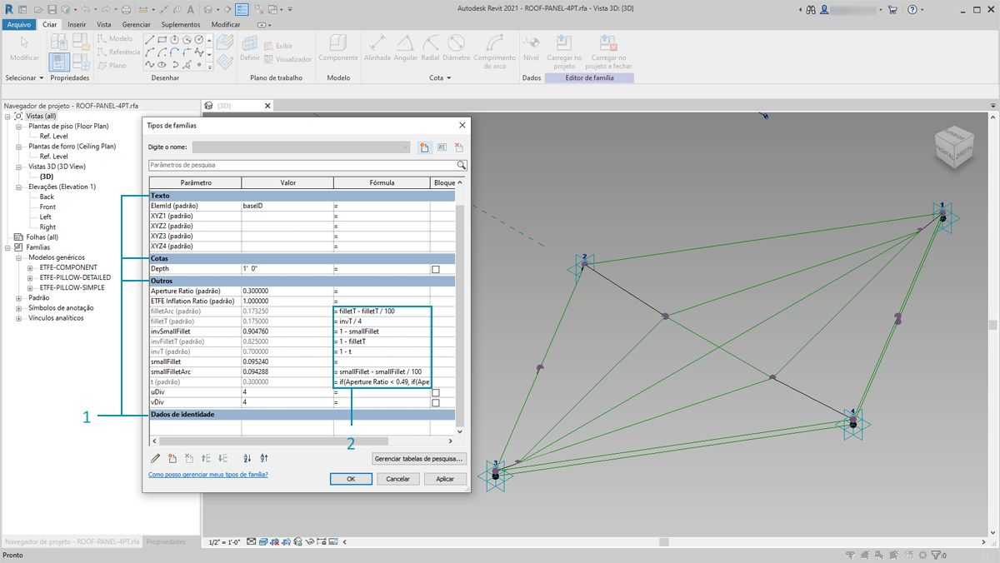
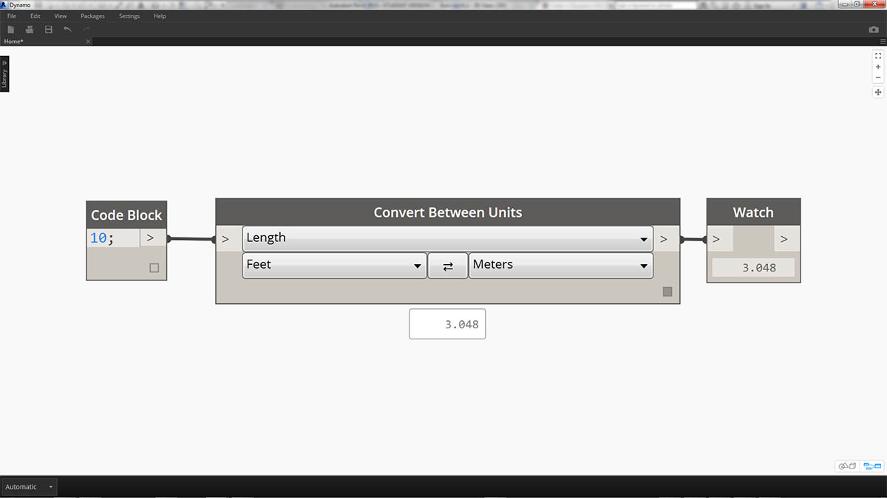
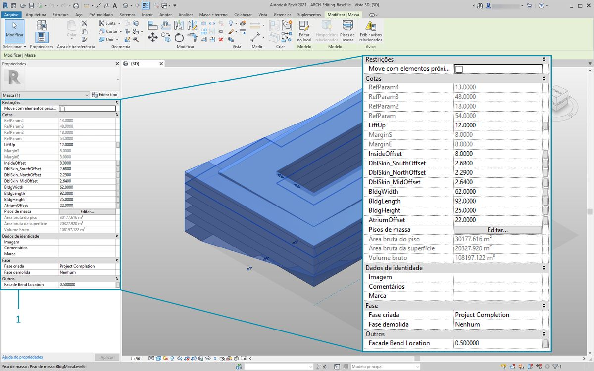
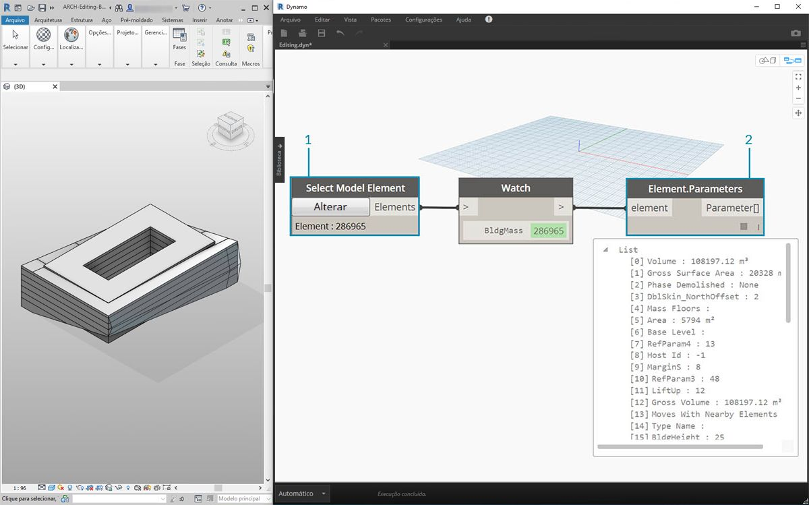
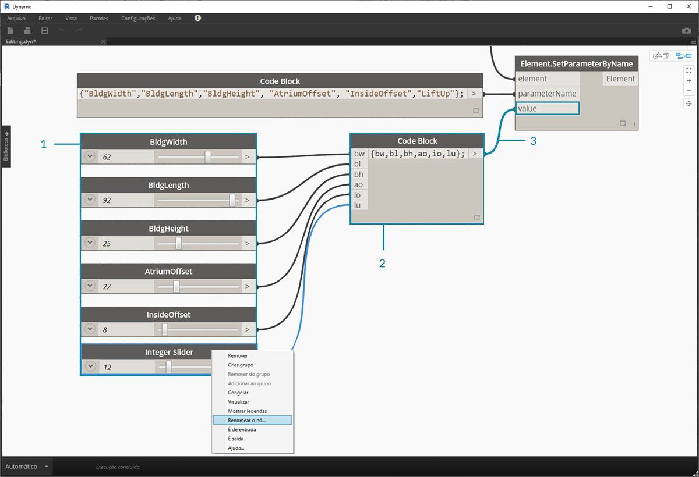
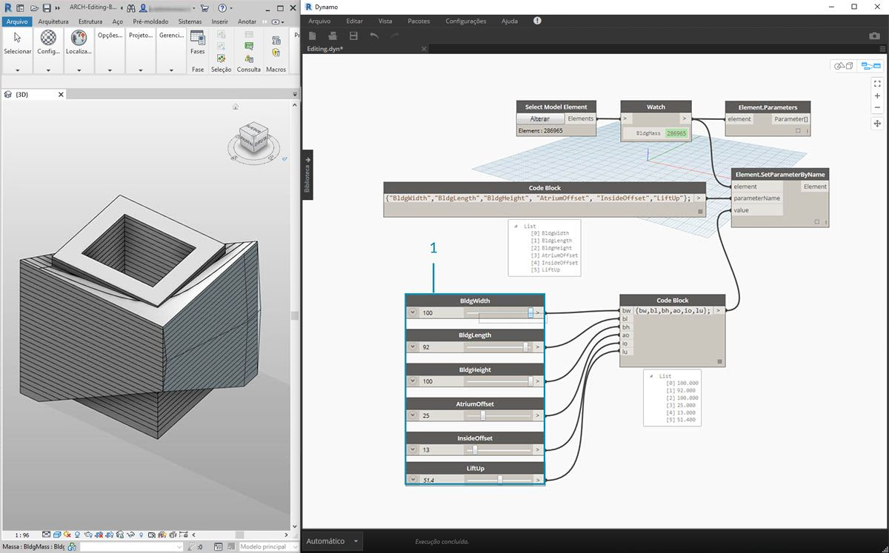
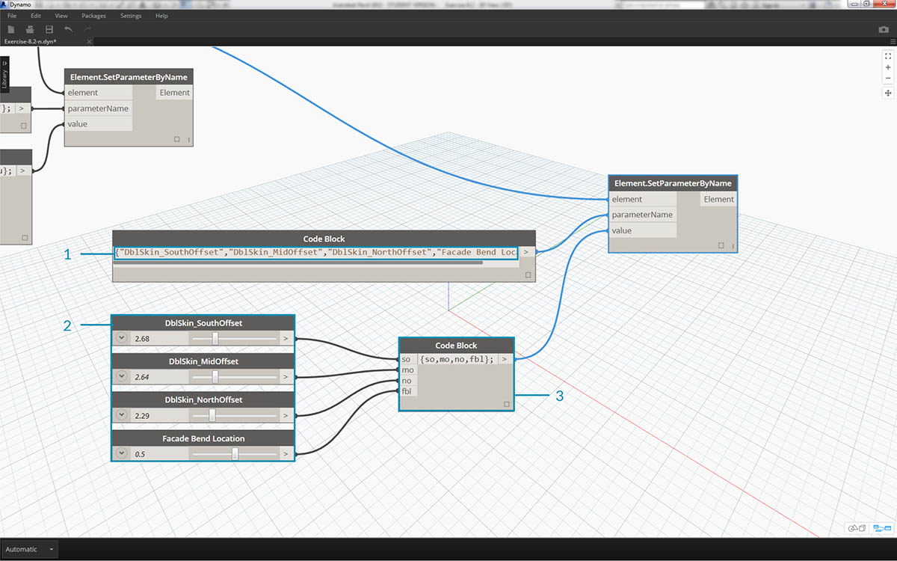
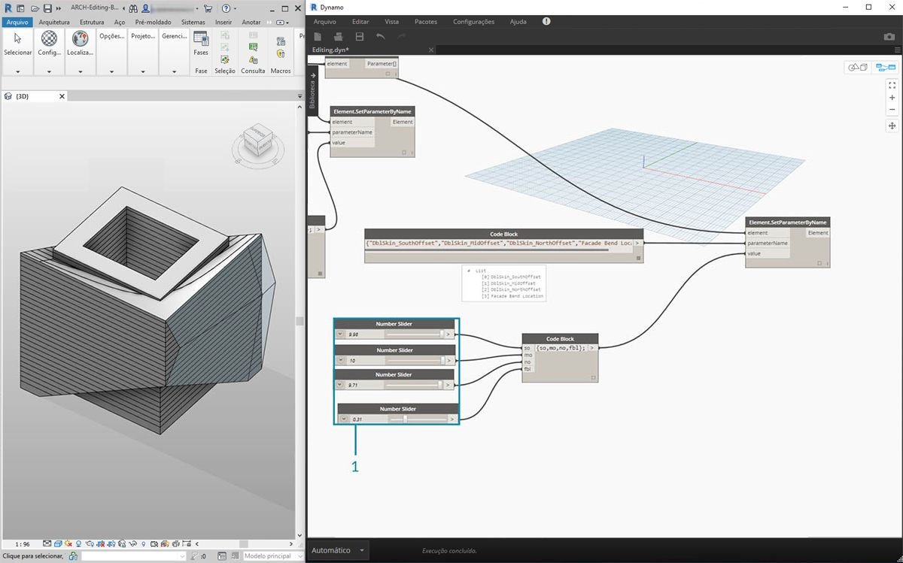

## Edição

O Dynamo possui um recurso avançado para permitir editar os parâmetros em um nível paramétrico. Por exemplo, um algoritmo gerador ou os resultados de uma simulação podem ser usados para controlar os parâmetros de uma matriz de elementos. Desta forma, um conjunto de instâncias da mesma família pode ter propriedades personalizadas no projeto do Revit.

### Parâmetros de tipo e instância


> 1. Os parâmetros de instância definem a abertura dos painéis na superfície de telhado, variando de um coeficiente de abertura de 0,1 a 0,4.
2. Os parâmetros com base no tipo são aplicados a cada elemento na superfície porque são do mesmo tipo de família. O material de cada painel, por exemplo, pode ser controlado por um parâmetro com base no tipo.



> 1. Se você já tiver configurado uma família do Revit, lembre-se de que é preciso atribuir um tipo de parâmetro (sequência de caracteres, número, cota etc.). Certifique-se de usar o tipo de dados correto ao atribuir parâmetros do Dynamo.
2. Também é possível usar o Dynamo em combinação com restrições paramétricas, definidas nas propriedades de uma família do Revit.

Como uma revisão rápida dos parâmetros no Revit, lembramos que existem parâmetros de tipo e parâmetros de instância. Ambos podem ser editados no Dynamo, mas trabalharemos com parâmetros de instância no exercício abaixo.

Observação: Depois de descobrir a aplicação abrangente de edição de parâmetros, você poderá desejar editar uma grande quantidade de elementos no Revit com o Dynamo. Essa operação pode *exigir muitos recursos computacionais*, o que significa que pode ser lenta. Se estiver editando um grande número de elementos, poderá ser conveniente usar a funcionalidade do nó “freeze” para pausar a execução das operações do Revit enquanto desenvolve o gráfico. Para obter mais informações sobre o congelamento de nós, consulte a seção “Congelar” no [capítulo de sólidos](../05_Geometry-for-Computational-Design/5-6_solids.md#freezing).

#### Unidades

A partir da versão 0.8, o Dynamo tem como base a ausência de unidades. Isso permite que o Dynamo continue sendo um ambiente de programação visual abstrato. Os nós do Dynamo que interagem com as cotas do Revit farão referência às unidades do projeto do Revit. Por exemplo, se você estiver definindo um parâmetro de comprimento no Revit no Dynamo, o número no Dynamo para o valor corresponderá às unidades padrão no projeto do Revit. O exercício abaixo funciona em metros.



> Para uma conversão rápida das unidades, use o nó *“Convert Between Units”* (Converter entre unidades). Essa é uma ferramenta útil para converter as unidades de Comprimento, Área e Volume em tempo real.

### Exercício

> Faça o download dos arquivos de exemplo que acompanham este exercício (clique com o botão direito do mouse e selecione “Salvar link como...”). É possível encontrar uma lista completa de arquivos de exemplo no Apêndice.

> 1. [Editing.dyn](datasets/8-3/Editing.dyn)
2. [ARCH-Editing-BaseFile.rvt](datasets/8-3/ARCH-Editing-BaseFile.rvt)

Este exercício se concentra na edição de elementos do Revit sem executar a operação geométrica no Dynamo. Não estamos importando a geometria do Dynamo aqui, apenas editando os parâmetros em um projeto do Revit. Este exercício é básico e para os usuários mais avançados do Revit, observe que estes são parâmetros de instância de uma massa, mas a mesma lógica pode ser aplicada a uma matriz de elementos para personalizar em grande escala. Tudo isso é feito com o nó “Element.SetParameterByName”.



> Comece com o arquivo de exemplo do Revit para esta seção. Removemos os elementos estruturais e as treliças adaptativas da seção anterior. Neste exercício, vamos nos concentrar em uma montagem paramétrica no Revit e manipulá-la no Dynamo.

> 1. Selecionando a construção em massa no Revit, vemos uma matriz de parâmetros de instância no painel Propriedades.



> 1. Selecione a massa da construção com o nó *“Select Model Element”* (Selecionar elemento do modelo).
2. É possível consultar todos os parâmetros dessa massa com o nó *“Element.Parameters”*. Isso inclui os parâmetros de tipo e instância.


> 1. Consulte o nó *Element.Parameters* para localizar os parâmetros alvo. Também é possível visualizar o painel Propriedades na etapa anterior para escolher quais nomes de parâmetros desejamos editar. Neste caso, estamos procurando os parâmetros que afetam os grandes movimentos geométricos na massa da construção.
2. Faremos alterações no elemento do Revit usando o nó *Element.SetParameterByName*.
3. Usando o *code block*, definimos uma lista desses parâmetros, com cada item entre aspas para indicar uma sequência de caracteres. Também é possível usar o nó List.Create com uma série de nós *“string”* conectados a várias entradas. O bloco de código é simplesmente mais rápido e fácil. Basta assegurar que a sequência de caracteres coincida com o nome exato no Revit, com distinção de maiúsculas e minúsculas: ```{"BldgWidth","BldgLength","BldgHeight", "AtriumOffset", "InsideOffset","LiftUp"};```



> 1. Também queremos especificar valores para cada parâmetro. Adicione seis *“controles deslizantes de números inteiros”* na tela e renomeie de acordo com o parâmetro correspondente na lista. Além disso, defina os valores de cada controle deslizante para a imagem acima. Em ordem de cima para baixo: ```62,92,25,22,8,12```
2. Defina outro *bloco de código* com uma lista do mesmo tamanho que os nomes de parâmetro. Neste caso, nomeamos variáveis (sem aspas) que criam entradas para o *bloco de código.* Conecte os *controles deslizantes* a cada entrada respectiva: ```{bw,bl,bh,ao,io,lu};```
3. Conecte o *code block* ao nó “*Element.SetParameterByName*”*. Com a execução marcada automaticamente, veremos os resultados automaticamente.

**Observação: Esta demonstração funciona com parâmetros de instância, mas não com parâmetros de tipo.*

 Assim como no Revit, muitos desses parâmetros dependem uns dos outros. É claro que há combinações nas quais a geometria pode ser interrompida. Podemos solucionar esse problema com fórmulas definidas nas propriedades de parâmetro ou definir uma lógica semelhante com as operações matemáticas no Dynamo (esse será um desafio adicional se você desejar expandir o exercício).

> 1. Essa combinação oferece um novo projeto moderno para a massa da construção: ```100;92;100;25;13;51,4```



> 1. Vamos copiar o gráfico e focar na vidraça da fachada que abrigará o sistema de treliça. Isolamos quatro parâmetros neste caso: ```{“DblSkin_SouthOffset","DblSkin_MidOffset","DblSkin_NorthOffset","Facade Bend Location”};```
2. Adicionalmente, criamos *number sliders* e os renomeamos com os parâmetros apropriados. Os três primeiros controles deslizantes de cima para baixo devem ser remapeados para um domínio de [0,10], enquanto o controle deslizante final, *“Facade Bend Location”*, deve ser remapeado com um domínio de [0,1]. Esses valores, de cima para baixo, devem começar com estes valores (embora sejam arbitrários): ```2,68;2,64;2,29;0,5```
3. Defina um novo *code block* e conecte os controles deslizantes: ```{so,mo,no,fbl};```



> 1. Ao alterar os *sliders* nesta parte do gráfico, podemos tornar a vidraça da fachada muito mais substancial: ```9,98;10,0;9,71;0,31```

