## Criando

É possível criar uma matriz de elementos do Revit no Dynamo com o controle paramétrico completo. Os nós do Revit no Dynamo oferecem a capacidade de importar elementos de geometrias genéricas para tipos de categoria específicos (como paredes e pisos). Nesta seção, vamos focar na importação de elementos parametricamente flexíveis com componentes adaptativos.


### Componentes adaptativos

Um componente adaptativo é uma categoria de família flexível que é bem adequada para aplicativos gerativos. Após a instanciação, é possível criar um elemento geométrico complexo que é guiado pela localização fundamental dos pontos adaptativos.

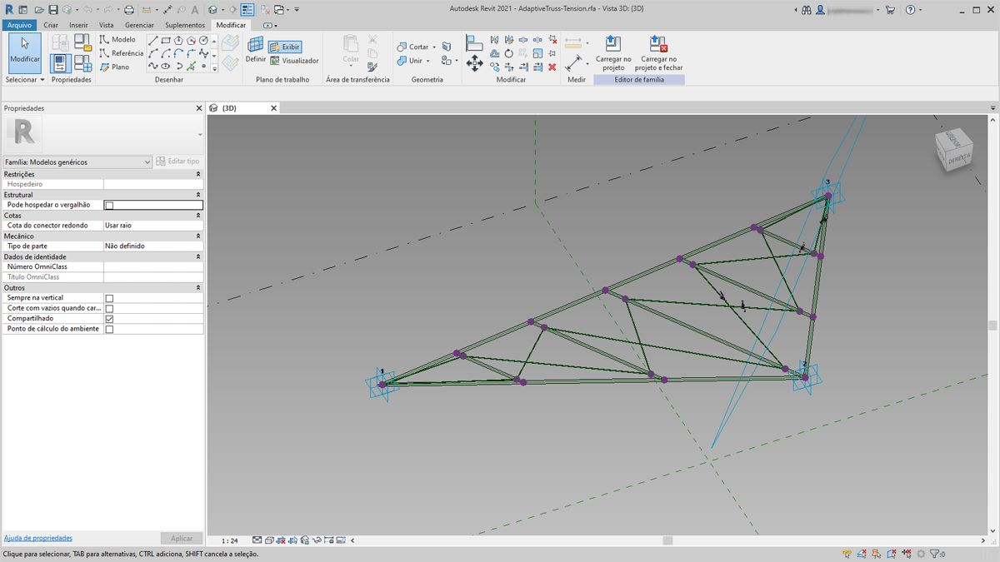

> Um exemplo de um componente adaptativo de três pontos no editor de família. Isso gera uma treliça que é definida pela posição de cada ponto adaptativo. No exercício abaixo, usaremos esse componente para gerar uma série de treliças em uma fachada.

#### Princípios de interoperabilidade

O componente adaptativo é um bom exemplo das práticas recomendadas de interoperabilidade. É possível criar uma matriz de componentes adaptativos definindo os pontos adaptativos fundamentais. E, ao transferir esses dados para outros programas, temos a capacidade de reduzir a geometria a dados simples. A importação e a exportação com um programa como o Excel seguem uma lógica similar.

Suponha que um consultor de fachadas deseje saber a localização dos elementos da treliça sem precisar analisar a geometria totalmente articulada. Na preparação para a fabricação, o consultor pode fazer referência à localização de pontos adaptativos para gerar novamente a geometria em um programa como o Inventor.

O fluxo de trabalho que configuraremos no exercício abaixo nos permite acessar todos esses dados ao criar a definição para a criação de elementos do Revit. Nesse processo, é possível mesclar a conceitualização, a documentação e a fabricação em um fluxo de trabalho contínuo. Isso cria um processo mais inteligente e eficiente para a interoperabilidade.

#### Vários elementos e listas


O exercício abaixo detalhará como o Dynamo referencia os dados para a criação de elementos do Revit. Para gerar vários componentes adaptativos, definiremos uma lista de listas em que cada lista tem três pontos que representam cada ponto do componente adaptativo. Isso será levado em consideração à medida que gerenciarmos as estruturas de dados no Dynamo.

### Exercício

> Faça o download dos arquivos de exemplo que acompanham este exercício (clique com o botão direito do mouse e selecione “Salvar link como...”). É possível encontrar uma lista completa de arquivos de exemplo no Apêndice.

> 1. [Creating.dyn](datasets/8-4/Creating.dyn)
2. [ARCH-Creating-BaseFile.rvt](datasets/8-4/ARCH-Creating-BaseFile.rvt)

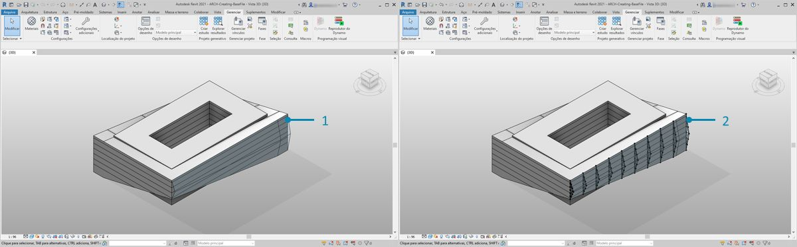

> Começando com o arquivo de exemplo desta seção (ou continuando com o arquivo do Revit da sessão anterior), vemos a mesma massa do Revit.

> 1. Esse é o arquivo conforme aberto.
2. Esse é o sistema de treliça que criamos com o Dynamo, vinculado de forma inteligente à massa do Revit.

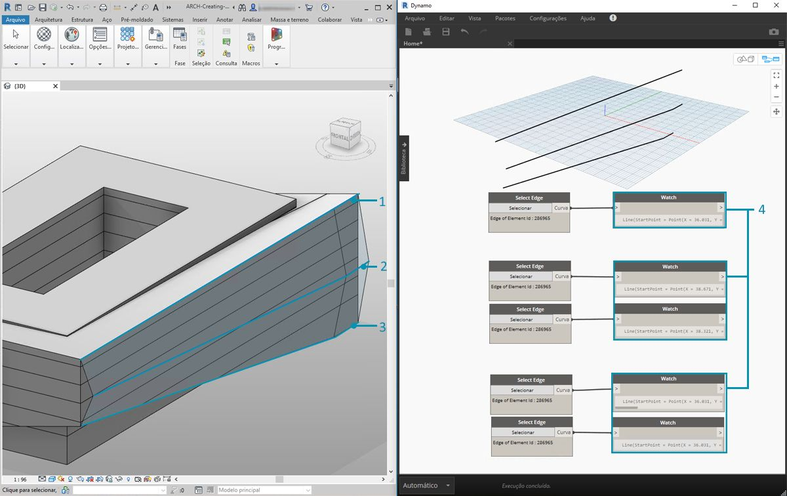

> Usamos os nós *“Selecionar o elemento do modelo”* e *“Selecionar face”*, agora estamos descendo um degrau na hierarquia da geometria e usando *“Selecionar aresta”*. Com o solucionador do Dynamo definido para executar *“Automático”*, o gráfico será continuamente atualizado com as alterações no arquivo do Revit. A aresta que estamos selecionando é vinculada dinamicamente à topologia do elemento do Revit. Desde que a topologia* não seja alterada, a conexão permanecerá vinculada entre o Revit e o Dynamo.

> 1. Selecione a curva superior da fachada de vidraça. Ela se expande por todo o comprimento da construção. Se você estiver tendo problemas para selecionar a aresta, lembre-se de escolher a seleção no Revit ao passar o mouse sobre a aresta e pressionar *“Tab”* até que a aresta desejada seja realçada.
2. Usando dois nós *“Selecionar aresta”*, selecione cada aresta que representa o declive transversal no meio da fachada.
3. Faça o mesmo para as arestas inferiores da fachada no Revit.
4. Os nós de *Inspeção* revelam que agora temos linhas no Dynamo. Isso é convertido automaticamente na geometria do Dynamo, já que as próprias arestas não são elementos do Revit. Essas curvas são as referências que usaremos para instanciar as treliças adaptativas na fachada.

**Observação: Para manter uma topologia consistente, estamos nos referindo a um modelo que não tenha mais faces ou arestas adicionadas. Embora os parâmetros possam alterar sua forma, a forma como ele é construído permanece consistente.*


> Primeiro, precisamos unir as curvas e mesclá-las em uma lista. Dessa forma, podemos *“agrupar”* as curvas para realizar operações de geometria.

> 1. Crie uma lista para as duas curvas no meio da fachada.
2. Una as duas curvas numa PolyCurve conectando o componente *List.Create* em um nó *Polycurve.ByJoinedCurves*.
3. Crie uma lista para as duas curvas na parte inferior da fachada.
4. Una as duas curvas numa PolyCurve conectando o componente *List.Create* em um nó *Polycurve.ByJoinedCurves*.
5. Por fim, una as três curvas principais (uma linha e duas PolyCurves) em uma lista.

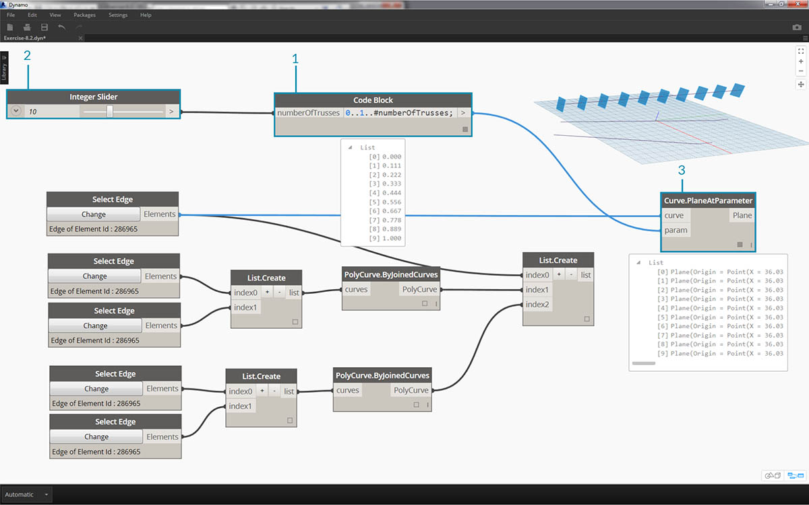

> Desejamos aproveitar a curva superior, que é uma linha, e representa a extensão completa da fachada. Vamos criar planos ao longo desta linha para fazer a interseção com o conjunto de curvas que agrupamos em uma lista.

> 1. Com um *bloco de código*, defina um intervalo usando a sintaxe: ```0..1..#numberOfTrusses;```
2. Conecte um *controle deslizante de valor inteiro* à entrada do bloco de código. Como talvez você tenha adivinhado, isso representará o número de treliças. Observe que a barra deslizante controla o número de itens no intervalo definido de *0 *a *1*.
3. Conecte o *bloco de código* à entrada de *param* de um nó *“Curve.PlaneAtParameter”* e conecte a aresta superior à entrada da *curva*. Isso nos dará dez planos uniformemente distribuídos pela extensão da fachada.


> Um plano é uma parte abstrata da geometria, representando um espaço bidimensional infinito. Os planos são excelentes para contorno e interseção, conforme configuramos nesta etapa.

> 1. Usando o nó *Geometry.Intersect* (observe a amarra do produto cartesiano), conecte *Curve.PlaneAtParameter* à entrada *entidade* do nó *Geometry.Intersect*. Conecte o nó principal *List.Create* à entrada de *geometria*. Agora, vemos pontos na viewport do Dynamo que representam a interseção de cada curva com os planos definidos.


> Observe que a saída é uma lista de listas de listas. Para nossos fins, há muitas listas. Desejamos fazer uma mesclagem parcial aqui. Precisamos descer um degrau na lista e mesclar o resultado. Para fazer isso, usaremos a operação *List.Map*, conforme discutido no capítulo da lista da introdução.

> 1. Conecte o nó *Geometry.Intersect* na entrada da lista de *List.Map*.
2. Conecte um nó *Mesclar* à entrada f(x) de *List.Map*. Os resultados fornecem três listas, cada uma com uma contagem igual ao número de treliças.
3. Precisamos alterar esses dados. Se desejarmos instanciar a treliça, precisaremos usar o mesmo número de pontos adaptativos, conforme definido na família. Esse é um componente adaptativo de três pontos, portanto, em vez de três listas com 10 itens cada (numberOfTrusses), desejamos 10 listas de três itens cada. Desta forma, podemos criar 10 componentes adaptativos.
4. Conecte o *List.Map* a um nó *List.Transpose*. Agora, temos a saída de dados desejada.
5. Para confirmar se os dados estão corretos, adicione um nó *Polygon.ByPoints* à tela e verifique novamente com a visualização do Dynamo.


> Da mesma forma que criamos os polígonos, é possível organizar os componentes adaptativos.

> 1. Adicione um nó *AdaptiveComponent.ByPoints* à tela, conecte o nó *List.Transpose* à entrada de *pontos*.
2. Usando um nó *Tipos de família*, selecione a família *“AdaptiveTruss”* e conecte-a à entrada *familySymbol* do nó *AdaptiveComponent.ByPoints*.

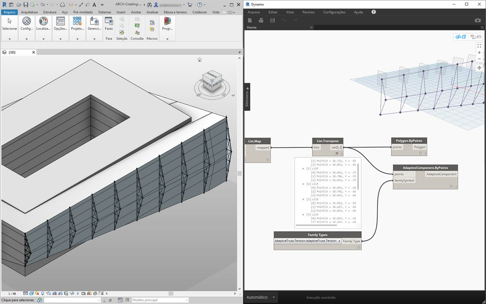

> Ao verificar o Revit, agora temos as dez treliças espaçadas uniformemente na fachada.

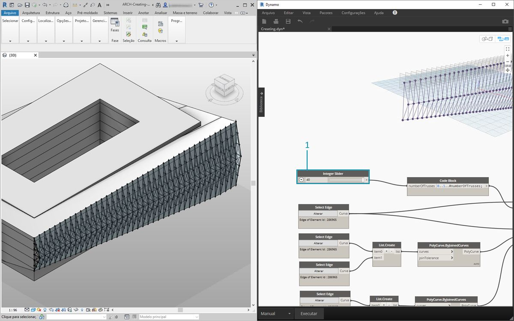

> 1. “Flexibilizando” o gráfico, vamos aumentar o *numberOfTrusses* para *40* alterando o *controle deslizante*. Muitas treliças, o que não é muito realista, mas o vínculo paramétrico está funcionando.

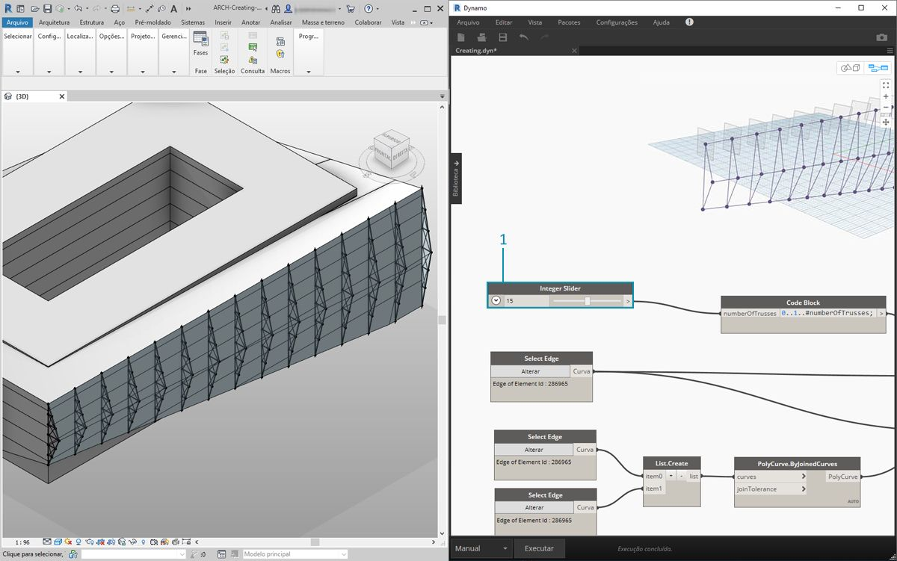

> 1. Para controlar o sistema de treliça, vamos arbitrar um valor de *15* para *numberOfTrusses*.

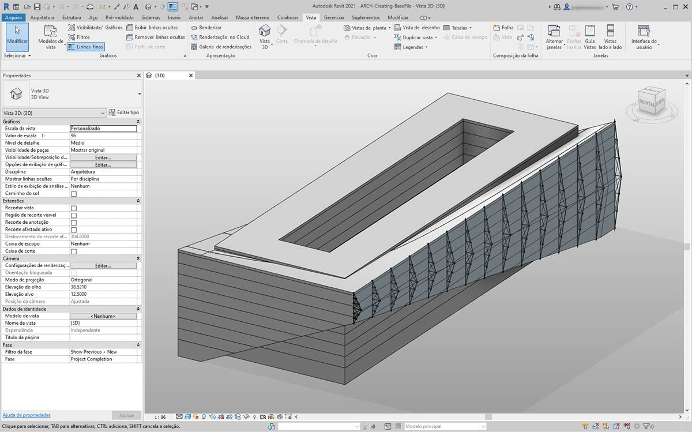

> E, para o teste final, ao selecionar a massa no Revit e editar os parâmetros de instância, podemos alterar a forma da construção e observar a treliça fazer o mesmo. Lembre-se: este gráfico do Dynamo precisa estar aberto para que essa atualização seja exibida, e o vínculo será interrompido assim que for fechado.

### Elementos DirectShape

Outro método para importar a geometria paramétrica do Dynamo no Revit é com o DirectShape. Em resumo, o elemento DirectShape e as classes relacionadas oferecem suporte à capacidade de armazenar formas geométricas criadas externamente em um documento do Revit. A geometria pode incluir sólidos ou malhas fechadas. O DirectShape foi projetado principalmente para importar formas de outros formatos de dados, como IFC ou STEP, onde não há informações suficientes disponíveis para criar um elemento “real” do Revit. Como o fluxo de trabalho IFC e STEP, a funcionalidade DirectShape funciona bem com a importação de geometrias criadas pelo Dynamo em projetos do Revit como elementos reais.

Vamos detalhar e exercitar a importação da geometria do Dynamo como uma DirectShape em nosso projeto do Revit. Usando esse método, podemos atribuir a categoria, o material e o nome de uma geometria importada, mantendo um vínculo paramétrico com o gráfico do Dynamo.

### Exercício

> Faça o download dos arquivos de exemplo que acompanham este exercício (clique com o botão direito do mouse e selecione “Salvar link como...”). É possível encontrar uma lista completa de arquivos de exemplo no Apêndice.

> 1. [DirectShape.dyn](datasets/8-4/DirectShape.dyn)
2. [ARCH-DirectShape-BaseFile.rvt](datasets/8-4/ARCH-DirectShape-BaseFile.rvt)

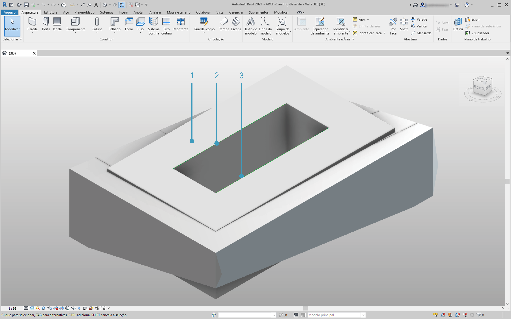

> Comece abrindo o arquivo de exemplo desta lição: ARCH-DirectShape-BaseFile.rvt.

> 1. Na vista 3D, vemos a massa da construção da lição anterior.
2. Ao longo da aresta do átrio há uma curva de referência, vamos usá-la como uma curva para fazer referência no Dynamo.
3. Ao longo da aresta oposta do átrio, há outra curva de referência à qual também vamos fazer referência no Dynamo.


> 1. Para fazer referência à nossa geometria no Dynamo, vamos usar *Selecionar o elemento do modelo* para cada membro do Revit. Selecione a massa no Revit e importe a geometria para o Dynamo usando *Element.Faces*. A massa agora deve estar visível na visualização do Dynamo.
2. Importe uma curva de referência para o Dynamo usando *Selecionar o elemento do modelo* e *CurveElement.Curve*.
3. Importe a outra curva de referência para o Dynamo usando *Selecionar o elemento do modelo* e *CurveElement.Curve*.


> 1. Diminuindo o zoom e efetuando o pan à direita no gráfico de exemplo, vemos um grupo grande de nós: são operações geométricas que geram a estrutura do telhado da treliça visível na visualização do Dynamo. Esses nós são criados usando a funcionalidade *Nó para código* conforme discutido na seção [bloco de código](../07_Code-Block/7-2_Design-Script-syntax.md#Node) da introdução.
2. A estrutura é guiada por três parâmetros principais: Deslocamento diagonal, Curvatura e Raio.


> Efetue o zoom em uma visualização próxima dos parâmetros para este gráfico. Podemos flexibilizá-la para obter resultados de geometria diferentes.

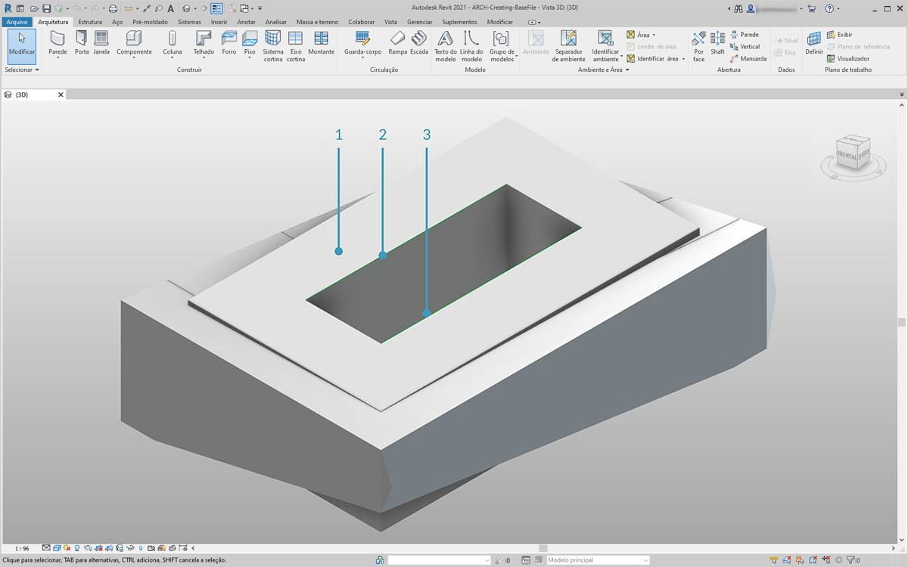

> 1. Ao soltar o nó *DirectShape.ByGeometry* na tela, vemos que ele tem quatro entradas: **geometria, categoria, material** e **nome**.
2. A geometria será o sólido criado com base na parte de criação da geometria do gráfico.
3. A entrada de categoria é selecionada usando o nó suspenso *Categorias*. Neste caso, usaremos “Framing estrutural”.
4. A entrada de material é selecionada por meio da matriz de nós acima. Embora possa ser mais simplesmente definida como “Padrão” neste caso.

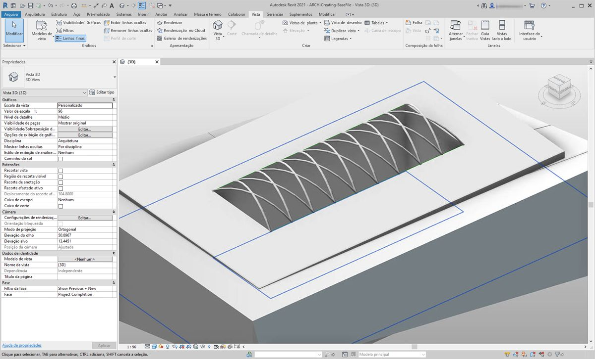

> Após executar o Dynamo, de volta no Revit, temos a geometria importada no telhado em nosso projeto. Esse é um elemento do framing estrutural em vez de um modelo genérico. O vínculo paramétrico para o Dynamo permanece intacto.

