## Personalização

Apesar de anteriormente termos examinado a edição de uma massa de construção básica, desejamos aprofundar o vínculo do Dynamo/Revit editando um grande número de elementos de uma só vez. Personalizar em uma grande escala se torna mais complexo, já que as estruturas de dados requerem operações de lista mais avançadas. No entanto, os princípios subjacentes por trás de sua execução são fundamentalmente os mesmos. Vamos estudar algumas oportunidades para análise com base em um conjunto de componentes adaptativos.

#### Localização do ponto

Suponha que criamos uma faixa de componentes adaptativos e que desejamos editar os parâmetros com base nas localizações dos pontos. Os pontos, por exemplo, podem determinar um parâmetro de espessura que está relacionado com a área do elemento. Ou, eles poderiam determinar um parâmetro de opacidade relacionado à exposição solar durante o ano. O Dynamo permite a conexão da análise com os parâmetros em algumas etapas simples e exploraremos uma versão básica no exercício abaixo.


> Consulte os pontos adaptativos de um componente adaptativo selecionado usando o nó *AdaptiveComponent.Locations*. Isso nos permite trabalhar com uma versão abstrata de um elemento do Revit para análise.

Ao extrair a localização dos pontos dos componentes adaptativos, podemos executar uma faixa de análise para aquele elemento. Um componente adaptativo de quatro pontos permitirá estudar o desvio do plano para um determinado painel, por exemplo.

#### Análise da orientação solar


> Use o remapeamento para mapear um conjunto de dados para um intervalo de parâmetros. Essa é uma ferramenta fundamental usada em um modelo paramétrico e vamos demonstrá-la no exercício abaixo.

Usando o Dynamo, é possível usar as localizações dos pontos dos componentes adaptativos para criar um plano de melhor ajuste para cada elemento. Também podemos consultar a posição do sol no arquivo do Revit e estudar a orientação relativa do plano em relação ao sol em comparação com outros componentes adaptativos. Vamos definir isso no exercício abaixo, criando um ambiente algorítmico.

### Exercício

> Faça o download dos arquivos de exemplo que acompanham este exercício (clique com o botão direito do mouse e selecione “Salvar link como...”). É possível encontrar uma lista completa de arquivos de exemplo no Apêndice.

> 1. [Customizing.dyn](datasets/8-5/Customizing.dyn)
2. [ARCH-Customizing-BaseFile.rvt](datasets/8-5/ARCH-Customizing-BaseFile.rvt)

Este exercício expandirá as técnicas demonstradas na seção anterior. Neste caso, estamos definindo uma superfície paramétrica com base em elementos do Revit, instanciando componentes adaptativos de quatro pontos e, em seguida, editando-os com base na orientação em relação ao sol.

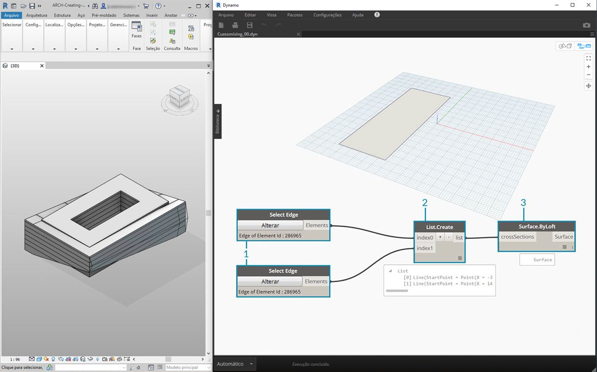

> 1. Comece selecionando duas arestas com o nó *“Selecionar aresta”*. As duas arestas são os vãos longos do átrio.
2. Combine as duas arestas em uma lista com o nó *List.Create*.
3. Crie uma superfície entre as duas arestas com *Surface.ByLoft*.

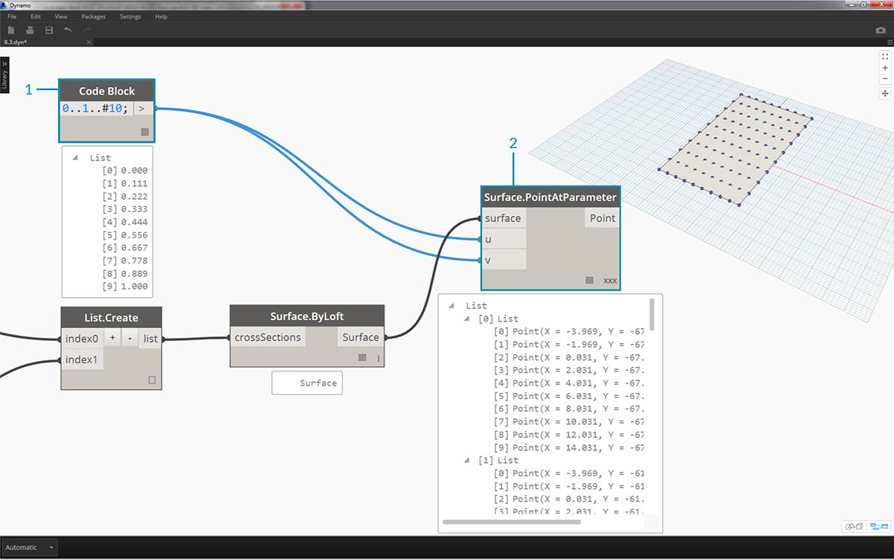

> 1. Usando o *bloco de código*, defina um intervalo de 0 a 1 com 10 valores uniformemente espaçados: ```0..1..#10;```
2. Conecte o *bloco de código* às entradas *u *e *v* de um nó *Surface.PointAtParameter* e conecte o nó *Surface.ByLoft* à entrada *superfície*. Clique com o botão direito do mouse no nó e altere a *amarra* para *Produto transversal*. Isso fornecerá uma grade de pontos na superfície.

Essa grade de pontos serve como os pontos de controle para uma superfície definida parametricamente. Queremos extrair as posições “u” e “v” de cada um desses pontos para que possamos conectá-los em uma fórmula paramétrica e manter a mesma estrutura de dados. É possível fazer isso consultando as localizações dos parâmetros dos pontos que acabamos de criar.


> 1. Adicione um nó *Surface.ParameterAtPoint* à tela e conecte as entradas como mostrado acima.
2. Consulte os valores *u* desses parâmetros com o nó *UV.U*.
3. Consulte os valores *v* desses parâmetros com o nó *UV.V*.
4. Os resultados mostram os valores *u* e *v* correspondentes a cada ponto da superfície. Agora, temos uma faixa de *0* a *1* para cada valor, na estrutura de dados apropriada, portanto, estamos prontos para aplicar um algoritmo paramétrico.


> 1. Adicione um *bloco de código* à tela e insira o código: ```Math.Sin(u*180)*Math.Sin(v*180)*w;``` Essa é uma função paramétrica que cria um montículo senoidal de uma superfície plana.
2. A entrada *u* se conecta a *UV.U*.
3. A entrada *v* se conecta a *UV.V*.
4. A entrada *w* representa a *amplitude* da forma, portanto, anexamos um *controle deslizante de número* a ela.


> 1. Agora, temos uma lista de valores conforme definido pelo algoritmo. Vamos usar essa lista de valores para mover os pontos para cima na direção *+Z*. Usando *Geometry.Translate*, conecte o *bloco de código *a *zTranslation* e o *Surface.PointAtParameter* à entrada *geometria*. Você deve ver os novos pontos exibidos na visualização do Dynamo.
2. Finalmente, criamos uma superfície com o nó *NurbsSurface.ByPoints*, conectando o nó da etapa anterior à entrada de pontos. Dessa forma, obtemos uma superfície paramétrica. Sinta-se à vontade para arrastar o controle deslizante para ver o encolhimento e aumento dos montículos.

Com a superfície paramétrica, queremos definir uma forma de aplicar painéis para criar matrizes em quatro pontos de componentes adaptativos. O Dynamo não tem uma funcionalidade pronta para uso para aplicar painéis à superfície, portanto, podemos consultar a comunidade para obter pacotes do Dynamo úteis.

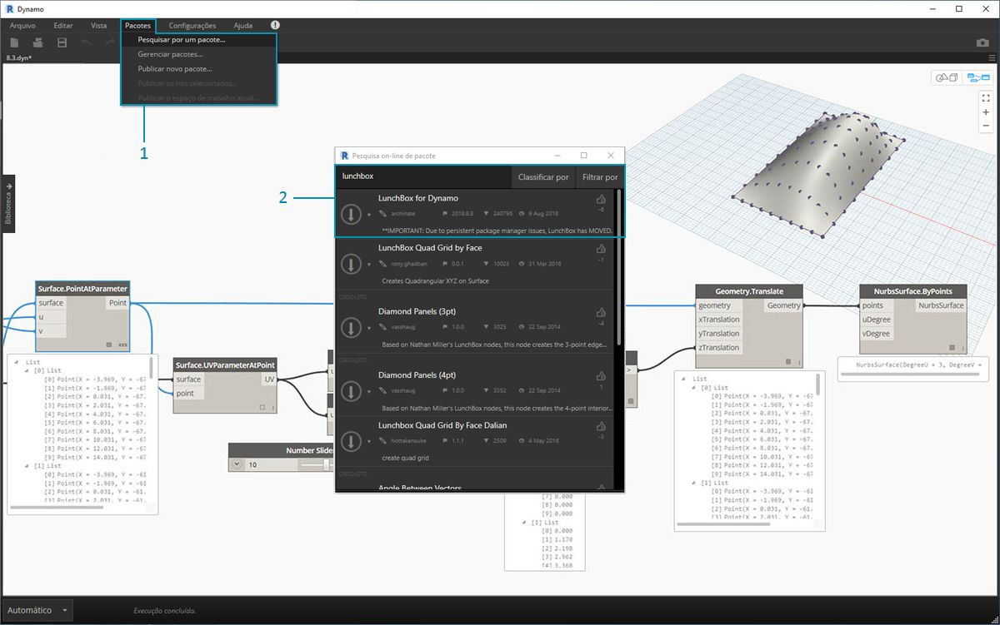

> 1. Vá para *Pacotes>Procurar um pacote...*
2. Procure *“LunchBox”* e faça o download de *“LunchBox for Dynamo”*. Esse pacote tem um conjunto de ferramentas muito útil para operações de geometria, como este.


> 1. Após o fazer o download, você terá acesso completo ao conjunto LunchBox. Procure *“Grade Quad”* e selecione *“LunchBox Quad Grid By Face”*. Conecte a superfície paramétrica à entrada *superfície* e defina as divisões *U* e *V* como *15*. Você deve ver uma superfície com painéis quad na visualização do Dynamo.


> Se estiver curioso sobre sua configuração, clique duas vezes no nó *Lunch Box* e veja como foi feito.

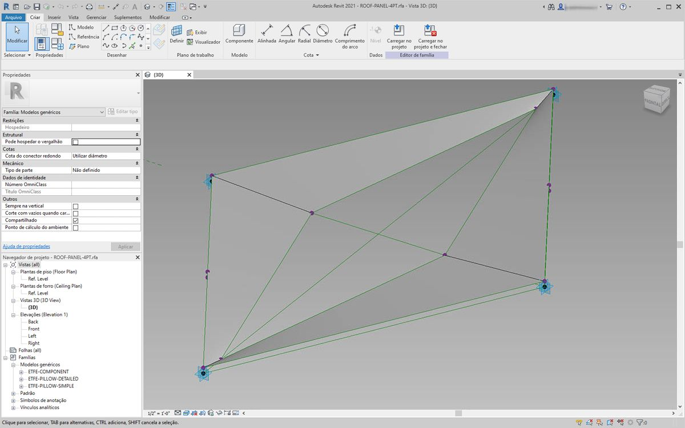

> De volta ao Revit, vamos dar uma olhada rápida no componente adaptativo que estamos usando aqui. Não é necessário seguir, mas este é o painel do telhado que vamos instanciar. É um componente adaptativo de quatro pontos que é uma representação bruta de um sistema ETFE. A abertura do vazio central está em um parâmetro chamado *“ApertureRatio”*.


> 1. Estamos prestes a instanciar uma grande quantidade de geometria no Revit, portanto, certifique-se de ativar o solucionador do Dynamo para *“Manual”*.
2. Adicione um nó *Tipos de família* à tela e selecione *“ROOF-PANEL-4PT”*.
3. Adicione um nó *AdaptiveComponent.ByPoints* à tela, conecte *Pts do painel* da saída *“LunchBox Quad Grid by Face”* à entrada *pontos*. Conecte o nó *Tipos de família* à entrada *familySymbol*.
4. Pressione *Executar*. O Revit terá que *pensar* um pouco enquanto a geometria está sendo criada. Se demorar muito, reduza o número de *“15” do bloco de código* para um número menor. Isso reduzirá o número de painéis no telhado.

*Observação: Se o Dynamo estiver demorando muito para calcular os nós, talvez seja recomendável usar a funcionalidade do nó “congelar” para pausar a execução das operações do Revit enquanto desenvolve o gráfico. Para obter mais informações sobre o congelamento de nós, consulte a seção “Congelar” no [capítulo de sólidos](../05_Geometry-for-Computational-Design/5-6_solids.md#freezing).*

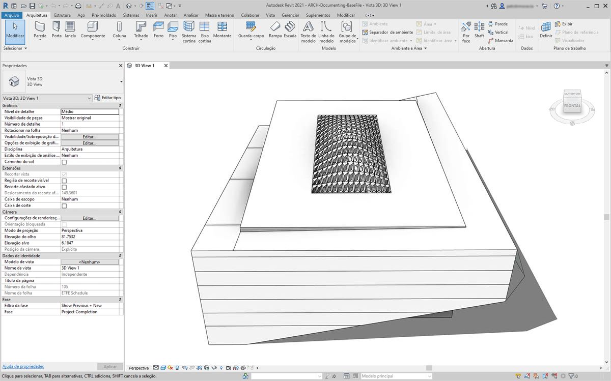

> De volta ao Revit, temos a matriz de painéis no telhado.

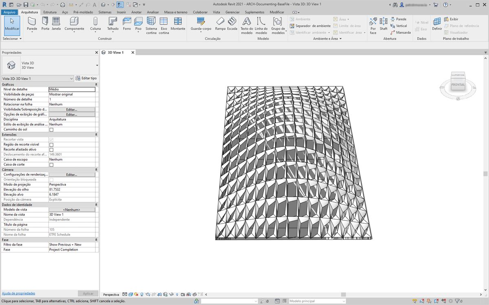

> Aproximando o zoom, podemos ver mais de perto suas qualidades de superfície.

### Análise

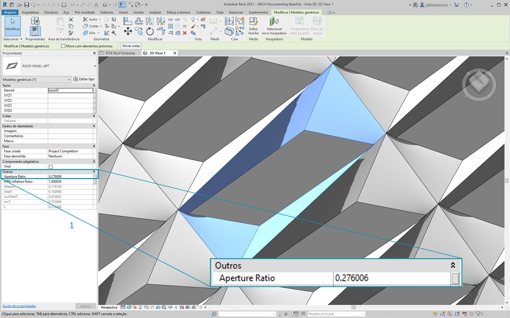

> 1. Continuando com a etapa anterior, vamos avançar mais e determinar a abertura de cada painel com base em sua exposição ao sol. Aproximando o zoom no Revit e selecionando um painel, vemos na barra de propriedades que há um parâmetro chamado *“Proporção de abertura”*. A família é configurada de forma que a abertura se estenda, aproximadamente, de *0,05* a *0,45*.

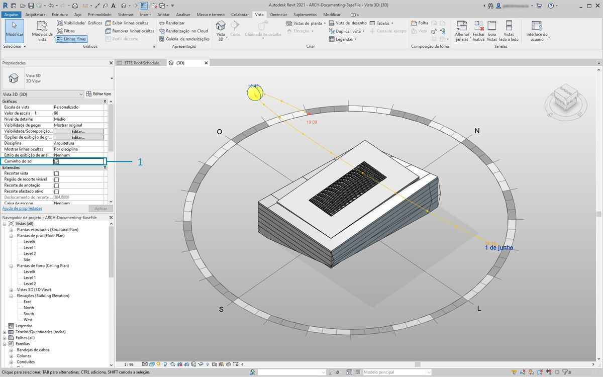

> 1. Se ativarmos o caminho solar, será possível ver a localização atual do sol no Revit.

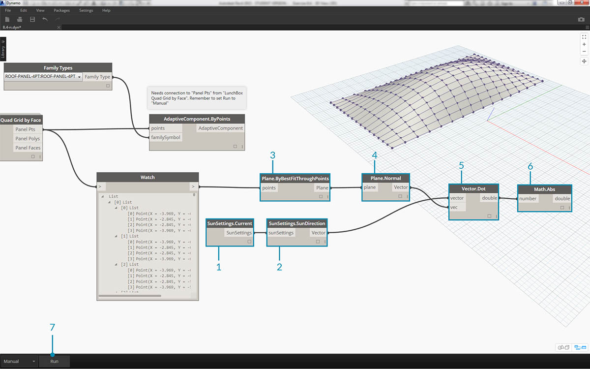

> 1. É possível referenciar a localização do sol usando o nó *SunSettings.Current*.
2. Conecte as configurações do sol a *Sunsetting.SunDirection* para obter o vetor solar.
3. Nos *Pts do painel* usados para criar os componentes adaptativos, use *Plane.ByBestFitThroughPoints* para aproximar o plano do componente.
4. Consulte a *normal* desse plano.
5. Use o *produto escalar* para calcular a orientação solar. O produto escalar é uma fórmula que determina como dois vetores paralelos ou antiparalelos podem ser. Então, estamos tomando a normal do plano de cada componente adaptativo e comparando com o vetor solar para simular aproximadamente a orientação solar.
6. Obtenha o *valor absoluto* do resultado. Isso assegura que o produto escalar seja preciso se a normal do plano estiver voltada para a direção reversa.
7. Pressione *Executar*.

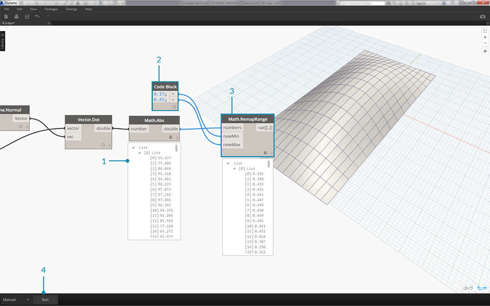

> 1. Observando o *produto escalar*, temos uma ampla variedade de números. Queremos usar a distribuição relativa deles, mas precisamos condensar os números dentro da faixa apropriada do parâmetro *“Proporção de abertura”* que planejamos editar.
2. *Math.RemapRange* é uma ótima ferramenta para isso. Essa ferramenta analisa uma lista de entrada e remapeia seus limites em dois valores alvo.
3. Defina os valores alvo como *0,15* e *0,45* em um *bloco de código*.
4. Pressione *Executar*.


> 1. Conecte os valores remapeados a um nó *Element.SetParameterByName*.
2. Conecte a sequência de caracteres *“Proporção de abertura”* à entrada *parameterName*.
3. Conecte os *componentes adaptativos* à entrada *elemento*.
4. Pressione *Executar*.

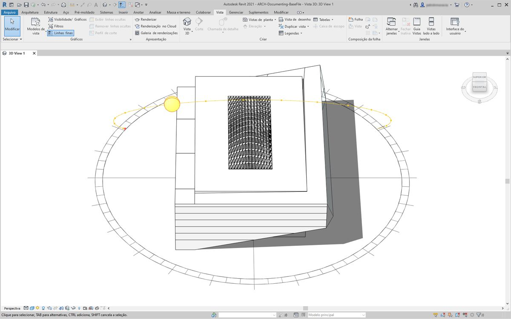

> De volta ao Revit, a partir de uma distância podemos fazer o efeito da orientação solar na abertura dos painéis ETFE.

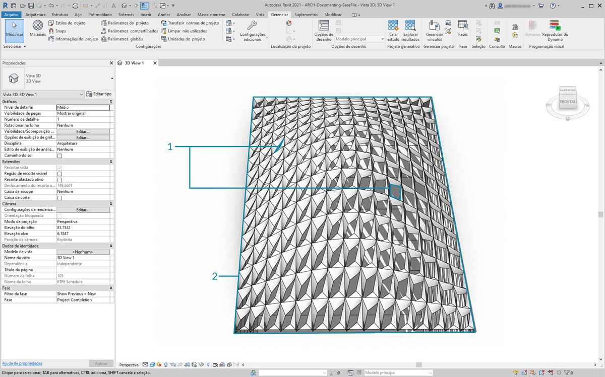

> Aproximando o zoom, vemos que os painéis ETFE estão mais fechados como a face do sol. Nosso objetivo aqui é reduzir o superaquecimento da exposição solar. Se quiséssemos deixar entrar mais luz com base na exposição solar, apenas precisaríamos alternar o domínio em *Math.RemapRange*.

