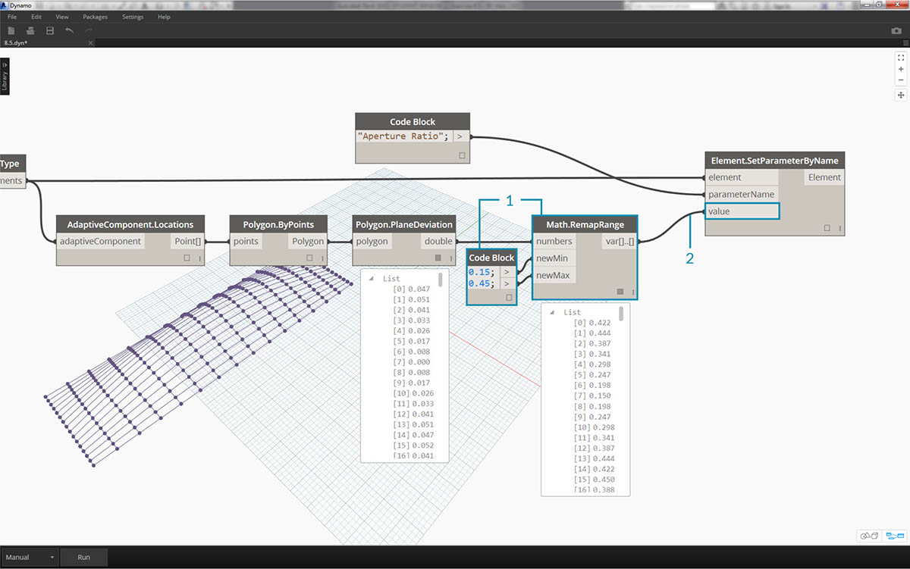
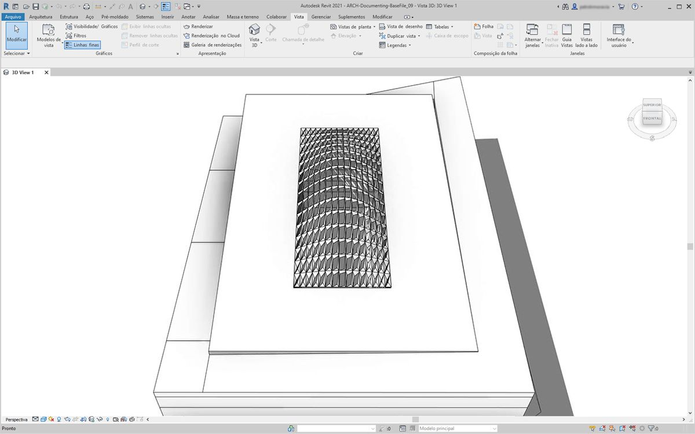
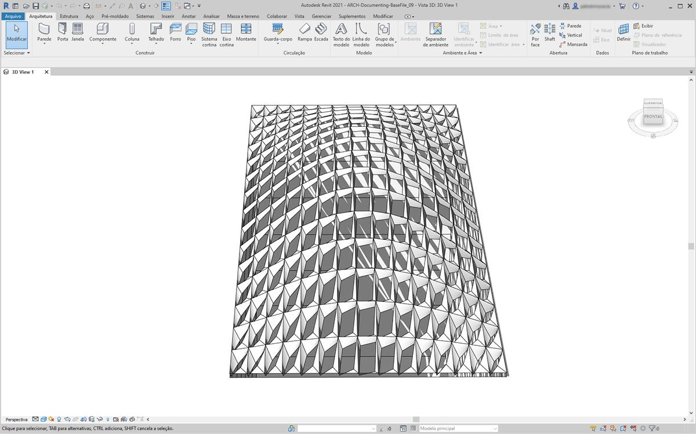
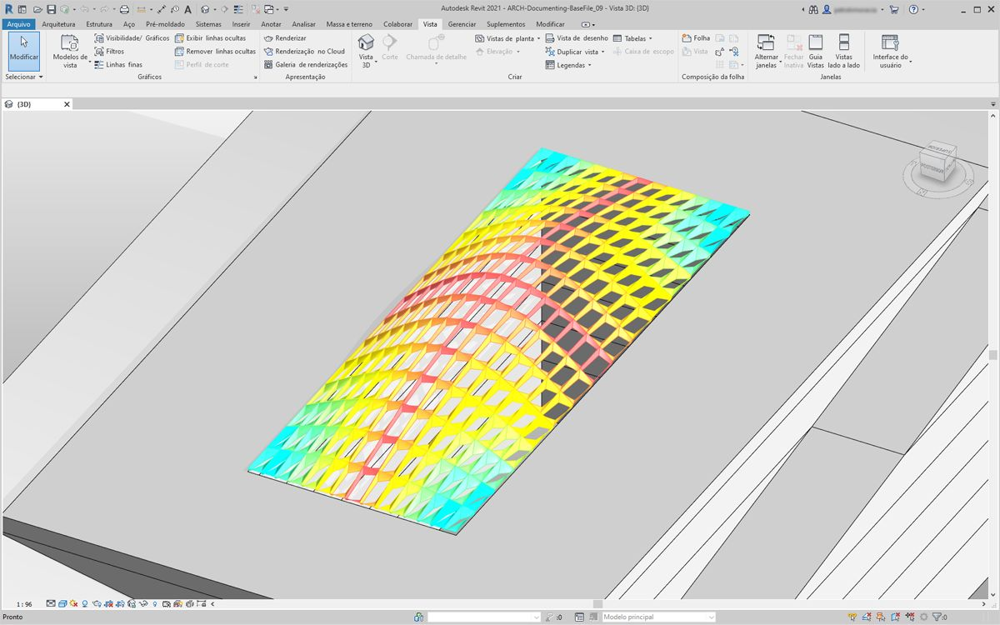
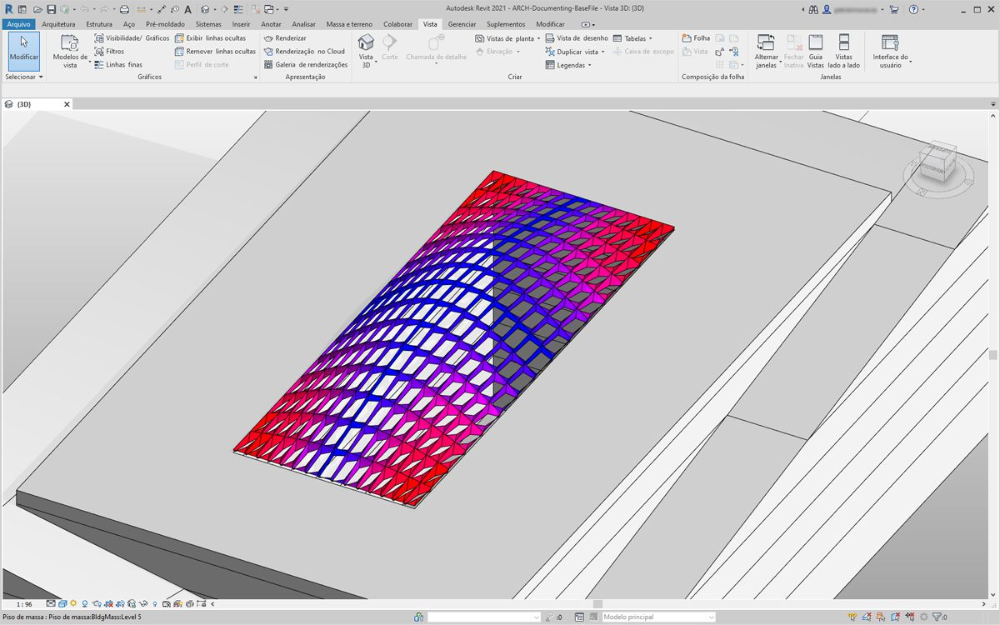
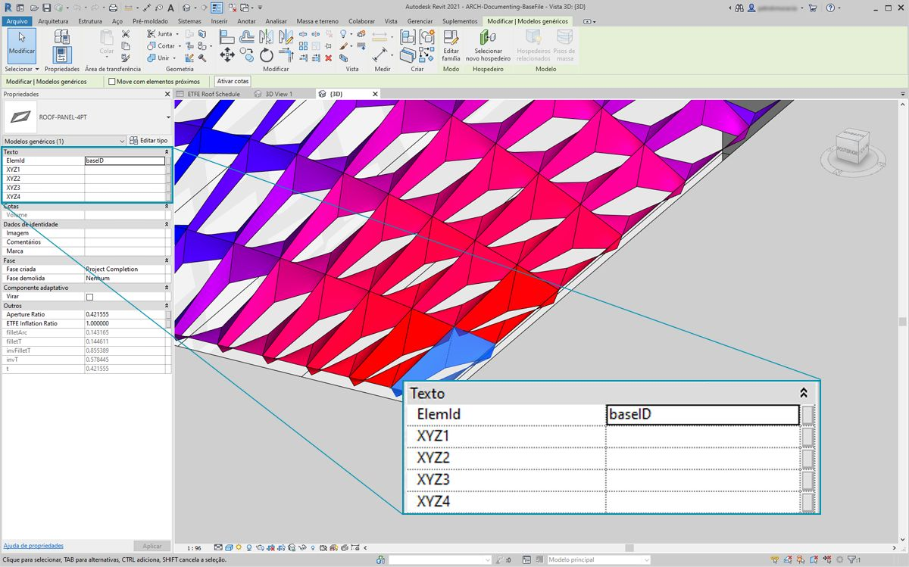
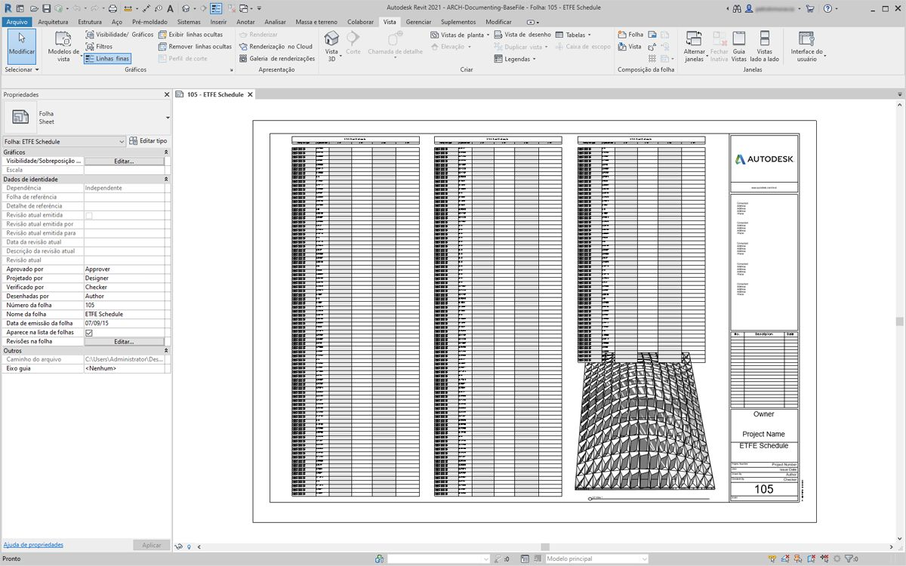
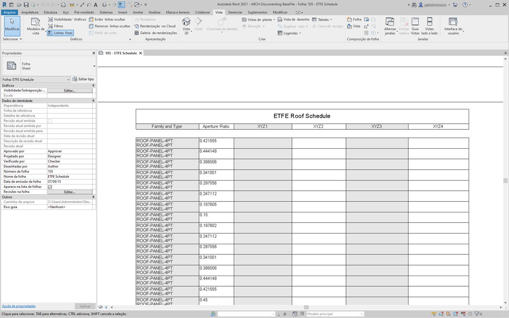
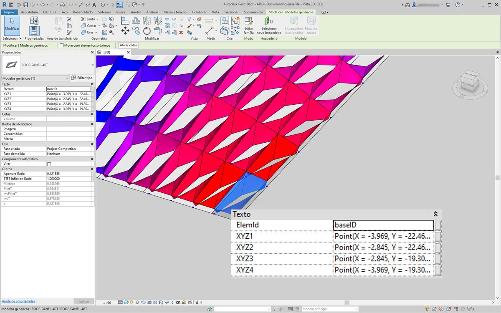
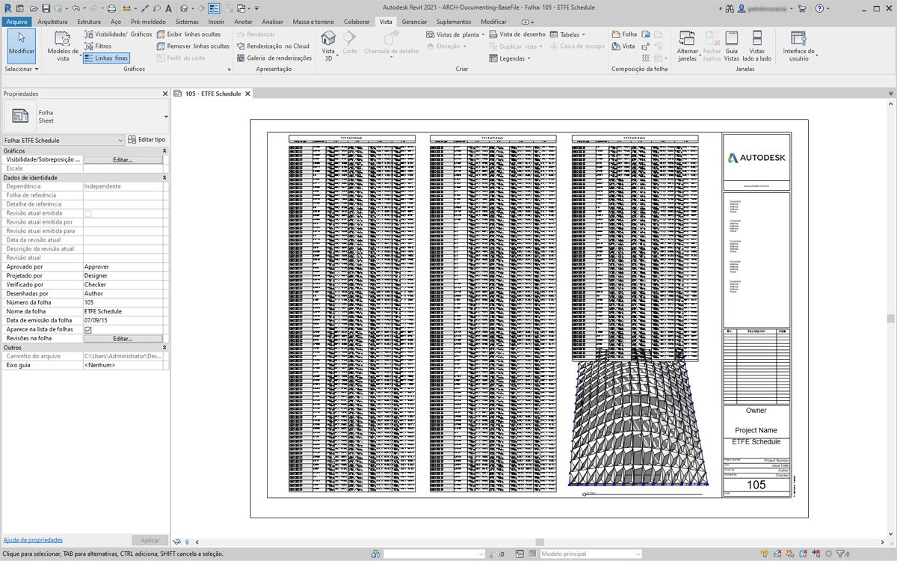

## Documentação

A edição de parâmetros da documentação segue as lições aprendidas nas seções anteriores. Nesta seção, vamos examinar os parâmetros de edição que não afetam as propriedades geométricas de um elemento, mas, em vez disso, preparam um arquivo do Revit para a documentação.

#### Desvio

No exercício abaixo, vamos usar um desvio básico do nó do plano para criar uma folha do Revit para documentação. Cada painel em nossa estrutura de telhado definida parametricamente tem um valor diferente para o desvio, e queremos chamar a faixa de valores usando cores e programando os pontos adaptativos para entregar a um consultor de fachadas, engenheiro ou empreiteiro.


> O desvio do nó de plano calculará a distância pela qual o conjunto de quatro pontos varia em relação ao plano de melhor ajuste entre eles. Essa é uma maneira rápida e fácil de estudar a construtibilidade.

### Exercício

> Faça o download dos arquivos de exemplo que acompanham este exercício (clique com o botão direito do mouse e selecione “Salvar link como...”). É possível encontrar uma lista completa de arquivos de exemplo no Apêndice.

> 1. [Documenting.dyn](datasets/8-6/Documenting.dyn)
2. [ARCH-Documenting-BaseFile.rvt](datasets/8-6/ARCH-Documenting-BaseFile.rvt)

Inicie com o arquivo do Revit nesta seção (ou continue da seção anterior). Esse arquivo tem uma matriz de painéis ETFE no telhado. Vamos fazer referência a esses painéis para este exercício.


> 1. Adicione um nó *Family Types* (Tipos de família) à tela e escolha *“ROOF-PANEL-4PT”*.
2. Conecte esse nó a um nó *All Elements of Family Type* para selecionar todos os elementos do Revit para o Dynamo.


> 1. Consulte a localização dos pontos adaptativos de cada elemento com o nó *AdaptiveComponent.Locations*.
2. Crie um polígono com base nesses quatro pontos com o nó *Polygon.ByPoints*. Observe que agora temos uma versão abstrata do sistema de painéis no Dynamo sem ter que importar toda a geometria do elemento do Revit.
3. Calcule o desvio do plano com o nó *Polygon.PlaneDeviation*.


> Só por diversão, como no exercício anterior, vamos definir a *relação de abertura *de cada painel com base no seu desvio plano.

> 1. Adicione um nó *Element.SetParameterByName* à tela e conecte os componentes adaptativos à entrada *element*. Conecte um *code block* com a inscrição *“Aperture Ratio”* (Proporção de abertura) na entrada *parameterName*.
2. Não é possível conectar diretamente os resultados do desvio à entrada de valor porque precisamos remapear os valores para o intervalo de parâmetros.



> 1. Usando *Math.RemapRange*, remapeie os valores de desvio para um domínio entre *0,15 *e *0,45*.
2. Conecte esses resultados à entrada value de *Element.SetParameterByName*.



> De volta ao Revit, podemos compreender *de certa forma* a mudança de abertura na superfície.



> Aproximando o zoom, torna-se mais claro que os painéis fechados se concentram nos cantos da superfície. Os cantos abertos estão na parte superior. Os cantos representam áreas de desvio maior, enquanto a saliência tem uma curvatura mínima, portanto, faz sentido.

### Cor e documentação

Definir a Proporção de abertura não demonstra claramente o desvio dos painéis no telhado. Também estamos alterando a geometria do elemento real. Suponha que só desejamos estudar o desvio do ponto de vista da viabilidade de fabricação. Seria útil colorir os painéis com base no intervalo de desvio para nossa documentação. Podemos fazer isso com a série de etapas abaixo e em um processo muito semelhante às etapas acima.


> 1. Remova os nós *Element.SetParameterByName* e adicione *Element.OverrideColorInView*.
2. Adicione um nó *Color Range* à tela e conecte-o à entrada color de *Element.OverrideColorInView*. Ainda precisamos conectar os valores de desvio ao intervalo de cores para criar o gradiente.
3. Ao passar o mouse sobre a entrada *value*, é possível ver que os valores da entrada devem estar entre *0* e *1* para mapear uma cor para cada valor. Precisamos remapear os valores de desvio para esse intervalo.


> 1. Usando *Math.RemapRange*, remapeie os valores de desvio plano para um intervalo entre *0* e *1* (observação: também é possível usar o nó *“MapTo”* para definir um domínio de origem).
2. Conecte os resultados a um nó *Color Range*.
3. Observe que nossa saída é um intervalo de cores em vez de um intervalo de números.
4. Se você estiver definido como Manual, pressione *Executar*. A partir desse ponto, você deve conseguir definir como Automático.



> De volta ao Revit, vemos um gradiente muito mais legível que é representativo do desvio plano com base em nosso intervalo de cores. Mas, e se quisermos personalizar as cores? Observe que os valores de desvio mínimo são representados em vermelho, o que parece ser o oposto do que esperávamos. Queremos que o desvio máximo esteja em vermelho, com o desvio mínimo representado por uma cor menos intensa. Vamos voltar ao Dynamo e corrigir isso.


> 1. Usando um *code block*, adicione dois números em duas linhas diferentes: ```0;``` e ```255;```.
2. Crie uma cor vermelha e azul ao conectar os valores apropriados em dois nós *Color.ByARGB*.
3. Crie uma lista com base nessas duas cores.
4. Conecte essa lista à entrada *colors* do *Color Range* e observe a atualização personalizada do intervalo de cores.



> De volta ao Revit, agora podemos entender melhor as áreas de desvio máximo nos cantos. Lembre-se: esse nó se destina a substituir uma cor em uma vista, portanto, poderia ser realmente útil se tivéssemos uma folha específica no conjunto de desenhos que se concentrasse em um determinado tipo de análise.

### Tabulando



> 1. Ao selecionar um painel ETFE no Revit, vemos que há quatro parâmetros de instância: *XYZ1, XYZ2, XYZ3* e *XYZ4*. Eles ficam todos em branco depois de serem criados. Esses são parâmetros baseados em texto e precisam de valores. Usaremos o Dynamo para escrever as localizações dos pontos adaptativos em cada parâmetro. Isso ajudará a interoperabilidade se a geometria precisar ser enviada para um engenheiro consultor de fachadas.



> Em uma folha de amostra, temos uma tabela grande e vazia. Os parâmetros XYZ são parâmetros compartilhados no arquivo do Revit, o que nos permite adicioná-los à tabela.



> Aproximando o zoom, os parâmetros XYZ ainda devem estar preenchidos. Os dois primeiros parâmetros são preparados pelo Revit.


> Para escrever esses valores, faremos uma operação de lista complexa. O gráfico em si é simples, mas os conceitos são construídos pesadamente com base no mapeamento da lista, conforme discutido no capítulo sobre a lista.

> 1. Selecione todos os componentes adaptativos com dois nós.
2. Extraia a localização de cada ponto com *AdaptiveComponent.Locations*.
3. Converta esses pontos em sequências de caracteres. Lembre-se: o parâmetro se baseia em texto, portanto, é preciso inserir o tipo de dados correto.
4. Crie uma lista das quatro sequências de caracteres que definem os parâmetros a serem alterados: *XYZ1, XYZ2, XYZ3* e *XYZ4*.
5. Conecte essa lista à entrada *parameterName* de *Element.SetParameterByName*.
6. Conecte *Element.SetParameterByName* à entrada *combinator* de *List.Combine.*
7. Conecte os *componentes adaptativos* à *list1*.
8. Conecte a *String* do objeto à *list2*.
9. Estamos mapeando a lista aqui, porque estamos escrevendo quatro valores para cada elemento, que cria uma estrutura de dados complexa. O nó *List.Combine* define uma operação uma etapa abaixo na hierarquia de dados. É por isso que as entradas de elemento e de valor são deixadas em branco. *List.Combine* está conectando as sublistas de suas entradas às entradas vazias de *List.SetParameterByName*, com base na ordem em que elas estão conectadas.



> Ao selecionar um painel no Revit, vemos agora que temos valores de sequência de caracteres para cada parâmetro. Realisticamente, criaríamos um formato mais simples para escrever um ponto (X,Y,Z). Isso pode ser feito com operações de sequência de caracteres no Dynamo, mas estamos ignorando isso aqui para permanecer no escopo deste capítulo.



> Uma vista da amostra de cronograma com parâmetros preenchidos.


> Cada painel ETFE agora tem as coordenadas XYZ escritas para cada ponto adaptativo, representando os cantos de cada painel para fabricação.

