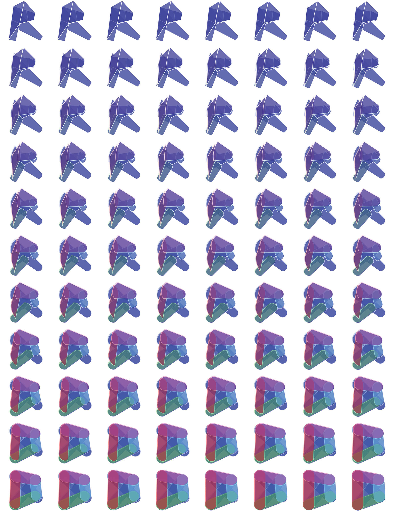

# Dynamo for Revit

Embora o Dynamo seja um ambiente flexível, projetado para criar uma ampla gama de programas, ele foi originalmente criado para uso com o Revit. Um programa visual cria opções robustas para o BIM (Building Information Model – Modelo de informações de construção). O Dynamo oferece um conjunto completo de nós especificamente projetados para o Revit, bem como bibliotecas de terceiros de uma comunidade AEC em evolução. Este capítulo foca nos conceitos básicos do uso do Dynamo no Revit.

