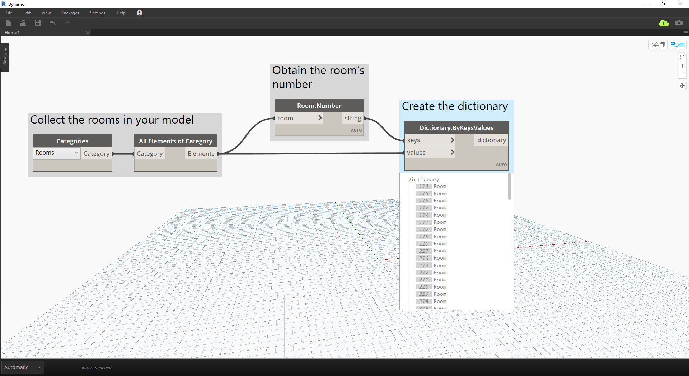

# Dicionários – Casos de uso do Revit

Alguma vez você já quis procurar algo no Revit por um dado que ele possui?

#### As chances são de que você tenha feito algo assim:


> Na imagem acima, estamos coletando todos os ambientes no modelo do Revit, obtendo o índice do ambiente desejado (por número do ambiente) e, por fim, selecionando o ambiente no índice.

### Agora, vamos recriar essa ideia usando dicionários.

> Faça o download do arquivo de exemplo que acompanha este exercício (clique com o botão direito do mouse e escolha “Salvar link como...”): [RoomDictionary.dyn](datasets/9-4_roomDictionary.dyn). É possível encontrar uma lista completa de arquivos de exemplo no Apêndice.

 Primeiro, precisamos coletar todos os ambientes no modelo do Revit.

> * Escolhemos a categoria do Revit com a qual queremos trabalhar (neste caso, estamos trabalhando com ambientes).
* Dizemos ao Dynamo para coletar todos esses elementos.

 Em seguida, precisamos decidir quais chaves iremos usar para examinar esses dados. (Para obter informações sobre as chaves, consulte a seção [9-1 O que é um dicionário?](9-1_What-is-a-dictionary,md)).

> * Os dados que usaremos são o número do ambiente.

 Agora, criaremos o dicionário com as chaves e os elementos indicados.

> * O nó ```Dictionary.ByKeysValues``` criará um dicionário com as entradas apropriadas.
* ```Keys``` precisam ser uma sequência de caracteres, enquanto ```values``` podem ser uma variedade de tipos de objetos.

 Por último, é possível recuperar um ambiente do dicionário com seu número de ambiente atual.

> * ```String``` será a chave que estamos usando para procurar um objeto no dicionário.
* ```Dictionary.ValueAtKey``` obterá o objeto do dicionário agora.

---

### Usando a mesma lógica de dicionário, também é possível criar dicionários com objetos agrupados. Se quiséssemos examinar todos os ambientes em um determinado nível, poderíamos modificar o gráfico acima, como segue.


> * Em vez de usar o número do ambiente como a chave, agora podemos usar um valor de parâmetro (neste caso, usaremos o nível).


> * Agora, é possível agrupar os ambientes pelo nível em que residem.


> * Com os elementos agrupados pelo nível, agora podemos usar as chaves compartilhadas (chaves exclusivas) como a nossa chave para o dicionário e as listas de ambientes como os elementos.


> * Por último, usando os níveis no modelo do Revit, podemos procurar quais ambientes residem naquele nível no dicionário. ```Dictionary.ValueAtKey``` obterá o nome do nível e retornará os objetos do ambiente naquele nível.

As oportunidades de uso do dicionário são realmente infinitas. A capacidade de relacionar seus dados do BIM no Revit com o próprio elemento apresenta uma variedade de casos de uso.

