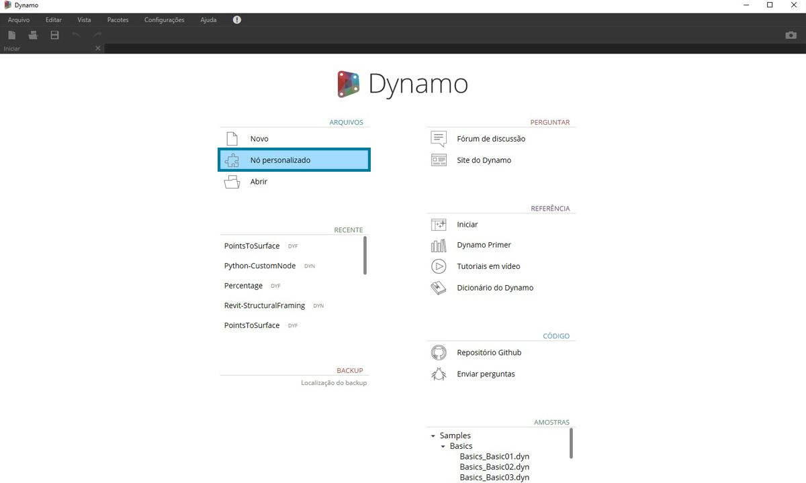
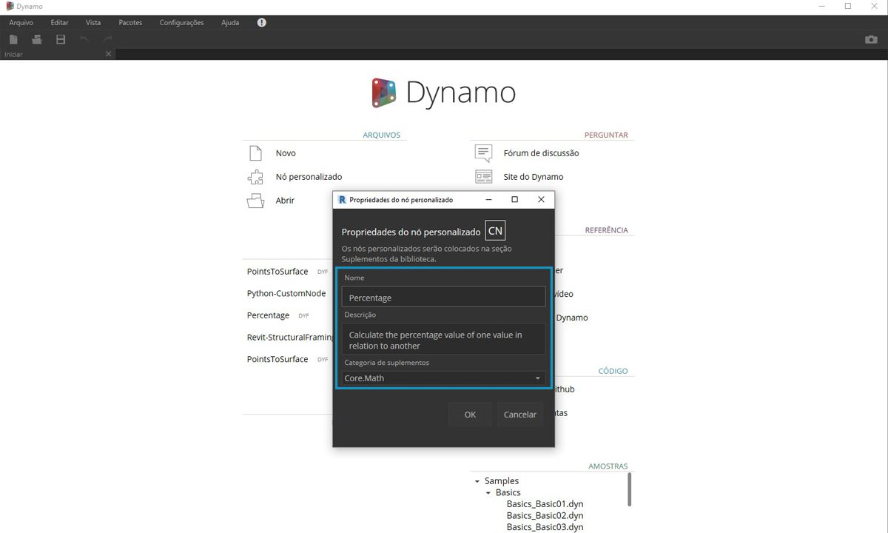
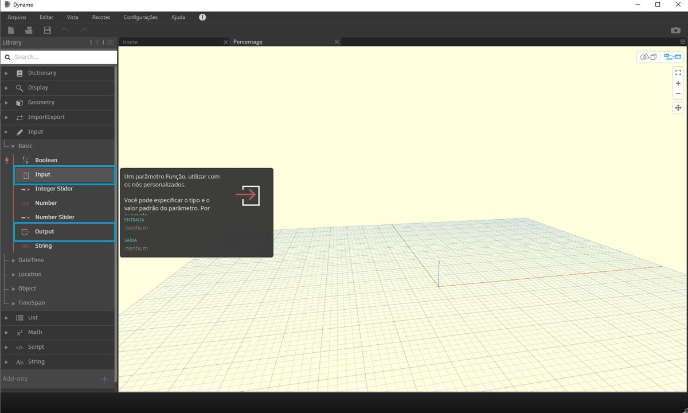

## Nós personalizados

O Dynamo oferece muitos nós principais para uma ampla gama de tarefas de programação visual. Às vezes, uma solução mais rápida, mais elegante ou compartilhada com mais facilidade consiste em construir seus próprios nós. Eles podem ser reutilizados em diferentes projetos e tornam o gráfico mais claro e limpo, além de poderem ser enviados para o gerenciador de pacotes e compartilhados com a comunidade global do Dynamo.

### Limpar o gráfico

Os nós personalizados são construídos pelo agrupamento de outros nós e dos nós personalizados dentro de um “nó personalizado do Dynamo”, que podemos pensar conceitualmente como um contêiner. Quando esse nó de contêiner é executado no gráfico, tudo dentro dele será executado para permitir a reutilização e o compartilhamento de uma combinação útil de nós.

### Adaptação às mudanças

Quando você tem várias cópias de um nó personalizado no gráfico, é possível atualizar todas elas editando o nó personalizado de base. Isso permite atualizar o gráfico sem problemas, adaptando-se a quaisquer alterações que possam ocorrer no fluxo de trabalho ou no projeto.

### Compartilhamento de trabalho

O melhor recurso dos nós personalizados é a forma de compartilhamento de trabalho. Se um “usuário avançado” criar um gráfico do Dynamo complexo e o entregar a um designer iniciante no Dynamo, ele poderá condensar o gráfico para exibir o essencial para a interação do projeto. Será possível abrir o nó personalizado para editar o gráfico interno, mas o “contêiner” poderá ser mantido simples. Com esse processo, os nós personalizados permitem que os usuários do Dynamo projetem um gráfico limpo e intuitivo.

### Muitas maneiras de criar um nó

Há uma ampla variedade de maneiras de criar nós personalizados no Dynamo. Nos exemplos neste capítulo, vamos criar nós personalizados diretamente na IU do Dynamo. Se você for um programador e estiver interessado na formatação C# ou Zero-Touch, poderá consultar [esta página](https://github.com/DynamoDS/Dynamo/wiki/How-To-Create-Your-Own-Nodes) no Wiki do Dynamo para obter uma revisão mais aprofundada.

### Ambiente de nó personalizado

Vamos para o ambiente de nó personalizado e criar um nó simples para calcular uma porcentagem. O ambiente de nó personalizado é diferente do ambiente gráfico do Dynamo, mas a interação é fundamentalmente a mesma. Com isso, vamos criar nosso primeiro nó personalizado.

> Para criar um nó personalizado do zero, inicie o Dynamo e selecione Nó personalizado ou digite Ctrl + Shift + N na tela.

> Atribua um nome, uma descrição e uma categoria na caixa de diálogo Propriedades de nó personalizado.

> 1. **Nome:** Porcentagem
2. **Descrição**: calcula a porcentagem de um valor em relação a outro.
3. **Categoria:** Core.Math

> Isso abrirá uma tela com um fundo amarelo, indicando que você está trabalhando dentro de um nó personalizado. Nessa tela, você tem acesso a todos os nós principais do Dynamo, bem como aos nós **Input** e **Output**, que rotulam os dados que fluem para dentro e para fora do nó personalizado. Eles podem ser encontrados em *Core > Input*.

> 1. **Inputs:** os nós de entrada criam portas de entrada no nó personalizado. A sintaxe para um nó de entrada é *nome_entrada: tipo de dados = valor_padrão(opcional).*

2. **Outputs:** semelhante às entradas, os nós de saída vão criar e nomear as portas de saída no nó personalizado. Considere a possibilidade de adicionar um **Comentário personalizado** às portas de entrada e saída para indicar os tipos de entrada e saída. Isso é discutido em mais detalhes na [seção Criar nós personalizados](10-2_Creating.md).

É possível salvar esse nó personalizado como um arquivo .dyf (em oposição ao arquivo .dyn padrão) e ele será automaticamente adicionado à sua sessão e a sessões futuras. Você encontrará o nó personalizado na biblioteca na categoria especificada nas propriedades do nó personalizado.

> Esquerda: a categoria Core > Maths da biblioteca padrão; 
Direita: Core > Math com o novo nó personalizado

### Seguindo em frente

Agora que criamos nosso primeiro nó personalizado, as próximas seções se aprofundarão na funcionalidade dos nós personalizados e como publicar fluxos de trabalho genéricos. Na seção a seguir, vamos analisar o desenvolvimento de um nó personalizado que transfere a geometria de uma superfície para outra.

