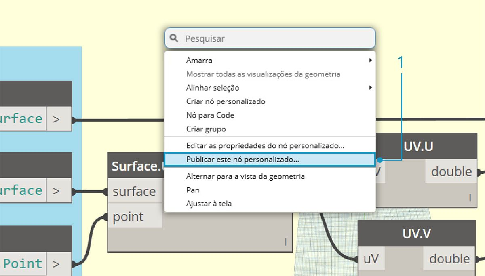
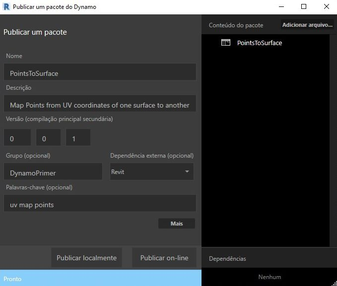
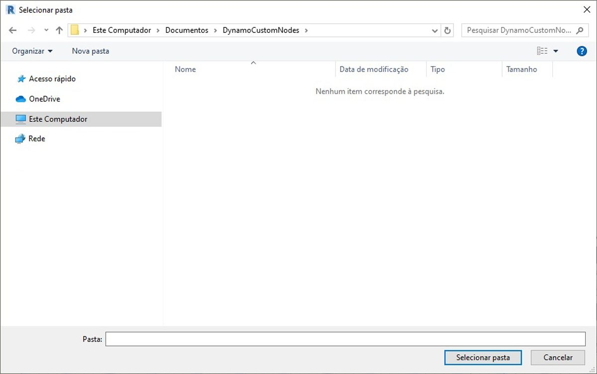
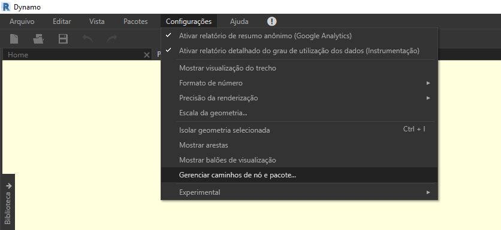
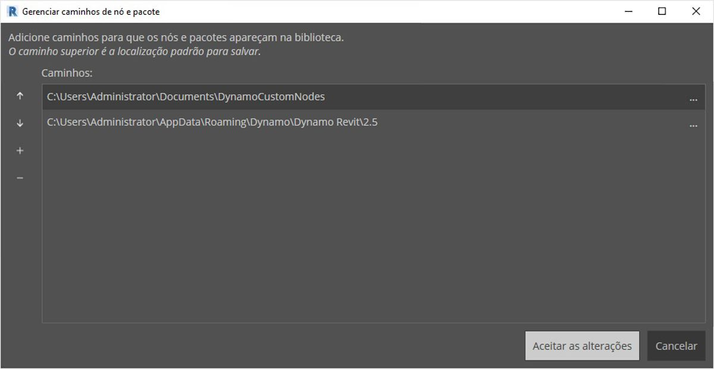
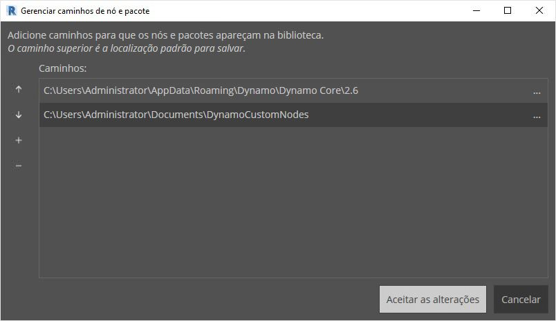
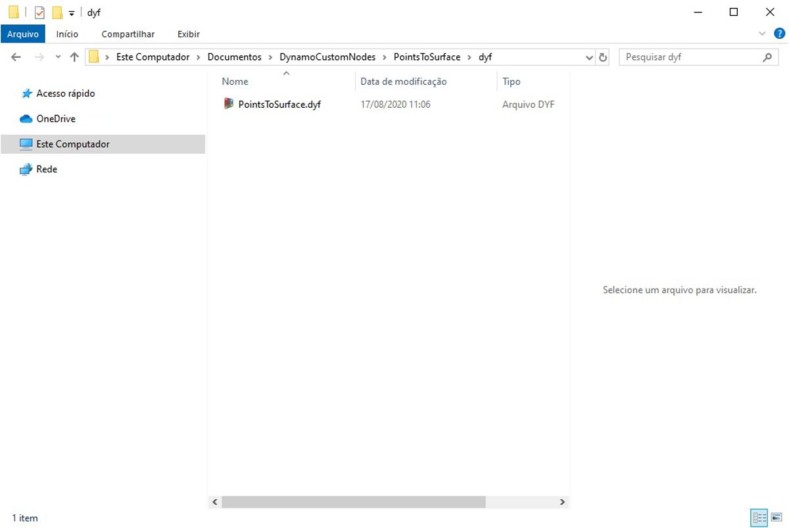
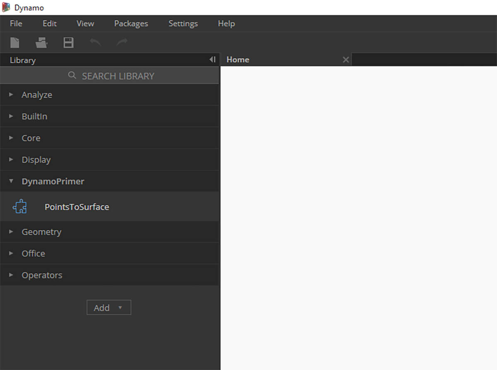

## Adicionar à biblioteca

Acabamos de criar um nó personalizado e aplicá-lo a um processo específico em nosso gráfico do Dynamo. Gostamos tanto desse nó, por isso queremos mantê-lo em nossa biblioteca do Dynamo para usar como referência em outros gráficos. Para fazer isso, vamos publicar o nó localmente. Este é um processo semelhante ao de publicar um pacote, que iremos mostrar em mais detalhes no próximo capítulo.

### Publicar um nó personalizado localmente

Vamos avançar com o nó personalizado que criamos na seção anterior. Ao publicar um nó localmente, o nó estará acessível na biblioteca do Dynamo quando você abrir uma nova sessão. Se nenhum nó for publicado, o gráfico do Dynamo que faz referência a um nó personalizado também deverá ter aquele nó personalizado em sua pasta (ou o nó personalizado deverá ser importado para o Dynamo usando *Arquivo>Importar biblioteca*).

> Faça o download do arquivo de exemplo que acompanha este exercício (clique com o botão direito do mouse e escolha “Salvar link como...”). É possível encontrar uma lista completa de arquivos de exemplo no Apêndice. [PointsToSurface.dyf](datasets/10-3/PointsToSurface.dyf)

> Após abrir o nó personalizado PointsToSurface, vemos o gráfico acima no Editor de nós personalizados do Dynamo. Também é possível abrir um nó personalizado clicando duas vezes nele no Editor de gráficos do Dynamo.

> 1. Para publicar um nó personalizado localmente, basta clicar com o botão direito do mouse na tela e selecionar *“Publicar este nó personalizado...”*

> Preencha as informações relevantes de forma similar à imagem acima e selecione *“Publicar localmente”.*. Observe que o campo Grupo define o elemento principal acessível no menu do Dynamo.

> Escolha uma pasta para alojar todos os nós personalizados que você planeja publicar localmente. O Dynamo verificará essa pasta sempre que ela for carregada, portanto, certifique-se de que a pasta esteja em um local permanente. Navegue até essa pasta e escolha *“Selecionar pasta”.* O nó do Dynamo agora está publicado localmente e permanecerá na barra de ferramentas do Dynamo cada vez que o programa for carregado.

> 1. Para verificar o local da pasta do nó personalizado, vá para *Configurações > Gerenciar caminhos de nó e pacote...*

> Nessa janela, vemos dois caminhos: *AppData\Roaming\Dynamo...* refere-se à localização padrão dos pacotes do Dynamo instalados on-line. *Documents\DynamoCustomNodes...* faz referência à localização dos nós personalizados que publicamos localmente. *

> 1. Você pode desejar mover o caminho da pasta local para baixo na ordem da lista acima (selecionando o caminho da pasta e clicando na seta para baixo à esquerda dos nomes do caminho). A pasta superior é o caminho padrão para a instalação do pacote. Portanto, mantendo o caminho de instalação do pacote do Dynamo padrão como a pasta padrão, os pacotes on-line serão separados dos nós publicados localmente.*

> Alteramos a ordem dos nomes de caminho para que o caminho padrão do Dynamo seja o local de instalação do pacote.

> Navegando para essa pasta local, podemos encontrar o nó personalizado original na pasta *“.dyf”*, que é a extensão de um arquivo de nó personalizado do Dynamo. Podemos editar o arquivo nessa pasta e o nó será atualizado na interface do usuário. Também é possível adicionar mais nós à pasta principal *DynamoCustomNode* e o Dynamo os adicionará à sua biblioteca ao ser reiniciado.

> O Dynamo agora será carregado sempre com *“PointsToSurface”* no grupo *“DynamoPrimer”* de sua biblioteca do Dynamo.

