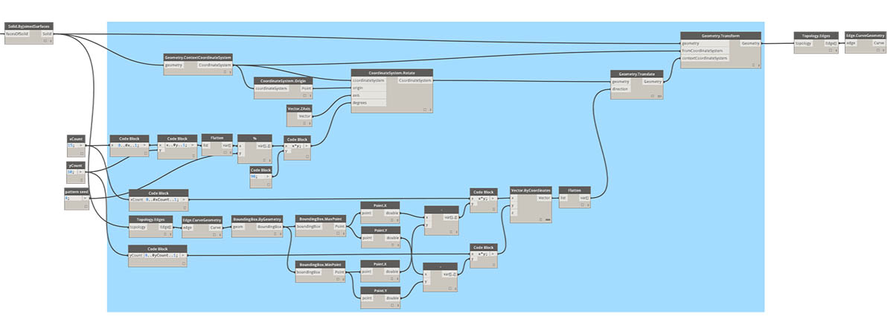
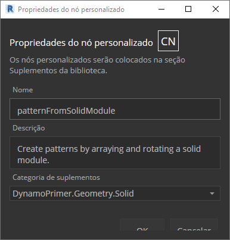

## Python

 O Python é uma linguagem de programação amplamente usada, cuja popularidade tem muito a ver com seu estilo de sintaxe. É altamente legível, o que a torna mais fácil de aprender do que muitas outras linguagens. O Python oferece suporte a módulos e pacotes e pode ser incorporado em aplicativos existentes. Os exemplos nesta seção presumem uma familiaridade básica com o Python. Para obter informações sobre como começar a usar o Python, um bom recurso é a página [“Getting Started”](https://www.python.org/about/gettingstarted/) em [Python.org](https://www.python.org/).

### Programação visual versus textual

Por que você usaria a programação textual no ambiente de programação visual do Dynamo? Como discutimos no capítulo 1.1, a programação visual tem muitas vantagens. Ela permite que você crie programas sem aprender sintaxe especial em uma interface visual intuitiva. No entanto, um programa visual pode se tornar confuso e, às vezes, pode ter funcionalidade insatisfatória. Por exemplo, o Python oferece métodos muito mais simples de gravar declarações condicionais (if/then) e loops. O Python é uma ferramenta avançada que pode estender os recursos do Dynamo e permitir que você substitua muitos nós por algumas linhas concisas de código.

**Programa visual:** 

**Programa textual:**

```
import clr
clr.AddReference('ProtoGeometry')
from Autodesk.DesignScript.Geometry import *

solid = IN[0]
seed = IN[1]
xCount = IN[2]
yCount = IN[3]

solids = []

yDist = solid.BoundingBox.MaxPoint.Y-solid.BoundingBox.MinPoint.Y
xDist = solid.BoundingBox.MaxPoint.X-solid.BoundingBox.MinPoint.X

for i in xRange:
for j in yRange:
fromCoord = solid.ContextCoordinateSystem
toCoord = fromCoord.Rotate(solid.ContextCoordinateSystem.Origin,Vector.ByCoordinates(0,0,1),(90*(i+j%val)))
vec = Vector.ByCoordinates((xDist*i),(yDist*j),0)
toCoord = toCoord.Translate(vec)
solids.append(solid.Transform(fromCoord,toCoord))

OUT = solids
```

### O nó do Python

Como os blocos de código, os nós do Python são uma interface de scripts dentro de um ambiente de programação visual. O nó do Python pode ser encontrado em *Núcleo>Scripts* na biblioteca. Clicar duas vezes no nó abre o editor de scripts Python (também é possível clicar com o botão direito do mouse no nó e selecionar *Editar...*).


> Você observará algum texto padronizado na parte superior, que pretende ajudar você a fazer referência às bibliotecas necessárias. As entradas estão armazenadas na matriz IN. Os valores são retornados ao Dynamo quando são atribuídos à variável OUT.

A biblioteca Autodesk.DesignScript.Geometry permite usar a notação de pontos similar aos blocos de código. Para obter mais informações sobre a sintaxe do Dynamo, consulte o capítulo 7.2, bem como o [Guia do DesignScript](http://dynamobim.org/wp-content/links/DesignScriptGuide.pdf). Digitar um tipo de geometria como “'Point.” gerará uma lista de métodos para criar e consultar pontos.


> Os métodos incluem construtores como *ByCoordinates*, ações como *Adicionar* e consultas como as coordenadas *X*, *Y* e *Z*.

### Exercício

> Faça o download do arquivo de exemplo que acompanha este exercício (clique com o botão direito do mouse e "Salvar link como..."). É possível encontrar uma lista completa de arquivos de exemplo no Apêndice. [Python_Custom-Node.dyn](datasets/10-4/Python-CustomNode.dyn)

Neste exemplo, escreveremos um script Python que cria padrões de um módulo sólido e o transforma em um nó personalizado. Primeiro, vamos criar nosso módulo sólido usando os nós do Dynamo.


> 1. **Rectangle.ByWidthLength:** crie um retângulo que será a base do nosso sólido.
2. **Surface.ByPatch:** conecte o retângulo à entrada “*closedCurve*” para criar a superfície inferior.


> 1. **Geometry.Translate:** conecte o retângulo à entrada “*geometry*” para movê-lo para cima, usando um bloco de código para especificar a espessura base do nosso sólido.
2. **Polygon.Points:** consulte o retângulo convertido para extrair os pontos de canto.
3. **Geometry.Translate:** use um bloco de código para criar uma lista de quatro valores correspondentes aos quatro pontos, convertendo um canto do sólido para cima.
4. **Polygon.ByPoints:** use os pontos convertidos para reconstruir o polígono superior.
5. **Surface.ByPatch:** conecte o polígono para criar a superfície superior.

Agora que temos as superfícies superior e inferior, vamos elevar os dois perfis para criar os lados do sólido.


> 1. **List.Create:** conecte o retângulo inferior e o polígono superior às entradas do índice.
2. **Surface.ByLoft:** eleve os dois perfis para criar os lados do sólido.
3. **List.Create:** conecte as superfícies superior, lateral e inferior às entradas de índice para criar uma lista de superfícies.
4. **Solid.ByJoinedSurfaces:** una as superfícies para criar o módulo sólido.

Agora que temos nosso sólido, vamos colocar um nó do script Python no espaço de trabalho.


> Para adicionar mais entradas ao nó, feche o editor e clique no ícone + no nó. As entradas são nomeadas IN[0], IN[1] etc. para indicar que representam itens em uma lista.

Vamos começar definindo nossas entradas e saídas. Clique duas vezes no nó para abrir o editor do Python.


```
# Enable Python support and load DesignScript library
import clr
clr.AddReference('ProtoGeometry')
from Autodesk.DesignScript.Geometry import *

# The inputs to this node will be stored as a list in the IN variables.
#The solid module to be arrayed
solid = IN[0]
#A number that determines which rotation pattern to use
seed = IN[1]
#The number of solids to array in the X and Y axes
xCount = IN[2]
yCount = IN[3]

#Create an empty list for the arrayed solids
solids = []

# Place your code below this line

# Assign your output to the OUT variable.
OUT = solids
```

Esse código fará mais sentido à medida que progredirmos no exercício. Em seguida, precisaremos pensar sobre quais informações são necessárias para organizar o módulo de sólido. Primeiro, precisamos conhecer as dimensões do sólido para determinar a distância de conversão. Devido a uma falha da caixa delimitadora, será necessário usar a geometria de curva de aresta para criar uma caixa delimitadora.


> Veja o nó do Python no Dynamo. Observe que estamos usando a mesma sintaxe que vemos nos títulos dos nós no Dynamo. O código comentado está abaixo.

```
# Enable Python support and load DesignScript library
import clr
clr.AddReference('ProtoGeometry')
from Autodesk.DesignScript.Geometry import *

# The inputs to this node will be stored as a list in the IN variables.
#The solid module to be arrayed
solid = IN[0]
#A number that determines which rotation pattern to use
seed = IN[1]
#The number of solids to array in the X and Y axes
xCount = IN[2]
yCount = IN[3]

#Create an empty list for the arrayed solids
solids = []
# Create an empty list for the edge curves
crvs = []

# Place your code below this line
#Loop through edges and append corresponding curve geometry to the list
for edge in solid.Edges:
crvs.append(edge.CurveGeometry)
#Get the bounding box of the curves
bbox = BoundingBox.ByGeometry(crvs)

#Get the X and Y translation distance based on the bounding box
yDist = bbox.MaxPoint.Y-bbox.MinPoint.Y
xDist = bbox.MaxPoint.X-bbox.MinPoint.X

# Assign your output to the OUT variable.
OUT = solids
```

Como vamos converter e girar os módulos de sólido, usaremos a operação Geometry.Transform. Observando o nó Geometry.Transform, sabemos que precisaremos de um sistema de coordenadas de origem e um sistema de coordenadas de destino para transformar o sólido. A origem é o sistema de coordenadas do contexto do nosso sólido, enquanto o destino será um sistema de coordenadas diferente para cada módulo com matriz. Isso significa que teremos que fazer um loop pelos valores x e y para transformar o sistema de coordenadas de forma diferente a cada vez.


> Veja o nó do Python no Dynamo. O código comentado está abaixo.

```
# Enable Python support and load DesignScript library
import clr
clr.AddReference('ProtoGeometry')
from Autodesk.DesignScript.Geometry import *

# The inputs to this node will be stored as a list in the IN variables.
#The solid module to be arrayed
solid = IN[0]
#A number that determines which rotation pattern to use
seed = IN[1]
#The number of solids to array in the X and Y axes
xCount = IN[2]
yCount = IN[3]

#Create an empty list for the arrayed solids
solids = []
# Create an empty list for the edge curves
crvs = []

# Place your code below this line
#Loop through edges and append corresponding curve geometry to the list
for edge in solid.Edges:
crvs.append(edge.CurveGeometry)
#Get the bounding box of the curves
bbox = BoundingBox.ByGeometry(crvs)

#Get the X and Y translation distance based on the bounding box
yDist = bbox.MaxPoint.Y-bbox.MinPoint.Y
xDist = bbox.MaxPoint.X-bbox.MinPoint.X
#get the source coordinate system
fromCoord = solid.ContextCoordinateSystem

#Loop through X and Y
for i in range(xCount):
for j in range(yCount):
#Rotate and translate the coordinate system
toCoord = fromCoord.Rotate(solid.ContextCoordinateSystem.Origin,Vector.ByCoordinates(0,0,1),(90*(i+j%seed)))
vec = Vector.ByCoordinates((xDist*i),(yDist*j),0)
toCoord = toCoord.Translate(vec)
#Transform the solid from the source coord system to the target coord system and append to the list
solids.append(solid.Transform(fromCoord,toCoord))

# Assign your output to the OUT variable.
OUT = solids
```


> Clicar em Executar no nó do Python permitirá que nosso código seja executado.


> Tente alterar o valor semente para criar diferentes padrões. Também é possível alterar os parâmetros do próprio módulo de sólido para diferentes efeitos. No Dynamo 2.0, você pode simplesmente alterar a semente e clicar em Executar sem fechar a janela do Python.

Agora que criamos um script Python útil, vamos salvá-lo como um nó personalizado. Selecione o nó do script Python, clique com o botão direito do mouse e selecione “Novo nó da seleção”.



> Atribua um nome, uma descrição e uma categoria.

Isso abrirá um novo espaço de trabalho no qual o nó personalizado será editado.


> 1. **Inputs** (entradas): altere os nomes das entradas para que sejam mais descritivos e adicione tipos de dados e valores padrão.
2. **Output** (saída): altere o nome da saída Salvar o nó como um arquivo .dyf.


> O nó personalizado reflete as alterações que acabamos de fazer.

