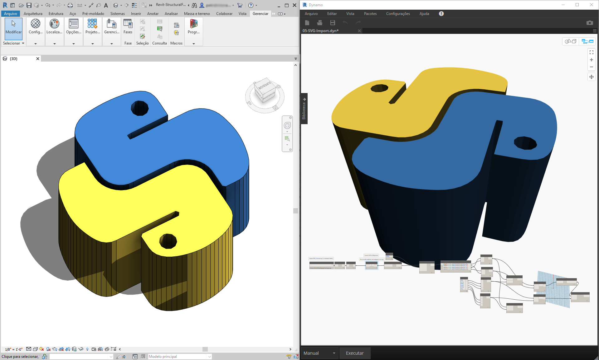
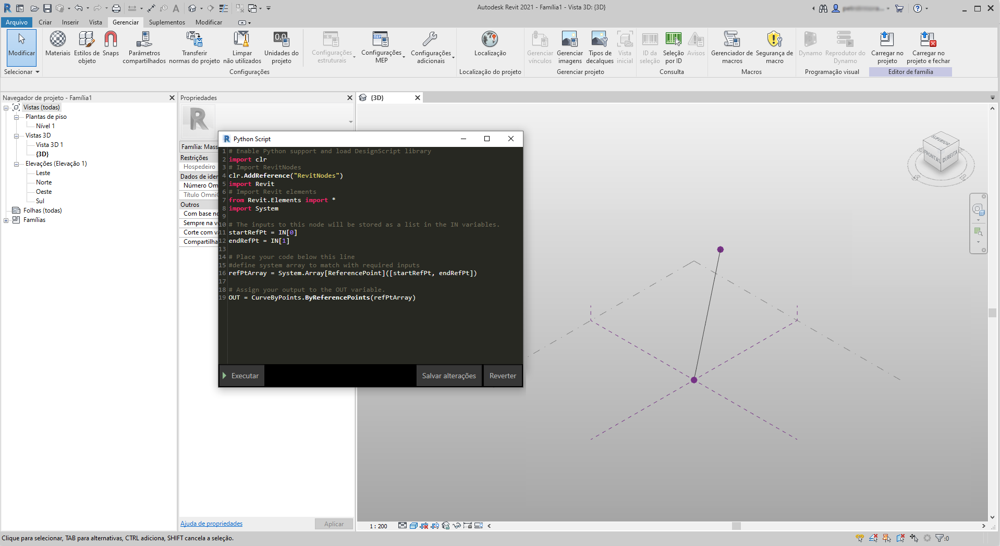
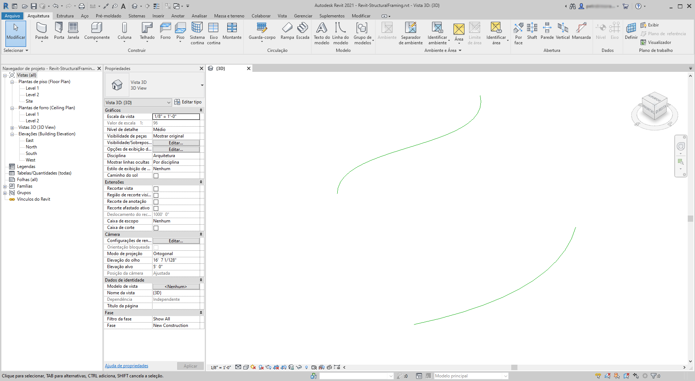
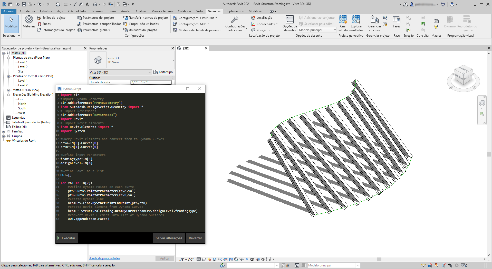
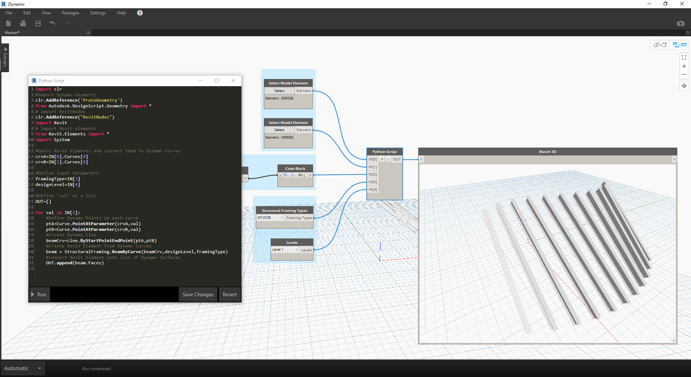

## Python e Revit

Agora que demonstramos como usar scripts Python no Dynamo, vamos analisar como conectar as bibliotecas do Revit ao ambiente de scripts. Lembre-se, importamos nossos nós do núcleo do Dynamo com as três primeiras linhas do bloco de código abaixo. Para importar os nós, os elementos e o gerenciador de documentos do Revit, só precisamos adicionar mais algumas linhas:

```
import clr
clr.AddReference('ProtoGeometry')
from Autodesk.DesignScript.Geometry import *

# Import RevitNodes
clr.AddReference("RevitNodes")
import Revit

# Import Revit elements
from Revit.Elements import *

# Import DocumentManager
clr.AddReference("RevitServices")
import RevitServices
from RevitServices.Persistence import DocumentManager

import System
```

Isso nos fornece acesso à API do Revit e oferece scripts personalizados para qualquer tarefa do Revit. Ao combinar o processo de programação visual com scripts da API do Revit, a colaboração e o desenvolvimento de ferramentas melhoram significativamente. Por exemplo, um gerente do BIM e um projetista esquemático podem trabalhar juntos no mesmo gráfico. Nessa colaboração, eles podem aprimorar o projeto e a execução do modelo.



### APIs específicas da plataforma

O plano por trás do projeto do Dynamo é ampliar o escopo da implementação da plataforma. À medida que o Dynamo adiciona mais programas ao registro, os usuários obterão acesso a APIs específicas de plataforma do ambiente de scripts Python. Embora o Revit seja o estudo de caso desta seção, podemos prever mais capítulos que oferecem tutoriais abrangentes sobre scripts em outras plataformas. Além disso, há muitas bibliotecas [IronPython](http://ironpython.net/) acessíveis agora que podem ser importadas para o Dynamo.

Os exemplos abaixo demonstram as maneiras de implementar operações específicas do Revit no Dynamo usando o Python. Para obter uma análise mais detalhada sobre a relação do Python com o Dynamo e o Revit, consulte a [página Wiki do Dynamo](https://github.com/DynamoDS/Dynamo/wiki/Python-0.6.3-to-0.7.x-Migration). Outro recurso útil para o Python e o Revit é o projeto [Revit Python Shell](https://github.com/architecture-building-systems/revitpythonshell).

### Exercício 01

> Crie um novo projeto do Revit. Faça o download do arquivo de exemplo que acompanha este exercício (clique com o botão direito do mouse e selecione “Salvar link como...”). É possível encontrar uma lista completa de arquivos de exemplo no Apêndice. [Revit-Doc.dyn](datasets/10-5/Revit-Doc.dyn)

Nestes exercícios, vamos explorar os scripts Python elementares no Dynamo for Revit. O exercício se concentrará em lidar com os arquivos e elementos do Revit, bem como na comunicação entre o Revit e o Dynamo.


> Este é um método preparado previamente para recuperar o *doc*, *uiapp* e *app* do arquivo do Revit vinculado à sua sessão do Dynamo. Os programadores que já trabalharam na API do Revit podem observar os itens na lista de inspeção. Se esses itens não parecerem familiares, não há problema, usaremos outros exemplos nos exercícios abaixo.

Veja a seguir como importamos serviços do Revit e recuperamos os dados do documento no Dynamo: 

> Veja o nó do Python no Dynamo. O código comentado está abaixo.

```
# Enable Python support and load DesignScript library
import clr
# Import DocumentManager
clr.AddReference("RevitServices")
import RevitServices
from RevitServices.Persistence import DocumentManager

# Place your code below this line
doc = DocumentManager.Instance.CurrentDBDocument
uiapp = DocumentManager.Instance.CurrentUIApplication
app = uiapp.Application

# Assign your output to the OUT variable.
OUT = [doc,uiapp,app]
```

### Exercício 02

> Faça o download dos arquivos de exemplo que acompanham este exercício (clique com o botão direito do mouse e selecione “Salvar link como...”). É possível encontrar uma lista completa de arquivos de exemplo no Apêndice. [Revit-ReferenceCurve.dyn](datasets/10-5/Revit-ReferenceCurve.dyn)

Neste exercício, vamos criar uma curva de modelo simples no Revit usando o nó do Python do Dynamo.


> Comece com o conjunto de nós na imagem acima. Primeiro, criaremos dois pontos de referência no Revit com base nos nós do Dynamo.

> Comece criando uma nova família de massa conceitual no Revit. Inicie o Dynamo e crie o conjunto de nós na imagem acima. Primeiro, criaremos dois pontos de referência no Revit com base nos nós do Dynamo.

> 1. Crie um bloco de código e atribua o valor “0;”.
2. Conecte esse valor a um nó ReferencePoint.ByCoordinates para as entradas X,Y e Z.
3. Crie três controles deslizantes, variando de -100 a 100 com um tamanho de etapa de 1.
4. Conecte cada controle deslizante a um nó ReferencePoint.ByCoordinates.
5. Adicione um nó do Python no espaço de trabalho, clique no botão “+” no nó para adicionar outra entrada e conecte os dois pontos de referência em cada entrada. Abra o nó do Python.


> Veja o nó do Python no Dynamo. O código comentado está abaixo.

> 1. **System.Array:** o Revit precisa de uma matriz do sistema como uma entrada (em vez de uma lista do Python). Isso é apenas mais uma linha de código, mas prestar atenção aos tipos de argumentos facilitará a programação em Python no Revit.

```
import clr

# Import RevitNodes
clr.AddReference("RevitNodes")
import Revit
# Import Revit elements
from Revit.Elements import *
import System

#define inputs
startRefPt = IN[0]
endRefPt = IN[1]

#define system array to match with required inputs
refPtArray = System.Array[ReferencePoint]([startRefPt, endRefPt])
#create curve by reference points in Revit
OUT = CurveByPoints.ByReferencePoints(refPtArray)
```



> No Dynamo, criamos dois pontos de referência com uma linha que os conecta usando o Python. Vamos aprofundar isso um pouco no próximo exercício.

### Exercício 03

> Faça o download e descompacte os arquivos de exemplo que acompanham este exercício (clique com o botão direito do mouse e selecione “Salvar link como...”). É possível encontrar uma lista completa de arquivos de exemplo no Apêndice. [Revit-StructuralFraming.zip](datasets/10-5/Revit-StructuralFraming.zip)

> Este exercício mantém a simplicidade, mas esclarece os tópicos de conexão de dados e a geometria do Revit para o Dynamo e vice-versa. Começaremos abrindo o Revit-StructuralFraming.rvt. Depois de aberto, carregue o Dynamo e abra o arquivo Revit-StructuralFraming.dyn.



> Esse arquivo do Revit é o mais básico possível. Duas curvas de referência: uma desenhada no Nível 1 e outra desenhada no Nível 2. Queremos inserir essas curvas no Dynamo e manter um vínculo dinâmico.


> Nesse arquivo, temos um conjunto de nós que se conectam a cinco entradas de um nó do Python.

> 1. **Nós Select Model Element** (Selecionar elemento de modelo): clique no botão de seleção para cada um e selecione uma curva correspondente no Revit.
2. **Code Block** (Bloco de código): usando a sintaxe *"0..1..#x;"*, conecte um controle deslizante de número inteiro que varia entre 0 e 20 à entrada *x*. Isso especifica o número de vigas a serem desenhadas entre as duas curvas.
3. **Structural Framing Types** (Tipos de framing estrutural): escolheremos a viga padrão W12x26 na opção do menu suspenso.
4. **Levels** (Níveis): selecione “Level 1” (Nível 1).


> Este código em Python é um pouco mais denso, mas os comentários no código descrevem o que está acontecendo no processo:

```
import clr
#import Dynamo Geometry
clr.AddReference('ProtoGeometry')
from Autodesk.DesignScript.Geometry import *
# Import RevitNodes
clr.AddReference("RevitNodes")
import Revit
# Import Revit elements
from Revit.Elements import *
import System

#Query Revit elements and convert them to Dynamo Curves
crvA=IN[0].Curves[0]
crvB=IN[1].Curves[0]

#Define input Parameters
framingType=IN[3]
designLevel=IN[4]

#Define "out" as a list
OUT=[]

for val in IN[2]:
#Define Dynamo Points on each curve
ptA=Curve.PointAtParameter(crvA,val)
ptB=Curve.PointAtParameter(crvB,val)
#Create Dynamo line
beamCrv=Line.ByStartPointEndPoint(ptA,ptB)
#create Revit Element from Dynamo Curves
beam = StructuralFraming.BeamByCurve(beamCrv,designLevel,framingType)
#convert Revit Element into list of Dynamo Surfaces
OUT.append(beam.Faces)
```



> No Revit, temos uma matriz de vigas que se estendem pelas duas curvas como elementos estruturais. Observação: Este não é um exemplo realista... os elementos estruturais são usados como um exemplo para instâncias nativas do Revit criadas no Dynamo.  No Dynamo, também podemos ver os resultados. As vigas no nó Watch3D se referem à geometria consultada dos elementos do Revit.

Observe que temos um processo contínuo de conversão de dados do ambiente do Revit para o ambiente do Dynamo. Em resumo, veja como o processo é realizado:

1. Selecionar o elemento do Revit
2. Converter o elemento do Revit em curva do Dynamo
3. Dividir a curva do Dynamo em uma série de pontos do Dynamo
4. Usar os pontos do Dynamo entre duas curvas para criar linhas do Dynamo
5. Criar vigas do Revit referenciando linhas do Dynamo
6. Gerar saída de superfícies do Dynamo ao consultar a geometria de vigas do Revit

Isso pode parecer um pouco severo, mas o script torna isso tão simples quando editar a curva no Revit e executar novamente o solucionador (embora você possa precisar excluir as vigas anteriores ao fazer isso). *Isso se deve ao fato de que estamos colocando vigas no Python, portanto, quebrando a associação que os nós prontos para uso têm.*


> Com uma atualização das curvas de referência no Revit, obtemos uma nova matriz de vigas.

