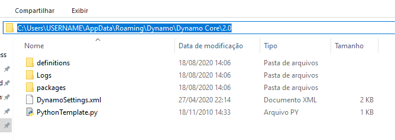
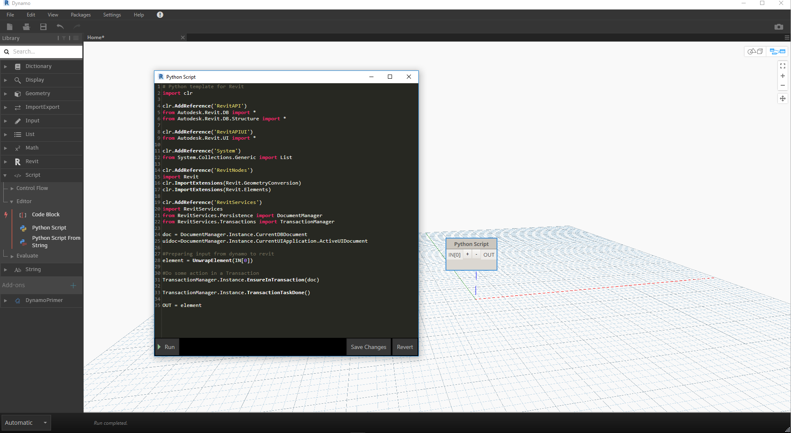

## Modelos Python

Com o Dynamo 2.0, podemos especificar um modelo padrão ```(extensão .py)``` para usar ao abrir a janela do Python pela primeira vez. Essa foi uma solicitação muito desejada, pois isso acelera o uso do Python no Dynamo. Ter a capacidade de usar um modelo nos permite ter as importações padrão prontas para serem usadas quando quisermos desenvolver um script Python personalizado.

A localização desse modelo está em ```APPDATA``` de sua instalação do Dynamo.

Normalmente, é o seguinte caminho ```(%appdata%\Dynamo\Dynamo Core\{version}\)```.



### Configurar o modelo

Para usar essa funcionalidade, é necessário adicionar a seguinte linha em nosso arquivo ```DynamoSettings.xml```. *(Editar no bloco de notas)*


Onde vemos ```<PythonTemplateFilePath />```, basta substituir este por:

```
<PythonTemplateFilePath>
<string>C:\Users\CURRENTUSER\AppData\Roaming\Dynamo\Dynamo Core\2.0\PythonTemplate.py</string>
</PythonTemplateFilePath>
```

*Observação: Substitua CURRENTUSER pelo seu nome de usuário*

Em seguida, precisamos criar um modelo com a funcionalidade que desejamos usar incorporada. Em nosso caso, vamos incorporar as importações relacionadas ao Revit e alguns dos outros itens típicos ao trabalhar com o Revit.

É possível iniciar um documento do bloco de notas em branco e colar o seguinte código:

```
import clr

clr.AddReference('RevitAPI')
from Autodesk.Revit.DB import *
from Autodesk.Revit.DB.Structure import *

clr.AddReference('RevitAPIUI')
from Autodesk.Revit.UI import *

clr.AddReference('System')
from System.Collections.Generic import List

clr.AddReference('RevitNodes')
import Revit
clr.ImportExtensions(Revit.GeometryConversion)
clr.ImportExtensions(Revit.Elements)

clr.AddReference('RevitServices')
import RevitServices
from RevitServices.Persistence import DocumentManager
from RevitServices.Transactions import TransactionManager

doc = DocumentManager.Instance.CurrentDBDocument
uidoc=DocumentManager.Instance.CurrentUIApplication.ActiveUIDocument

#Preparing input from dynamo to revit
element = UnwrapElement(IN[0])

#Do some action in a Transaction
TransactionManager.Instance.EnsureInTransaction(doc)

TransactionManager.Instance.TransactionTaskDone()

OUT = element
```

Uma vez feito isso, salve o arquivo como ```PythonTemplate.py``` na localização ```APPDATA```.

### Comportamento posterior do script Python

Após o modelo do Python ser definido, o Dynamo procurará esses dados sempre que um nó do Python for inserido. Se não forem encontrados, será semelhante à janela do Python padrão.


Se o modelo do Python for encontrado (como nosso modelo do Revit, por exemplo), será possível ver todos os itens padrão incorporados.



Pode obter mais informações sobre esta grande adição (desenvolvida por Radu Gidei) aqui. [https://github.com/DynamoDS/Dynamo/pull/8122](https://github.com/DynamoDS/Dynamo/pull/8122)

