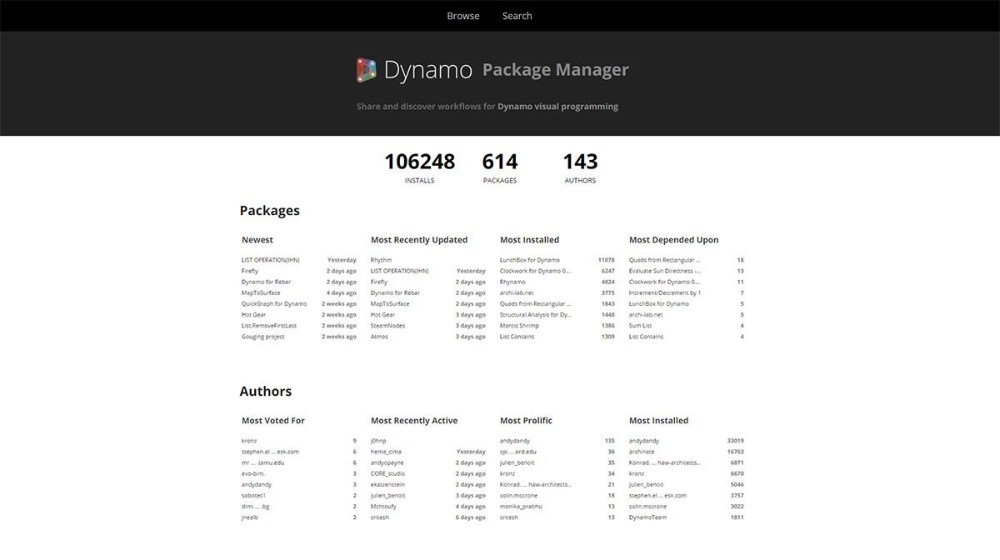
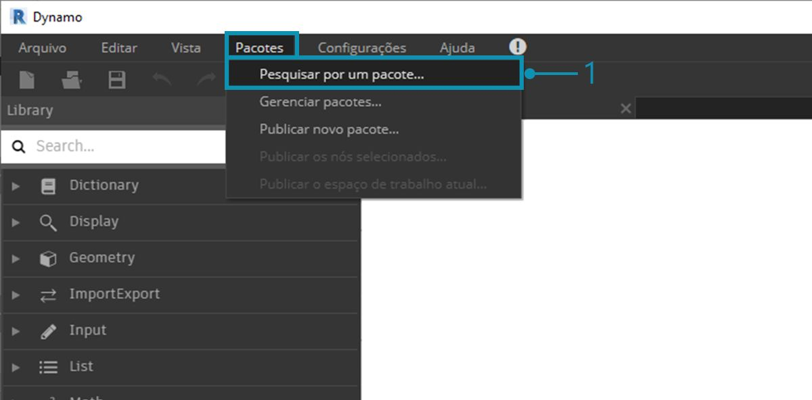
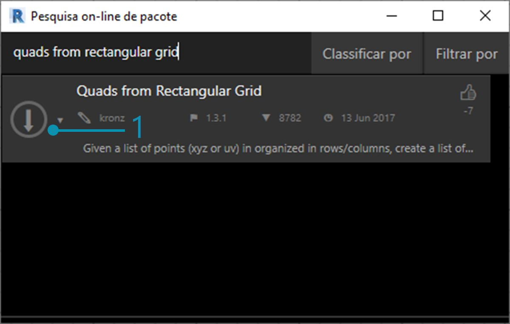
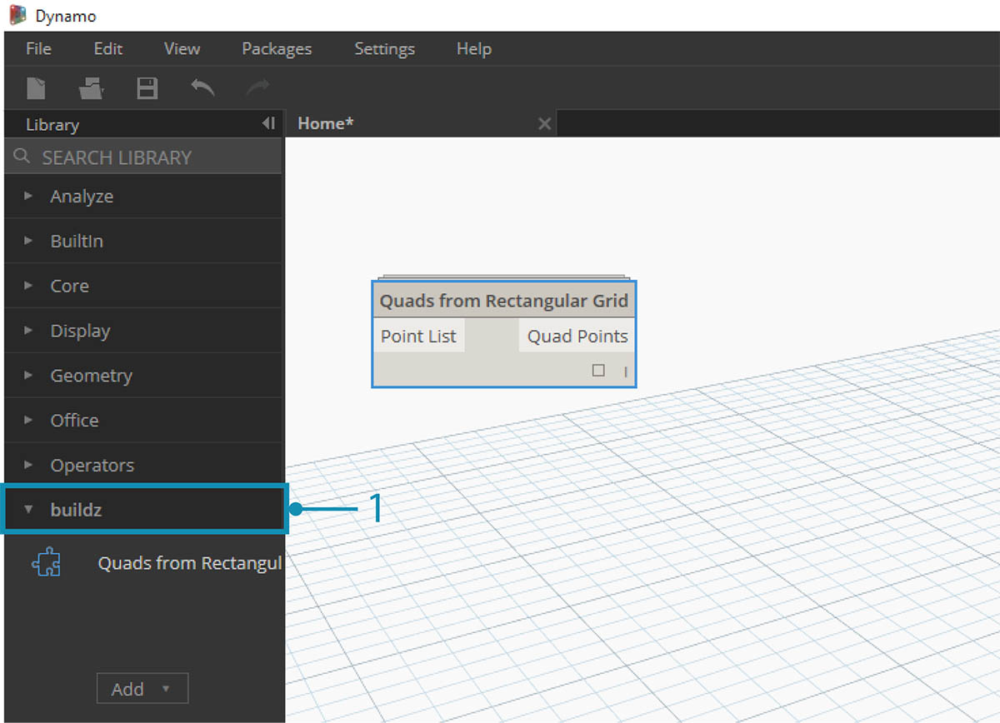
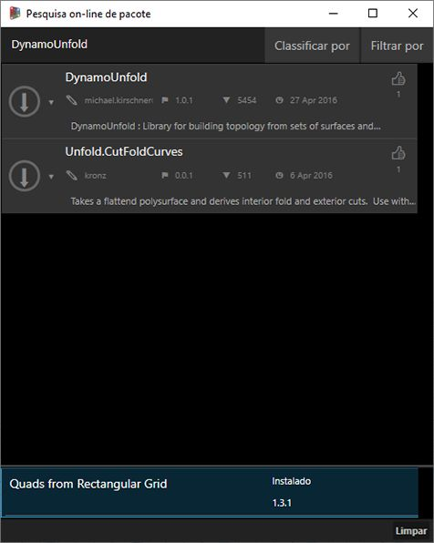
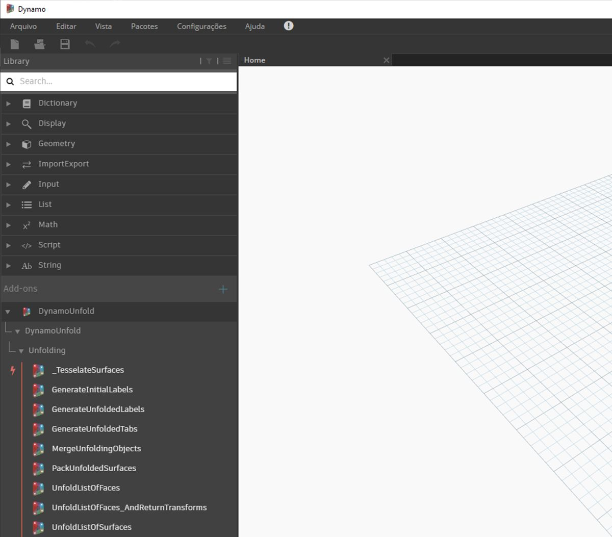
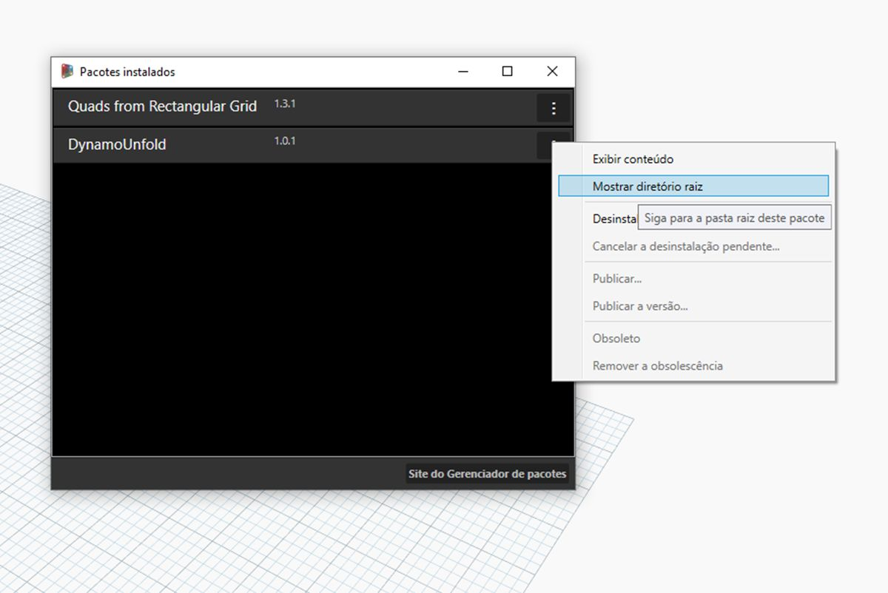
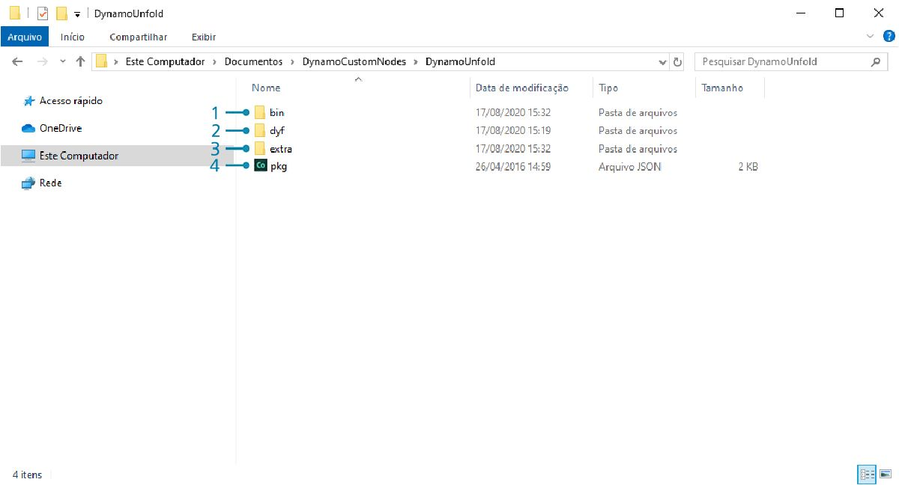
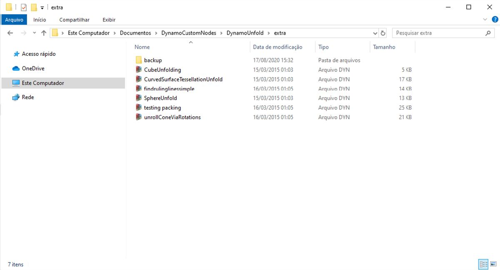
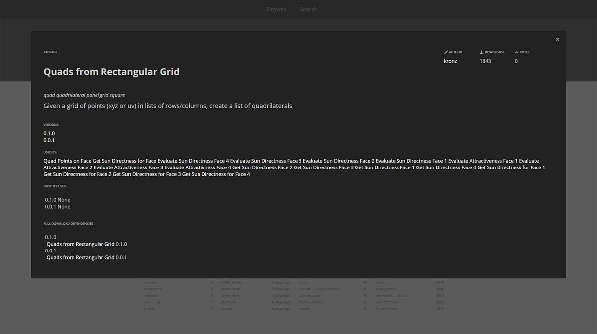

## Pacotes

Em resumo, um pacote é uma coleção de nós personalizados. O Dynamo Package Manager é um portal para a comunidade a fim de efetuar o download de qualquer pacote que tenha sido publicado on-line. Esses conjuntos de ferramentas são desenvolvidos por terceiros para estender a funcionalidade principal do Dynamo, acessível a todos, e estão prontos para download com um clique no botão.

Um projeto de código aberto, como o Dynamo, prospera nesse tipo de envolvimento da comunidade. Com desenvolvedores de terceiros dedicados, o Dynamo é capaz de estender seu alcance para os fluxos de trabalho em uma variedade de setores. Por esse motivo, a equipe do Dynamo tem feito esforços em conjunto para simplificar o desenvolvimento e a publicação de pacotes (que serão discutidos mais detalhadamente nas seções a seguir).

### Instalar um pacote

A forma mais fácil de instalar um pacote é usando a barra de ferramentas Pacotes na interface do Dynamo. Vamos começar imediatamente e instalar um agora. Neste exemplo rápido, vamos instalar um pacote popular para criar painéis quadrados em uma grade. 

> 1. No Dynamo, vá para *Pacotes> Procurar um pacote...*

> Na barra de pesquisa, vamos procurar “quadrados na grade retangular”. Após alguns momentos, você deverá ver todos os pacotes que correspondem a essa consulta de pesquisa. Queremos selecionar o primeiro pacote com o nome correspondente.

> 1. Clique na seta de download à esquerda do nome do pacote para instalar o pacote. Concluído.

> 1. Observe que agora temos outro grupo em nossa biblioteca do Dynamo chamado *“buildz”*. Esse nome se refere ao [desenvolvedor](http://buildz.blogspot.com/) do pacote e o nó personalizado é colocado nesse grupo. Podemos começar a usá-lo imediatamente.

> Com uma operação de bloco de código rápida para definir uma grade retangular, criamos uma lista de painéis retangulares.

### Pastas do pacote

O exemplo acima se concentra em um pacote com um nó personalizado, mas você usa o mesmo processo para fazer o download de pacotes com diversos nós personalizados e arquivos de dados de suporte. Vamos demonstrar isso agora, com um pacote mais abrangente: o Dynamo Unfold.

> Como no exemplo acima, comece selecionando *Pacotes>Procurar um pacote...*. Desta vez, vamos procurar *“DynamoUnfold”*, uma só palavra, com distinção de maiúsculas e minúsculas. Quando os pacotes são exibidos, faça o download clicando na seta à esquerda do nome do pacote. O Dynamo Unfold agora será instalado na sua biblioteca do Dynamo.

> Na biblioteca do Dynamo, temos um grupo *DynamoUnfold* com várias categorias e vários nós personalizados.

> Agora, vamos analisar a estrutura de arquivos do pacote. Selecione *“Pacotes>Gerenciar pacotes...”* no Dynamo. A janela acima será exibida com as duas bibliotecas que instalamos. Clique no botão à direita de *DynamoUnfold* e selecione *“Mostrar diretório raiz”.*

> Isso nos levará ao diretório raiz do pacote. Observe que temos três pastas e um arquivo.

> 1. A pasta *bin* contém os arquivos .dll. Esse pacote do Dynamo foi desenvolvido usando a funcionalidade Sem toque, para que os nós personalizados sejam mantidos nessa pasta.
2. A pasta *dyf* contém os nós personalizados. Esse pacote não foi desenvolvido usando os nós personalizados do Dynamo, portanto, essa pasta está vazia para esse pacote.
3. A pasta extra contém todos os arquivos adicionais, inclusive os arquivos de exemplo.
4. O arquivo pkg é um arquivo de texto básico que define as configurações do pacote. Podemos ignorar isso por enquanto.

> Abrindo a pasta *“extra”*, vemos muitos arquivos de exemplo que foram obtidos por download com a instalação. Nem todos os pacotes têm arquivos de exemplo, mas será possível encontrá-los se fizerem parte de um pacote. Vamos abrir *“SphereUnfold”*.

> Após abrir o arquivo e pressionar *“Executar”* no solucionador, teremos uma esfera desdobrada. Arquivos de exemplo como esses são úteis para aprender como trabalhar com um novo pacote do Dynamo.

### Dynamo Package Manager

Outra forma de descobrir os pacotes do Dynamo é explorar o [Dynamo Package Manager](http://dynamopackages.com/) on-line. Essa é uma boa forma de procurar pacotes, pois o repositório classifica os pacotes em ordem de popularidade e número de downloads. Além disso, é uma forma fácil de coletar informações sobre atualizações recentes de pacotes, pois alguns pacotes do Dynamo estão sujeitos a controle de versão e dependências das compilações do Dynamo.

> Ao clicar em *“Quadrados da grade retangular”* no Dynamo Package Manager, você pode ver suas descrições, versões, o desenvolvedor e as possíveis dependências.

Também é possível fazer o download dos arquivos do pacote no Dynamo Package Manager, mas fazer isso diretamente no Dynamo é um processo mais intuitivo.

### Onde estão armazenados os arquivos localmente?

Se você fizer o download dos arquivos do Dynamo Package Manager ou se desejar ver onde todos os seus arquivos de pacote são mantidos, clique em *Configurações>Gerenciar caminhos de nó e pacote...*. Ao clicar nas reticências ao lado do diretório de pasta, é possível copiar a pasta raiz e explorar o pacote na janela do explorer. Por padrão, os pacotes são instalados em uma localização similar a esse caminho de pasta: *C:/Users/[nome de usuário]/AppData/Roaming/Dynamo/[versão do Dynamo]*.

### Aprofundar os pacotes

A comunidade do Dynamo está crescendo e evoluindo constantemente. Explorando o Dynamo Package Manager periodicamente, você encontrará alguns novos desenvolvimentos empolgantes. Nas seções a seguir, analisaremos com mais detalhes os pacotes, da perspectiva do usuário final até a criação do seu próprio pacote do Dynamo.

