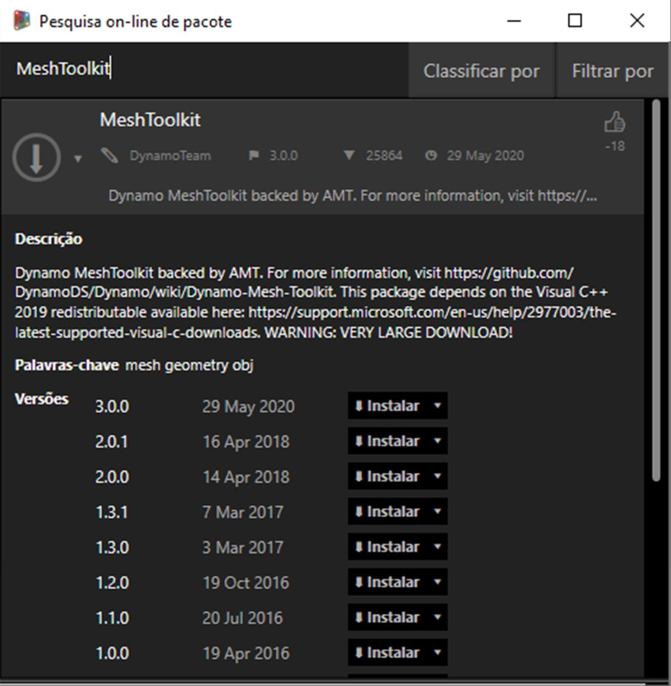

## Estudo de caso do pacote – Kit de ferramentas de malha

O Kit de ferramentas de malha do Dynamo fornece ferramentas para importar malhas de formatos de arquivos externos, para criar uma malha com base nos objetos de geometria do Dynamo e para criar manualmente malhas de acordo com seus vértices e índices. A biblioteca também fornece ferramentas para modificar malhas, reparar malhas ou extrair fatias horizontais para uso na fabricação.

O Kit de ferramentas de malha do Dynamo faz parte da pesquisa contínua da malha da Autodesk, e como tal continuará a crescer nos próximos anos. Pode contar com o aparecimento frequente de novos métodos no kit de ferramentas. Sinta-se à vontade para entrar em contato com a equipe do Dynamo com comentários, bugs e sugestões de novos recursos.

### Malhas vs. sólidos

O exercício abaixo demonstra algumas operações básicas de malha usando o Kit de ferramentas de malha. No exercício, intersecionamos uma malha com uma série de planos, que podem ser computacionalmente caros usando sólidos. Ao contrário de um sólido, uma malha tem uma “resolução” definida e não é definida matematicamente, mas topologicamente, e é possível definir essa resolução com base na tarefa em questão. Para obter mais detalhes sobre as relações de malha para sólidos, consulte o capítulo [Geometria do projeto de cálculo](../05_Geometry-for-Computational-Design/5_geometry-for-computational-design.md) neste manual. Para uma análise mais completa do Kit de ferramentas de malha, consulte a [página Wiki do Dynamo.](https://github.com/DynamoDS/Dynamo/wiki/Dynamo-Mesh-Toolkit) Vamos analisar o pacote no exercício abaixo.

### Instalar o kit de ferramentas de malha

> No Dynamo, vá para *Pacotes > Procurar pacotes...* na barra de menus superior. No campo de pesquisa, digite *“MeshToolkit”*, tudo junto, com atenção às maiúsculas. Clique na seta de download do pacote apropriado para sua versão do Dynamo. É tão simples quanto isto.

### Exercício

> Faça o download e descompacte os arquivos de exemplo deste exercício (clique com o botão direito do mouse e escolha “Salvar link como...”). É possível encontrar uma lista completa de arquivos de exemplo no Apêndice. [MeshToolkit.zip](datasets/11-2/MeshToolkit.zip)

Para começar, abra *Mesh-Toolkit_Intersect-Mesh.dyn no Dynamo.* Neste exemplo, vamos analisar o nó Intersect no kit de ferramentas de malha. Vamos importar uma malha e intersecioná-la com uma série de planos de entrada para criar fatias. Esse é o ponto inicial para preparar o modelo para fabricação em um cortador a laser, um cortador a jato de água ou uma fresa CNC.

> 1. **Caminho do arquivo:** localize o arquivo de malha a ser importado (*stanford_bunny_tri.obj*). Os tipos de arquivo suportados são .mix e .obj
2. **Mesh.ImportFile:** conecte o caminho do arquivo para importar a malha

> 1. **Point.ByCoordinates:** crie um ponto – será o centro de um arco.
2. **Arc.ByCenterPointRadiusAngle:** crie um arco em torno do ponto. Essa curva será usada para posicionar uma série de planos.

> 1. Code Block: crie um intervalo de números entre zero e um.
2. **Curve.PointAtParameter:** conecte o arco à entrada *“curve”* e a saída do bloco de código à entrada *“param”* para extrair uma série de pontos ao longo da curva.
3. **Curve.TangentAtParameter:** conecte as mesmas entradas do nó anterior.
4. **Plane.ByOriginNormal:** conecte os pontos à entrada *“origin”* e os vetores à entrada *“normal”* para criar uma série de planos em cada ponto.

Você agora deve visualizar uma série de planos orientados ao longo do arco. A seguir, usaremos esses planos para fazer a interseção com a malha.

> 1. **Mesh.Intersect:** faça a interseção dos planos com a malha importada, criando uma série de contornos de PolyCurve.
2. **PolyCurve.Curves:** divida as PolyCurves em seus fragmentos de curva.
3. **Curve.EndPoint:** extraia os pontos finais de cada curva.
4. **NurbsCurve.ByPoints:** use os pontos para criar uma curva NURBS. Use um nó Boolean definido como *True* para fechar as curvas.

> 1. **Surface.ByPatch:** crie os fechamentos de superfícies para cada contorno para criar “fatias” da malha.

> Adicione um segundo conjunto de fatias para obter um efeito waffle/caixa de ovos.

Você pode ter notado que as operações de intersecção são calculadas mais rapidamente com uma malha vs. um sólido comparável. Fluxos de trabalho como o demonstrado neste exercício ajudam a trabalhar com malhas.

