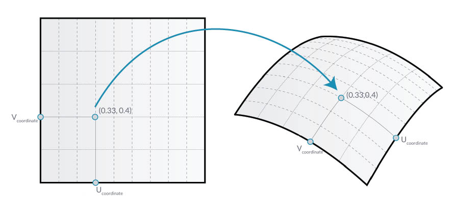
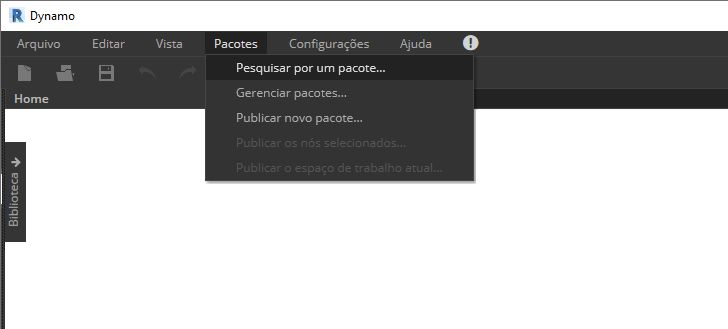
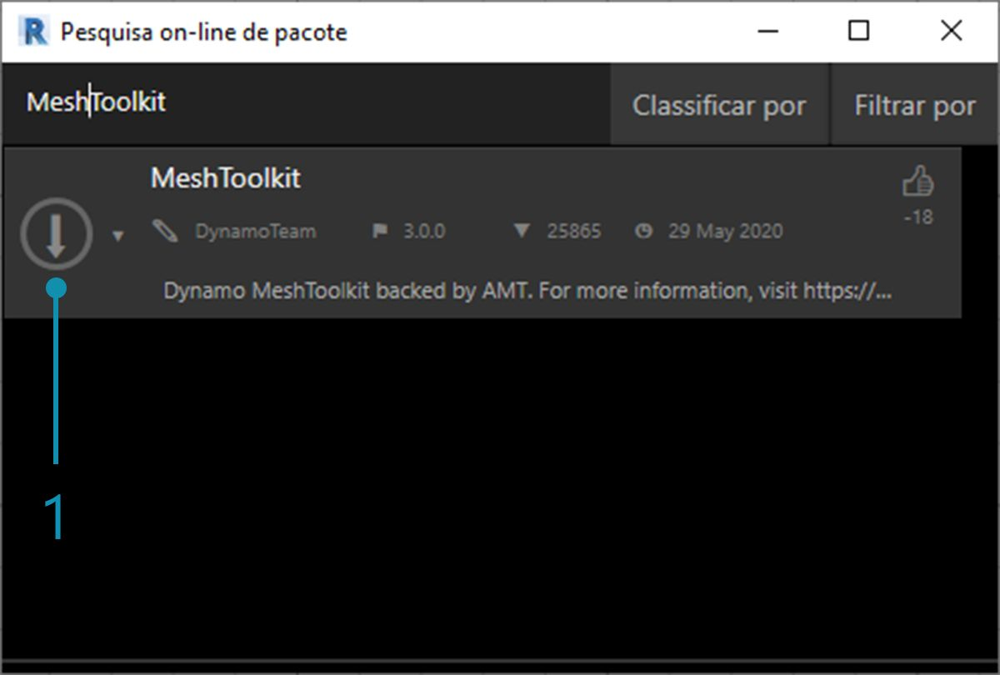
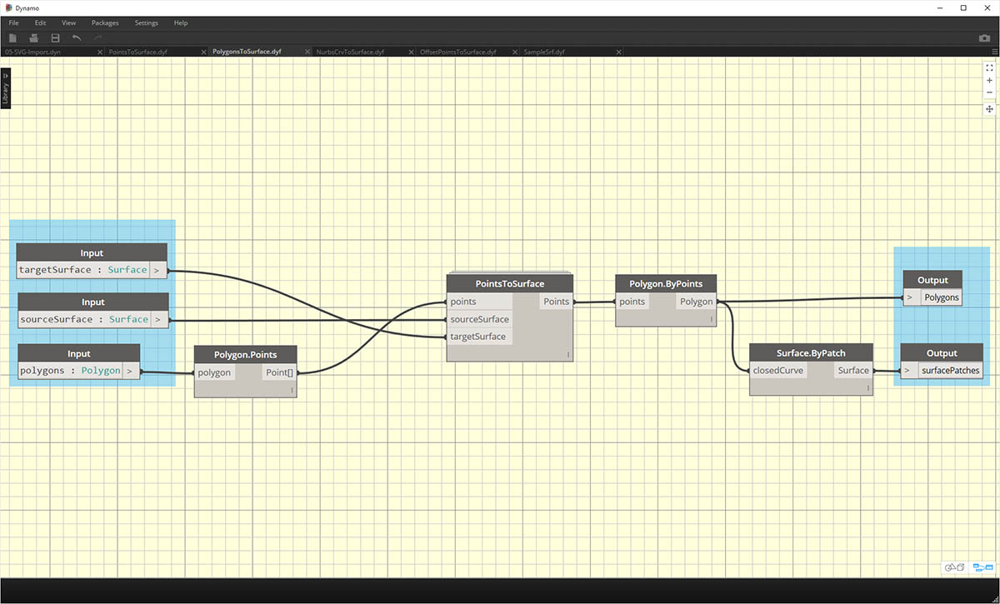
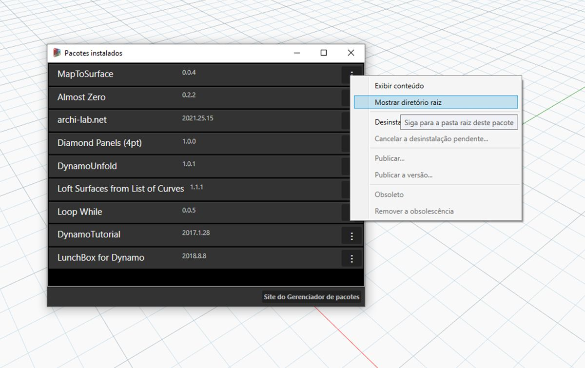
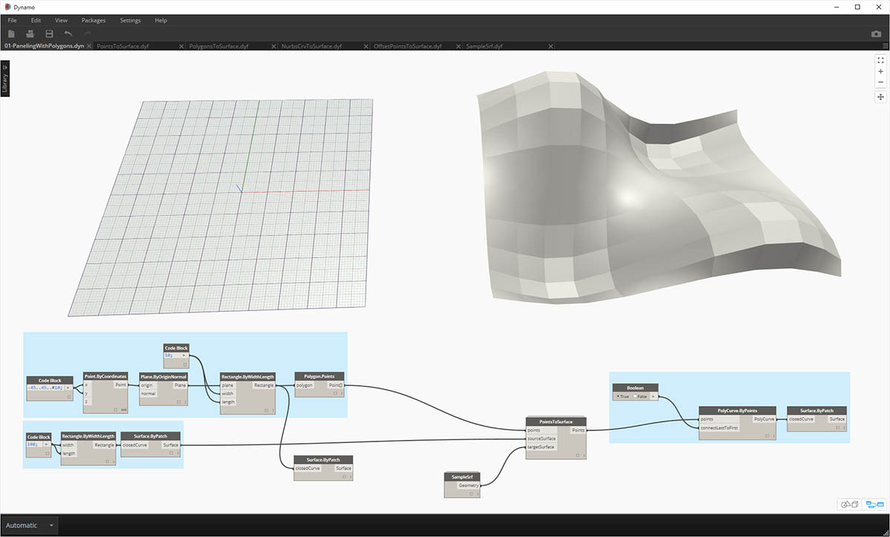
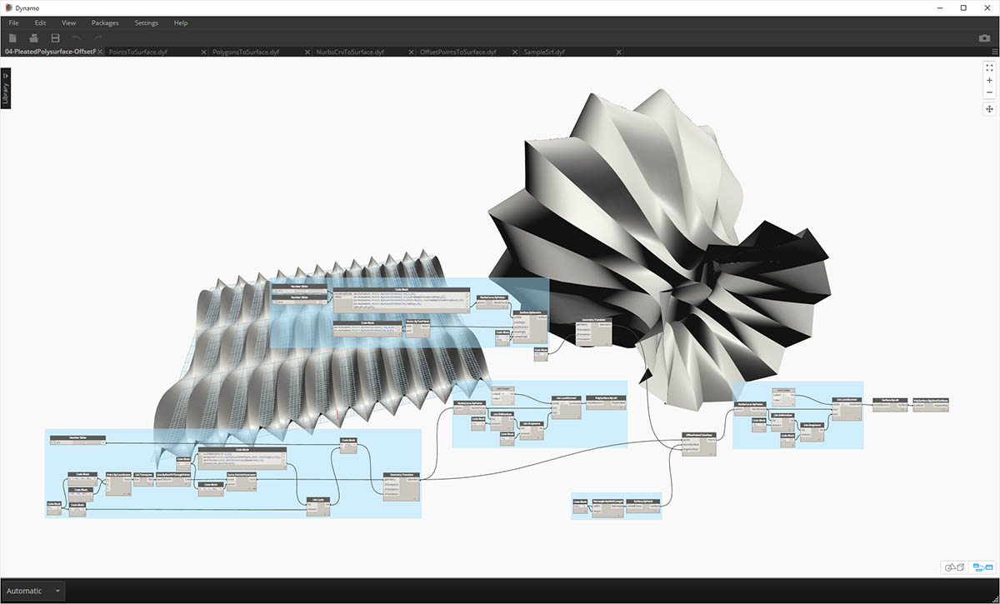

## Desenvolver um pacote

O Dynamo oferece diversas formas de criar um pacote para seu uso pessoal ou para compartilhar com a comunidade do Dynamo. No estudo de caso abaixo, vamos analisar como um pacote é configurado desconstruindo um existente. Este estudo de caso baseia-se nas lições do capítulo anterior, fornecendo um conjunto de nós personalizados para o mapeamento de geometria, por coordenadas UV, de uma superfície do Dynamo para outra.

### MapToSurface

Vamos trabalhar com um pacote de amostra que demonstra o mapeamento UV de pontos de uma superfície para outra. Já construímos os conceitos básicos da ferramenta na seção [Criar um nó personalizado](../10_Custom-Nodes/10-2_Creating.md) desta introdução. Os arquivos abaixo demonstram como podemos usar o conceito de mapeamento UV e desenvolver um conjunto de ferramentas para uma biblioteca publicável.

> Nessa imagem, mapeamos um ponto de uma superfície para outra usando as coordenadas UV. O pacote é baseado nesse conceito, mas com uma geometria mais complexa.

### Instalar o pacote

No capítulo anterior, exploramos formas de criar painéis em uma superfície no Dynamo com base nas curvas definidas no plano XY. Este estudo de caso estende esses conceitos para mais cotas de geometria. Vamos instalar esse pacote conforme construído para demonstrar como ele foi desenvolvido. Na próxima seção, demonstraremos como esse pacote foi publicado.

> Essa é a parte fácil. No Dynamo, navegue até *“Pacotes> Procurar um pacote...”*

> Procure o pacote *“MapToSurface”* (uma única palavra).

> 1. Quando o pacote for encontrado, clique na seta grande de download à esquerda do nome do pacote. Isso instalará o pacote no Dynamo.

> 1. Após a instalação, os nós personalizados deverão estar disponíveis no grupo “DynamoPrimer” ou na biblioteca do Dynamo. Com o pacote já instalado, vamos analisar como ele está configurado.

### Nós personalizados

O pacote que estamos criando usa cinco nós personalizados que criamos para referência. Vamos examinar o que cada nó faz abaixo. Alguns nós personalizados são criados com base em outros nós personalizados, e os gráficos têm um layout para que outros usuários compreendam de forma simples.

> Esse é um pacote simples com cinco nós personalizados. Nas etapas abaixo, falaremos brevemente sobre a configuração de cada nó personalizado.

> **PointsToSurface:** esse é um nó personalizado básico e no qual todos os outros nós de mapeamento são baseados. Em termos simples, o nó mapeia um ponto de uma coordenada UV da superfície de origem para o local da coordenada UV a superfície de destino. E, como os pontos são a geometria mais primitiva, a partir da qual se constrói uma geometria mais complexa, podemos usar essa lógica para mapear a geometria 2D e até mesmo a geometria 3D de uma superfície para outra.

> **PolygonsToSurface:** a lógica de estender pontos mapeados da geometria 1D para a geometria 2D é demonstrado simplesmente com polígonos aqui. Observe que aninhamos o nó *“PointsToSurface”* nesse nó personalizado. Desta forma, é possível mapear os pontos de cada polígono para a superfície e, em seguida, regenerar o polígono com base nesses pontos mapeados. Ao manter a estrutura de dados apropriada (uma lista de listas de pontos), podemos manter os polígonos separados após serem reduzidos a um conjunto de pontos.

> **NurbsCrvtoSurface:** a mesma lógica do nó *“PolygonsToSurface”* se aplica aqui. Mas, em vez de mapear pontos poligonais, estamos mapeando pontos de controle de uma curva NURBS.

> **OffsetPointsToSurface:** esse nó fica um pouco mais complexo, mas o conceito é simples: como o nó *“PointsToSurface”*, esse nó mapeia pontos de uma superfície para outra. No entanto, ele também considera os pontos que não estão na superfície de origem, obtém sua distância até o parâmetro UV mais próximo e mapeia essa distância até a superfície alvo normal na coordenada UV correspondente. Isso fará mais sentido ao analisar os arquivos de exemplo.

> **SampleSrf:** esse é um nó simples que cria uma superfície paramétrica para mapear da grade de origem para uma superfície ondulada nos arquivos de exemplo.

### Arquivos de exemplo

Os arquivos de exemplo podem ser encontrados na pasta raiz do pacote (no Dynamo, navegue até esta pasta acessando *Pacotes>Gerenciar pacotes...*).

> Na janela Gerenciar pacotes, clique nos três pontos verticais à direita de *“MapToSurface”* e escolha *“Mostrar diretório raiz”.*

Com o diretório raiz aberto, navegue até a pasta *“extra”*, que contém todos os arquivos do pacote que não são nós personalizados. É nesse ponto que os arquivos de exemplos (se existirem) são armazenados para pacotes do Dynamo. As capturas de tela abaixo discutem os conceitos demonstrados em cada arquivo de exemplo.

> **01-PanelingWithPolygons:** esse arquivo de exemplo demonstra como *“PointsToSurface”* pode ser usado para criar um painel de uma superfície com base em uma grade de retângulos. Isso deve ser familiar, pois demonstramos um fluxo de trabalho similar no [capítulo anterior](../10_Custom-Nodes/10-2_Creating.md).

> **02-PanelingWithPolygons-II:** usando um fluxo de trabalho semelhante, esse arquivo de exercício mostra uma configuração para o mapeamento de círculos (ou polígonos que representam círculos) de uma superfície para outra. Isso usa o nó *“PolygonsToSurface”*.

> **03-NurbsCrvsAndSurface:** esse arquivo de exemplo adiciona alguma complexidade trabalhando com o nó “NurbsCrvToSurface”. A superfície alvo é deslocada uma determinada distância e a curva Nurbs é mapeada para a superfície alvo original e para a superfície de deslocamento. A partir daí, as duas curvas mapeadas são elevadas para criar uma superfície, que então se torna mais espessa. Esse sólido resultante apresenta uma ondulação representativa das normais da superfície alvo.

> **04-PleatedPolysurface-OffsetPoints:** esse arquivo de exemplo demonstra como mapear uma PolySurface plissada de uma superfície de origem para uma superfície alvo. A superfície de origem e de destino são uma superfície retangular que se estende pela grade e uma superfície de revolução, respectivamente.

> **04-PleatedPolysurface-OffsetPoints:** a PolySurface de origem mapeada da superfície de origem para a superfície de destino.

> **05-SVG-Import:** como os nós personalizados são capazes de mapear diferentes tipos de curvas, esse último arquivo faz referência a um arquivo SVG exportado do Illustrator e mapeia as curvas importadas para uma superfície alvo.

> **05-SVG-Import:** ao analisar a sintaxe de um arquivo .svg, as curvas são convertidas do formato .xml em policurvas do Dynamo.

> **05-SVG-Import:** as curvas importadas são mapeadas para uma superfície alvo. Isso nos permite projetar explicitamente (apontar e clicar) uma panorâmica no Illustrator, importar no Dynamo e aplicar a uma superfície de destino.

