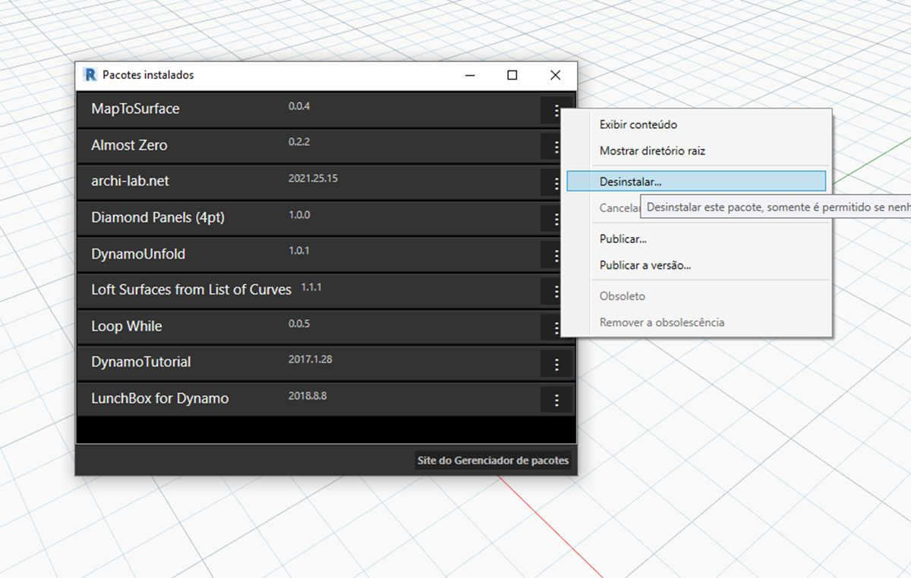

## Publicar um pacote

Nas seções anteriores, analisamos os detalhes de como o pacote *MapToSurface* é definido com nós personalizados e arquivos de exemplo.  Mas como publicamos um pacote que foi desenvolvido localmente?  Este estudo de caso demonstra como publicar um pacote de um conjunto de arquivos em uma pasta local.
Há muitas maneiras de publicar um pacote. Abaixo está o processo aconselhado:** publicar localmente, desenvolver localmente e publicar on-line**. Vamos começar com uma pasta contendo todos os arquivos do pacote.

### Desinstalar um pacote
Antes de passarmos para a publicação do pacote MapToSurface, se você instalou o pacote da lição anterior, desinstale-o para que não esteja trabalhando com pacotes idênticos.

> Comece indo para *Pacotes>Gerenciar pacotes...*

> Selecione o botão correspondente a *"MapToSurface"* e selecione *"Desinstalar..."*. Em seguida, reinicie o Dynamo. Ao reabrir, quando você verificar a janela *"Gerenciar pacotes"*, o *MapToSurface* não deve mais estar lá. Agora estamos prontos para começar!

### Publicar um pacote localmente

*Observação: No momento em que este documento foi escrito, a publicação do pacote somente está ativada no Dynamo for Revit e no Dynamo para Civil 3D. O Dynamo Sandbox não tem a funcionalidade de publicação.*

> Faça o download e descompacte os arquivos de exemplo que acompanham o estudo de caso deste pacote (clique com o botão direito do mouse e selecione “Salvar link como...”). É possível encontrar uma lista completa de arquivos de exemplo no Apêndice. [MapToSurface.zip](datasets/11-4/MapToSurface.zip)

> Este é o primeiro envio para o nosso pacote e colocamos todos os arquivos de exemplo e nós personalizados em uma pasta.  Com esta pasta preparada, estamos prontos para carregar no Dynamo Package Manager.
1. Essa pasta contém cinco nós personalizados (.dyf).
2. Essa pasta também contém cinco arquivos de exemplo (.dyn) e um arquivo de vetor importado (.svg). Esses arquivos servirão como exercícios introdutórios para mostrar ao usuário como trabalhar com os nós personalizados.

> No Dynamo, comece clicando em *Pacotes>Publicar novo pacote...*

> Na janela *"Publicar um pacote do Dynamo"*, preenchemos os formulários relevantes à esquerda da janela.
1. Ao clicar em *"Adicionar arquivo"*, também adicionamos os arquivos da estrutura de pastas no lado direito da tela (para adicionar arquivos que não são arquivos .dyf, certifique-se de alterar o tipo de arquivo na janela do navegador para **"Todos os arquivos(*.*)"**. Observe que adicionamos cada arquivo, nó personalizado (.dyf) ou arquivo de exemplo (.dyn) de forma indiferenciada. O Dynamo classificará esses itens em categorias quando publicarmos o pacote.
2. O campo "Grupo" define qual grupo localizará os nós personalizados na interface do usuário do Dynamo.
3. Publique ao clicar em "Publicar localmente". Após completar esses passos, certifique-se de clicar em *"Publicar localmente"* e **não** *"Publicar on-line"*; é recomendável evitar o acúmulo de pacotes duplicados no Gerenciador de pacotes.

> 1. Após a publicação, os nós personalizados devem estar disponíveis no grupo "DynamoPrimer" ou na sua Biblioteca do Dynamo.

> Agora, vamos examinar o diretório raiz para ver como o Dynamo formatou o pacote que acabamos de criar. Faça isso clicando em *Pacotes>Gerenciar pacotes...*

> Na janela Gerenciar pacotes, clique nos três pontos verticais à direita de *"MapToSurface"* e escolha *"Mostrar diretório raiz".*

> Observe que o diretório raiz está na localização local do pacote (lembre-se de que publicamos o pacote "localmente").  O Dynamo está fazendo referência a esta pasta para ler nós personalizados. Portanto, é importante publicar localmente o diretório em um local de pasta permanente (isto é, não em seu desktop). Veja a seguir a divisão da pasta do pacote do Dynamo:
1. A pasta *bin* contém os arquivos .dll criados com bibliotecas C# ou Zero-Touch.  Não temos nenhum arquivo neste pacote, portanto, esta pasta está em branco neste exemplo.
2. A pasta *dyf* contém os nós personalizados.  Ao abrir essa pasta, serão exibidos todos os nós personalizados (arquivos .dyf) para este pacote.
3. A pasta adicional contém todos os arquivos adicionais.  É provável que esses arquivos sejam arquivos do Dynamo (.dyn) ou qualquer arquivo adicional necessário (.svg, .xls, .jpeg, .sat, etc.).
4. O arquivo pkg é um arquivo de texto básico que define as configurações do pacote. Isso é automatizado no Dynamo, mas pode ser editado se você deseja entrar nos detalhes.

### Publicar um pacote on-line

> **Observação: não siga estas etapas, a não ser que você esteja realmente publicando um pacote próprio!**
1. Quando estiver pronto para publicar, na janela "Gerenciar pacotes", selecione o botão à direita de MapToSurface e escolha *Publicar...*
2. Se você estiver atualizando um pacote que já foi publicado, selecione "Publicar versão" e o Dynamo atualizará seu pacote on-line com base nos novos arquivos no diretório raiz do pacote. Simples assim!

### Publicar a versão...
Quando você atualiza os arquivos na pasta raiz do pacote publicado, é possível publicar uma nova versão do pacote selecionando *"Publicar versão..."* na janela *Gerenciar pacotes*.  Esta é uma forma perfeita para se fazer atualizações necessárias ao seu conteúdo e para compartilhar com a comunidade.  *A versão de publicação* só funcionará se você for o administrador do pacote.
