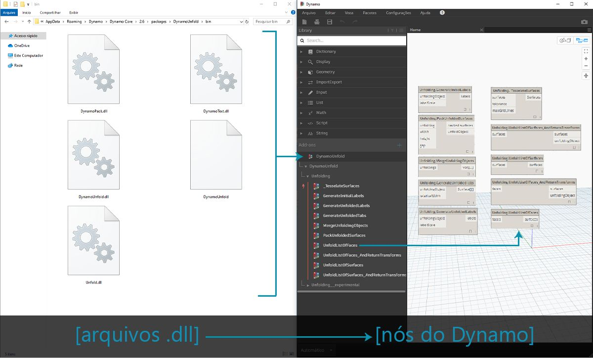
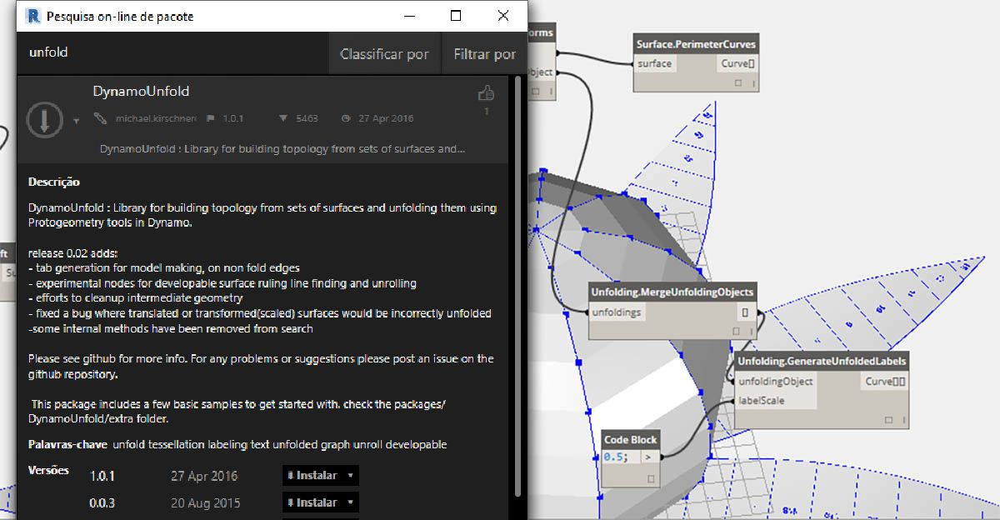
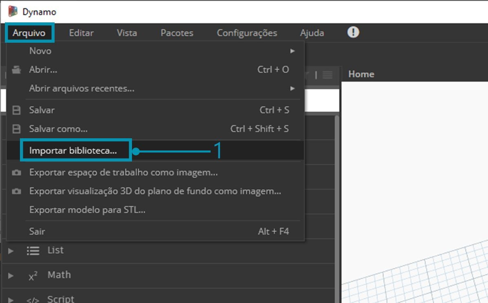
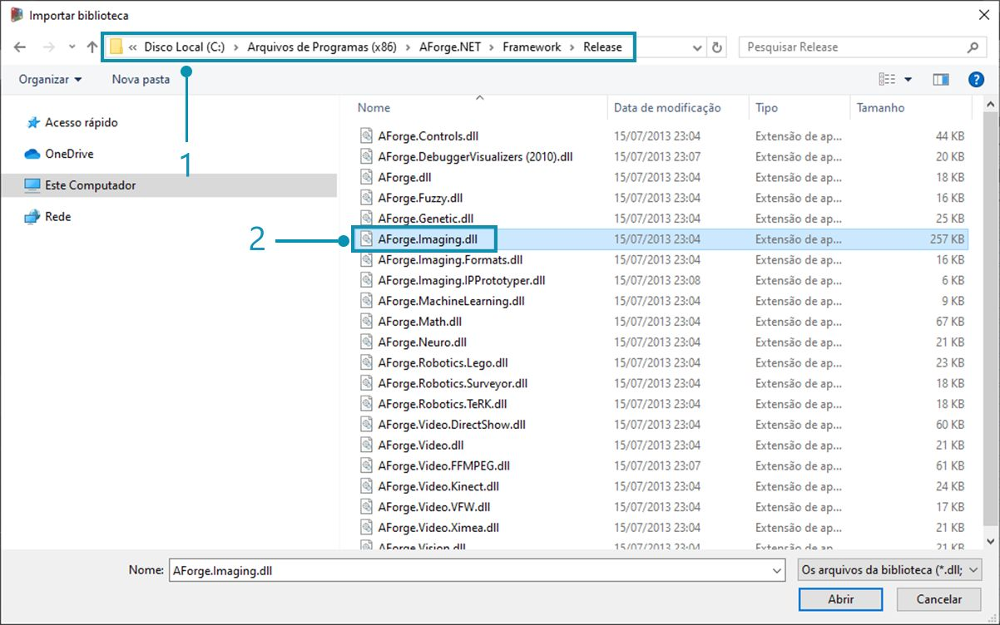
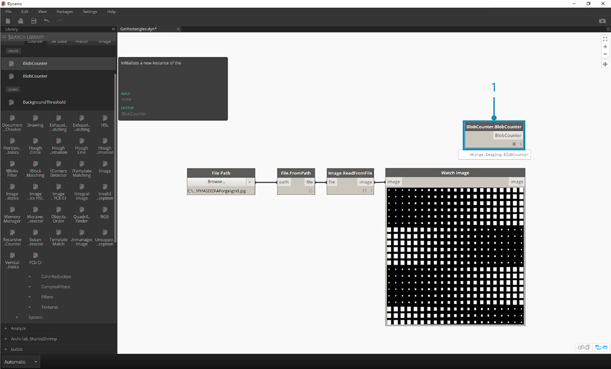
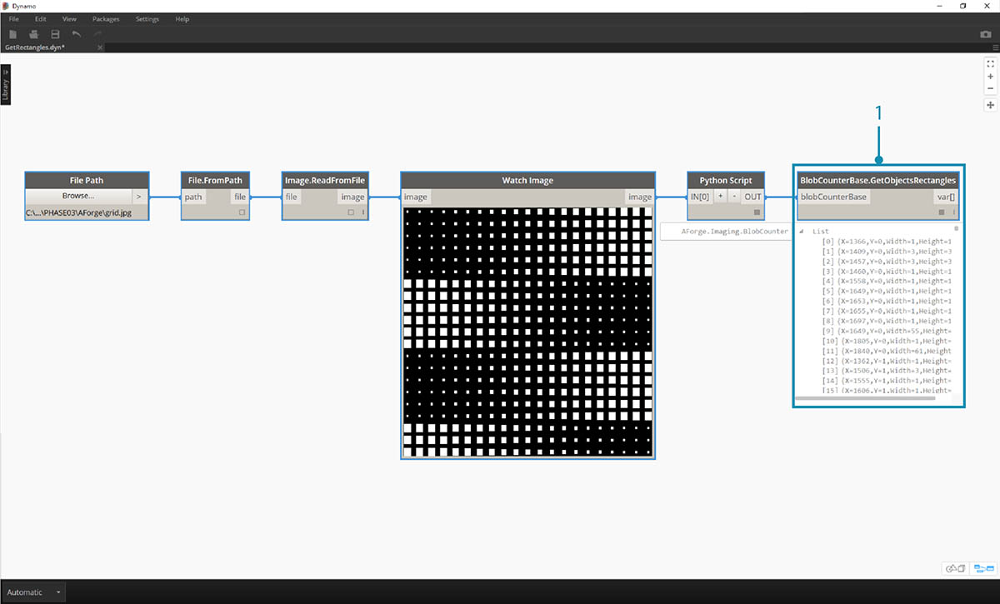
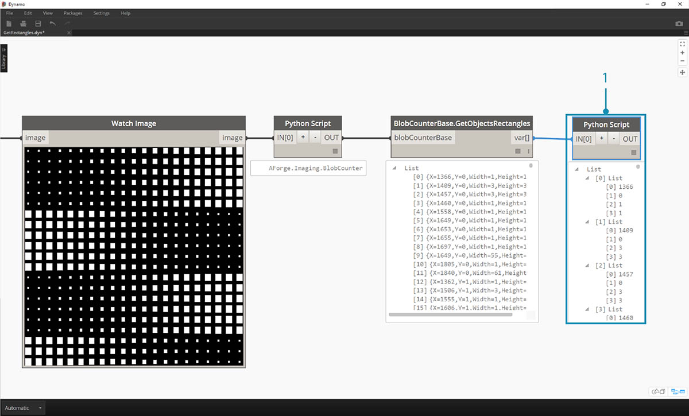

<style>
table{box-shadow: 2px 2px 2px #BBBBBB;max-width:75%;display:block;margin-left: auto;   margin-right: auto }
thead {display: none}
img{display:block;margin-left: auto;   margin-right: auto }
</style>

## O que é a funcionalidade Sem toque?

A importação sem toque é um método de apontar e clicar simples para importar bibliotecas C#. O Dynamo lerá os métodos públicos de um arquivo *.dll* e os converterá em nós do Dynamo. É possível usar a funcionalidade Sem toque para desenvolver seus próprios nós e pacotes personalizados e para importar bibliotecas externas para o ambiente do Dynamo.



Com a funcionalidade Sem toque, é possível importar de fato uma biblioteca que não foi necessariamente desenvolvida para o Dynamo e criar um conjunto de novos nós. A funcionalidade Sem toque atual demonstra a mentalidade do projeto do Dynamo entre plataformas.

Esta seção demonstra como usar a funcionalidade Sem toque para importar uma biblioteca de terceiros. Para obter informações sobre como desenvolver sua própria biblioteca sem toque, consulte a [página wiki do Dynamo](https://github.com/DynamoDS/Dynamo/wiki/Zero-Touch-Plugin-Development).

### Pacotes sem toque

Os pacotes sem toque são um bom complemento aos nós personalizados definidos pelo usuário. Alguns pacotes que usam bibliotecas C# são listados na tabela abaixo. Para obter informações mais detalhadas sobre os pacotes, consulte a [seção Pacotes ](../Appendix/A-3_packages.md)no Apêndice.


<table width="100%">
    <tr>
    <td width="20%"><b>Logotipo/imagem</b></td>
    <td><b>Nome</b></td>
</tr>
  <tr>
    <td></img></td>
    <td><a href="https://github.com/DynamoDS/Dynamo/wiki/Dynamo-Mesh-Toolkit">Kit de ferramentas de malha</td></a>
  </tr>
  <tr>
    <td></img></td>
    <td><a href="http://dynamobim.com/dynamounfold/">Desdobramento do Dynamo</td></a>
  </tr>
  <tr>
    <td></img></td>
    <td><a href="http://www.case-inc.com/blog/what-is-rhynamo">Rhynamo</td></a>
  </tr>
  <tr>
    <td></img></td>
    <td><a href="https://github.com/BPOpt/Optimo">Optimo</td></a>
  </tr>
</table>

### Estudo de caso – Importar o AForge

Neste estudo de caso, vamos mostrar como importar a biblioteca *.dll* externa [AForge](http://www.aforgenet.com/). O AForge é uma biblioteca robusta que oferece uma gama de funcionalidades de processamento de imagens para inteligência artificial. Vamos fazer referência à classe de imagens no AForge para fazer alguns exercício de processamento de imagens abaixo.

> Faça o download e descompacte os arquivos de exemplo que acompanham o estudo de caso deste pacote (clique com o botão direito do mouse e selecione “Salvar link como...”). É possível encontrar uma lista completa de arquivos de exemplo no Apêndice. [Zero-Touch-Examples.zip](datasets/11-5/Zero-Touch-Examples.zip).

> 1. Vamos começar por fazer o download do AForge. Na [página de download do AForge](http://www.aforgenet.com/framework/downloads.html), selecione *[Instalador de download]* e instale após a conclusão do download.



> 1. No Dynamo, crie um novo arquivo e selecione *Arquivo > Importar biblioteca...*



> 1. Na janela pop-up, navegue até a pasta de lançamento em sua instalação do AForge. Provavelmente isso estará em uma pasta semelhante a esta: *C:\ Arquivos de Programas (x86)\AForge.NET\Framework\Release*.
2. **AForge.Imaging.dll:** somente queremos usar esse arquivo da biblioteca AForge para este estudo de caso. Selecione este *.dll* e pressione *“Abrir”.*


> 1. De volta ao Dynamo, você deve ver um grupo de nós *“AForge”* adicionados à barra de ferramentas da biblioteca. Agora, temos acesso à biblioteca de imagens do AForge do nosso programa visual.

### Exercício 1 – Detecção de bordas

Agora que a biblioteca foi importada, começaremos com este primeiro exercício. Vamos fazer um processamento básico de imagem em uma imagem de amostra para mostrar como o AForge filtra as imagens. Usaremos o nó *“Inspeção de imagem”* para mostrar nossos resultados e aplicar filtros no Dynamo de forma similar aos do Photoshop.

> Faça o download e descompacte os arquivos de exemplo que acompanham o estudo de caso deste pacote (clique com o botão direito do mouse e selecione “Salvar link como...”). É possível encontrar uma lista completa de arquivos de exemplo no Apêndice. [ZeroTouchImages.zip](datasets/11-5/ZeroTouchImages.zip)

Agora que a biblioteca foi importada, começaremos com este primeiro exercício (*01-EdgeDetection.dyn*). Vamos fazer um processamento básico de imagem em uma imagem de amostra para mostrar como o AForge filtra as imagens. Usaremos o nó *“Inspeção de imagem”* para mostrar nossos resultados e aplicar filtros no Dynamo de forma similar aos do Photoshop.


> Primeiro, queremos importar uma imagem para trabalhar. Adicione um nó *Caminho do arquivo* à tela e selecione “soapbubbles.jpg” na pasta de exercícios que transferiu por download (créd. foto: [flickr](https://www.flickr.com/photos/wwworks/667298782)).


> 1. O nó Caminho do arquivo simplesmente fornece uma sequência de caracteres do caminho para a imagem que selecionamos. É necessário converter esse caminho do arquivo em uma imagem no ambiente do Dynamo.
2. Conecte o nó Caminho do arquivo ao nó File.FromPath.
3. Para converter esse arquivo em uma imagem, usaremos o nó Image.ReadFromFile.
4. Por último, vamos ver o resultado. Solte um nó Inspeção de imagem na tela e conecte-se a Image.ReadFromFile. Ainda não usamos o AForge, mas importamos com êxito uma imagem para o Dynamo.


> Em AForge.Imaging.AForge.Filters (no menu de navegação), você notará que há uma ampla gama de filtros disponíveis. Agora, vamos usar um desses filtros para diminuir a saturação de uma imagem com base nos valores limite.

> 1. Solte três controles deslizantes na tela, altere suas faixas para que fiquem de 0 a 1 e seus valores de etapas para 0,01.
2. Adicione o nó Grayscale.Grayscale à tela. Esse é um filtro do AForge que aplica um filtro de escala de cinza a uma imagem. Conecte os três controles deslizantes da etapa 1 a cr, cg e cb. Altere os controles deslizantes superior e inferior para ter um valor de 1 e o controle deslizante do meio para ter um valor de 0.
3. Para aplicar o filtro escala de cinza, é necessário executar uma ação em nossa imagem. Para isso, usaremos IFilter.Apply. Conecte a imagem à entrada de imagem e Grayscale.Grayscale à entrada iFilter.
4. Ao conectar-se a um nó Inspeção de imagem, obtemos uma imagem sem saturação.


> Podemos ter controle sobre como diminuir a saturação dessa imagem com base nos valores limite para vermelho, verde e azul. Esses valores são definidos pelas entradas para o nó Grayscale.Grayscale. Observe que a imagem parece muito escura, pois o valor verde está definido como 0 no controle deslizante.

> 1. Altere os controles deslizantes superior e inferior para ter um valor de 0 e o controle deslizante do meio para ter um valor de 1. Dessa forma, obtemos uma imagem sem saturação mais legível.


> Vamos usar a imagem sem saturação e aplicar outro filtro. A imagem sem saturação tem algum contraste, por isso, vamos testar a detecção de bordas.

> 1. Adicione um nó SobelEdgeDetector.SobelEdgeDetector à tela. Conecte-o como o IFilter a um novo nó IFilter e conecte a imagem sem saturação à entrada da imagem do nó IFilter.
2. O Sobel Edge Detector realçou as bordas em uma nova imagem.


> Aproximando o zoom, o detector de bordas destacou os contornos das bolhas com pixels. A biblioteca AForge tem ferramentas para obter resultados como este e criar a geometria do Dynamo. Vamos explorar isso no próximo exercício.

### Exercício 2 – Criação de retângulo

> Faça o download e descompacte os arquivos de exemplo que acompanham o estudo de caso deste pacote (clique com o botão direito do mouse e selecione “Salvar link como...”). É possível encontrar uma lista completa de arquivos de exemplo no Apêndice. [ZeroTouchImages.zip](datasets/11-5/ZeroTouchImages.zip)

Agora que aprendemos alguns conceitos básicos do processamento de imagem, vamos usar uma imagem para determinar a geometria do Dynamo. Neste exercício, em um nível elementar, temos como objetivo fazer um *“Traço automático”* de uma imagem usando o AForge e o Dynamo. Vamos mantê-lo simples e extrair retângulos de uma imagem de referência, mas há ferramentas disponíveis no AForge para operações mais complexas. Vamos trabalhar com *02-RectangleCreation.dyn* dos arquivos de exercício que transferimos por download.


> 1. Com o nó Caminho do arquivo, navegue para grid.jpg na pasta de exercícios.
2. Conecte as séries restantes de nós acima para revelar um eixo paramétrico de curso.

Nesta próxima etapa, queremos fazer referência aos quadrados brancos na imagem e convertê-los em geometria real do Dynamo. O AForge tem muitas ferramentas poderosas de Pesquisa visual computacional e, aqui, vamos usar uma ferramenta particularmente importante para a biblioteca chamada [BlobCounter](http://www.aforgenet.com/framework/docs/html/d7d5c028-7a23-e27d-ffd0-5df57cbd31a6.htm).



> 1. Após adicionar um BlobCounter à tela, precisamos de uma forma de processar a imagem (semelhante à ferramenta IFilter no exercício anterior). Infelizmente, o nó “Processar imagem” não está imediatamente visível na biblioteca do Dynamo. Isso acontece porque a função pode não estar visível no código fonte do AForge. Para corrigir isso, precisamos encontrar uma solução alternativa.


> 1. Adicione um nó Python à tela.

```
import clr
clr.AddReference('AForge.Imaging')
from AForge.Imaging import *

bc= BlobCounter()
bc.ProcessImage(IN[0])
OUT=bc
```

> Adicione o código acima ao nó Python. Esse código importa a biblioteca AForge e, em seguida, processa a imagem importada.


> Conectando a saída da imagem à entrada do nó Python, obtemos um resultado AForge.Imaging.BlobCounter do nó Python.

As próximas etapas farão alguns truques que demonstram familiaridade com a [API de imagem AForge](http://www.aforgenet.com/framework/docs/html/d087503e-77da-dc47-0e33-788275035a90.htm). Não é necessário aprender tudo isso para trabalhar no Dynamo. Esta é mais uma demonstração de como trabalhar com bibliotecas externas dentro da flexibilidade do ambiente do Dynamo.



> 1. Conecte a saída do script Python a BlobCounterBase.GetObjectRectangles. Essa ação faz a leitura de objetos em uma imagem, com base em um valor limite, e extrai retângulos quantificados do espaço de pixel.



> 1. Adicione outro nó Python à tela, conecte-se a GetObjectRectangles e insira o código abaixo. Isso criará uma lista organizada de objetos do Dynamo.

```
OUT = []
for rec in IN[0]:
subOUT=[]
subOUT.append(rec.X)
subOUT.append(rec.Y)
subOUT.append(rec.Width)
subOUT.append(rec.Height)
OUT.append(subOUT)
```


> 1. Transponha a saída do nó Python da etapa anterior. Isso cria quatro listas, cada uma representando X, Y, Largura e Altura para cada retângulo.
2. Usando o bloco de código, organizamos os dados em uma estrutura que acomoda o nó Rectangle.ByCornerPoints (código abaixo).

```
recData;
x0=List.GetItemAtIndex(recData,0);
y0=List.GetItemAtIndex(recData,1);
width=List.GetItemAtIndex(recData,2);
height=List.GetItemAtIndex(recData,3);
x1=x0+width;
y1=y0+height;
p0=Autodesk.Point.ByCoordinates(x0,y0);
p1=Autodesk.Point.ByCoordinates(x0,y1);
p2=Autodesk.Point.ByCoordinates(x1,y1);
p3=Autodesk.Point.ByCoordinates(x1,y0);
```


> Afastando o zoom, temos uma matriz de retângulos representando os quadrados brancos na imagem. Através da programação, fizemos algo (quase) similar a um traço automático no Illustrator.


> No entanto, ainda precisamos fazer um pouco de limpeza. Ao aumentar o zoom, podemos ver que temos vários retângulos pequenos indesejados.


> 1. Descartamos os retângulos indesejados inserindo um nó Python entre o nó GetObjectRectangles e outro nó Python. O código do nó está abaixo e remove todos os retângulos que estão abaixo de um determinado tamanho.

```
rectangles=IN[0]
OUT=[]
for rec in rectangles:
if rec.Width>8 and rec.Height>8:
OUT.append(rec)
```


> Com os retângulos supérfluos removidos, apenas para testes, vamos criar uma superfície com base nesses retângulos e efetuar a extrusão deles por uma distância baseada em suas áreas.


> 1. Por último, altere a entrada both_sides para falso e obtemos uma extrusão em uma direção. Mergulhe a peça em resina e você obtém uma tabela supermoderna.

Esses são exemplos básicos, mas os conceitos descritos aqui também podem ser usados em aplicativos reais incríveis. É possível usar a pesquisa visual computacional para diversos processos. Para nomear apenas alguns: leitores de código de barras, correspondência de perspectiva, [mapeamento de projeção](https://www.youtube.com/watch?v=XSR0Xady02o) e [realidade aumentada](http://aforgenet.com/aforge/articles/gratf_ar/). Para obter tópicos mais avançados com o AForge relacionado a este exercício, leia [este artigo](http://aforgenet.com/articles/shape_checker/).

