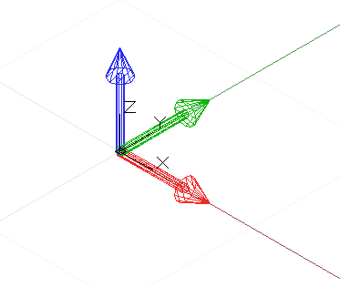
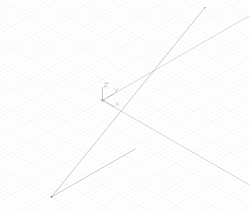

# Primitivas geométricas

Embora o Dynamo seja capaz de criar uma variedade de formas geométricas complexas, as primitivas geométricas simples formam a espinha dorsal de qualquer projeto de cálculo: expressas diretamente na forma final projetada ou usadas como pontos de partida dos quais é gerada uma geometria mais complexa.

Embora não seja estritamente uma geometria, o CoordinateSystem é uma ferramenta importante para construir a geometria. Um objeto CoordinateSystem mantém o controlo das transformações de posição e geométricas, como rotação, cisalhamento e escala.

Criar um CoordinateSystem centralizado em um ponto com x = 0, y = 0, z = 0, sem rotações, escala ou transformações de cisalhamento, requer simplesmente a chamada do construtor Identity:



```js
// create a CoordinateSystem at x = 0, y = 0, z = 0,
// no rotations, scaling, or sheering transformations

cs = CoordinateSystem.Identity();
```

Os CoordinateSystems com transformações geométricas estão fora do escopo deste capítulo, embora outro construtor permita criar um sistema de coordenadas em um ponto específico, *CoordinateSystem.ByOriginVectors*:


```js
// create a CoordinateSystem at a specific location,
// no rotations, scaling, or sheering transformations
x_pos = 3.6;
y_pos = 9.4;
z_pos = 13.0;

origin = Point.ByCoordinates(x_pos, y_pos, z_pos);
identity = CoordinateSystem.Identity();

cs = CoordinateSystem.ByOriginVectors(origin,
    identity.XAxis, identity.YAxis, identity.ZAxis);
```

A primitiva geométrica mais simples é um Ponto, representando uma localização de dimensão zero no espaço tridimensional. Como mencionado anteriormente, há diversas formas de criar um ponto em um determinado sistema de coordenadas: *Point.ByCoordinates* cria um ponto com as coordenadas x, y e x especificadas; *Point.ByCartesianCoordinates* cria um ponto com as coordenadas x, y e x especificadas em um sistema de coordenadas específico; *Point.ByCylindricalCoordinates* cria um ponto sobre um cilindro com o raio, o ângulo de rotação e a altura; e *Point.BySphericalCoordinates* cria um ponto sobre uma esfera com o raio e dois ângulos de rotação.

Este exemplo mostra pontos criados em vários sistemas de coordenadas:


```js
// create a point with x, y, and z coordinates
x_pos = 1;
y_pos = 2;
z_pos = 3;

pCoord = Point.ByCoordinates(x_pos, y_pos, z_pos);

// create a point in a specific coordinate system
cs = CoordinateSystem.Identity();
pCoordSystem = Point.ByCartesianCoordinates(cs, x_pos,
    y_pos, z_pos);

// create a point on a cylinder with the following
// radius and height
radius = 5;
height = 15;
theta = 75.5;

pCyl = Point.ByCylindricalCoordinates(cs, radius, theta,
    height);

// create a point on a sphere with radius and two angles

phi = 120.3;

pSphere = Point.BySphericalCoordinates(cs, radius, 
    theta, phi);
```

A próxima primitiva dimensional superior do Dynamo é um segmento de linha, representando um número infinito de pontos entre dois pontos finais. É possível criar as linhas explicitamente especificando os dois pontos de limite com o construtor *Line.ByStartPointEndPoint* ou especificando um ponto inicial, uma direção e um comprimento nessa direção, *Line.ByStartPointDirectionLength*.



```js
p1 = Point.ByCoordinates(-2, -5, -10);
p2 = Point.ByCoordinates(6, 8, 10);

// a line segment between two points
l2pts = Line.ByStartPointEndPoint(p1, p2); 

// a line segment at p1 in direction 1, 1, 1 with 
// length 10
lDir = Line.ByStartPointDirectionLength(p1,
    Vector.ByCoordinates(1, 1, 1), 10);
```

O Dynamo tem objetos que representam os tipos mais básicos de primitivas geométricas em três dimensões: cubóides, criados com *Cuboid.ByLength*; cones, criados com *Cone.ByPointsRadius* e *Cone.ByPointsRadii*; cilindros, criados com *Cylinder.ByRadiusHeight*; e esferas, criadas com *Sphere.ByCenterPointRadius*.


```js
// create a cuboid with specified lengths
cs = CoordinateSystem.Identity();

cub = Cuboid.ByLengths(cs, 5, 15, 2);

// create several cones
p1 = Point.ByCoordinates(0, 0, 10);
p2 = Point.ByCoordinates(0, 0, 20);
p3 = Point.ByCoordinates(0, 0, 30);

cone1 = Cone.ByPointsRadii(p1, p2, 10, 6);
cone2 = Cone.ByPointsRadii(p2, p3, 6, 0);

// make a cylinder
cylCS = cs.Translate(10, 0, 0);

cyl = Cylinder.ByRadiusHeight(cylCS, 3, 10);

// make a sphere
centerP = Point.ByCoordinates(-10, -10, 0);

sph = Sphere.ByCenterPointRadius(centerP, 5);
```

