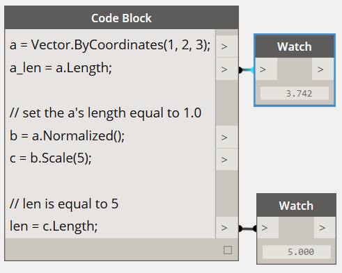

# Matemática de vetores

Os objetos em projetos de cálculo raramente são criados explicitamente em sua posição e forma finais e são, na maioria das vezes, convertidos, rotacionados e posicionados de outra forma, com base na geometria existente. A matemática de vetores serve como um tipo de andaime geométrico para dar direção e orientação à geometria, bem como para conceituar movimentos através do espaço 3D sem representação visual.

Em seu nível mais básico, um vetor representa uma posição no espaço 3D e, muitas vezes, é considerado como o ponto final de uma seta da posição (0, 0, 0) para essa posição. É possível criar os vetores com o construtor *ByCoordinates*, usando as posições x, y e z do objeto Vector recém-criado. Observe que os objetos Vector não são objetos geométricos e não aparecem na janela do Dynamo. No entanto, as informações sobre um vetor recém-criado ou modificado podem ser impressas na janela do console:


```js
// construct a Vector object
v = Vector.ByCoordinates(1, 2, 3);

s = v.X + " " + v.Y + " " + v.Z;
```

Um conjunto de operações matemáticas é definido em objetos Vector, permitindo adicionar, subtrair, multiplicar e mover objetos no espaço 3D, como você moveria os números reais no espaço 1D em uma linha de número.

A adição de vetores é definida como a soma dos componentes de dois vetores e poderá ser considerada como o vetor resultante se as duas setas de vetor do componente forem inseridas “ponta a ponta”. A adição de vetores é realizada com o método *Add* e é representada pelo diagrama à esquerda.


```js
a = Vector.ByCoordinates(5, 5, 0);
b = Vector.ByCoordinates(4, 1, 0);

// c has value x = 9, y = 6, z = 0
c = a.Add(b);
```

De forma similar, dois objetos Vector podem ser subtraídos um do outro com o método *Subtract*. A subtração de vetores pode ser considerada como a direção do primeiro vetor para o segundo vetor.


```js
a = Vector.ByCoordinates(5, 5, 0);
b = Vector.ByCoordinates(4, 1, 0);

// c has value x = 1, y = 4, z = 0
c = a.Subtract(b);
```

A multiplicação de vetores pode ser considerada como mover a extremidade de um vetor em sua própria direção por um determinado fator de escala.


```js
a = Vector.ByCoordinates(4, 4, 0);

// c has value x = 20, y = 20, z = 0
c = a.Scale(5);
```

Muitas vezes, ao dimensionar um vetor, é desejável que o comprimento resultante seja exatamente igual à quantidade dimensionada. Isso é facilmente conseguido pela normalização de um vetor, ou seja, definindo o comprimento do vetor exatamente igual a um.



```js
a = Vector.ByCoordinates(1, 2, 3);
a_len = a.Length;

// set the a's length equal to 1.0
b = a.Normalized();
c = b.Scale(5);

// len is equal to 5
len = c.Length;
```

c ainda aponta na mesma direção que a (1, 2, 3), embora agora apresente comprimento exatamente igual a 5.

Existem dois métodos adicionais na matemática de vetores que não têm paralelos claros com a matemática 1D, o produto vetorial e o produto escalar. O produto vetorial é um meio de gerar um vetor ortogonal (a 90 graus) a dois vetores existentes. Por exemplo, o produto vetorial dos eixos x e y é o eixo z, embora os dois vetores de entrada não precisem ser ortogonais entre si. Um vetor de produto vetorial é calculado com o método *Cross*.


```js
a = Vector.ByCoordinates(1, 0, 1);
b = Vector.ByCoordinates(0, 1, 1);

// c has value x = -1, y = -1, z = 1
c = a.Cross(b);
```

Uma função adicional, embora um pouco mais avançada da matemática vetorial, é o produto escalar. O produto escalar entre dois vetores é um número real (não um objeto Vector) que se relaciona, mas não é exatamente, o ângulo entre dois vetores. Uma propriedade útil do produto escalar é que o produto escalar entre dois vetores será 0 somente se for perpendicular. O produto escalar é calculado com o método *Dot*.


```js
a = Vector.ByCoordinates(1, 2, 1);
b = Vector.ByCoordinates(5, -8, 4);

// d has value -7
d = a.Dot(b);
```

