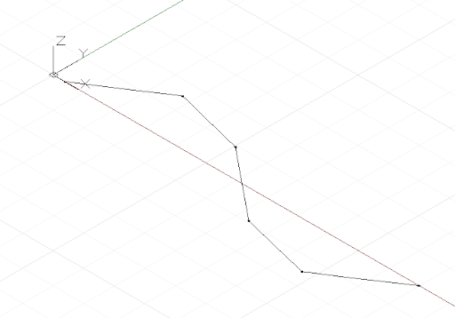

# Curvas: interpoladas e pontos de controle

Há duas maneiras fundamentais para criar curvas de forma livre no Dynamo: especificar uma coleção de pontos e fazer com que o Dynamo interpole uma curva suave entre eles ou um método de menor nível ao especificar os pontos de controle subjacentes de uma curva de determinado grau. As curvas interpoladas serão úteis quando um designer sabe exatamente a forma que uma linha deve ter ou se o projeto tiver restrições específicas por onde a curva pode e não pode passar. As curvas especificadas por meio de pontos de controle são, em essência, uma série de segmentos de linha reta que um algoritmo suaviza em uma forma de curva final. A especificação de uma curva por meio de pontos de controle pode ser útil para navegações de formas de curva com graus variados de suavização ou quando uma continuidade suave entre segmentos de curva é necessária.

Para criar uma curva interpolada, basta passar uma coleção de pontos para o método *NurbsCurve.ByPoints*.


```js
num_pts = 6;

s = Math.Sin(0..360..#num_pts) * 4;

pts = Point.ByCoordinates(1..30..#num_pts, s, 0);

int_curve = NurbsCurve.ByPoints(pts);
```

A curva gerada faz interseção com cada um dos pontos de entrada, começando e terminando no primeiro e último ponto da coleção, respectivamente. É possível usar um parâmetro periódico opcional para criar uma curva periódica que está fechada. O Dynamo automaticamente preencherá o segmento ausente, portanto, um ponto final duplicado (idêntico ao ponto inicial) não é necessário.


```js
pts = Point.ByCoordinates(Math.Cos(0..350..#10),
    Math.Sin(0..350..#10), 0);

// create an closed curve
crv = NurbsCurve.ByPoints(pts, true);

// the same curve, if left open:
crv2 = NurbsCurve.ByPoints(pts.Translate(5, 0, 0),
    false);
```

As NurbsCurves são geradas da mesma forma, com os pontos de entrada que representam os pontos finais de um segmento de linha reta e um segundo parâmetro que especifica a quantidade e o tipo de suavização que a curva sofre, denominado grau.* Uma curva com grau 1 não tem suavização; ela é uma polilinha.



```js
num_pts = 6;

pts = Point.ByCoordinates(1..30..#num_pts,
    Math.Sin(0..360..#num_pts) * 4, 0);

// a B-Spline curve with degree 1 is a polyline
ctrl_curve = NurbsCurve.ByControlPoints(pts, 1);
```

Uma curva com grau 2 é suavizada de forma que a curva faça interseção e seja tangente ao ponto central dos segmentos de polilinha:


```js
num_pts = 6;

pts = Point.ByCoordinates(1..30..#num_pts,
    Math.Sin(0..360..#num_pts) * 4, 0);

// a B-Spline curve with degree 2 is smooth
ctrl_curve = NurbsCurve.ByControlPoints(pts, 2);
```

O Dynamo suporta curvas NURBS (B-spline racional não uniforme) até o grau 20, e o seguinte script ilustra o efeito o aumento dos níveis de suavização tem na forma de uma curva:


```js
num_pts = 6;

pts = Point.ByCoordinates(1..30..#num_pts,
    Math.Sin(0..360..#num_pts) * 4, 0);

def create_curve(pts : Point[], degree : int) 
{
	return = NurbsCurve.ByControlPoints(pts,
        degree);
}

ctrl_crvs = create_curve(pts, 1..11);
```

Observe que você deve ter pelo menos mais um ponto de controle que o grau da curva.

Outro benefício de construir curvas por vértices de controle é a capacidade de manter a tangência entre segmentos de curva individuais. Isso é feito extraindo a direção entre os últimos dois pontos de controle e continuando esta direção com os dois primeiros pontos de controle da curva a seguir. O exemplo a seguir cria duas curvas NURBS separadas que, mesmo assim, são tão suaves como uma curva:


```js
pts_1 = {};

pts_1[0] = Point.ByCoordinates(0, 0, 0);
pts_1[1] = Point.ByCoordinates(1, 1, 0);
pts_1[2] = Point.ByCoordinates(5, 0.2, 0);
pts_1[3] = Point.ByCoordinates(9, -3, 0);
pts_1[4] = Point.ByCoordinates(11, 2, 0);

crv_1 = NurbsCurve.ByControlPoints(pts_1, 3);

pts_2 = {};

pts_2[0] = pts_1[4];
end_dir = pts_1[4].Subtract(pts_1[3].AsVector());

pts_2[1] = Point.ByCoordinates(pts_2[0].X + end_dir.X,
    pts_2[0].Y + end_dir.Y, pts_2[0].Z + end_dir.Z);

pts_2[2] = Point.ByCoordinates(15, 1, 0);
pts_2[3] = Point.ByCoordinates(18, -2, 0);
pts_2[4] = Point.ByCoordinates(21, 0.5, 0);

crv_2 = NurbsCurve.ByControlPoints(pts_2, 3);
```

* Essa é uma descrição muito simplificada da geometria da curva NURBS, para uma discussão mais precisa e detalhada, consulte Pottmann, et al, 2007, nas referências.

