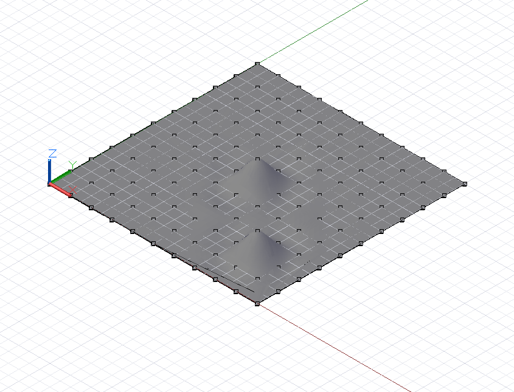
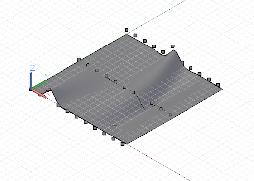
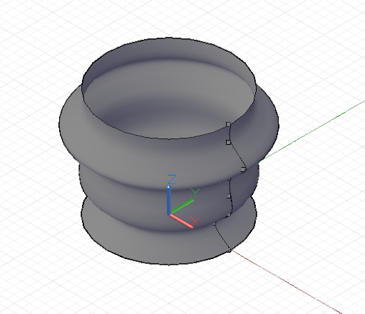

# Superfícies: interpoladas, pontos de controle, elevação, revolução

O análogo bidimensional de uma NurbsCurve é a NurbsSurface e, tal como a NurbsCurve de forma livre, as NurbsSurfaces podem ser construídas com dois métodos básicos: inserir um conjunto de pontos base e fazer interpolar o Dynamo entre eles e especificar explicitamente os pontos de controle da superfície. Também como as curvas de forma livre, as superfícies interpoladas são úteis quando um designer sabe com precisão a forma que uma superfície precisa ter ou se um projeto requer que a superfície passe pelos pontos de restrição. Por outro lado, as superfícies criadas por pontos de controle podem ser mais úteis para projetos exploratórios em vários níveis de suavização.

Para criar uma superfície interpolada, basta gerar uma coleção bidimensional de pontos aproximando a forma de uma superfície. A coleção deve ser retangular, isto é, não irregular. O método *NurbsSurface.ByPoints* constrói uma superfície com base nesses pontos.



```js
// python_points_1 is a set of Points generated with
// a Python script found in Chapter 12, Section 10

surf = NurbsSurface.ByPoints(python_points_1);
```

Também é possível criar as NurbsSurfaces de forma livre ao especificar os pontos de controle subjacentes de uma superfície. Tal como as NurbsCurves, os pontos de controle podem ser considerados como representando uma malha quadrilateral com segmentos retos que, dependendo do grau da superfície, é suavizada na forma da superfície final. Para criar uma NurbsSurface por pontos de controle, inclua dois parâmetros adicionais para *NurbsSurface.ByPoints*, indicando os graus das curvas subjacentes em ambas as direções da superfície.


```js
// python_points_1 is a set of Points generated with
// a Python script found in Chapter 12, Section 10

// create a surface of degree 2 with smooth segments
surf = NurbsSurface.ByPoints(python_points_1, 2, 2);
```

É possível aumentar o grau da NurbsSurface para alterar a geometria da superfície resultante:


```js
// python_points_1 is a set of Points generated with
// a Python script found in Chapter 12, Section 10

// create a surface of degree 6
surf = NurbsSurface.ByPoints(python_points_1, 6, 6);
```

Assim como as superfícies podem ser criadas por interpolação entre um conjunto de pontos de entrada, elas também podem ser criadas por interpolação entre um conjunto de curvas base. Isso é conhecido como elevação. Uma curva elevada é criada usando o construtor *Surface.ByLoft*, com um conjunto de curvas de entrada como o único parâmetro.



```js
// python_points_2, 3, and 4 are generated with
// Python scripts found in Chapter 12, Section 10

c1 = NurbsCurve.ByPoints(python_points_2);
c2 = NurbsCurve.ByPoints(python_points_3);
c3 = NurbsCurve.ByPoints(python_points_4);

loft = Surface.ByLoft([c1, c2, c3]);
```

As superfícies de revolução são um tipo adicional de superfície criada arrastando uma curva base em torno de um eixo central. Se as superfícies interpoladas são o análogo bidimensional das curvas interpoladas, as superfícies de revolução são o análogo bidimensional dos círculos e arcos.

As superfícies de revolução são especificadas por uma curva base, representando a “aresta” da superfície; uma origem de eixo, o ponto base da superfície; uma direção de eixo, a direção “principal” central; um ângulo inicial de varredura; e um ângulo final de varredura. São usadas como a entrada para o construtor *Surface.Revolve*.



```js
pts = {};
pts[0] = Point.ByCoordinates(4, 0, 0);
pts[1] = Point.ByCoordinates(3, 0, 1);
pts[2] = Point.ByCoordinates(4, 0, 2);
pts[3] = Point.ByCoordinates(4, 0, 3);
pts[4] = Point.ByCoordinates(4, 0, 4);
pts[5] = Point.ByCoordinates(5, 0, 5);
pts[6] = Point.ByCoordinates(4, 0, 6);
pts[7] = Point.ByCoordinates(4, 0, 7);

crv = NurbsCurve.ByPoints(pts);

axis_origin = Point.ByCoordinates(0, 0, 0);
axis = Vector.ByCoordinates(0, 0, 1);

surf = Surface.ByRevolve(crv, axis_origin, axis, 0,
    360);
```

