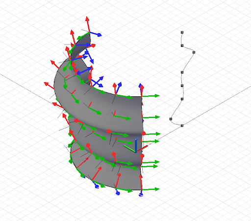

# Parametrização geométrica

Em projetos de cálculo, as curvas e as superfícies são usadas com frequência como o esboço subjacente para construir a geometria subsequente. Para que esta geometria inicial seja usada como uma fundação para a geometria posterior, o script deve ser capaz de extrair qualidades como a posição e a orientação através de toda a área do objeto. As curvas e as superfícies suportam essa extração, que é chamada de parametrização.

Todos os pontos em uma curva podem ser considerados como tendo um parâmetro único variando de 0 a 1. Se fôssemos criar uma NurbsCurve com base em diversos pontos de controle ou interpolados, o primeiro ponto teria o parâmetro 0 e o último ponto teria o parâmetro 1. É impossível saber antecipadamente qual é o parâmetro exato que qualquer ponto intermediário representa, o que pode parecer uma limitação severa, embora seja atenuada por uma série de funções de utilitários. As superfícies apresentam uma parametrização semelhante às curvas, porém com dois parâmetros em vez de um, chamados u e v. Se quiséssemos criar uma superfície com os seguintes pontos:

```js
pts = [ [p1, p2, p3],
        [p4, p5, p6],
        [p7, p8, p9] ];
```

p1 teria o parâmetro u = 0 v = 0, enquanto p9 teria os parâmetros u = 1 v = 1.

A parametrização não é particularmente útil ao determinar os pontos usados para gerar curvas, seu principal uso será determinar as localizações se os pontos intermediários forem gerados pelos construtores NurbsCurve e NurbsSurface.

As curvas têm um método *PointAtParameter*, que assume um único argumento duplo entre 0 e 1, e retorna o objeto de ponto naquele parâmetro. Por exemplo, este script localiza os pontos nos parâmetros 0, .1, .2, .3, .4, .5, .6, .7, .8, .9 e 1:


```js
pts = {};
pts[0] = Point.ByCoordinates(4, 0, 0);
pts[1] = Point.ByCoordinates(6, 0, 1);
pts[2] = Point.ByCoordinates(4, 0, 2);
pts[3] = Point.ByCoordinates(4, 0, 3);
pts[4] = Point.ByCoordinates(4, 0, 4);
pts[5] = Point.ByCoordinates(3, 0, 5);
pts[6] = Point.ByCoordinates(4, 0, 6);

crv = NurbsCurve.ByPoints(pts);

pts_at_param = crv.PointAtParameter(0..1..#11);

// draw Lines to help visualize the points
lines = Line.ByStartPointEndPoint(pts_at_param, 
    Point.ByCoordinates(4, 6, 0));
```

De forma similar, as superfícies têm um método *PointAtParameter* que tem dois argumentos, o parâmetro u e v do ponto gerado.

Embora a extração de pontos individuais em uma curva e superfície possa ser útil, os scripts geralmente exigem o conhecimento das características geométricas específicas de um parâmetro, como a direção da curva ou da superfície. O método *CoordinateSystemAtParameter* localiza não somente a posição como também um CoordinateSystem orientado no parâmetro de uma curva ou superfície. Por exemplo, o script a seguir extrai o CoordinateSystems orientado ao longo de uma superfície de revolução e usa a orientação do CoordinateSystems para gerar linhas que se destacam normalmente na superfície:



```js
pts = {};
pts[0] = Point.ByCoordinates(4, 0, 0);
pts[1] = Point.ByCoordinates(3, 0, 1);
pts[2] = Point.ByCoordinates(4, 0, 2);
pts[3] = Point.ByCoordinates(4, 0, 3);
pts[4] = Point.ByCoordinates(4, 0, 4);
pts[5] = Point.ByCoordinates(5, 0, 5);
pts[6] = Point.ByCoordinates(4, 0, 6);
pts[7] = Point.ByCoordinates(4, 0, 7);

crv = NurbsCurve.ByPoints(pts);

axis_origin = Point.ByCoordinates(0, 0, 0);
axis = Vector.ByCoordinates(0, 0, 1);

surf = Surface.ByRevolve(crv, axis_origin, axis, 90,
    140);

cs_array = surf.CoordinateSystemAtParameter(
    (0..1..#7)<1>, (0..1..#7)<2>);

def make_line(cs : CoordinateSystem) { 
	lines_start = cs.Origin;
    lines_end = cs.Origin.Translate(cs.ZAxis, -0.75);
    
    return = Line.ByStartPointEndPoint(lines_start, 
        lines_end);
}

lines = make_line(Flatten(cs_array));
```

Como mencionado anteriormente, a parametrização nem sempre é uniforme ao longo do comprimento de uma curva ou superfície, o que significa que o parâmetro 0,5 nem sempre corresponde ao ponto central, e 0,25 nem sempre corresponde ao ponto um quarto ao longo de uma curva ou superfície. Para contornar essa limitação, as curvas têm um conjunto adicional de comandos de parametrização que permite encontrar um ponto em comprimentos específicos ao longo de uma curva.

