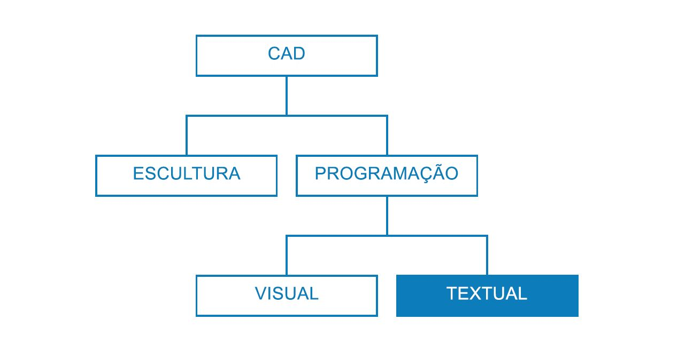
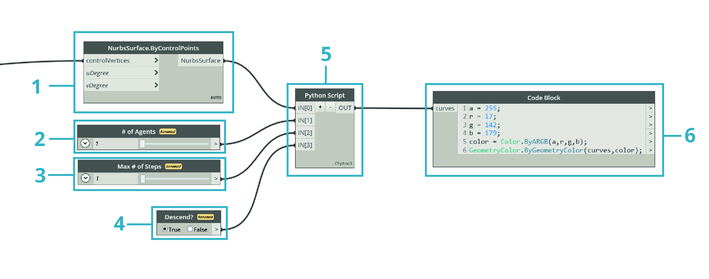

## Estratégias de script

Os scripts baseados em texto no ambiente de scripts visuais permitem relacionamentos visuais avançados usando o DesignScript, o Python e o ZeroTouch (C#). O usuário pode expor elementos como os controles deslizantes de entrada, condensar grandes operações no DesignScript e acessar ferramentas e bibliotecas avançadas por meio do Python ou do C#, tudo isso no mesmo espaço de trabalho. Se gerenciada de forma eficaz, a combinação dessas estratégias pode fornecer uma grande quantidade de personalização, clareza e eficiência a todo o programa. A seguir, há um conjunto de diretrizes para ajudá-lo a ampliar o script visual com script de texto.



### Saber quando criar scripts

Os scripts de texto podem estabelecer relacionamentos de maior complexidade do que a programação visual, mas há uma quantidade significativa de sobreposição de recursos entre ambos. Isso faz sentido porque os nós são essencialmente um código pré-empacotado e é provável que possamos escrever um programa inteiro do Dynamo em DesignScript ou Python. No entanto, usamos scripts visuais porque a interface dos nós e dos fios cria um fluxo intuitivo de informações gráficas. O conhecimento de que os recursos de script de texto vão além do script visual oferece pistas importantes de quando ele deve ser usado sem sacrificar a natureza intuitiva dos nós e dos fios. A seguir estão as diretrizes para quando inserir um script e qual linguagem usar.

**Use os scripts de texto para:**

* Loops

* Recursão

* Acessar bibliotecas externas

**Escolha uma linguagem:**

||Loops|Recursão|Condensar nós|Ext. Bibliotecas|Abreviação|
| -- | -- |
|**DesignScript**|Sim|Sim|Sim|Não|Sim|
|**Python**|Sim|Sim|Parcialmente|Sim|Não|
|**ZeroTouch (C#)**|Não|Não|Não|Sim|Não|

> Consulte [Referência de scripts](http://primer.dynamobim.org/en/12_Best-Practice/12-3_Scripting-Reference.html) para obter uma lista dos itens aos quais cada biblioteca do Dynamo fornece acesso.

### Pensar de forma paramétrica

Ao criar scripts no Dynamo, um ambiente inevitavelmente paramétrico, é aconselhável estruturar o código em relação à estrutura de nós e do fios na qual ele residirá. Considere o nó que contém o script de texto como se fosse qualquer outro nó no programa com algumas entradas específicas, uma função e uma saída esperada. Isso imediatamente fornece ao código no nó um pequeno conjunto de variáveis com o qual é possível trabalhar, a chave para um sistema paramétrico limpo. Aqui estão algumas diretrizes para melhor integração do código em um programa visual.

**Identifique as variáveis externas:**

* Tente determinar os parâmetros fornecidos no problema do projeto para que você possa construir diretamente um modelo com base nesses dados.

* Antes de escrever o código, identifique as variáveis:

  * Um conjunto mínimo de entradas

  * A saída pretendida

  * Constantes



> Diversas variáveis foram estabelecidas antes de escrever o código.

> 1. A superfície na qual simularemos as águas pluviais.
2. O número de gotas de chuva (agentes) que desejamos.
3. A distância que desejamos que as gotas de chuva percorram.
4. Alterne entre descer o caminho mais inclinado e percorrer a superfície.
5. Nó do Python com o respectivo número de entradas.
6. Um bloco de código para tornar azuis as curvas retornadas.

**Projete os relacionamentos internos:**

* O parametricismo permite que determinados parâmetros ou variáveis sejam editados para manipular ou alterar o resultado final de uma equação ou de um sistema.

* Sempre que as entidades do script estão logicamente relacionadas, é preciso defini-las como funções umas das outras. Dessa forma, quando uma é modificada, a outra pode ser atualizada proporcionalmente.

* Minimize o número de entradas expondo somente os parâmetros chave:

  * Se for possível derivar um conjunto de parâmetros de mais parâmetros principais, somente exponha os parâmetros principais como entradas de script. Isso aumenta a usabilidade reduzindo a complexidade da interface do script.


> Os “módulos” do código do exemplo no [Nó do Python](http://primer.dynamobim.org/en/09_Custom-Nodes/9-4_Python.html).

> 1. Entradas.
2. Variáveis internas do script.
3. Um loop que usa essas entradas e variáveis para executar sua função.
> Dica: Dê ao processo a mesma ênfase que dá à solução.

**Não se repita (o princípio DRY):**

* Quando você tem várias maneiras de expressar o mesmo em seu script, em algum momento as representações duplicadas não estarão sincronizadas, o que pode levar a grande dificuldade de manutenção, má fatoração e contradições internas.

* O princípio DRY é declarado como “Cada conhecimento deve ter uma representação única, inequívoca e confiável dentro de um sistema”:

  * Quando esse princípio é aplicado com êxito, todos os elementos relacionados ao script mudam de forma previsível e uniforme, e todos os elementos não relacionados não têm consequências lógicas entre si.

```
### BAD
for i in range(4):
for j in range(4):
point = Point.ByCoordinates(3*i, 3*j, 0)
points.append(point)
```

```
### GOOD
count = IN[0]
pDist = IN[1]

for i in range(count):
for j in range(count):
point = Point.ByCoordinates(pDist*i, pDist*j, 0)
points.append(point)
```

> Dica: Antes de duplicar entidades no script (como constante no exemplo acima), considere se é possível, em vez disso, vincular à origem.

### Estruturar de forma modular

Conforme seu código fica cada vez mais complexo, a “ideia geral”, ou o algoritmo abrangente, se torna cada vez mais ilegível. Também é mais difícil controlar o que (e onde) coisas específicas acontecem, encontrar falhas quando as coisas dão errado, integrar outro código e atribuir tarefas de desenvolvimento. Para evitar essas dores de cabeça, é preciso escrever código em módulos, uma estratégia organizacional que divide o código com base na tarefa que ele executa. Aqui estão algumas dicas para tornar seus scripts mais gerenciáveis por meio da modularização.

**Escreva código em módulos:**

* Um “módulo” é um grupo de códigos que executa uma tarefa específica, similar a um nó do Dynamo no espaço de trabalho.

* Isso pode ser qualquer item que deva ser visualmente separada do código adjacente (uma função, uma classe, um grupo de entradas ou as bibliotecas que você esteja importando).

* O desenvolvimento de código em módulos aproveita a característica visual e intuitiva dos nós, bem como as relações complexas que somente os scripts de texto podem obter.


> Esses loops chamam uma classe nomeada “agente” que desenvolveremos no exercício.

> 1. Um módulo de código que define o ponto inicial de cada agente.
2. Um módulo de código que atualiza o agente.
3. Um módulo de código que desenha um rastro para o caminho do agente.

**Identificação da reutilização de código:**

* Se você achar que seu código faz a mesma coisa (ou algo muito similar) em mais de um lugar, encontre maneiras de agrupá-lo em uma função que possa ser chamada.

* As funções de “gerenciador” controlam o fluxo do programa e contêm principalmente chamadas para funções de “trabalho” que lidam com detalhes de baixo nível, como mover dados entre estruturas.


> Este exemplo cria esferas com raios e cores com base no valor Z dos pontos centrais.

> 1. Duas funções principais de “trabalho”: uma que cria esferas com raios e exibe cores com base no valor Z do ponto central.
2. Uma função principal de “gerenciador” que combina as duas funções de trabalho. Chamar essa função chamará as duas funções no interior dela.

**Mostre somente o que precisa ser visto:**

* Uma interface de módulo expressa os elementos que são fornecidos e requeridos pelo módulo.

* Quando as interfaces entre as unidades tiverem sido definidas, o projeto detalhado de cada unidade poderá prosseguir separadamente.

**Capacidade de separação/substituição:**

* Os módulos não sabem ou são indiferentes quanto à existência uns dos outros.

**Formas gerais de modularização:**

* Agrupamento de código:

```
# IMPORT LIBRARIES
import random
import math
import clr
clr.AddReference('ProtoGeometry')
from Autodesk.DesignScript.Geometry import *

# DEFINE PARAMETER INPUTS
surfIn = IN[0]
maxSteps = IN[1]
```

* Funções:

```
def get_step_size():
area = surfIn.Area
stepSize = math.sqrt(area)/100
return stepSize

stepSize = get_step_size()
```

* Classes:

```
class MyClass:
i = 12345

def f(self):
return 'hello world'

numbers = MyClass.i
greeting = MyClass.f
```

### Flexionar de forma contínua

Ao desenvolver scripts de texto no Dynamo, é recomendável garantir constantemente que o que está sendo realmente criado está de acordo com o que você está esperando. Isso garantirá que eventos imprevistos (erros de sintaxe, discrepâncias lógicas, imprecisões de valor, saídas anômalas etc.) sejam rapidamente detectados e tratados à medida que surgem em vez de todos de uma vez ao final. Como os scripts de texto residem nos nós internos da tela, eles já estão integrados no fluxo de dados do programa visual. Isso torna o monitoramento sucessivo do script tão simples quanto a atribuição dos dados a serem gerados, a execução do programa e a avaliação do que flui do script usando um nó de inspeção. Aqui estão algumas dicas para inspecionar continuamente os scripts ao construí-los.

**Teste conforme o uso:**

* Sempre que você concluir um conjunto de funcionalidades:

  * Volte e inspecione o código.

  * Seja crítico. Um colaborador conseguiria entender o que ele está produzindo? Preciso fazer isso? Essa função pode ser feita de forma mais eficiente? Estou criando dependências ou duplicatas desnecessárias?

  * Teste rapidamente para garantir que ele esteja retornando dados que “façam sentido”.

* Atribua os dados mais recentes com os quais você está trabalhando em seu script como a saída de forma que o nó sempre produza dados relevantes quando o script for atualizado:


> Flexibilize o código de exemplo do [Nó do Python](http://primer.dynamobim.org/en/09_Custom-Nodes/9-4_Python.html).

> 1. Verifique se todas as arestas do sólido estão sendo retornadas como curvas para criar uma caixa delimitadora em torno dele.
2. Verifique se nossas entradas de contagem estão sendo convertidas com êxito em intervalos.
3. Verifique se os sistemas de coordenadas foram corretamente convertidos e rotacionados neste loop.

**Antecipe “casos de aresta”:**

* Durante a criação dos scripts, coloque os parâmetros de entrada nos valores mínimo e máximo de seu domínio alocado para verificar se o programa ainda funciona em condições extremas.

* Mesmo que o programa funcione em seus extremos, verifique se ele está retornando valores nulos/vazios/zero não pretendidos.

* Às vezes, as falhas e os erros que revelam um problema subjacente com seu script só surgirão durante esses casos de aresta.

  * Compreenda o que está causando o erro e, em seguida, decida se ele precisa ser corrigido internamente ou se um domínio de parâmetro precisa ser redefinido para evitar o problema.

> Dica: Sempre presuma que o usuário usará cada combinação de cada valor de entrada que foi exposto a ele. Isso ajudará a eliminar surpresas indesejadas.

### Depurar de forma eficiente

A depuração é o processo de eliminação de falhas do script. As falhas podem ser erros, ineficiências, imprecisões ou qualquer resultado não pretendido. A solução de uma falha pode ser tão simples quanto corrigir um nome de variável com erros de grafia ou problemas estruturais mais abrangentes no script. Idealmente, a flexibilização do script à medida que você o cria ajudará a detectar esses possíveis problemas no início, embora isso não seja uma garantia de que ele estará livre de falhas. A seguir, apresentamos uma revisão das várias práticas recomendadas acima para ajudar você a solucionar falhas de forma sistemática.

**Use a bolha de inspeção:**

* Verifique os dados retornados em diferentes locais no código ao atribuí-los à variável OUT, de forma semelhante ao conceito de flexibilização do programa.

**Insira comentários significativos:**

* Será muito mais fácil depurar um módulo de código se seu resultado pretendido for claramente descrito.

```
# Loop through X and Y
for i in range(xCount):
for j in range(yCount):

# Rotate and translate the coordinate system
toCoord = fromCoord.Rotate(solid.ContextCoordinateSystem.Origin,Vector.ByCoordinates(0,0,1),(90*(i+j%seed)))
vec = Vector.ByCoordinates((xDist*i),(yDist*j),0)
toCoord = toCoord.Translate(vec)

# Transform the solid from the source coord system to the target coord system and append to the list
solids.append(solid.Transform(fromCoord,toCoord))
```

> Normalmente, isso seria uma quantidade excessiva de linhas de comentário e em branco, mas ao depurar, pode ser útil dividir os itens em partes gerenciáveis.

**Aproveite a modularidade do código:**

* É possível isolar a origem de um problema a determinados módulos.

* Quando o módulo com falha for identificado, a correção do problema será consideravelmente mais simples.

* Quando um programa precisa ser modificado, é muito mais fácil alterar o código que foi desenvolvido nos módulos:

  * É possível inserir módulos novos ou depurados em um programa existente com a segurança de que o restante do programa não será alterado.


> Depurar o arquivo de exemplo do [Nó do Python](http://primer.dynamobim.org/en/09_Custom-Nodes/9-4_Python.html).

> 1. A geometria de entrada está retornando uma caixa delimitadora maior que ela mesma, como podemos ver ao atribuir xDist e yDist a OUT.
2. As curvas de aresta da geometria de entrada retornam uma caixa delimitadora apropriada com as distâncias corretas para xDist e yDist.
3. O “módulo” do código que inserimos para resolver o problema dos valores xDist e yDist.

### Exercício – Caminho mais inclinado

> Faça o download do arquivo de exemplo que acompanha este exercício (clique com o botão direito do mouse e selecione “Salvar link como...”). É possível encontrar uma lista completa de arquivos de exemplo no Apêndice. [SteepestPath.dyn](datasets/13-1/SteepestPath.dyn)

Considerando as nossas melhores práticas para os scripts de texto, vamos escrever um script de simulação de chuva. Embora seja possível aplicar as práticas recomendadas a um programa visual desorganizado em Estratégias de gráfico, é muito mais difícil fazer isso com scripts de texto. As relações lógicas estabelecidas no script de texto são menos visíveis e pode ser quase impossível decifrá-las em um código confuso. O poder dos scripts de texto é acompanhado por uma responsabilidade maior na organização. Vamos detalhar cada etapa e aplicar as práticas recomendadas durante o percurso.


> Nosso script aplicado a uma superfície deformada por atrativos.

A primeira coisa que precisamos fazer é importar as bibliotecas do Dynamo necessárias. Fazer isso fornecerá acesso global à funcionalidade do Dynamo no Python.


> Todas as bibliotecas que pretendemos usar precisam ser importadas aqui.

Em seguida, precisamos definir as entradas e saídas do script, que serão exibidas como portas de entrada no nó. Essas entradas externas são a base do nosso script e a chave para estabelecer um ambiente paramétrico.


> Precisamos definir entradas que correspondam a variáveis no script do Python e determinar a saída desejada:

> 1. A superfície que queremos percorrer.
2. O número de agentes pelos quais queremos percorrer.
3. O número máximo de etapas que os agentes podem assumir.
4. Uma opção para obter o caminho mais curto pela superfície ou para percorrê-la.
5. O nó do Python com identificadores de entrada que correspondem às entradas no script (IN[0], IN[1]).
6. As curvas de saída que podem ser exibidas com uma cor diferente.

Agora, vamos empregar a prática da modularidade e criar o corpo do nosso script. A simulação do caminho mais curto por uma superfície de vários pontos iniciais é uma tarefa significativa que exigirá diversas funções. Em vez de chamar as diferentes funções por todo o script, podemos modularizar nosso código coletando-as em uma única classe, nosso agente. As diferentes funções dessa classe ou “módulo” podem ser chamadas com diferentes variáveis ou até mesmo reutilizadas em outro script.


> Precisaremos definir uma classe ou blueprint, para um agente com a intenção de navegar por uma superfície escolhendo viajar na direção mais inclinada possível sempre que ele assume uma etapa:

> 1. Nome.
2. Atributos globais compartilhados por todos os agentes.
3. Atributos de instância exclusivos para cada agente.
4. Uma função para realizar uma etapa.
5. Uma função para catalogar a posição de cada etapa em uma lista de rastros.

Vamos inicializar os agentes definindo sua localização inicial. Esta é uma boa oportunidade para flexibilizar nosso script e garantir que a classe de agente esteja funcionando.


> Precisaremos instanciar todos os agentes que desejamos observar para navegar pela superfície e definir seus atributos iniciais:

> 1. Uma nova lista de rastros vazia.
2. Onde eles iniciarão sua jornada na superfície.
3. Atribuímos a lista de agentes como saída para verificar o que o script está retornando aqui. O número correto de agentes está sendo retornado, mas precisamos flexionar o script novamente mais tarde para verificar a geometria que ele retorna.

Atualize cada agente em cada etapa.


> Em seguida, precisaremos inserir um ciclo aninhado onde, para cada agente e para cada etapa, atualizamos e registramos sua posição na lista de rastros. Em cada etapa, também garantiremos que o agente não tenha alcançado um ponto na superfície em que ele não possa avançar mais uma etapa, o que lhe permitirá descer. Se essa condição for atendida, encerraremos o percurso do agente.

Agora que nossos agentes foram totalmente atualizados, vamos retornar a geometria que os representa.


> Depois que todos os agentes tiverem atingido seu limite de descida ou o número máximo de etapas, criaremos uma PolyCurve pelos pontos da lista de rastros e geraremos os rastros da PolyCurve.

Nosso script para encontrar os caminhos mais inclinados.


> 1. Uma predefinição que simula as águas pluviais na superfície subjacente.
2. Em vez de encontrar o caminho mais inclinado, é possível alternar os agentes para percorrer a superfície subjacente.


> O script de texto completo em Python.

