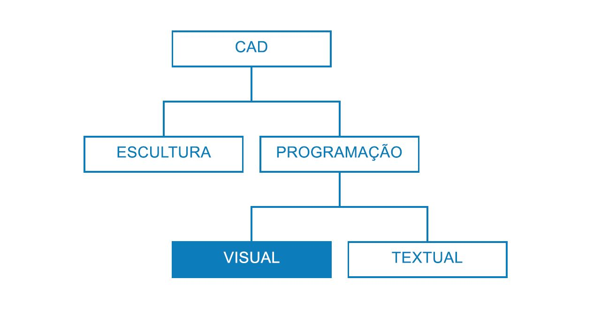
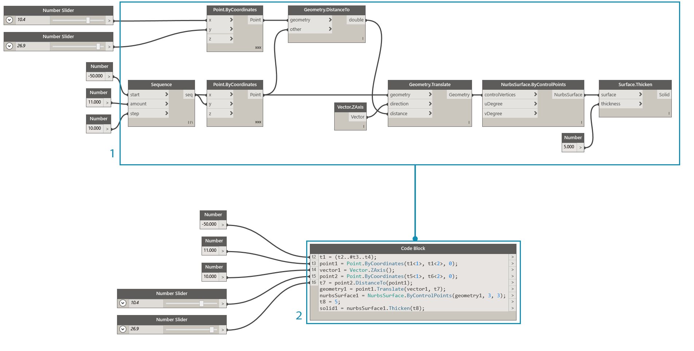
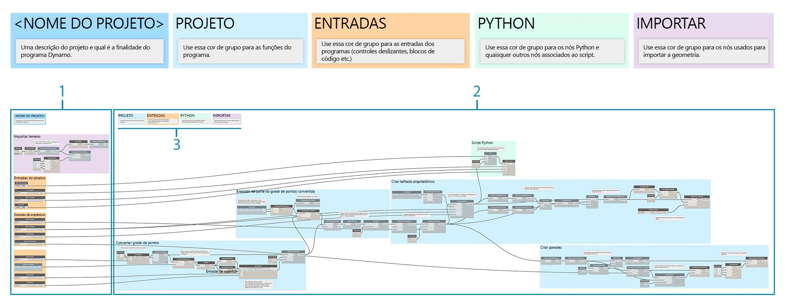
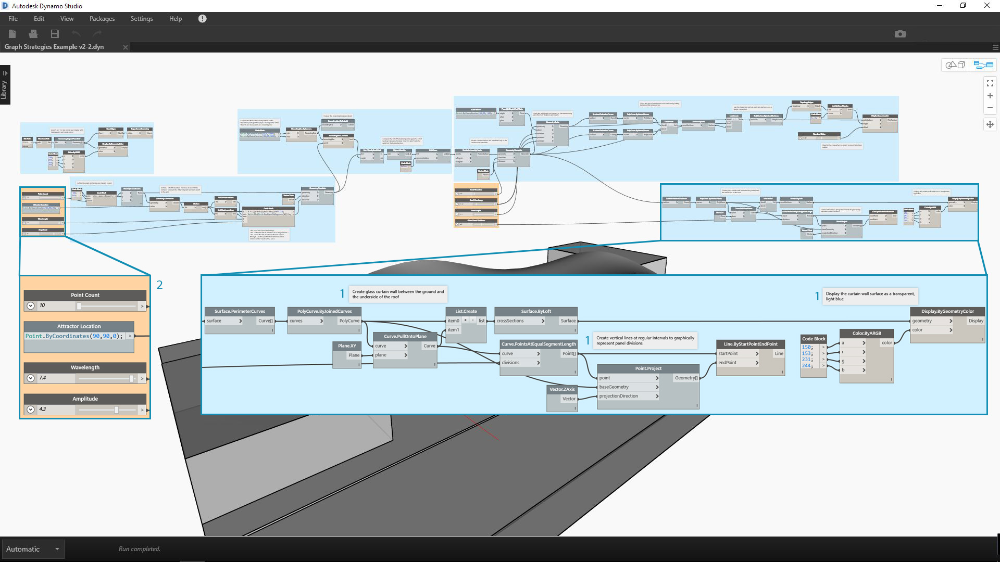
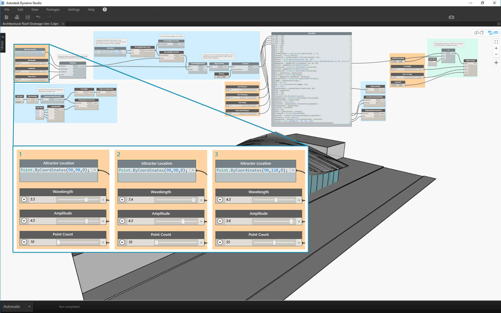

## Estratégias de gráfico

Antes deste capítulo, a introdução abordou como implementar os recursos avançados de scripts visuais do Dynamo. Uma boa compreensão desses recursos é uma base sólida e a primeiro etapa para criação de programas visuais robustos. Quando usamos nossos programas visuais no campo, os compartilhamos com colegas, solucionamos erros ou testamos limites adicionais com os quais você precisa lidar. Se outra pessoa usar seu programa no futuro ou se você estiver esperando abri-lo daqui a seis meses, ele precisará ter uma clareza gráfica e lógica imediata. O Dynamo tem muitas ferramentas para gerenciar a complexidade do programa, e este capítulo fornecerá diretrizes sobre quando usá-las.

### Reduzir a complexidade

À medida que você desenvolve o gráfico do Dynamo e testa ideias, ele pode aumentar rapidamente em tamanho e complexidade. Embora seja importante criar um programa funcional, é igualmente importante simplificar isso ao máximo. Assim, além de o gráfico ser executado de forma mais rápida e previsível, você e outros usuários compreenderão a lógica posteriormente. A seguir, estão diversas formas que ajudarão a esclarecer a lógica do gráfico.

#### Modularizar com grupos

* Os grupos permitem **criar peças funcionalmente distintas** enquanto você cria um programa
* Os grupos permitem **mover grandes partes do programa** enquanto a modularidade e o alinhamento são mantidos
* É possível alterar a **cor do grupo para diferenciar** o que os grupos estão fazendo (entradas versus funções)
* É possível usar grupos para iniciar a **organização do gráfico para simplificar a criação do nó personalizado**

> As cores deste programa identificam o propósito de cada grupo. Essa estratégia pode ser usada para criar hierarquia em qualquer norma gráfica ou modelo que você desenvolver.

> 1. Grupo de funções (azul)
2. Grupo de entradas (laranja)
3. Grupo de scripts (verde)
> Para saber como usar Grupos, consulte [Como gerenciar o programa](http://primer.dynamobim.org/en/03_Anatomy-of-a-Dynamo-Definition/3-4_best_practices.html).

#### Desenvolver com eficiência usando blocos de código

* Às vezes, é possível usar um bloco de código para **digitar um método de número ou nó mais rápido do que pesquisar** (Point.ByCoordinates, Number, String, Formula)

* Os blocos de código são úteis **quando você deseja definir funções personalizadas no DesignScript para reduzir o número de nós em um gráfico**

> Tanto 1 quanto 2 executam a mesma função. Era muito mais rápido escrever algumas linhas de código do que procurar e adicionar cada nó individualmente. O bloco de código também é muito mais conciso.

> 1. DesignScript escrito no bloco de código
2. Programa equivalente em nós
> Para saber como usar o bloco de código, consulte [O que é um bloco de código](http://primer.dynamobim.org/en/07_Code-Block/7-1_what-is-a-code-block.html).

#### Condensar com Nó para código

* É possível **reduzir a complexidade de um gráfico usando Nó para código** que usará uma coleção de nós simples e gravará seu DesignScript correspondente em um único bloco de código
* O Nó para código pode** condensar o código sem eliminar a clareza do programa**
* **Vantagens** do uso de Nó para código:
* Condensa facilmente o código em um componente que ainda é editável
* Pode simplificar uma parte significativa do gráfico
* Será útil se o “miniprograma” não for editado com frequência
* É útil para incorporar outras funcionalidades de bloco de código, como funções

* **Desvantagens** do uso de Nó para código:
* A nomenclatura genérica o torna menos legível
* É mais difícil de entender para outros usuários
* Não há uma forma fácil de retornar à versão de programação visual

> 1. Programa existente
2. Bloco de código criado usando Nó para código
> Para saber como usar o Nó para código, consulte [Sintaxe do DesignScript](http://primer.dynamobim.org/en/07_Code-Block/7-2_Design-Script-syntax.html).

#### Acessar os dados de forma flexível com List@Level

* O uso do recurso List@Level pode ajudar você a **reduzir a complexidade do gráfico substituindo os nós List.Map e List.Combine**, que podem ocupar uma quantidade considerável de espaço da tela
* O recurso List@Level oferece uma** forma mais rápida do que List.Map/List.Combine para construir a lógica do nó** ao permitir que você acesse dados em qualquer nível em uma lista diretamente da porta de entrada de um nó

> É possível verificar quantos valores verdadeiros BoundingBox.Contains retorna e em que listas ativando List@Level para entrada de “lista” de CountTrue. O recurso List@Level permite que o usuário determine de qual nível a entrada extrairá os dados. O uso de List@Level é flexível, eficiente e altamente recomendável em relação a outros métodos que envolvem List.Map e List.Combine.

> 1. Contagem de valores verdadeiros no Nível de lista 2
2. Contagem de valores verdadeiros no Nível de lista 3
> Para saber como usar List@Level, consulte [Listas de listas](http://primer.dynamobim.org/en/06_Designing-with-Lists/6-3_lists-of-lists.html#list@level).

### Manter a legibilidade

Além de tornar o gráfico o mais simples e eficiente possível, tente obter maior clareza gráfica. Apesar de seus melhores esforços para tornar o gráfico intuitivo com agrupamentos lógicos, os relacionamentos podem não ser evidentes. Uma Nota simples dentro de um grupo ou a renomeação de um controle deslizante pode poupar confusão desnecessária ou a aplicação de pan pelo gráfico para você ou outro usuário. Veja a seguir diversas formas que ajudarão você a aplicar a consistência gráfica nos gráficos e entre eles.

#### Continuidade visual com o alinhamento de nós

* Para reduzir o trabalho após terminar de construir o gráfico, você deve tentar garantir que o layout dos nós seja legível **alinhando os nós com frequência e conforme você avança**
* Se outras pessoas estiverem trabalhando com o gráfico, você deverá **garantir que o layout fio/nó flua com facilidade antes do envio**
* Para ajudar você com o alinhamento, **use o recurso “Limpeza do layout do nó” para alinhar automaticamente** o gráfico, porém menos precisamente do que fazer isso pessoalmente

> 1. Gráfico não organizado
2. Gráfico alinhado
> Para saber como usar o Alinhamento de nós, consulte [Como gerenciar o programa](http://primer.dynamobim.org/en/03_Anatomy-of-a-Dynamo-Definition/3-4_best_practices.html).

#### Rotulagem descritiva por meio da renomeação

* A renomeação de entradas poderá ajudar outras pessoas a entender facilmente o gráfico **principalmente se o item a que elas se conectam estiver fora da tela**
* **Tenha cuidado ao renomear nós que não sejam entradas.** Uma alternativa para isso é criar um nó personalizado de um cluster de nós e renomeá-lo; ficará subentendido que ele contém outra coisa

> 1. Entradas para manipulação de superfície
2. Entradas para parâmetros arquitetônicos
3. Entradas para o script de simulação de drenagem
> Para renomear um nó, clique com o botão direito do mouse no nome e selecione “Renomear nó...”.

#### Explicar com notas

* Adicione uma nota se algo no **gráfico necessitar de uma explicação em linguagem simples** que os nós não podem expressar
* Você deverá adicionar uma nota se uma coleção de **nós ou um grupo for muito grande ou complexo e não puder ser facilmente compreendido imediatamente**

> 1. Uma nota que descreve a parte do programa que retorna as distâncias brutas de conversão
2. Uma nota que descreve o código que mapeia esses valores para uma onda sinusoidal
> Para saber como adicionar uma nota, consulte [Como gerenciar o programa](http://primer.dynamobim.org/en/03_Anatomy-of-a-Dynamo-Definition/3-4_best_practices.html).

### Flexionar de forma contínua

Ao criar o script visual, é importante verificar se o que está sendo retornado é o que você esperava. Nem todos os erros ou problemas causarão a falha imediata do programa, principalmente valores nulos ou zero que possam afetar algo distante a jusante. Essa estratégia também é discutida no contexto de scripts de texto em [Estratégias de script](http://primer.dynamobim.org/en/12_Best-Practice/13-2_Scripting-Strategies.html). A prática a seguir ajudará a garantir que você esteja obtendo o que esperava.

#### Monitorar os dados com balões de visualização e inspeção

* Use balões de visualização ou inspeção ao criar o programa para** verificar se as saídas principais estão retornando o que você esperava**

> Os nós de inspeção estão sendo usados para comparar:

> 1. As distâncias de conversão brutas
2. Os valores passados pela equação de seno
> Para saber como usar a Inspeção, consulte a [Biblioteca](http://primer.dynamobim.org/en/03_Anatomy-of-a-Dynamo-Definition/3-2_dynamo_libraries.html).

### Garantir a reutilização

É altamente provável que outra pessoa esteja abrindo o programa em algum momento, mesmo que você esteja trabalhando de forma independente. Ela deve ser capaz de entender rapidamente o que o programa precisa e produz com base em suas entradas e saídas. Isso é especialmente importante ao desenvolver um nó personalizado para ser compartilhado com a comunidade do Dynamo e usado no programa de outra pessoa. Essas práticas resultam em programas e nós robustos e reutilizáveis.

#### Gerenciar as E/S

* Para garantir a legibilidade e a escalabilidade, tente **minimizar as entradas e saídas o máximo possível**
* Você deve tentar **imaginar uma estratégia de como você criará a lógica elaborando um contorno aproximado** de como a lógica poderia funcionar antes mesmo de adicionar um único nó à tela. À medida que desenvolve o contorno aproximado, você deve acompanhar quais entradas e saídas farão parte de scripts

#### Usar predefinições para incorporar valores de entrada

* Se houver **opções ou condições específicas que você deseje incorporar ao gráfico**, use as predefinições para acesso rápido
* Também é possível usar as predefinições para **reduzir a complexidade ao armazenar em cache os valores de controle deslizante específicos** em um gráfico com longos tempos de execução

> Para saber como usar as predefinições, consulte [Gerenciar os dados com as predefinições](http://primer.dynamobim.org/en/03_Anatomy-of-a-Dynamo-Definition/3-5_presets.html).

#### Conter programas com nós personalizados

* Você deverá usar um nó personalizado se o **programa puder ser coletado em um único contêiner**
* Você deverá usar um nó personalizado **quando uma parte do gráfico for reutilizada com frequência** em outros programas
* Você deverá usar um nó personalizado se desejar **compartilhar uma funcionalidade com a comunidade do Dynamo**

> A coleta do programa de conversão de pontos em um nó personalizado torna portátil e muito mais fácil de entender um programa robusto e exclusivo. Portas de entrada bem nomeadas ajudarão outros usuários a entender como usar o nó. Lembre-se de adicionar descrições e tipos de dados necessários a cada entrada.

> 1. Programa atrativo existente
2. Nó personalizado que coleta este programa, PointGrid
> Para saber como usar nós personalizados, consulte [Introdução ao nó personalizado](http://primer.dynamobim.org/en/09_Custom-Nodes/9-1_Introduction.html).

#### Modelos de construção

* É possível criar modelos para **estabelecer padrões gráficos em seus gráficos visuais para garantir que os colaboradores tenham um modo padronizado de entender o gráfico**
* Ao construir um modelo, é possível padronizar **as cores de grupo e os tamanhos de fonte** para categorizar os tipos de fluxos de trabalho ou as ações de dados.
* Ao criar um modelo, você pode até padronizar como deseja **rotular, colorir ou estilizar a diferença entre os fluxos de trabalho de front-end e back-end** em seu gráfico.

> 1. A interface do usuário, ou o front-end, do programa inclui um nome de projeto, controles deslizantes de entrada e geometria de importação.
2. O back-end do programa.
3. Categorias de cor de grupo (o projeto geral, as entradas, o script do Python, a geometria importada).

### Exercício – Telhado arquitetônico

> Faça o download do arquivo de exemplo que acompanha este exercício (clique com o botão direito do mouse e selecione “Salvar link como...”). É possível encontrar uma lista completa de arquivos de exemplo no Apêndice. [RoofDrainageSim.zip](datasets/13-2/RoofDrainageSim.zip)

Agora que estabelecemos várias práticas recomendadas, vamos aplicá-las a um programa que foi montado rapidamente. Embora o programa seja bem-sucedido na geração do telhado, o estado do gráfico é um “mapa mental” do autor. Ele não possui nenhuma organização ou descrição de seu uso. Vamos examinar as práticas recomendadas para organizar, descrever e analisar o programa de modo que outros usuários possam entender como usá-lo.

> O programa está funcionando, mas o gráfico está desorganizado.

Vamos começar determinando os dados e a geometria retornados pelo programa.

> A compreensão de quando as principais alterações dos dados ocorrem é crucial para estabelecer divisões lógicas ou modularidade. Tente inspecionar o restante do programa com os nós de inspeção para ver se é possível determinar os grupos antes de seguir para a próxima etapa.

> 1. Esse bloco de código com uma equação matemática se parece com uma parte crucial do programa. Um nó de inspeção mostra que ele está retornando listas de distâncias de conversão.
2. O objetivo dessa área não é evidente. A disposição dos valores verdadeiros no nível de lista L2 de BoundingBox.Contains e a presença de List.FilterByBoolMask sugere que estamos fazendo uma amostragem de uma parte da grade de pontos.

Quando entendermos as partes elementares do programa, vamos colocá-las em grupos.

> Os grupos permitem que o usuário diferencie visualmente as partes do programa.

> 1. Importar o modelo de terreno 3D
2. Converter a grade de ponto com base na equação de seno
3. Parte de exemplo da grade de pontos
4. Criar a superfície de telhado arquitetônico
5. Criar a parede cortina de vidro

Com os grupos estabelecidos, alinhe os nós para criar a continuidade visual no gráfico.

> A continuidade visual ajuda o usuário a ver o fluxo do programa e as relações implícitas entre os nós.

Torne o programa mais acessível adicionando mais uma camada de melhorias gráficas. Adicione notas para descrever como funciona uma área específica do programa, atribua nomes personalizados às entradas e atribua cores a diferentes tipos de grupos.

> Essas melhorias gráficas informam ao usuário mais sobre o que o programa está fazendo. As diferentes cores de grupo ajudam a diferenciar as entradas das funções.

> 1. Notas
2. Entradas com nomes descritivos

Antes de começarmos a condensar o programa, vamos encontrar uma localização estratégica para introduzir o simulador de drenagem do script do Python. Conecte a saída da primeira superfície de telhado dimensionada à respectiva entrada de script.

> Escolhemos integrar scripts neste ponto no programa para que a simulação de drenagem possa ser executada na superfície original de telhado único. Essa superfície específica não está sendo visualizada, mas nos poupa a necessidade de escolher a superfície superior da PolySurface chanfrada.

> 1. Geometria de origem para entrada de script
2. Nó do Python
3. Controles deslizantes de entrada
4. “Chave” ligar/desligar

Vamos simplificar o gráfico agora que tudo está em seu devido lugar.

> A condensação do nosso programa com Nó para código e Nó personalizado reduziu consideravelmente o tamanho do gráfico. Os grupos que criam a superfície do telhado e as paredes foram convertidos em código, já que são muito específicos deste programa. O grupo de conversão de pontos está contido em um Nó personalizado, pois ele pode ser usado em outro programa. No arquivo de exemplo, crie seu próprio nó personalizado com base no grupo de conversão de pontos.

> 1. Nó personalizado para conter o grupo “converter grade de pontos”
2. Nó para código para condensar os grupos “criar superfície de telhado arquitetônico e parede cortina”

Como etapa final, crie predefinições de formas de telhado exemplares.

> Essas entradas são os principais acionadores de forma do telhado e ajudarão os usuários a ver o potencial do programa.

Nosso programa com vistas de duas predefinições.

> Os padrões de drenagem do telhado fornecem ao usuário uma vista analítica das predefinições respectivas.

