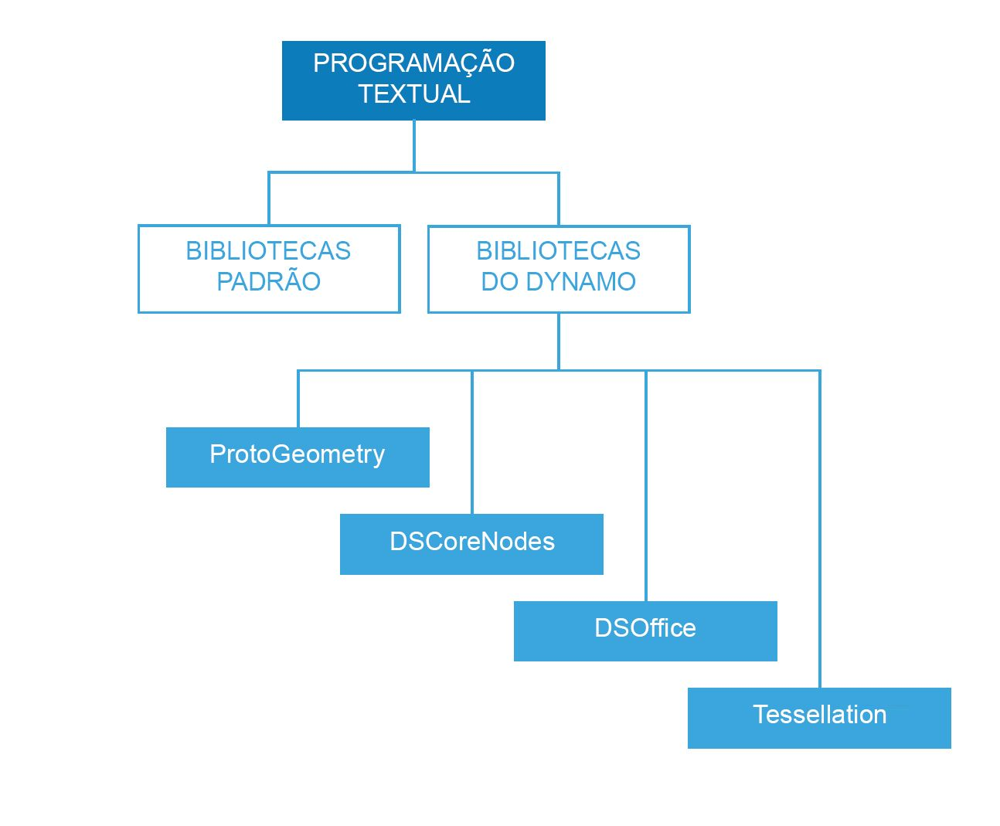

## Referência dos scripts

Esta página de referência estende as melhores práticas descritas em Estratégias de script com mais detalhes sobre bibliotecas de códigos, legendagem e estilização. Usaremos o Python para ilustrar os conceitos abaixo, mas os mesmos princípios se aplicam a Python e C# (Zerotouch), mas com sintaxe diferente.

### Quais bibliotecas devem ser usadas

As bibliotecas padrão são externas ao Dynamo e estão presentes nas linguagens de programação Python e C# (Zerotouch). O Dynamo também tem seu próprio conjunto de bibliotecas que correspondem diretamente à sua hierarquia de nós, permitindo que o usuário crie qualquer coisa em código que possa ser feito com nós e fios. A seguir está um guia a indicar os acessos fornecidos por cada biblioteca do Dynamo e quando usar uma biblioteca padrão.



**Bibliotecas padrão e bibliotecas do Dynamo**

* As bibliotecas padrão do Python e C# podem ser usadas para criar dados avançados e estruturas de fluxo no ambiente do Dynamo.
* As bibliotecas do Dynamo correspondem diretamente à hierarquia dos nós para criar geometria e outros objetos do Dynamo.

**Bibliotecas do Dynamo**

* ProtoGeometry
  * Funcionalidade: Arco, Caixa delimitadora, Círculo, Cone, Sistema de coordenadas, Cuboide, Curva, Cilindro, Aresta, Elipse, Arco de elipse, Face, Geometria, Hélice, Grupo de índices, Linha, Malha, Curva Nurbs, Superfície Nurbs, Plano, Ponto, Polígono, Retângulo, Sólido, Esfera, Superfície, Topologia, TSpline, UV, Vetor, Vértice.
  * Como importar: ```import Autodesk.DesignScript.Geometry```
  * **Observação ao usar a ProtoGeometry com o Python ou C#**: você está criando objetos não gerenciados, que precisam ter memória gerenciada manualmente. Consulte a seção abaixo: **Objetos não gerenciados**, para obter mais informações.
* DSCoreNodes
  * Funcionalidade: Cor, Intervalo de Cores 2D, Data e hora, Tempo, E/S, Fórmula, Lógica, Lista, Matemática, Quadtree, Sequência de caracteres, Rosca.
  * Como importar: ```import DSCore```
* Tessellation
  * Funcionalidade: Casco convexo, Delaunay, Voronoi.
  * Como importar: ```import Tessellation```
* DSOffice
  * Funcionalidade: Excel.
  * Como importar: ```import DSOffice```

### Rotular cuidadosamente

Enquanto cria scripts, estamos constantemente usando identificadores para indicar coisas como variáveis, tipos, funções e outras entidades. Por meio desse sistema de notação simbólica, ao criar algoritmos, podemos convenientemente nos referir às informações através de rótulos, geralmente compostos de uma sequência de caracteres. Atribuir nomes a coisas desempenha um papel importante em códigos de escrita que podem ser facilmente lidos e compreendidos por outras pessoas, bem como por você no futuro. Veja algumas dicas para se ter em mente ao nomear os itens no script:

**É aceitável usar abreviações, mas explique a abreviação com um comentário:**

```
### BAD
csfX = 1.6
csfY= 1.3
csfZ = 1.0
```

```
### GOOD
# column scale factor (csf)
csfX = 1.6
csfY= 1.3
csfZ = 1.0
```

**Evite a legendagem redundante:**

```
### BAD
import car
seat = car.CarSeat()
tire = car.CarTire()
```

```
### GOOD
import car
seat = car.Seat()
tire = car.Tire()
```

**Use lógica positiva para seus nomes de variáveis em vez de lógica negativa:**

```
### BAD
if 'mystring' not in text:
print 'not found'
else:
print 'found'
print 'processing'
```

```
### GOOD
if 'mystring' in text:
print 'found'
print 'processing'
else:
print 'not found'
```

**Prefira a “notação inversa”:**

```
### BAD
agents = …
active_agents = …
dead_agents ...
```

```
### GOOD
agents = …
agents_active = …
agents_dead = ...
```

> É mais sensível, em termos estruturais.

**Os alias devem ser usados para abreviar cadeias muito longas e frequentemente repetidas:**

```
### BAD
from RevitServices.Persistence import DocumentManager

DocumentManager = DM

doc = DM.Instance.CurrentDBDocument
uiapp = DM.Instance.CurrentUIApplication
```

```
### GOOD
from RevitServices.Persistence import DocumentManager as DM

doc = DM.Instance.CurrentDBDocument
uiapp = DM.Instance.CurrentUIApplication
```

> A suavização de serrilhado pode levar rapidamente a programas muito confusos e não padrão.

**Use somente as palavras necessárias:**

```
### BAD
rotateToCoord = rotateFromCoord.Rotate(solid.ContextCoordinateSystem.Origin,Vector.ByCoordinates(0,0,1),5)
```

```
### GOOD
toCoord = fromCoord.Rotate(solid.ContextCoordinateSystem.Origin,Vector.ByCoordinates(0,0,1),5)
```

> “Tudo deve ser feito tão simples quanto possível, mas não mais simples”. – Albert Einstein

### Estilo consistente

Em termos gerais, há mais de uma maneira de programar qualquer coisa; portanto, seu “estilo pessoal” de scripts é o resultado das inúmeras decisões pequenas que você tomar (ou não tomar) durante o processo. Mesmo assim, a legibilidade e a manutenção do código são um resultado direto de sua consistência interna, bem como sua adesão às convenções estilizadas gerais. Como regra geral, o código com a mesma aparência em dois lugares deve funcionar da mesma maneira também. Aqui estão algumas dicas para escrever código claro e consistente.

**Convenções de nomenclatura:** (selecione uma das convenções abaixo para cada tipo de entidade em seu código e a mantenha.)

* Variáveis, funções, métodos, pacotes, módulos:
`lower_case_with_underscores`

* Classes e exceções:
`CapWords`

* Funções internas e métodos protegidos:
`_single_leading_underscore(self, ...)`

* Métodos privados:
`__double_leading_underscore(self, ...)`

* Constantes:
`ALL_CAPS_WITH_UNDERSCORES`

> Dica: Evite variáveis com uma letra (esp. l, O, I), exceto em blocos muito curtos, quando o significado é claramente visível no contexto imediato.

**Use linhas em branco:**

* Defina a função de nível superior e as definições de classe com duas linhas em branco.

  * As definições de método dentro de uma classe são cercadas por uma única linha em branco.

  * É possível usar linhas em branco adicionais (com moderação) para separar grupos de funções relacionadas.

**Evite espaços em branco desnecessários:**

* Imediatamente dentro dos parênteses, colchetes ou chaves:

```
### BAD
function( apples[ 1 ], { oranges: 2 } )
```

```
### GOOD:
function(apples[1], {oranges: 2})
```

* Imediatamente antes de uma vírgula, ponto e vírgula ou dois pontos:

```
### BAD
if x == 2 : print x , y ; x , y = y , x
```

```
### GOOD
if x == 2: print x, y; x, y = y, x
```

* Imediatamente antes do parêntese de abertura que inicia a lista de argumentos de uma chamada de função:

```
### BAD
function (1)
```

```
### GOOD
function(1)
```

* Imediatamente antes do parêntese de abertura que inicia uma indexação ou fatiamento:

```
### BAD
dict ['key'] = list [index]
```

```
### GOOD
dict['key'] = list[index]
```

* Sempre coloque esses operadores binários com um único espaço em cada lado:

```
assignment ( = )
augmented assignment ( += , -= etc.)
comparisons ( == , < , > , != , <> , <= , >= , in , not in , is , is not )
Booleans ( and , or , not )
```

**Comprimento da linha de inspeção:**

* Não se estresse com isso, aproximadamente 79 caracteres.

* Limitar a largura da janela do editor necessária possibilita ter vários arquivos abertos lado a lado e funciona bem ao usar as ferramentas de revisão de código que apresentam as duas versões em colunas adjacentes.

* Linhas longas podem ser divididas em várias linhas ao colocar expressões entre parênteses:

**Evite comentários óbvios e redundantes:**

* Às vezes, menos comentários resultam em um código mais legível. Especialmente se isso forçar o uso de nomes de símbolos significativos.

* Adotar bons hábitos de codificação reduz a dependência de comentários:

```
### BAD
# get the country code
country_code = get_country_code(address)

# if country code is US
if (country_code == 'US'):
# display the form input for state
print form_input_state()
```

```
### GOOD
# display state selection for US users
country_code = get_country_code(address)
if (country_code == 'US'):
print form_input_state()
```

> Dica: Os comentários informam o porquê, o código informa como.

**Confira o código fonte aberto:**

* Os projetos em código aberto foram desenvolvidos com base nos esforços de colaboração de muitos desenvolvedores. Esses projetos precisam manter um alto nível de legibilidade de código para que a equipe possa trabalhar em conjunto da maneira mais eficiente possível. Portanto, é aconselhável procurar o código fonte desses projetos para observar o que esses desenvolvedores estão fazendo.

* Melhore as convenções:

  * Questione se cada convenção está ou não funcionando para as necessidades em questão.

  * A funcionalidade/eficiência está sendo comprometida?

### Padrões C# (Zerotouch)

**Confira estas páginas wiki para obter ajuda sobre como escrever em C# para Zerotouch e contribuir para o Dynamo:**

  * Este wiki aborda alguns padrões gerais de codificação para documentar e testar seu código: [https://github.com/DynamoDS/Dynamo/wiki/Coding-Standards](https://github.com/DynamoDS/Dynamo/wiki/Coding-Standards)

  * Este wiki aborda especificamente os padrões de nomenclatura para bibliotecas, categorias, nomes de nós, nomes de porta e abreviaturas: [https://github.com/DynamoDS/Dynamo/wiki/Naming-Standards](https://github.com/DynamoDS/Dynamo/wiki/Naming-Standards)

  **Objetos não gerenciados:**

  Ao usar a biblioteca de geometria do Dynamo*(ProtoGeometry)* do Python ou C#, os objetos de geometria que você criar não serão gerenciados pela máquina virtual, e a memória de muitos desses objetos precisará ser limpa manualmente. Para limpar objetos nativos ou não gerenciados, é possível usar o método **Dispose** ou a palavra-chave **using**. Consulte esta entrada do wiki para obter uma visão geral: [https://github.com/DynamoDS/Dynamo/wiki/Zero-Touch-Plugin-Development#dispose—using-statement](https://github.com/DynamoDS/Dynamo/wiki/Zero-Touch-Plugin-Development#dispose--using-statement).

  Você só precisa descartar os recursos não gerenciados aos quais não retorne no gráfico ou para os quais não armazene uma referência. Para o restante desta seção, chamaremos esses objetos *geometria intermediária*. É possível ver um exemplo dessa classe de objeto no exemplo de código abaixo. Essa função C# zerotouch **singleCube** retorna um único cubo, mas cria 10.000 cubos extras durante sua execução. É possível simular que usamos esta outra geometria como alguma geometria de construção intermediária.

  **Essa função zerotouch provavelmente travará o Dynamo.** Como criamos 10.000 sólidos, mas somente um deles foi armazenado, só esse será devolvido. Devemos, em vez disso, descartar todos os nossos cubos intermediários, exceto o que retornamos. Não queremos descartar o que retornamos, pois será propagado no gráfico e usado por outros nós.

```
public Cuboid singleCube(){

var output = Cuboid.ByLengths(1,1,1);

for(int i = 0; i<10000;i++){
output = Cuboid.ByLengths(1,1,1);
}
return output;
}
```

O código fixo deve ter o seguinte aspecto:

```
public Cuboid singleCube(){

var output = Cuboid.ByLengths(1,1,1);
var toDispose = new List<Geometry>();

for(int i = 0; i<10000;i++){
toDispose.Add(Cuboid.ByLengths(1,1,1));
}

foreach(IDisposable item in toDispose ){
item.Dispose();
}

return output;
}
```

Em geral, você só precisa descartar geometrias como ```Superfícies```, ```Curvas``` e ```Sólidos```. Como prevenção, é possível descartar todos os tipos de geometria (```Vetores```, ```Pontos```, ```Sistemas de coordenadas```).

