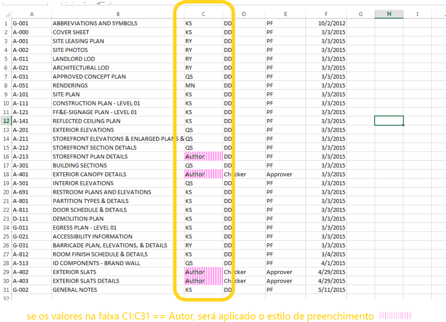
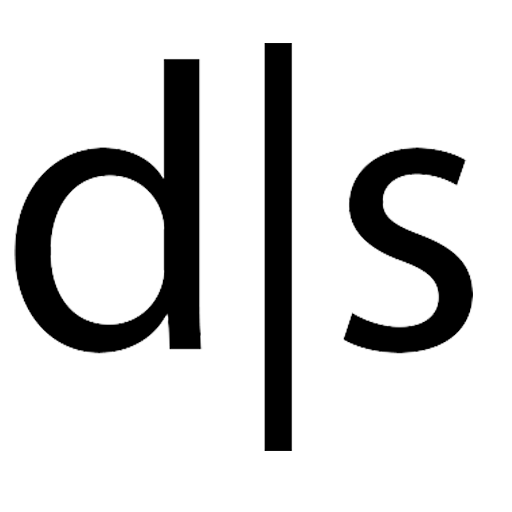
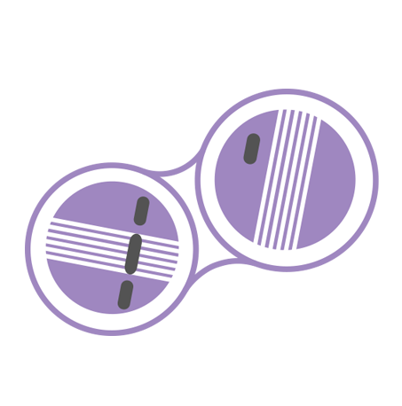

## Pacotes do Dynamo
Veja a seguir uma lista de alguns dos pacotes mais populares da comunidade do Dynamo. Desenvolvedores, adicionem itens à lista! Lembre-se, o [Dynamo Primer](https://github.com/DynamoDS/DynamoPrimer ) é de código aberto!

<table>
   <tr>
      <td width="10%">
         </img>
      </td>
      <td width="55%">
         <b>ARCHI-LAB</b>
      </td>
      <td>
         <a href="http://archi-lab.net/">Visite o site oficial do archi-lab
      </td>
      </a>
   </tr>
   <tr>
      <td colspan="2">o Archi-lab é uma coleção de mais de 50 pacotes personalizados que ampliam muito a capacidade do Dynamo de interagir com o Revit. Os nós contidos no pacote do Archi-lab variam de operações básicas de lista para nós avançados da Análise e da Estrutura de Visualização do Revit. </td>
      <td>
         </img>
      </td>
   </tr>
</table>

<table>
  <tr>
    <td width="10%"></img></td>
    <td width="55%"><b>BIMORPH NODES</b></td>
    <td><a href="https://bimorph.com/bimorph-nodes/">Visite o Dicionário BimorphNodes</td></a>
  </tr>
  <tr>
    <td colspan="2">BimorphNodes é uma coleção versátil de poderosos nós de utilitários. Os destaques do pacote incluem a detecção de interferências e intersecção de geometria ultraeficientes, nós de conversão de curva ImportInstance (CAD) e coletores de elementos vinculados que resolvem as limitações no Revit API. Para saber mais sobre a faixa completa de nós disponíveis, visite o dicionário BimorphNodes.</td>
    <td></img></td>
  </tr>
</table>

<table>
  <tr>
    <td width="10%"></img></td>
    <td width="55%"><b>BUMBLEBEE FOR DYNAMO</b></td>
    <td><a href="http://archi-lab.net/bumblebee-dynamo-and-excel-interop/">Visite o site oficial do BumbleBee</td></a>
  </tr>
  <tr>
    <td colspan="2">O Bumblebee é um plug-in de interoperabilidade do Excel e Dynamo que aprimora consideravelmente a capacidade do Dynamo de ler e gravar arquivos do Excel. </td>
    <td></img></td>
  </tr>
</table>

<table>
  <tr>
    <td width="10%"></img></td>
    <td width="55%"><b>CLOCKWORK FOR DYNAMO</b></td>
    <td><a href="https://github.com/CAAD-RWTH/ClockworkForDynamo">Visite o Clockwork For Dynamo GitHub</td></a>
  </tr>
  <tr>
    <td colspan="2">O Clockwork é uma coleção de nós personalizados para o ambiente de programação visual do Dynamo. Ela contém muitos nós relacionados ao Revit, mas também diversos nós para outras finalidades, como gerenciamento de lista, operações matemáticas, operações de sequência de caracteres, conversões de unidade, operações geométricas (principalmente caixas delimitadoras, malhas, planos, pontos, superfícies, UVs e vetores) e pan. </td>
    <td></img></td>
  </tr>
</table>

<table>
  <tr>
    <td width="10%"></img></td>
    <td width="55%"><b>DATA|SHAPES</b></td>
    <td><a href="https://github.com/MostafaElAyoubi/Data-shapes">Visite Data|Shapes no GitHub</td></a>
  </tr>
  <tr>
    <td colspan="2"> O DataShapes é um pacote que visa estender a funcionalidade do usuário de scripts do Dynamo. Isso tem um foco forte em adicionar mais funcionalidades ao Dynamo player. Para mais informações, visite https://data-shapes.net/. Deseja criar incríveis fluxos de trabalho do Dynamo player? Utilize este pacote.</td>
    <td></img></td>
  </tr>
</table>

<table>
  <tr>
    <td width="10%"></img></td>
    <td width="55%"><b>DYNAMO SAP</b></td>
    <td><a href="http://core.thorntontomasetti.com/dynamosap-is-now-open-source/">Visite o DynamoSAP Project no Core Studio</td></a>
  </tr>
  <tr>
    <td colspan="2">O DynamoSAP é uma interface paramétrica para SAP2000, criada com base no Dynamo. O projeto permite que projetistas e engenheiros criem e analisem de forma generativa os sistemas estruturais no SAP, usando o Dynamo para controlar o modelo SAP. O projeto prescreve alguns fluxos de trabalho comuns que são descritos nos arquivos de amostra incluídos e fornece uma ampla gama de oportunidades para a automação de tarefas típicas no SAP. </td>
    <td></img></td>
  </tr>
</table>

<table>
  <tr>
    <td width="10%"></img></td>
    <td width="55%"><b>DYNAMO UNFOLD</b></td>
    <td><a href="https://github.com/mjkkirschner/DynamoUnfold">Visite o DynamoUnfold GitHub</td></a>
  </tr>
  <tr>
    <td colspan="2">Esta biblioteca estende a funcionalidade do Dynamo/Revit permitindo que os usuários desdobrem a geometria de superfície e da superfície de polígono. A biblioteca permite que os usuários convertam primeiro as superfícies em uma topologia plana de triangulação e, em seguida, desdobre-as usando as ferramentas de protogeometria do Dynamo. Este pacote também inclui alguns nós experimentais, bem como alguns arquivos de amostra básicos. </td>
    <td></img></td>
  </tr>
</table>

<table>
  <tr>
    <td width="10%"></img></td>
    <td width="55%"><b>DYNASTRATOR</b></td>
    <td><a href="http://dynamopackages.com/">Baixar o Dynastrator no Gerenciador de pacotes</td></a>
  </tr>
  <tr>
    <td colspan="2">Importe a arte vetorial do Illustrator ou da web usando o .svg.  Isso permite importar desenhos criados manualmente para o Dynamo para operações paramétricas. </td>
    <td></img></td>
  </tr>
</table>

<table>
  <tr>
    <td width="10%"></img></td>
    <td width="55%"><b>ENERGY ANALYSIS FOR DYNAMO</b></td>
    <td><a href="https://github.com/tt-acm/EnergyAnalysisForDynamo">Visite o Energy Analysis for Dynamo Project no GitHub</td></a>
  </tr>
  <tr>
    <td colspan="2">A Energy Analysis for Dynamo permite a modelagem paramétrica de energia e os fluxos de trabalho de análise de energia de toda a construção no Dynamo 0.8. O Energy Analysis for Dynamo permite que o usuário configure o modelo de energia do Autodesk Revit, envie para o Green Building Studio para a análise de energia DOE2 e aprofunda os resultados retornados da análise. O pacote está sendo desenvolvido pelo estúdio CORE do Thornton Tomasetti.  </td>
    <td></img></td>
  </tr>
</table>

<table>
  <tr>
    <td width="10%"></img></td>
    <td width="55%"><b>FIREFLY FOR DYNAMO</b></td>
    <td><a href="http://dynamopackages.com/">Baixe o Firefly no Gerenciador de pacotes do Dynamo</td></a>
  </tr>
  <tr>
    <td colspan="2">O Firefly é uma coleção de nós que permite que o Dynamo se comunique com dispositivos de entrada/saída, como o microcontrolador Arduino. Como o fluxo de dados acontece "ao vivo", o Firefly abre muitas oportunidades de prototipagem interativa entre os mundos digital e físico através de câmeras de internet, telefones celulares, controladores de jogos, sensores e mais. </td>
    <td></img></td>
  </tr>
</table>

<table>
  <tr>
    <td width="10%"></img></td>
    <td width="55%"><b>LUNCHBOX FOR DYNAMO</b></td>
    <td><a href="http://provingground.io/tools/lunchbox/">Confira o Lunchbox for Dynamo on the Proving Ground</td></a>
  </tr>
  <tr>
    <td colspan="2">O LunchBox é uma coleção de geometria reutilizáveis e nós de gerenciamento de dados. As ferramentas foram testadas com o Dynamo 0.8.1 e o Revit 2016. A ferramenta inclui nós para o pan da superfície, geometria, coleta de dados do Revit e mais!</td>
    <td></img></td>
  </tr>
</table>

<table>
  <tr>
    <td width="10%"></img></td>
    <td width="55%"><b>MANTIS SHRIMP</b></td>
    <td><a href="http://archi-lab.net/mantis-shrimp-getting-started/">Visite o site oficial do Mantis Shrimp.</td></a>
  </tr>
  <tr>
    <td colspan="2">O Mantis Shrimp é um projeto de interoperabilidade que permite importar facilmente a geometria Grasshopper e/ou Rhino para o Dynamo.</td>
    <td></img></td>
  </tr>
</table>

<table>
  <tr>
    <td width="10%"></img></td>
    <td width="55%"><b>KIT DE FERRAMENTAS DE MALHA</b></td>
    <td><a href="https://github.com/DynamoDS/Dynamo/wiki/Dynamo-Mesh-Toolkit">Visite o Kit de ferramentas de malha para o Dynamo no GitHub</td></a>
  </tr>
  <tr>
    <td colspan="2">O Kit de ferramentas de malha oferece muitas ferramentas úteis para trabalhar com geometria de malha. A funcionalidade deste pacote inclui a capacidade de importar malhas de formatos de arquivo externo, gerar malhas a partir de objetos de geometria do Dynamo preexistentes e criar manualmente malhas através de vértices e informações de conectividade. Além disso, este kit de ferramentas inclui ferramentas para modificar e reparar a geometria da malha. </td>
    <td></img></td>
  </tr>
</table>

<table>
  <tr>
    <td width="10%"></img></td>
    <td width="55%"><b>OPTIMO</b></td>
    <td><a href="https://github.com/BPOpt/Optimo/wiki/0_-Home">Visite o Optimo no GitHub</td></a>
  </tr>
  <tr>
    <td colspan="2">O Optimo fornece aos usuários dinâmicos a capacidade de otimizar problemas de projeto autodefinidos usando vários algoritmos evolucionários. Os usuários podem definir o objetivo do problema ou o conjunto de objetivos, bem como funções de adequação específicas. </td>
    <td></img></td>
  </tr>
</table>

<table>
  <tr>
    <td width="10%"></img></td>
    <td width="55%"><b>RHYNAMO</b></td>
    <td><a href="https://bitbucket.org/caseinc/rhynamo">Visite o Rhynamo Bitbucket</td></a>
  </tr>
  <tr>
    <td colspan="2">A biblioteca de nós Rhynamo fornece aos usuários a capacidade de ler e gravar arquivos Rhino 3DM dentro do Dynamo. O Rhynamo converte a geometria Rhino para a geometria do Dynamo utilizável usando a biblioteca OpenNURBS do McNeel, permitindo novos fluxos de trabalho que podem trocar a geometria e os dados de forma fluida entre o Rhino e o Revit. Este pacote também contém alguns nós experimentais que permitem o acesso "ao vivo" para a linha de comando Rhino. </td>
    <td></img></td>
  </tr>
</table>

<table>
  <tr>
    <td width="10%"></img></td>
    <td width="55%"><b>RHYTHM</b></td>
    <td><a href="https://github.com/sixtysecondrevit/RhythmForDynamo">Visitar o Rhythm no GitHub</td></a>
  </tr>
  <tr>
    <td colspan="2"> À primeira vista, o Rhythm não é nada especial. Não envolve nenhum código sofisticado nem qualquer coisa de outra natureza. O que o Rhythm representa, porém, é o resultado de um pensamento prático e diligência. A ideia é que este pacote ajude os usuários a manter o Rhythm no Revit com o Dynamo. O Rhythm consiste principalmente em nós prontos para uso no Dynamo, utilizados de forma inteligente, como se aplicam ao ambiente Revit. </td>
    <td></img></td>
  </tr>
</table>
