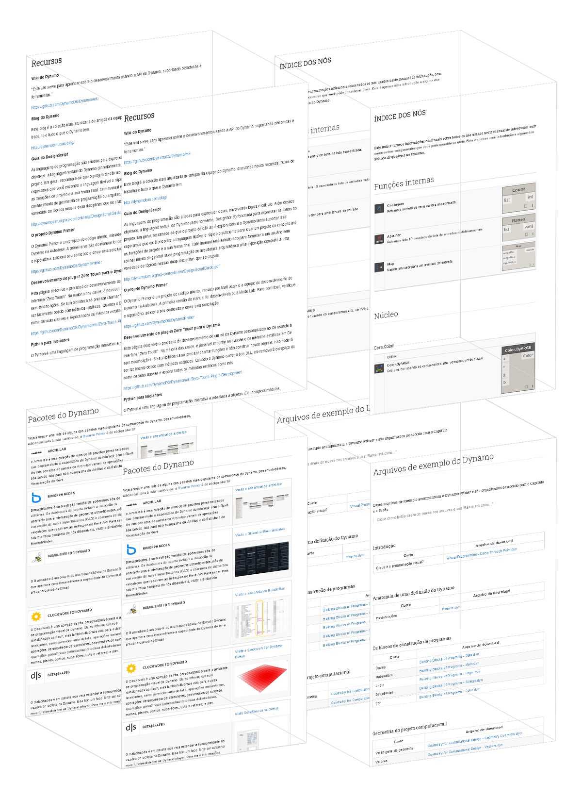

# Apêndice A: Recursos

Nesta seção, você pode encontrar recursos adicionais para melhorar ainda mais as suas habilidades no Dynamo. Também adicionamos um índice de nós importantes, um conjunto de pacotes úteis e um repositório dos arquivos de exemplo neste manual. Sinta-se à vontade para adicionar informações a esta seção... lembre-se, o [Dynamo Primer](https://github.com/DynamoDS/DynamoPrimer) é uma fonte aberta. 

