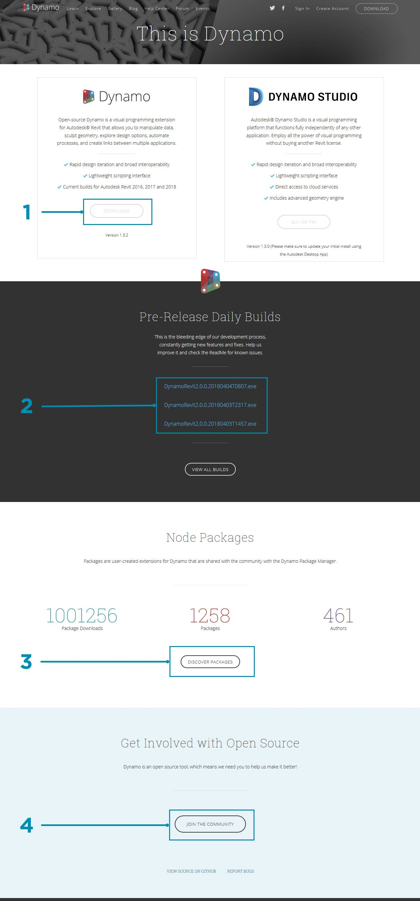
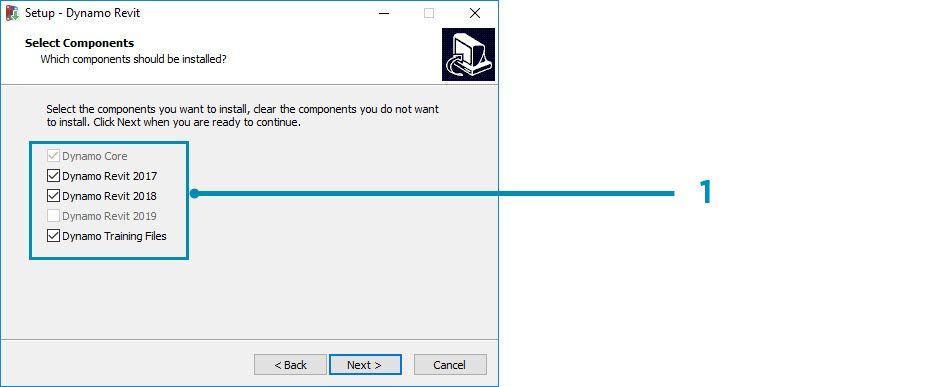
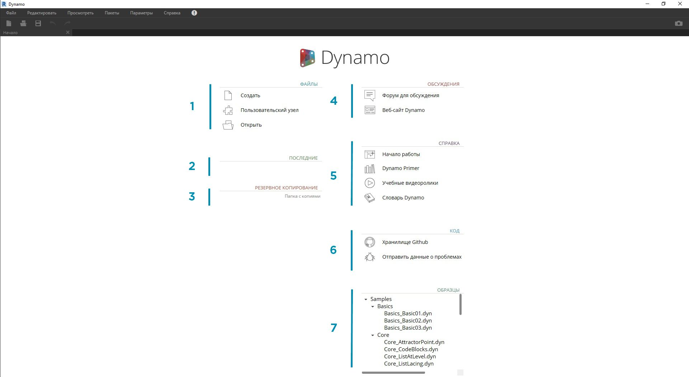
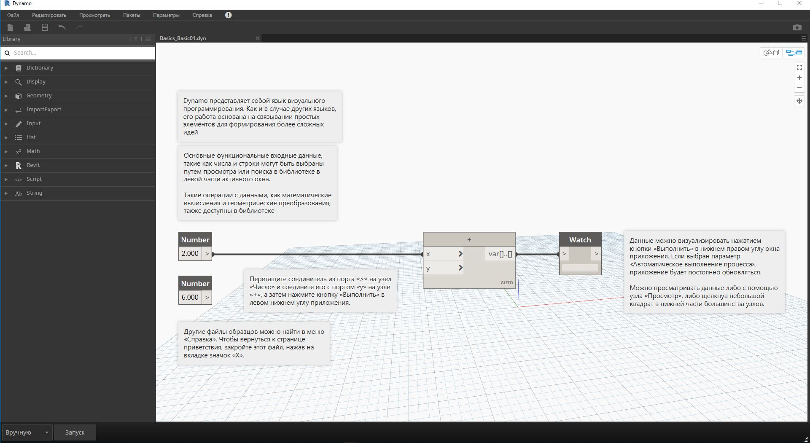

## Установка и запуск Dynamo

Dynamo — это действующий проект с открытым исходным кодом. Вы можете скачать установщик и для официальной версии, и для новейших, «неофициальных» версий от разработчиков. Скачайте официальный выпуск и приступайте к работе либо примите участие в разработке новых версий Dynamo на сайте GitHub.

### Скачивание

Чтобы скачать официальный выпуск Dynamo, посетите [веб-сайт Dynamo](http://dynamobim.com/). Скачивание можно запустить, нажав соответствующую кнопку на главной странице либо открыв предназначенную для этого страницу.

> 1. Просмотрите видеоролик об использовании возможностей машинного проектирования Dynamo в сфере архитектуры.
2. Или перейдите на страницу скачивания.

Здесь можно скачать новейшие версии от разработчиков или перейти на [страницу проекта Dynamo на сайте Github](https://github.com/DynamoDS/Dynamo).

> 1. Скачайте установщик для официального выпуска.
2. Скачайте установщик для новейших версий от разработчиков.
3. Ознакомьтесь с пользовательскими пакетами, предоставленными участниками сообщества.
4. Примите участие в разработке проекта Dynamo на GitHub.

### Установка

Перейдите в папку со скачанным установщиком и запустите исполняемый файл. В процессе установки можно указать, какие именно компоненты требуется установить.

> 1. Выберите компоненты, которые требуется установить.

Здесь необходимо указать, следует ли устанавливать компоненты, отвечающие за подключение Dynamo к другим установленным приложениям, например Revit. Дополнительные сведения о платформе Dynamo см. в **главе 1.2**.

### Запуск

Чтобы запустить Dynamo, перейдите в папку \Program Files\Dynamo\Dynamo Revit\x.y и выберите DynamoSandbox.exe. Откроется однопользовательская версия Dynamo и отобразится *начальная страница*. На этой странице доступны стандартные меню и панель инструментов, а также набор ярлыков для работы с файлами и доступа к ресурсам.

> 1. «Файлы»: создание нового файла или открытие существующего.
2. «Последние»: список последних файлов.
3. «Резервное копирование»: доступ к резервным копиям.
4. «Обсуждения»: непосредственный доступ к форуму пользователей или веб-сайту Dynamo.
5. «Справка»: дополнительные обучающие ресурсы.
6. «Код»: разработка проекта с открытым исходным кодом.
7. «Образцы»: файлы примеров, входящие в комплект установки.

Откройте первый файл примеров, чтобы в первый раз открыть рабочее пространство и убедиться, что приложение Dynamo работает правильно. Выберите Samples > Basics > **Basics_Basic01.dyn**.

> 1. Убедитесь, что в строке выполнения выбран параметр «Автоматически», или нажмите кнопку «Запуск».
2. Следуйте инструкциям и соедините узел **Number** с узлом **+**.
3. Убедитесь, что в узле Watch отображается результат выполненной операции.

Если этот файл загружается успешно, то вы сможете запустить свою первую визуальную программу Dynamo.

