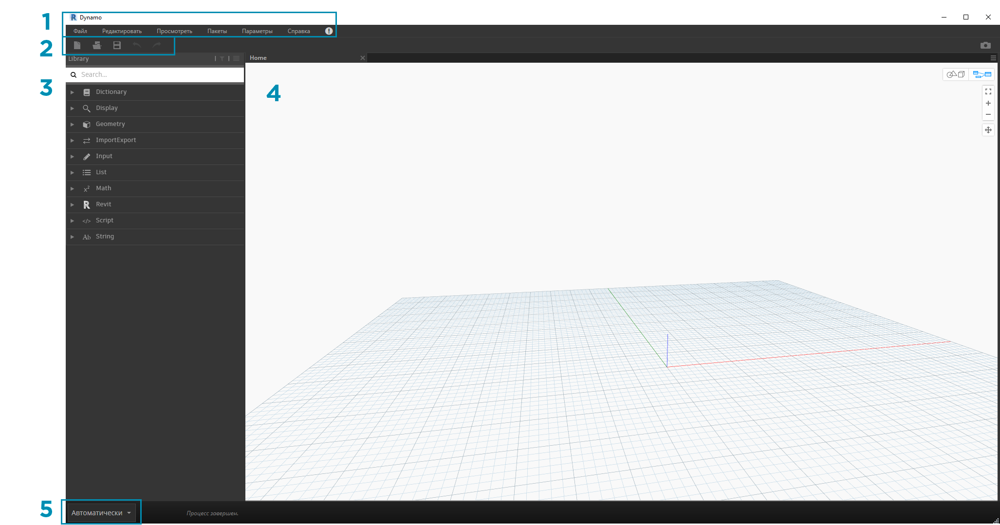
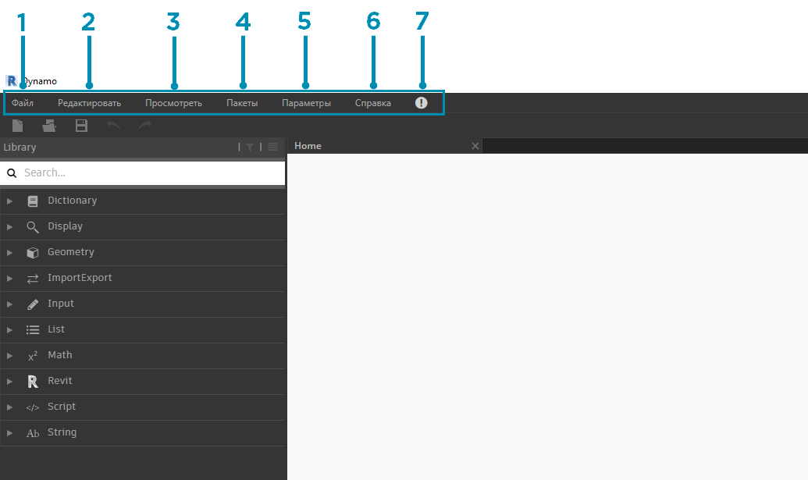
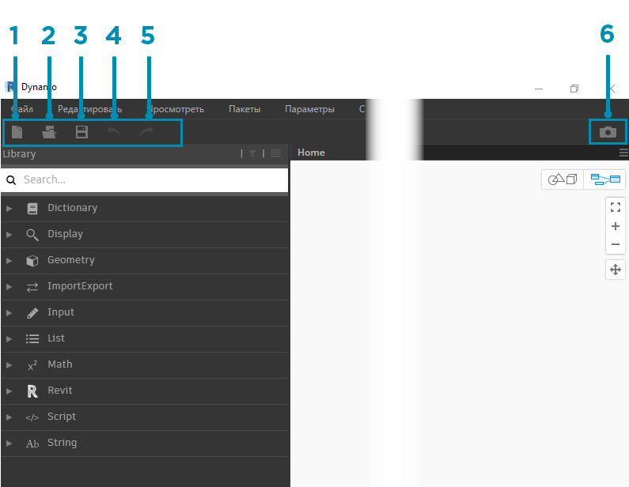
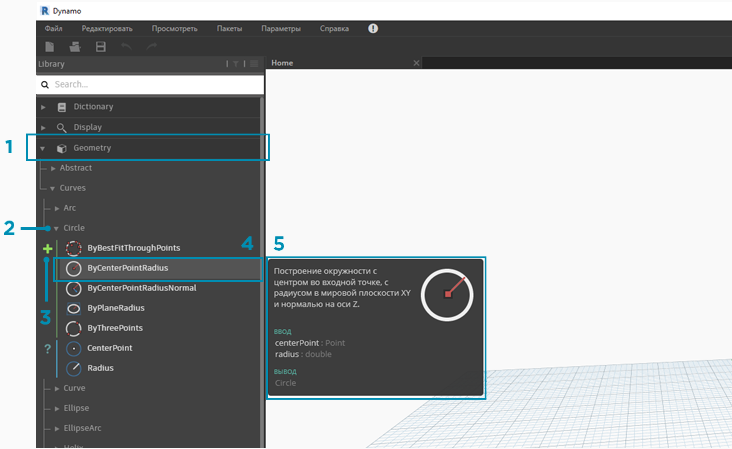
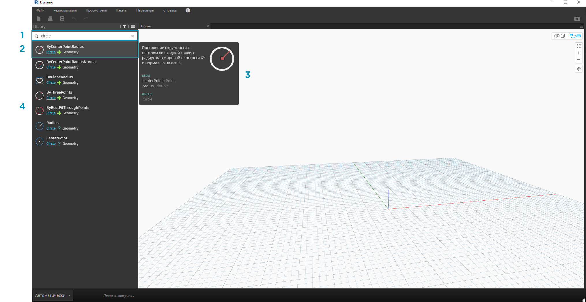
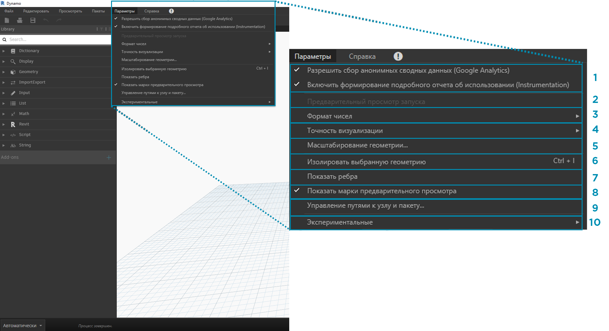
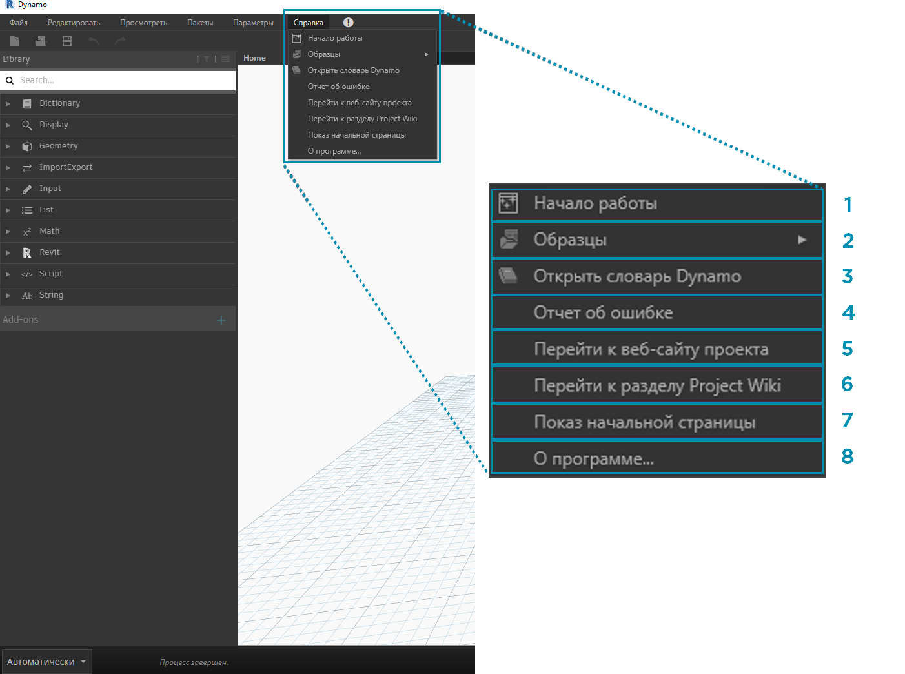

## Пользовательский интерфейс Dynamo

Пользовательский интерфейс Dynamo состоит из пяти основных областей, самая крупная из которых — рабочее пространство, в котором составляются визуальные программы.

> 1. Меню
2. Панель инструментов
3. Библиотека
4. Рабочее пространство
5. Панель выполнения

В этом разделе мы подробнее рассмотрим пользовательский интерфейс приложения и функции каждой области.

#### Меню

С помощью раскрывающихся меню можно получить доступ к основным функциям приложения Dynamo. Как и в большинстве приложений на базе Windows, в первых двух меню содержатся стандартные функции, связанные с управлением файлами, а также операциями выбора и редактирования компонентов. В остальных меню содержатся функции, присущие именно Dynamo.

> 1. Файл
2. Редактировать
3. Просмотреть
4. Пакеты
5. Параметры
6. Справка
7. Уведомления

#### Панель инструментов

Панель инструментов Dynamo содержит ряд кнопок для быстрого доступа к файлам, а также команды «Отменить» [CTRL+Z] и «Повторить [CTRL+Y]». Справа находится еще одна кнопка, с помощью которой можно экспортировать снимок рабочего пространства, что часто требуется при создании документации и обмене данными.

> 1. «Создать»: создание нового файла DYN.
2. «Открыть»: открытие существующего файла DYN (рабочее пространство) или DYF (пользовательский узел).
3. «Сохранить/Сохранить как»: сохранение активного файла DYN или DYF.
4. «Отменить»: отмена последнего действия.
5. «Повторить»: повтор действия.
6. «Экспорт рабочего пространства в виде изображения»: экспорт видимого рабочего пространства в файл PNG.

#### Библиотека

Библиотека содержит все загруженные узлы, включая узлы по умолчанию, входящие в установочный пакет, а также все дополнительно загруженные пользовательские узлы и пакеты. Узлы в библиотеке распределены иерархически по библиотекам, категориям и, при необходимости, подкатегориям в зависимости от функции узла: создание данных (**Create**), выполнение действия (**Action**) или запрос данных (**Query**).

##### Обзор

По умолчанию в **библиотеке** доступно восемь категорий узлов. Начинать знакомство с программой рекомендуется с меню **Core** и **Geometry**, в которых представлено наибольшее количество узлов. Обзор узлов по категориям позволяет быстро разобраться в иерархии узлов, которые требуется добавить в рабочее пространство, а также найти узлы, которыми вы еще не пользовались.

> Для начала мы рассмотрим стандартный набор узлов, а затем расширим библиотеку за счет пользовательских узлов, дополнительных библиотек и менеджера пакетов.

> 1. Dictionary
2. Display
3. Geometry
4. ImportExport
5. Input
6. List
7. Math
8. Revit
9. Script
10. String
11. Add-ons

Ознакомьтесь с содержимым библиотеки, щелкая различные меню. Выберите Geometry > Curves > Circle. Обратите внимание на новую появившуюся часть меню, а также на метки подкатегорий **Create** и **Query**.

> 1. Библиотека
2. Категория
3. Подкатегория: Create/Actions/Query
4. Узел
5. Описание и свойства узла: появляется при наведении указателя на значок узла.

В том же меню Circle наведите указатель на элемент **ByCenterPointRadius**. В окне отобразятся более подробные сведения об узле в дополнение к его имени и значку. Такие подсказки позволяют быстро определить функции, выполняемые узлом, какие данные ему требуются на входе и что он дает на выходе.

> 1. Описание: описание узла на обычном языке.
2. Значок: увеличенная версия значка, используемого в меню библиотеки.
3. Входные данные: наименование, тип и структура данных.
4. Выходные данные: наименование, тип и структура данных.

##### Поиск

Если вам в общих чертах известно, какой узел требуется добавить в рабочее пространство, можно воспользоваться полем **Поиск**. Курсор всегда находится в этом поле, если только в рабочей области не выполняется редактирование параметров или задание значений. Если начать ввод текста, появится наиболее точное совпадение, найденное в библиотеке Dynamo (с подсказками о расположении объекта в категориях узлов), а также список дополнительных совпадений. При нажатии клавиши ENTER или выборе элемента в компактном обозревателе выделенный узел добавляется в центр рабочего пространства.

> 1. Поле поиска
2. Наиболее точное / выбранное совпадение
3. Дополнительные совпадения

### Параметры

В меню **Параметры** можно найти геометрические, пользовательские и прочие настройки. Здесь можно включить или отключить отправку пользовательских данных для улучшения работы Dynamo, а также задать точность десятичных значений и качество визуализации геометрии.

> 1. Активация отчетов: параметры для отправки данных пользователя с целью улучшения функций Dynamo.
2. «Предварительный просмотр запуска»: предварительный просмотр состояния графика при выполнении. Используемые при выполнении программы узлы выделяются на графике.
3. Параметры формата чисел: изменение параметров использования десятичных знаков в документе.
4. «Точность визуализации»: повышение или понижение качества визуализации документа.
5. «Масштабирование геометрии»: выбор рабочего диапазона геометрии.
6. «Изолировать выбранную геометрию»: изолирование фоновой геометрия в зависимости от выбранных узлов.
7. Отображение/скрытие ребер геометрии: включение и отключение ребер 3D-геометрии.
8. Отображение/скрытие марок предварительного просмотра: включение и отключение марок предварительного просмотра под узлами.
9. «Управление путями к узлу и пакету»: управление путями к файлам для отображения узлов и пакетов в библиотеке.
10. Включение экспериментальных функций: доступ к бета-версиям функций, недавно появившихся в Dynamo.

### Справка

При возникновении вопросов по работе программы можно воспользоваться меню **Справка**. Здесь можно найти файлы примеров, входящие в установочный пакет, а также получить доступ к одному из справочных веб-сайтов Dynamo через веб-браузер. В разделе **О программе** можно выяснить, какая версия Dynamo установлена и является ли она актуальной.

> 1. «Начало работы»: краткое введение в работу с приложением Dynamo.
2. «Образцы»: файлы примеров для справки.
3. «Открыть словарь Dynamo»: ресурс с документацией по всем узлам.
4. «Отчет об ошибке»: создание инцидента на веб-сайте GitHub.
5. «Перейти к веб-сайту проекта»: просмотр проекта Dynamo на сайте GitHub.
6. «Перейти к разделу Project Wiki»: переход на страницу справки Wiki, посвященную методам разработки с помощью API-интерфейса Dynamo, вспомогательных библиотек и инструментов.
7. «Показ начальной страницы»: возврат на начальную страницу Dynamo при работе с документом.
8. «О программе»: сведения о версии Dynamo.

