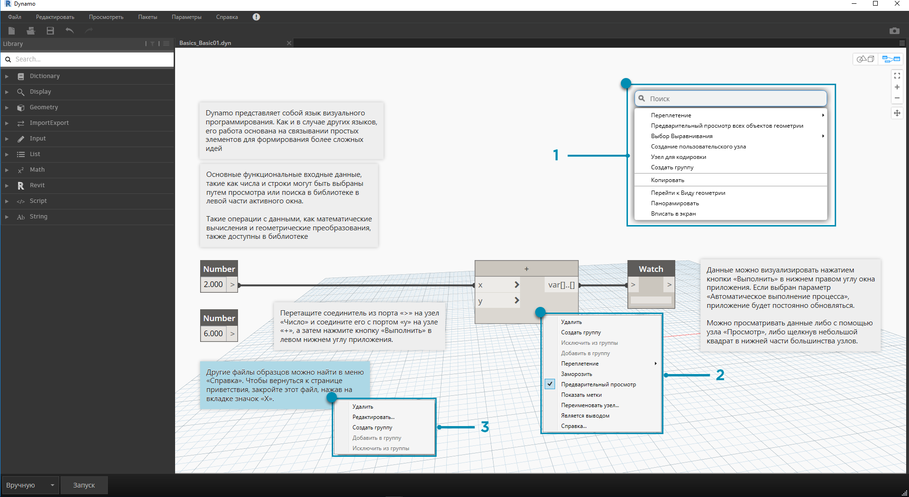
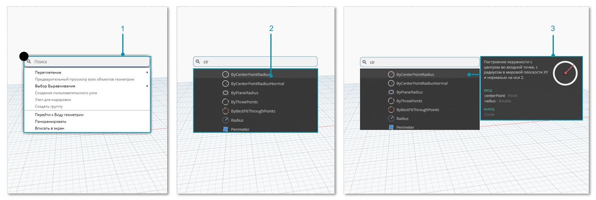

## Рабочее пространство

В **рабочем пространстве** Dynamo осуществляется непосредственная работа над визуальными программами. В нем также можно просмотреть предварительные результаты программирования путем визуализации полученной геометрии. Перемещаться по рабочему пространству, как и по пользовательскому узлу, можно с помощью мыши или кнопок в правом верхнем углу окна приложения. В правом нижнем углу можно выбрать режим просмотра для навигации.

> Примечание. Узлы и геометрия имеют порядок прорисовки, вследствие чего при визуализации объекты могут накладываться друг на друга. Это может произойти при последовательном добавлении нескольких узлов, так как все они могут быть визуализированы в одном и том же месте рабочего пространства.

> 1. Вкладки
2. Кнопки масштабирования и панорамирования
3. Режим предварительного просмотра
4. Двойной щелчок в рабочем пространстве

### Вкладки

При активной вкладке «Рабочее пространство» можно перемещаться по создаваемой программе и редактировать ее. При открытии нового файла по умолчанию отображается новая **начальная страница рабочего пространства**. Можно также открыть новое **рабочее пространство пользовательского узла**, используя меню «Файл» или указав нужные узлы и выбрав параметр *New Node by Selection* (Создать узел по выбранным объектам) в контекстном меню (подробнее о данной функции будет рассказано в следующих разделах).

> Примечание. Одновременно может быть открыта только одна начальная страница рабочего пространства, при этом может быть открыто несколько рабочих пространств пользовательских узлов на дополнительных вкладках.

### Навигация по графикам и областям предварительного 3D-просмотра

В Dynamo и графики, и их 3D-результаты (если создаются объекты геометрии) визуализируются в рабочем пространстве. По умолчанию активной областью предварительного просмотра является график. Его панорамирование и масштабирование можно выполнять с помощью кнопок навигации или средней кнопки мыши. Переключаться между активными областями предварительного просмотра можно тремя способами.

> 1. Кнопки переключения режима предварительного просмотра в рабочем пространстве
2. Щелчок правой кнопкой мыши в рабочем пространстве и выбор параметра *Перейти к виду ...*
3. Сочетание клавиш (CTRL+B)

В режиме навигации по области предварительного 3D-просмотра также доступна возможность **непосредственной манипуляции** точками, описанная в разделе [Начала работы](http://primer.dynamobim.org/02_Hello-Dynamo/2-6_the_quick_start_guide.html).

### Зумирование по центру

В режиме навигации по области предварительного 3D-просмотра можно свободно перемещать, зумировать и поворачивать модели. Для зумирования определенного объекта, созданного с помощью узла геометрии, можно выбрать отдельный узел, а затем использовать значок «Показать все».

> 1. Выберите узел, соответствующий геометрии, которая должна располагаться по центру вида.
2. Переключитесь на режим навигации по области предварительного 3D-просмотра.

> 1. Щелкните значок «Показать все» в правом верхнем углу.
2. Выбранная геометрия будет размещена по центру вида.

### Работа с мышью

В зависимости от того, какой режим предварительного просмотра активен, кнопки мыши будут работать по-разному. Обычно левая кнопка мыши позволяет выбирать и задавать входные данные, правая — переходить к параметрам, а средняя — перемещаться по рабочему пространству. Если щелкнуть правой кнопкой мыши, отобразятся контекстные параметры, список которых определяется тем, где был произведен щелчок.

> 1. Щелчок правой кнопкой мыши в рабочем пространстве
2. Щелчок правой кнопкой мыши по узлу
3. Щелчок правой кнопкой мыши по примечанию

Ниже приведена таблица действий, доступных при использовании мыши в разных режимах просмотра.

|**Действие мыши**|**Предварительный просмотр графика**|**Предварительный 3D-просмотр**|
| -- | -- | -- |
|Щелчок левой кнопкой|Выбор|Нет|
|Щелчок правой кнопкой|Контекстное меню|Параметры зумирования|
|Щелчок средней кнопкой|Панорамирование|Панорамирование|
|Прокрутка|Зумирование|Зумирование|
|Двойной щелчок|Создание блока кода|Нет|

### Поиск в активном окне

Функция поиска в активном окне приложения Dynamo позволяет быстро получать доступ к подсказкам и описаниям узлов независимо от того, над какой частью графика вы работаете. Просто щелкнув правой кнопкой мыши, вы получаете доступ ко всем функциям поиска в библиотеке независимо от того, в какой части рабочей области вы находитесь.

> 1. Щелкните правой кнопкой в любом месте активного окна, чтобы вызвать функцию поиска. Если строка поиска пуста, отобразится раскрывающееся меню предварительного просмотра.
2. При вводе данных в строку поиска раскрывающееся меню будет обновляться и отображать наиболее подходящие результаты поиска.
3. Наведите указатель на результаты поиска, чтобы вывести соответствующие описания и подсказки.

## Очистка компоновки узлов

Чем сложнее становятся создаваемые исполняемые файлы, тем важнее становится упорядочение объектов в активном окне Dynamo. Для работы с небольшим числом выбранных узлов в Dynamo используется инструмент **Выбор выравнивания**. Если требуется выполнить очистку по всему файлу, можно воспользоваться инструментом **Очистить компоновку узла**.

#### Перед очисткой узлов

> 1. Выберите узлы, которые требуется автоматически упорядочить, или оставьте все узлы невыбранными, чтобы выполнить очистку всех узлов в файле.
2. Функция «Очистить компоновку узла» доступна на вкладке «Редактировать».
#### После очистки узлов

3. Узлы будут автоматически перераспределены и выровнены, а все смещенные или перекрывающиеся узлы будут очищены и выровнены по соседним узлам.

