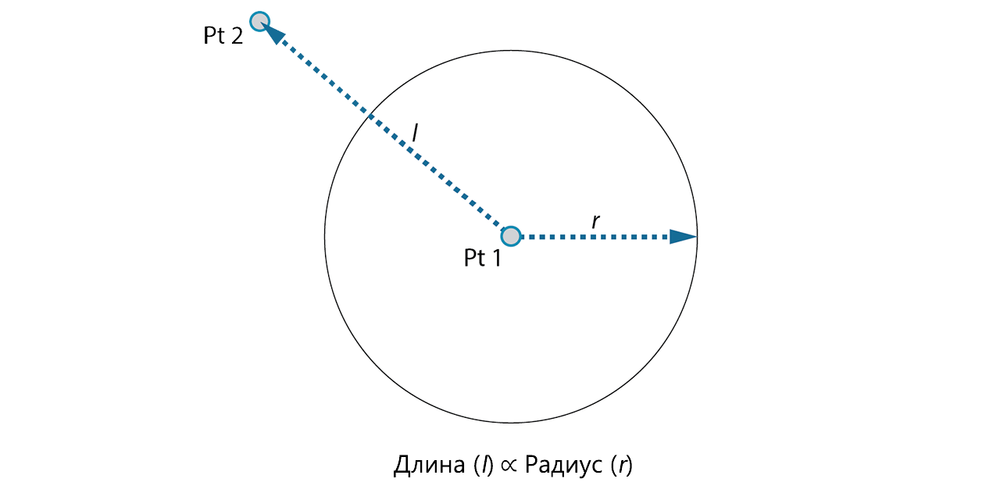
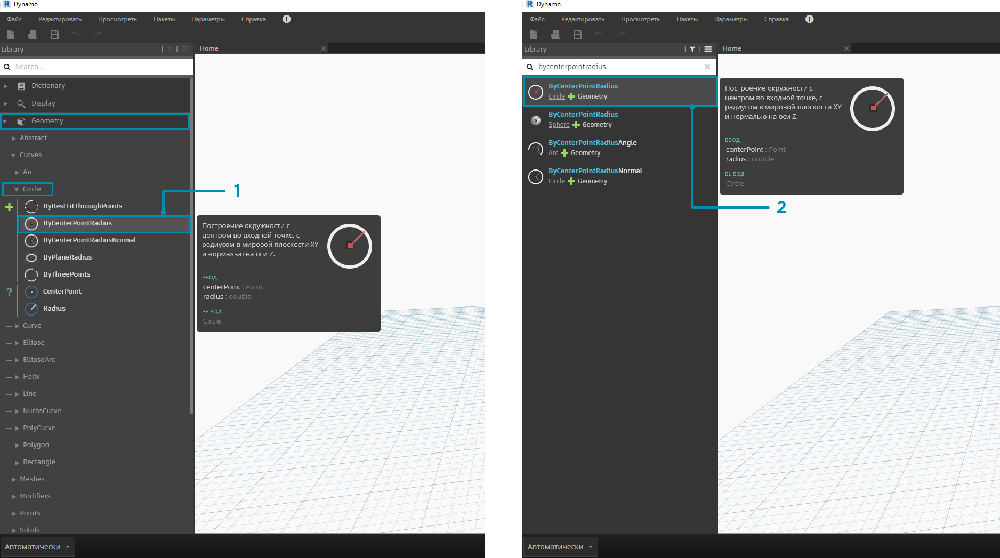
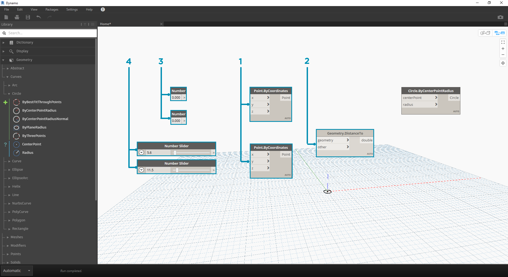

## НАЧАЛО РАБОТЫ

Теперь, когда мы ознакомились с интерфейсом и навигацией по рабочему пространству, рассмотрим типовой рабочий процесс создания графиков в Dynamo. Начнем с создания окружности с динамическими размерами, а затем создадим массив окружностей с различными радиусами.

### Определение целей и связей

Прежде чем добавлять объекты в рабочее пространство Dynamo, необходимо определить, чего мы пытаемся добиться, и какие связи будут играть наиболее важную роль. Как вы помните, при соединении двух узлов между ними создается явная связь, и хотя направление потока данных впоследствии может измениться, сама связь останется зафиксированной. В рамках этого упражнения требуется создать окружность (*цель*), в которой входные значения радиуса определяются расстоянием до ближайшей точки (*связь*).



> Точка, определяющая отношение на основе расстояния, обычно называется точкой притяжения. В данном случае расстояние до точки притяжения будет использоваться для определения размера окружности.

### Добавление узлов в рабочее пространство

Теперь, когда мы наметили цели и связи, можно приступать к созданию графика. Необходимо выбрать узлы, которые будут представлять последовательность действий, выполняемых приложением Dynamo. Поскольку нам нужно создать окружность, то начнем с поиска узла, позволяющего сделать это. В результате использования поля «Поиск» или обзора библиотеки мы обнаруживаем, что существует несколько способов создания окружности.



> 1. Перейдите к разделу Geometry > Curves > Circle > **Circle.ByPointRadius**.
2. Выполните поиск по запросу ByCenterPointRadius.

Выберите узел **Circle.ByPointRadius** в библиотеке, чтобы добавить его в рабочее пространство. Узел должен появиться в центре рабочего пространства.


> 1. Узел Circle.ByPointandRadius в библиотеке.
2. При выборе узла в библиотеке щелчком мыши он добавляется в рабочее пространство.

Кроме того, требуются узлы **Point.ByCoordinates**, **Number Input** и **Number Slider**.



> 1. Geometry > Points > Point > **Point.ByCoordinates**
2. Geometry > Geometry > **DistanceTo**
3. Input > Basic > **Number**
4. Input > Basic > **Number Slider**

### Соединение узлов с помощью проводов

Разместив узлы, необходимо соединить их порты с помощью проводов. Эти соединения будут определять поток данных.


> 1. От узла **Number** к узлу **Point.ByCoordinates**
2. От узла **Number Sliders** к узлу **Point.ByCoordinates**
3. От узла **Point.ByCoordinates** (2) к узлу **DistanceTo**
4. От узлов **Point.ByCoordinates** и **DistanceTo** к узлу **Circle.ByCenterPointRadius**

### Выполнение программы

После того как мы определили последовательность потока данных, нам остается только дать Dynamo команду на выполнение программы. После выполнения программы (автоматически или путем нажатия кнопки «Запуск» в ручном режиме) данные пойдут по проводам, а результаты появятся в области 3D-просмотра.


> 1. Запуск: если на панели выполнения задан ручной режим, нажмите кнопку «Запуск», чтобы запустить выполнение графика.
2. Просмотр узла: при наведении указателя на поле в правом нижнем углу узла появится всплывающее окно результатов.
3. 3D-просмотр: если какой-либо узел создает геометрию, то она будет отображаться в области 3D-просмотра.
4. Выходная геометрия узла создания данных.

### Добавление подробностей

Если программа работает правильно, то в области 3D-просмотра должна появиться окружность, проходящая через точку притяжения. Теперь можно добавить дополнительные подробности или элементы управления. Выполним настройку входных портов для узла окружности, чтобы можно было регулировать влияние входных данных на радиус. Добавьте еще один узел **Number Slider** в рабочую область, а затем дважды щелкните в пустом месте рабочего пространства, чтобы добавить узел **Code Block**. Отредактируйте поле в узле Code Block, указав значения ```X/Y```.


> 1. **Code Block**
2. От узлов **DistanceTo** и **Number Slider** к узлу **Code Block**
3. От узла **Code Block** к узлу **Circle.ByCenterPointRadius**

### Усложнение программы

Чтобы процесс пошаговой разработки программы был эффективен, рекомендуется начинать с простой структуры, которую затем можно постепенно усложнять. Если программа позволяет успешно создавать одну окружность, то ее можно усложнить и использовать для создания сразу нескольких окружностей. Чтобы сделать это, вместо одной центральной точки можно задать сетку точек, данные из которой будут использоваться в итоговой структуре. В результате каждая из полученных окружностей будет иметь уникальное значение радиуса, определяемое калибруемым расстоянием до точки притяжения.


> 1. Добавьте узел **Number Sequence** и замените входные порты узла **Point.ByCoordinates**. Щелкните узел Point.ByCoordinates правой кнопкой мыши и выберите «Переплетение» > «Перекрестная ссылка».
2. Добавьте узел **Flatten** после узла Point.ByCoordinates. Чтобы выровнять список полностью, оставьте для входного порта ```amt``` значение по умолчанию (```-1```).
3. Область 3D-просмотра обновляется, и в ней появляется сетка окружностей.

### Настройка с помощью непосредственных манипуляций

Манипуляции с числами не всегда являются оптимальным подходом. Теперь геометрию точки можно корректировать вручную при навигации по области фонового 3D-просмотра. Можно также управлять другой геометрией, построенной на основе точки. Например, узел **Sphere.ByCenterPointRadius** поддерживает режим непосредственной манипуляции. Можно управлять положением точки, задавая наборы значений X, Y и Z с помощью узла **Point.ByCoordinates**. При использовании метода непосредственных манипуляций можно обновлять значения регуляторов путем перемещения точки вручную в режиме **навигации по области 3D-просмотра**. Это обеспечивает более интуитивный способ управления набором отдельных значений, которые определяют положение точки.


> 1. Для использования метода **Непосредственная манипуляция** выберите панель перемещаемой точки. Над выбранной точкой появятся стрелки.
2. Переключитесь в режим **Навигация по области 3D-просмотра**.


> 1. Наведите указатель на точку. Появятся оси X, Y и Z.
2. Чтобы переместить ось, щелкните и перетащите соответствующую цветную стрелку. При перемещении точки вручную значения в узле **Number Slider** динамически обновляются.


> 1. Обратите внимание, что до перехода в режим **непосредственной манипуляции** с компонентом **Point.ByCoordinates** был соединен только один регулятор. При перемещении точки в направлении по оси X вручную автоматически создается новый узел **Number Slider** для указания входных данных по оси X.

