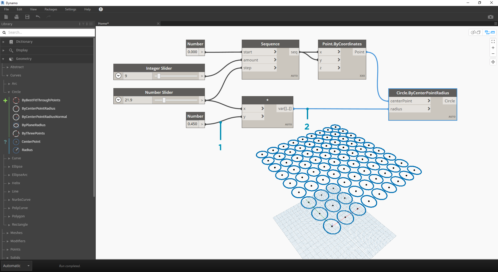

## Провода

Провода соединяют друг с другом узлы, создавая тем самым связи и обеспечивая поток выполнения операций в рамках визуальной программы. Их можно воспринимать как настоящие электрические провода, передающие заряды (данные) от одного объекта к другому.

### Поток выполнения операций в программе

Каждый порт соединяет порт вывода одного узла с портом ввода другого. Такой порядок подключения определяет направление **потока данных** в визуальной программе. Узлы можно расположить в рабочем пространстве как хочется, но учитывая, что порты ввода находятся слева, а порты вывода — справа, можно сказать, что поток выполнения операций в программе направлен слева направо.


### Создание проводов

Для создания провода щелкните сначала порт одного узла, а затем порт другого узла, чтобы установить между ними соединение. В процессе создания соединения провод отображается пунктирной линией, после чего становится сплошным. Данные всегда проходят по проводам в направлении от вывода к вводу, однако провод можно создавать в любом направлении в последовательности щелчков соединенных портов.

> Совет. Прежде чем щелкнуть левой кнопкой мыши, чтобы завершить создание соединения, дождитесь, когда провод сам присоединится к порту узла, и наведите указатель на этот порт, чтобы посмотреть подсказку.


> 1. Щелкните порт вывода ```seq``` узла Sequence.
2. Пока указатель перемещается к другому порту, провод отображается пунктирной линией.
3. Щелкните порт ввода ```y``` узла Point.ByCoordinates, чтобы завершить создание соединения.

### Редактирование проводов

Зачастую при работе над визуальной программой возникает необходимость в корректировке потока выполнения операций путем редактирования проводов, играющих роль соединительных элементов. Чтобы отредактировать провод, щелкните порт ввода подсоединенного узла. Далее выберите один из двух вариантов:


> 1. Существующий провод.
2. Чтобы изменить подключение к порту ввода, щелкните другой порт ввода.
3. Чтобы удалить провод, перетащите его в сторону и щелкните в рабочем пространстве.

* Примечание. Доступна дополнительная возможность, позволяющая одновременно перемещать несколько проводов. Подробные сведения см. здесь: [http://dynamobim.org/dynamo-1-3-release/](http://dynamobim.org/dynamo-1-3-release/).

### Предварительный просмотр проводов

По умолчанию провода отображаются в режиме предварительного просмотра как серые прерывистые линии. При выборе узла все подключенные к нему провода выделяются тем же синим цветом, что и узел.



> 1. Провод по умолчанию
2. Выделенный провод

Dynamo также позволяет настроить отображение проводов в рабочем пространстве с помощью меню «Просмотреть» > «Соединители». В этом меню можно выбрать провода в виде полилиний или кривых либо полностью отключить их отображение.


> 1. Тип соединителя: кривые
2. Тип соединителя: полилинии

