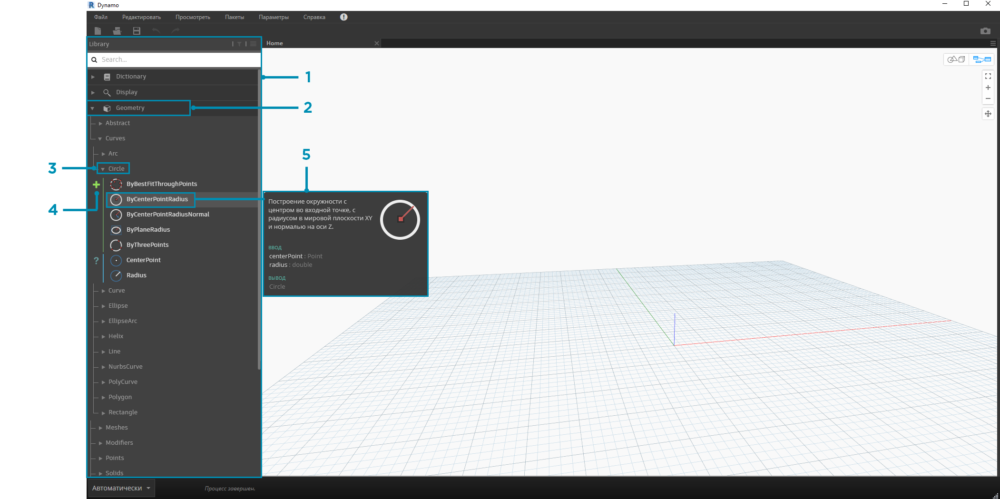
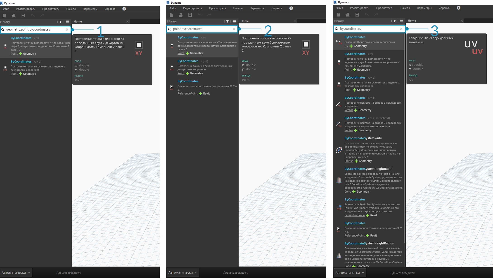
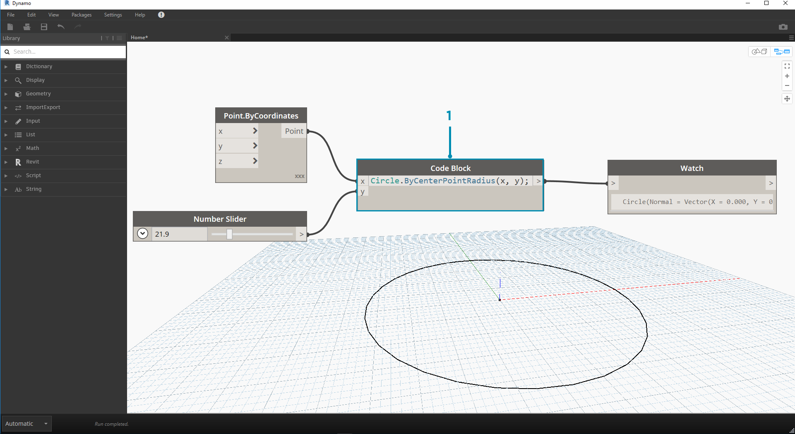

## Библиотека Dynamo

Библиотека **Dynamo** содержит узлы, из которых в рабочем пространстве создаются визуальные программы. Для доступа к узлам в библиотеке можно использовать функции поиска и обзора. Узлы (стандартные узлы из комплекта установки, а также пользовательские узлы и узлы из менеджера пакетов, добавленные в Dynamo) сгруппированы в библиотеке иерархически по категориям. Рассмотрим эту структуру и ознакомимся с основными узлами, которыми мы будем пользоваться чаще всего.

### Библиотека библиотек

**Библиотека** Dynamo, с которой мы работаем в рамках приложения, по сути представляет собой набор из нескольких функциональных библиотек, каждая из которых содержит узлы, сгруппированные по категориям. Подобная гибкая структура, на первый взгляд сложная для восприятия, позволяет эффективно упорядочивать узлы, устанавливаемые по умолчанию с Dynamo, а также пользовательские узлы и дополнительные пакеты, используемые для расширения функциональных возможностей приложения.

#### Структура

Раздел **Библиотека** пользовательского интерфейса Dynamo состоит из набора иерархически упорядоченных отдельных библиотек. В процессе поиска нужных узлов мы последовательного переходим от общего списка к отдельной библиотеке, затем к нужной категории и подкатегории.



> 1. Библиотека: область интерфейса Dynamo (библиотека библиотек)
2. Отдельная библиотека: набор связанных категорий (например, **Geometry**)
3. Категория: набор связанных узлов, например всех компонентов, относящихся к **окружностям**
4. Подкатегория: более подробная классификация узлов в рамках категории, обычно по операциям (**Create**, **Action** и **Query**)
5. Узел: объекты, добавляемые в рабочее пространство для выполнения какого-либо действия

#### Правила именования

Иерархия каждой библиотеки отражена в именах узлов, добавляемых в рабочее пространство, которые также можно использовать в поле поиска и узлах Code Block, которые поддерживают *текстовый язык Dynamo*. Таким образом, при поиске узлов можно использовать не только ключевые слова, но и иерархические последовательности, разделенные точками.

При вводе различных фрагментов расположения узла в библиотечной иерархии в формате ```библиотека.категория.имя_узла``` выводятся различные результаты.



> 1. ```Библиотека.Категория.ИмяУзла```
2. ```Категория.ИмяУзла```
3. ```ИмяУзла``` или ```ключевое слово```

В рабочем пространстве имя узла обычно представлено в формате ```Категория.ИмяУзла``` (есть некоторые исключения, в частности, узлы категорий Input и View). Соблюдайте осторожность при использовании узлов с одинаковыми именами и обращайте особое внимание на различия в категориях, к которым они относятся.


> 1. Узлы из большинства библиотек содержат наименование категории.
2. Имена узлов ```Point.ByCoordinates``` и ```UV.ByCoordinates``` совпадают, но они относятся к разным категориям.
3. К исключениям относятся встроенные функции, Core.Input, Core.View и логические операторы.

### Часто используемые узлы

В комплект установки приложения Dynamo входят сотни стандартных узлов. Какие же из них наиболее важны при разработке визуальных программ? Давайте рассмотрим узлы, которые позволяют определять параметры программы (**Input**), отображать результаты действия, выполненного тем или иным узлом (**Watch**), и задавать входные данные и функции ускоренным методом (**Code Block**).

#### Input

Узлы Input — это ключевой инструмент, благодаря которому пользователи визуальных программ могут работать с основными параметрами. Приведем список узлов, доступных в категории Input основной библиотеки.


> 1. Boolean
2. Number
3. String
4. Number Slider
5. Integer Slider
6. Directory Path
7. File Path

#### Watch

Узлы Watch играют важную роль в управлении потоком данных в визуальной программе. Результаты действия, выполняемого узлом, можно просмотреть в области предварительного просмотра данных узла, однако если требуется, чтобы эти результаты отображались постоянно, следует использовать узел **Watch** или **Watch3D**. Оба этих узла находятся в категории View основной библиотеки.

> Совет. Иногда при работе с большим количеством узлов пользоваться функцией 3D-просмотра может быть неудобно. В этом случае можно снять флажок фонового просмотра в меню параметров и использовать узел Watch3D для предварительного просмотра геометрии.


> 1. Watch: обратите внимание, что при выборе элемента в узле Watch он помечается в узле Watch3D и области 3D-просмотра.
2. Watch3D: с помощью правой нижней ручки можно изменить размер окна, а перемещаться по нему можно с помощью мыши, как при 3D-просмотре.

#### Code Block

Узлы **Code Block** позволяют создавать блоки кода, состоящие из строк, разделенных запятыми. Данные, используемые в этих узлах, могут быть самыми простыми, например координаты ```X/Y```. Кроме этого, узлы Code Block можно использовать в качестве упрощенного метода ввода чисел или вызова функции другого узла. Используемый синтаксис должен следовать правилам именования текстового языка Dynamo DesignScript (см. раздел 7.2). Давайте попробуем создать окружность с помощью этого упрощенного метода.



> 1. Дважды щелкните для создания узла **Code Block**.
2. Введите ```Circle.ByCenterPointRadius(x,y);```.
3. Если щелкнуть в рабочем пространстве, чтобы отменить выбор, автоматически добавляются входные порты ```x``` и ```y```.
4. Создайте узлы **Point.ByCoordinates** и **Number Slider**, затем соедините их с входными портами узла Code Block.
5. В области 3D-просмотра отобразится окружность, являющаяся результатом выполнения визуальной программы.

