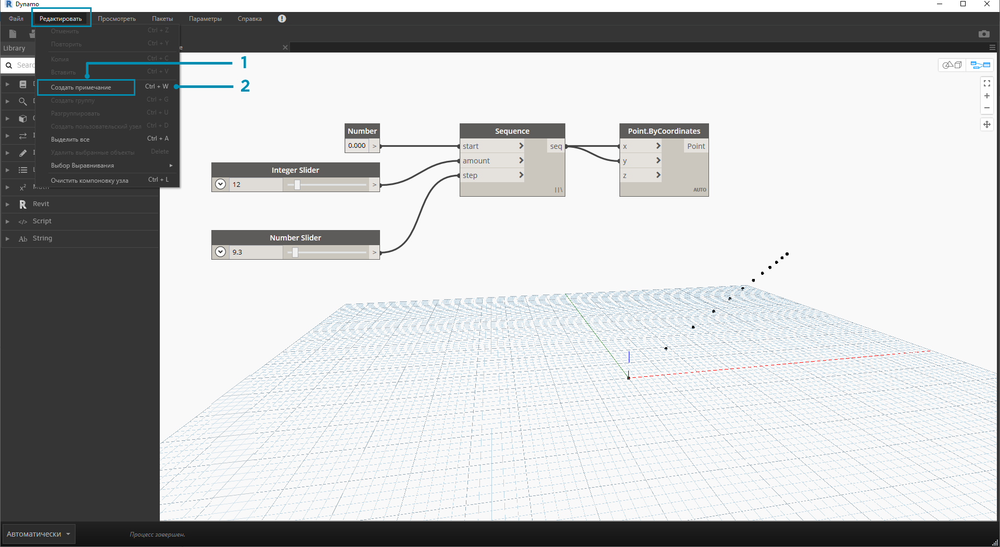

## Управление структурой программы

Процесс визуального программирования может быть очень увлекательным и вдохновляющим, однако работа с потоком выполнения операций и ключевыми входными данными пользователя может очень быстро зайти в тупик из-за запутанности программы или неудачной компоновки рабочего пространства. Далее представлены некоторые практические советы по управлению структурой программы.

### Выравнивание

Когда рабочее пространство постепенно начнет заполняться узлами, может потребоваться переупорядочить их для большей наглядности. Выберите несколько узлов и щелкните в рабочем пространстве правой кнопкой мыши. Появится всплывающее окно с меню **Выбор выравнивания**, содержащим параметры выравнивания и распределения по осям X и Y.

> 1. Выберите несколько узлов.
2. Щелкните в рабочем пространстве правой кнопкой мыши.
3. Воспользуйтесь параметрами меню **Выбор выравнивания**.

### Примечания

По мере накопления опыта вы научитесь «считывать» содержимое визуальной программы, просматривая имена узлов и следуя последовательности выполнения операций. Чтобы дополнительно упростить работу как опытным пользователям, так и новичкам, мы рекомендуем добавлять простые текстовые метки и описания. Для этого в Dynamo можно использовать узел **Notes** с редактируемым текстовым полем. Добавить примечания в рабочее пространство можно двумя способами.

> 1. Перейдите в меню «Редактировать» > «Создать примечание».
2. Используйте клавиши быстрого вызова CTRL + W.

После добавления примечания в рабочее пространство появится текстовое поле, позволяющее отредактировать текст примечания. Созданные примечания можно изменить, щелкнув узел примечаний правой кнопкой мыши или щелкнув его дважды.

### Группирование

Когда число компонентов визуальной программы становится по-настоящему большим, для упрощения работы с ними рекомендуется выделить крупные этапы процесса выполнения. Большие наборы узлов можно объединять в **группы**, в результате чего они помечаются цветным фоновым прямоугольником и заголовком. Создать группу на основе нескольких выбранных узлов можно тремя способами.

> 1. Перейдите в меню «Редактировать» > «Создать группу».
2. Используйте клавиши быстрого вызова CTRL + G.
3. Щелкните в рабочем пространстве правой кнопкой мыши и выберите «Создать группу».

После создания группы можно отредактировать ее параметры, например название и цвет фона. 

> Совет. Использование примечаний и групп является эффективным способом аннотирования файла и повышения его читабельности.

Далее приводится программа из раздела 2.4, к которой были добавлены примечания и группы.

> 1. Примечание: «Параметры сетки»
2. Примечание: «Точки сетки»
3. Группа: «Создать сетку из точек»
4. Группа: «Создать точку аттрактора»
5. Примечание: «Откалибровать значения расстояния»
6. Примечание: «Переменная сетка окружностей»

