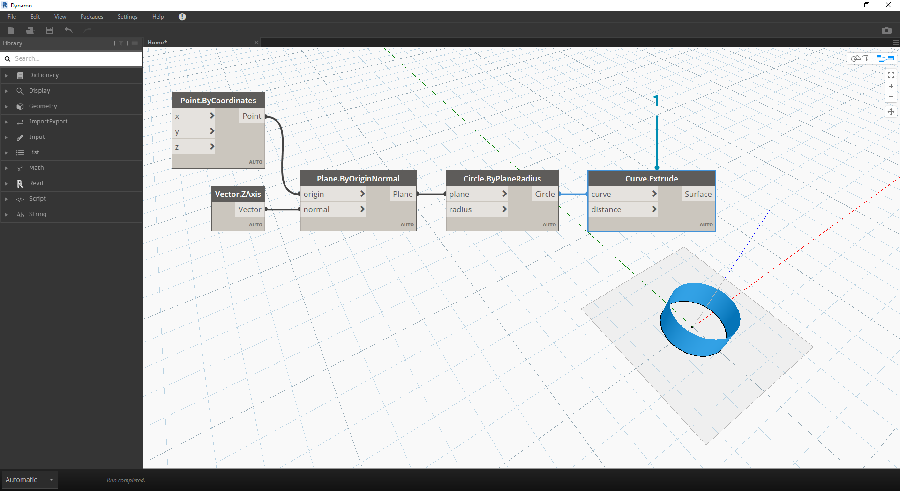
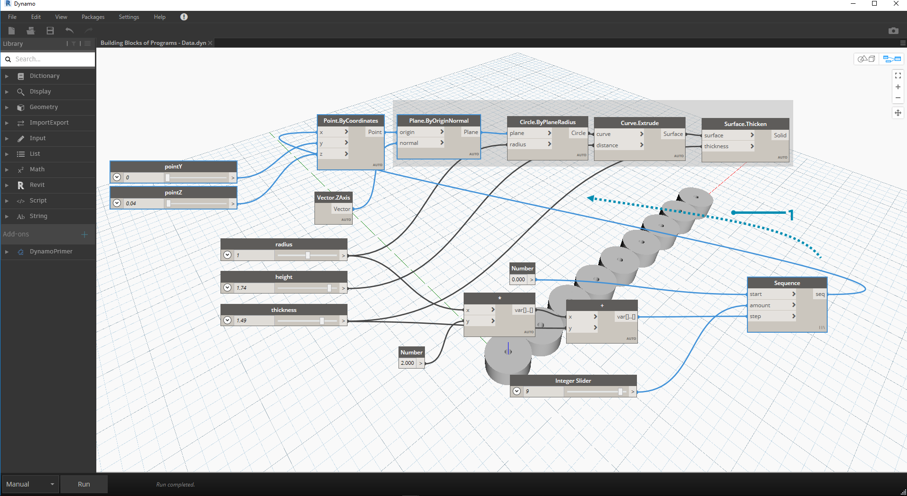

## Данные

Данные — это содержимое программы. Они передаются по проводам, предоставляя входные значения узлам, в которых затем обрабатываются и преобразуются в выходные данные новой формы. Давайте рассмотрим определение данных и их структуру, а затем начнем работу с данными в Dynamo.

### Что такое данные?

Данные — это набор значений количественных и качественных переменных. Самая простая форма данных — числа, например ```0```, ```3.14``` или ```17```. Однако существуют и другие типы данных: переменные, представляющие меняющиеся числа (```высота```); символы (```myName```); геометрические объекты (```окружность```); список элементов данных (```1,2,3,5,8,13,..```). Данные необходимы для добавления в порты входных параметров в узлах Dynamo. Хотя данные могут существовать без действий, они необходимы для обработки действий, которые представлены в форме узлов. Если узел добавлен в рабочее пространство, но не имеет входных данных, результатом будет функция, а не результат самого действия.


> 1. Простые данные
2. Данные и действие (узел), которое успешно выполняется.
3. Действие (узел) без входных данных возвращает типовую функцию.

### Будьте осторожны с нулевыми объектами

Тип ```null``` означает отсутствие данных. Это абстрактное понятие, с которым можно, тем не менее, столкнуться при визуальном программировании. Если результат действия недопустим, узел возвращает нулевой объект. Проверка наличия нулевых объектов и их удаление из структуры данных крайне важны для создания надежных программ.

|Значок|Имя/синтаксис|Входные данные|Выходные данные|
| -- | -- | -- | -- |
||Object.IsNull|obj|bool|

### Структуры данных

При визуальном программировании можно очень быстро генерировать большие объемы данных, поэтому необходимы средства для управления их иерархией. Эту роль выполняют структуры данных — организационные схемы, в которых хранятся данные. Особенности структур данных и их использования зависят от языка программирования. В Dynamo для построения иерархии данных используются списки. Они будут подробнее рассмотрены в следующих главах, пока же приведем только общие сведения.

Список — это набор элементов, размещенных в одной структуре данных:

* У меня пять пальцев (*элементы*) на руке (*список*).
* На моей улице (*список*) десять домов (*элементы*).


> 1. Узел **Number Sequence** определяет список чисел на основе входных данных *start*, *amount* и *step*. С помощью этих узлов было создано два отдельных списка из десяти чисел, один из которых охватывает диапазон *100–109*, а другой — *0–9*.
2. Узел **List.GetItemAtIndex** позволяет выбрать элемент в списке по определенному индексу. При выборе значения *0* будет получен первый элемент в списке (в данном случае — *100*).
3. Та же процедура применительно ко второму списку дает значение *0* — первый элемент в списке.
4. Объединим оба списка в один с помощью узла **List.Create**. Обратите внимание, что узел создает *список списков.* Это меняет структуру данных.
5. При повторном использовании узла **List.GetItemAtIndex** с индексом *0* получаем первый список в списке списков. Это означает, что список рассматривается как элемент, в чем и состоит отличие от других языков программирования. В последующих главах операции со списками и структуры данных будут рассмотрены подробнее.

Главное, что следует помнить об иерархии данных в Dynamo — **в случае со структурой данных списки рассматриваются как элементы.** Другими словами, в Dynamo структура данных рассматривается сверху вниз. Что это означает? Рассмотрим пример.

### Использование данных для создания цепочки цилиндров

> Скачайте файл примера для этого упражнения (щелкните правой кнопкой мыши и выберите «Сохранить ссылку как...»): [Building Blocks of Programs - Data.dyn](datasets/4-1/Building Blocks of Programs - Data.dyn). Полный список файлов примеров можно найти в приложении.

В первом примере создадим цилиндр с оболочкой, пройдя по ступеням геометрической иерархии, описанной в этом разделе. 

> 1. **Point.ByCoordinates.** После того как в рабочую область добавлен узел, в начале координат сетки предварительного просмотра Dynamo появляется точка. Значения по умолчанию для выходных параметров *x,y* и *z* равны *0,0*. В этом месте и была создана точка.


> 1. **Plane.ByOriginNormal.** Следующий шаг в построении геометрической иерархии — плоскость. Существует несколько способов построения плоскости. В этом случае в качестве входных данных используется начало координат и нормаль. Начало координат — это узел-точка, созданный в предыдущем шаге.
2. **Vector.ZAxis.** Построение унифицированного вектора в направлении Z. Обратите внимание, что здесь входные данные отсутствуют, а есть только вектор со значением [0,0,1]. Он будет использоваться в качестве входных данных *нормали* для узла *Plane.ByOriginNormal*. В результате получается прямоугольная плоскость в области предварительного просмотра Dynamo.


> 1. **Circle.ByPlaneRadius.** Продвигаясь вверх по иерархии, создадим кривую из плоскости, полученной в предыдущем шаге. После соединения с узлом получаем окружность в начале координат. По умолчанию радиус в узле имеет значение *1*.



> 1. **Curve.Extrude.** Теперь выполним выдавливание фигуры, задав глубину и двигаясь в третьем измерении. Этот узел создает поверхность из кривой путем выдавливания. По умолчанию расстояние в узле равно *1*, а на видовом экране должен отображаться цилиндр.


> 1. **Surface.Thicken.** Этот узел создает замкнутое тело путем смещения поверхности на заданное расстояние и замыкания формы. По умолчанию значение толщины равно *1*, а на видовом экране в соответствии с этими значениями отображается цилиндр с оболочкой.


> 1. **Number Slider.** Вместо использования в качестве значений по умолчанию для входных данных добавим в модель параметрические элементы управления.
2. **Редактирование области.** После добавления регулятора чисел в рабочую область щелкните значок в левом верхнем углу окна, чтобы отобразить параметры области.
3. **Min/Max/Step.** Задайте для *min*, *max* и *step* значения *0*,*2* и *0.01* соответственно. Это необходимо для управления размером всего геометрического объекта.


> 1. **Регуляторы чисел.** Вместо входных значений по умолчанию скопируйте и вставьте этот регулятор чисел (выберите его, нажмите CTRL + C, затем CTRL + V), пока во всех входных параметрах со значениями по умолчанию не будут заданы регуляторы. Чтобы алгоритм действовал, некоторые значения регуляторов должны быть больше нуля (например, для увеличения толщины поверхности требуется глубина выдавливания).

В итоге с помощью регуляторов создан параметрический цилиндр с оболочкой. Попробуйте изменить некоторые из параметров, наблюдая за динамическим обновлением геометрических объектов на видовом экране Dynamo.


> 1. **Регуляторы чисел.** На следующем этапе мы добавили в рабочую область множество регуляторов, и теперь необходимо очистить интерфейс только что созданного инструмента. Щелкните один регулятор правой кнопкой мыши и выберите «Переименовать...». Замените имя каждого регулятора именем соответствующего параметра. В качестве источника имен используйте изображение, представленное выше.

На данный момент создан цилиндр с толстыми стенками. Пока это только один объект. Теперь рассмотрим, как создать массив цилиндров, которые динамически связаны друг с другом. Для этого вместо одного объекта создадим список цилиндров.


> 1. **Добавление (+).** Наша цель — добавить ряд цилиндров возле уже имеющегося цилиндра. При вставке еще одного цилиндра рядом с текущим необходимо учитывать радиус цилиндра и толщину его оболочки. Это число можно получить, сложив два значения регуляторов.


> Это более сложный шаг, поэтому рассмотрим его подробнее. Конечная цель — создать список чисел, определяющих местоположение каждого цилиндра в последовательности.

> 1. **Умножение.** Сначала умножим значение из предыдущего шага на 2. Это было значение радиуса, а цилиндр необходимо переместить на полный диаметр.
2. **Number Sequence.** С помощью этого узла создадим массив чисел. Сначала вставим узел *умножения* из предыдущего шага в качестве значения *step*. В качестве значения *start* можно указать *0.0*, используя узел *number*.
3. **Integer Slider.** Чтобы задать значение *amount*, присоединим регулятор целых чисел. Он будет определять количество создаваемых цилиндров.
4. **Выходные данные.** В этом списке показано расстояние смещения каждого цилиндра в массиве, которое управляется параметрически с помощью первоначальных регуляторов.



> 1. Этот шаг достаточно прост: соедините последовательность из предыдущего шага с входным параметром *x* исходного узла *Point.ByCoordinates*. При этом регулятор *pointX* будет заменен и его можно удалить. Теперь на видовом экране отображается массив цилиндров (убедитесь, что регулятор целых чисел имеет значение больше 0).


> Цепь цилиндров по-прежнему динамически связана со всеми регуляторами. Перемещайте регуляторы и вы увидите, как изменится картина.

