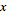

## Математика

Числа являются самой простой формой данных, а самым простым способом связать эти числа между собой является математика. Начиная от элементарных операторов, таких как деление, и заканчивая тригонометрическими функциями и более сложными формулами, математика — отличный способ начать знакомство с отношениями и закономерностями в мире чисел.

### Арифметические операторы

Оператор — это набор компонентов, в которых используются алгебраические функции с двумя входными числовыми значениями, результатом которых является одно выходное значение (сложение, вычитание, умножение, деление и т. д.). Они находятся в разделе «Операторы» > «Действия».

|Значок|Имя|Синтаксис|Входные данные|Выходные данные|
| -- | -- | -- | -- | -- |
||Сложение|+|var[]...[], var[]...[]|var[]...[]|
||Вычитание|-|var[]...[], var[]...[]|var[]...[]|
||Умножение|*|var[]...[], var[]...[]|var[]...[]|
||Деление|/|var[]...[], var[]...[]|var[]...[]|

### Параметрическая формула

> Скачайте файл примера для этого упражнения (щелкните правой кнопкой мыши и выберите «Сохранить ссылку как...»): [Building Blocks of Programs - Math.dyn](datasets/4-2/Building Blocks of Programs - Math.dyn). Полный список файлов примеров можно найти в приложении.

Следующий логический шаг при работе с операторами — их комбинирование с переменными для формирования более сложных отношений с помощью **формул**. Создадим формулу, которой могут управлять входные параметры, такие как регуляторы.

> 1. **Number Sequence.** Определим последовательность чисел на основе трех входных значений: *start, amount* и *step*. Эта последовательность представляет «t» в параметрическом уравнении, поэтому необходим достаточно большой список для определения спирали.

В предыдущем шаге был создан список чисел для определения области параметрических компонентов. Золотая спираль определяется по формуле = и =. Данное уравнение представлено ниже в виде группы узлов в среде визуального программирования.

> Рассматривая группу узлов, обратите внимание на соответствие между визуальной программой и уравнением в записи.

> 1. **Number Slider.** Добавьте два регулятора чисел в рабочую область. Эти регуляторы будут задавать переменные *a* и *b* параметрического уравнения. Они представляют собой гибкую константу или параметры, которые можно настроить для получения желаемого результата.
2. ** *.** Узел умножения обозначен звездочкой. Он будет часто использоваться для соединения умножаемых переменных
3. **Math.RadiansToDegrees.** Значения «*t*» необходимо преобразовать в градусы для их оценки в тригонометрических функциях. Помните, что для оценки этих функций в Dynamo по умолчанию используются градусы.
4. **Math.Pow.** В качестве функции «*t*» и числа «*e*» этот узел создает последовательность Фибоначчи.
5. **Math.Cos и Math.Sin.** С помощью этих двух тригонометрических функций будут различаться координаты X и Y (соответственно) для каждой параметрической точки.
6. **Watch. **В качестве выходных данных отображается два списка, которые будут выступать в качестве координат *x* и *y* точек, используемых для формирования спирали.

### От формулы к геометрии

Хотя набор узлов из предыдущего этапа будет выполнять поставленные задачи, этот процесс довольно трудоемкий. Для повышения эффективности работы в разделе **Блоки кода** (3.3.2.3) ознакомьтесь со сведениями о том, как в одном узле разместить строку выражений Dynamo. На последующих этапах рассмотрим использование параметрического уравнения для построения спирали Фибоначчи. 

> 1. **Point.ByCoordinates.** Соедините верхний узел умножения с входным параметром *x*, а нижний с входным параметром *y*. На экране отобразится параметрическая спираль, проходящая через точки.

> 1. **Polycurve.ByPoints.** Соедините узел Point.ByCoordinates из предыдущего шага с входным параметром *points*. Параметр *connectLastToFirst* можно оставить без входных данных, поскольку мы не будем создавать замкнутую кривую. Таким образом, получаем спираль, которая проходит через каждую точку, заданную в предыдущем шаге.

Спираль Фибоначчи создана. Продолжим работу и выполним еще два упражнения, которые назовем «Наутилус» и «Подсолнух». Продемонстрируем два варианта использования спирали Фибоначчи на примере этих представителей естественных систем.

### От спирали к наутилусу

> 1. Начнем с того же шага, что и в предыдущем упражнении: создадим массив точек спирали с помощью узла **Point.ByCoordinates**.

> 1. **Polycurve.ByPoints.** Этот узел из предыдущего упражнения будет использоваться в качестве базового.
2. **Circle.ByCenterPointRadius.** Узел построения окружности будет иметь те же входные данные, что и в предыдущем шаге. Значение радиуса по умолчанию равно *1.0*, поэтому окружности создаются сразу. Четко видно, каким образом точки отклоняются от начала координат.

> 1. **Circle.ByCenterPointRadius.** Чтобы создать более динамический массив окружностей, соединим исходную последовательность чисел (последовательность «*t*») со значением радиуса.
2. **Number Sequence.** Это исходный массив элементов «*t*». Если соединить его со значением радиуса, центры окружностей будут по-прежнему отклоняться дальше от начального положения, но радиус окружностей будет увеличиваться, создавая необычный график спирали Фибоначчи. 3D-изображение этого объекта будет выглядеть замечательно.

### От наутилуса к подсолнуху

После создания раковины наутилуса перейдем к параметрическим сеткам. Используя основной угол вращения спирали Фибоначчи, создадим сетку Фибоначчи, а на ее основе — модель [расположения семян цветка подсолнуха](http://ms.unimelb.edu.au/~segerman/papers/sunflower_spiral_fibonacci_metric.pdf).

> 1. Начнем с того же шага, что и в предыдущем упражнении: создадим массив точек спирали с помощью узла **Point.ByCoordinates**.

> 1. **Geometry.Rotate.** Существует несколько вариантов узла Geometry.Rotate. Убедитесь, что выбран узел с входными параметрами *geometry*, *basePlane* и *degrees*. Соедините узел **Point.ByCoordinates** с входным параметром geometry.
2. **Plane.XY.** Соедините узел с входным параметром *basePlane*. Вращение будет выполняться вокруг начала координат, которое совпадает с основанием спирали.
3. **Number Range.** Для входного параметра значений градусов необходимо создать несколько вращений. Это можно сделать быстро с помощью компонента Number Range. Соедините его с входным параметром *degrees*.
4. **Number.** Чтобы задать диапазон чисел, добавьте три узла Number в рабочую область вертикально. В нисходящей последовательности назначьте значения *0.0,360.0* и *120.0* соответственно. Они будут определять вращение спирали. Обратите внимание на результаты выходного параметра из узла **Number Range** после соединения с ним трех узлов Number.

Полученное изображение начинает напоминать водоворот. Скорректируем некоторые параметры **Number Range** и посмотрим, как изменятся результаты. 

> 1. Измените размер шага в узле **Number Range**, задав вместо значения *120.0* значение *36.0*. Обратите внимание, что при этом генерируется больше вращений, и, следовательно, создается более плотная сетка.

> 1. Измените размер шага в узле **Number Range**, задав вместо значения *36.0* значение *3.6*. Получится более плотная сетка, а у спирали будет отсутствовать направление. Итак, мы создали подсолнух.

