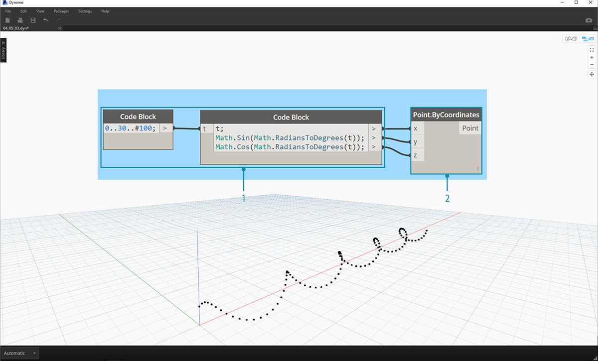
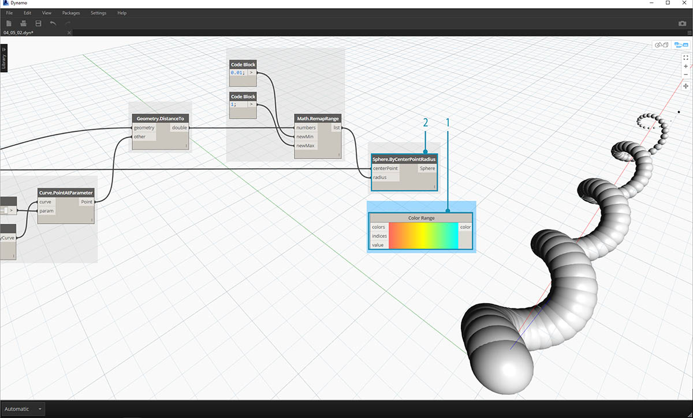
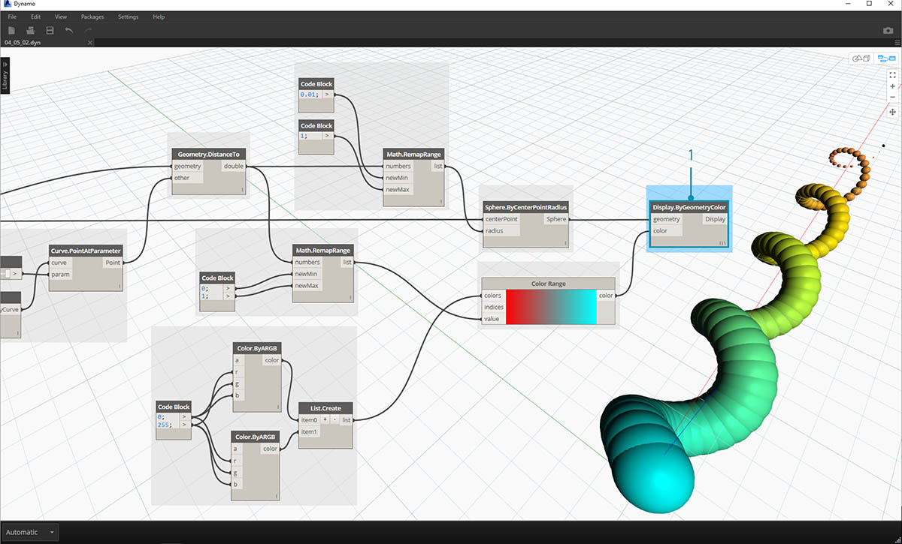
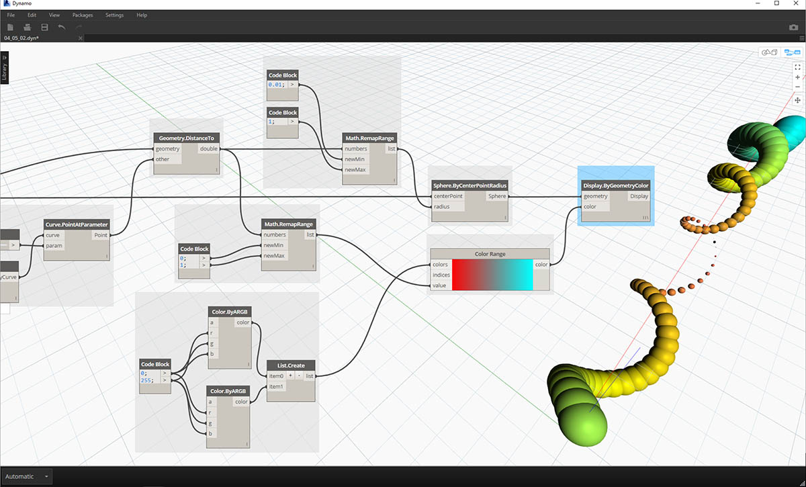
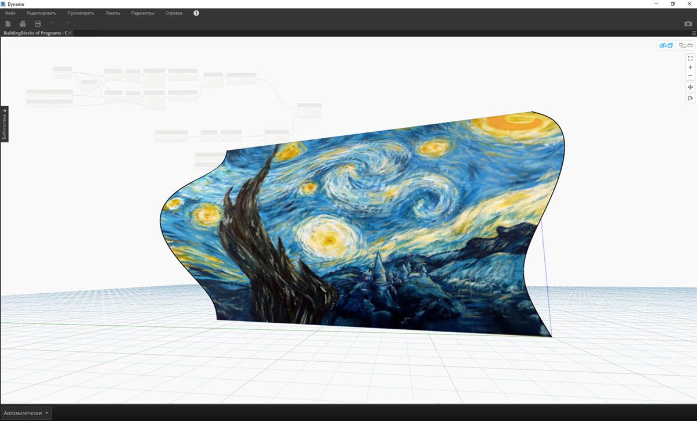

## Цвет

Цвет — это тип данных, который помогает создавать наглядные визуальные представления, а также отражать различия в результатах визуального программирования. При работе с абстрактными данными и численными переменными бывает трудно определить, что именно изменилось и в какой степени. Для решения этой проблемы можно использовать цвета.

### Создание цветов

Цвета в Dynamo создаются с использованием входных данных ARGB, что является сокращенным обозначением комбинации альфа-канала (Alpha) с красным (Red), зеленым (Green) и синим (Blue) каналами. Альфа-канал служит для задания *прозрачности* цвета, а остальные три канала используются как основные цвета для создания всего цветового спектра.

|Значок|Имя|Синтаксис|Входные данные|Выходные данные|
| -- | -- | -- | -- | -- |
||Цвет ARGB|Color.ByARGB|A,R,G,B|color|

### Запрос значений цвета

Цвета в таблице ниже запрашивают свойства, использованные для настройки итогового цвета: альфа, красный цвет, зеленый цвет и синий цвет. Обратите внимание, что узел Color.Components включает все четыре свойства в качестве портов вывода, поэтому его удобнее всего использовать для запроса свойств цвета.

|Значок|Имя|Синтаксис|Входные данные|Выходные данные|
| -- | -- | -- | -- | -- |
||Альфа|Color.Alpha|color|A|
||Красный цвет|Color.Red|color|R|
||Зеленый цвет|Color.Green|color|G|
||Синий цвет|Color.Blue|color|B|
||Компоненты|Color.Components|color|A,R,G,B|

Цвета в таблице ниже соответствуют **цветовому пространству HSB**. Разделение цвета на такие составляющие, как оттенок, насыщенность и яркость, является более понятным и привычным с точки зрения интерпретации цвета. Какого оттенка должен быть цвет? Насколько ярким он должен быть? Насколько светлым или темным? Отвечая на эти вопросы, мы тем самым разбиваем цвет на составляющие, то есть на оттенок, насыщенность и яркость соответственно.

|Значок|Имя запроса|Синтаксис|Входные данные|Выходные данные|
| -- | -- | -- | -- | -- |
||Hue|Color.Hue|color|Hue|
||Насыщенность|Color.Saturation|color|Saturation|
||Brightness|Color.Brightness|color|Brightness|

### Цветовой диапазон

Цветовой диапазон аналогичен узлу **Remap Range** из раздела 4.2: и тот и другой сопоставляет список числовых значений со значениями из другой области. Однако вместо сопоставления с областью *чисел* цветовой диапазон выполняет сопоставление с *цветовым градиентом* в соответствии со входными значениями в диапазоне от 0 до 1.

Текущий узел хорошо выполняет свои функции, но с ним может быть трудно добиться нужных результатов с первого раза. Чтобы уверенно работать с цветовым градиентом, стоит несколько раз опробовать его на практике в интерактивном режиме. Выполните небольшое упражнение, чтобы узнать, как настроить градиент, так чтобы цвета на выходе соответствовали заданным числам.

> 1. **Определите три цвета.** С помощью узла Code Block определите *красный, зеленый* и *синий* цвета, назначив каждому из них соответствующие сочетания значений *0* и *255*.
2. **Создайте список.** Объедините три цвета в один список.
3. **Определите индексы.** Создайте список для определения положения ручек каждого цвета (в диапазоне от 0 до 1). Обратите внимание, что для зеленого цвета задано значение 0,75. Это смещает зеленый цвет на 3/4 вдоль горизонтального градиента в регуляторе цветового диапазона.
4. **Code Block.** Введите значения (от 0 до 1), которые будут преобразованы в цвета.

### Образец цвета

Узел **Display.ByGeometry** позволяет раскрашивать геометрию на видовом экране Dynamo. Это позволяет наглядно показывать различные типы геометрии, демонстрировать параметрические концепции и задавать условные обозначения для расчета при моделировании. В качестве входных данных здесь требуются только геометрия и цвет. Для создания градиента, как на изображении выше, порт ввода color соединяется с узлом **Color Range**.

### Упражнение по работе с цветом

> Скачайте файл примера для этого упражнения (щелкните правой кнопкой мыши и выберите «Сохранить ссылку как...»): [Building Blocks of Programs - Color.dyn](datasets/4-5/Building Blocks of Programs - Color.dyn). Полный список файлов примеров можно найти в приложении.

В этом упражнении основное внимание уделяется параметрическому управлению цветом параллельно с геометрией. Геометрия — стандартная спираль, определение которой выполнено ниже с помощью узла **Code Block** (3.2.3). Это простой и быстрый способ создания параметрической функции. Так как в данном уроке рассматривается работа с цветом (а не с геометрией), то Code Block идеально подходит для быстрого создания спирали без загромождения рабочей области. Мы будем использовать Code Block все чаще и чаще по мере изучения более сложных процессов.

> 1. **Code Block:** создайте два узла Code Block, используя приведенные выше формулы. Это быстрый параметрический метод создания спирали.
2. **Point.ByCoordinates:** соедините порты координат этого узла с тремя портами вывода узла Code Block.

Отображается массив точек, которые образуют спираль. Далее необходимо создать кривую, проходящую через точки, чтобы получить изображение спирали.

> 1. **PolyCurve.ByPoints:** соедините порт вывода *Point.ByCoordinates* с портом ввода *points* этого узла. Отображается спиральная кривая.
2. **Curve.PointAtParameter:** соедините порт вывода *PolyCurve.ByPoints* с портом ввода *curve*. Это требуется, чтобы создать параметрическую точку притяжения, которая перемещается вдоль кривой. Так как кривая вычисляет положение точки с помощью параметра, необходимо задать значение *param* в диапазоне от 0 до 1.
3. **Number Slider:** добавьте этот узел в рабочую область и измените значение *min* на *0,0*, значение *max* на *1*, а значение *step* на *0,01*. Соедините порт вывода регулятора с портом ввода *param* узла *Curve.PointAtParameter*. Появляется точка, которая перемещается вдоль спирали в соответствии с положением регулятора (0 — в начальной точке, 1 — в конечной).

Создав опорную точку, мы можем сравнить расстояние от нее до исходных точек, определяющих геометрию спирали. Данное расстояние будет определять геометрию и цвет.

> 1. **Geometry.DistanceTo:** соедините порт вывода узла *Curve.PointAtParameter* с портом *ввода* этого узла. Соедините узел *Point.ByCoordinates* с портом ввода geometry.
2. **Watch:** в результате мы получаем список значений расстояния от каждой точки спирали до опорной точки, перемещающейся вдоль кривой.

Следующий шаг — определение параметров на основе списка расстояний между точками спирали и опорной точкой. Эти значения расстояний будут использованы для определения радиусов сфер, размещаемых вдоль кривой. Чтобы обеспечить подходящий размер сфер, необходимо *повторно сопоставить* значения расстояния.

> 1. **Math.RemapRange:** соедините порт вывода узла *Geometry.DistanceTo* с портом ввода numbers.
2. **Code Block**: соедините узел Code Block со значением *0,01* с портом ввода *newMin*, а узел Code Block со значением *1* с портом ввода *newMax*.
3. **Watch:** соедините порт вывода *Math.RemapRange* с одним узлом Watch, а порт вывода *Geometry.DistanceTo* — с другим. Сравните результаты.

Выполнив этого шаг, мы получили повторно сопоставленный список расстояний меньшего диапазона. При необходимости можно задать другие значения *newMin* и *newMax*. Новые значения будут повторно сопоставлены и будут иметь одинаковый *коэффициент распределения* в пределах области.

> 1. **Sphere.ByCenterPointRadius:** соедините порт вывода узла *Math.RemapRange* с портом ввода *radius*, а порт вывода исходного узла *Point.ByCoordinates* — с портом ввода *centerPoint*.

> 1. **Number Slider:** измените значение числового регулятора и посмотрите, как при этом изменится размер сфер. Теперь у нас есть параметрический шаблон.

Размер сфер является представлением параметрического массива, определяемого опорной точкой, перемещающейся вдоль кривой. Применим эту же концепцию к радиусу сфер, чтобы определить их цвет.

> 1. **Color Range:** добавьте в рабочую область этот узел. При наведении указателя мыши на порт ввода *value* обратите внимание, что запрашиваемые числа находятся в диапазоне от 0 до 1. Необходимо повторно сопоставить числа, указанные для порта вывода узла *Geometry.DistanceTo*, чтобы они были совместимы с этой областью.
2. **Sphere.ByCenterPointRadius:** временно отключите предварительный просмотр узла (*щелкните правой кнопкой мыши, а затем выберите «Предварительный просмотр»*).

> 1. **Math.RemapRange:** эта процедура должна быть вам уже знакома. Соедините порт вывода узла *Geometry.DistanceTo* с портом ввода numbers.
2. **Code Block:** аналогично шагу выше задайте значение *0* для порта ввода *newMin* и значение *1* для порта ввода *newMax*. Обратите внимание, что в данном случае мы задаем два порта вывода для одного узла Code Block.
3. **Color Range:** соедините порт вывода узла *Math.RemapRange* с портом ввода *value*.

> 1. **Color.ByARGB**: этот блок позволит нам создать два цвета. Хотя процесс может показаться не самым очевидным, по сути, это то же самое, что и работа с цветами RGB в другом программном обеспечении, просто здесь мы используем возможности визуального программирования.
2. **Code Block:** создайте два значения: *0* и *255*. Соедините два порта вывода с двумя портами ввода *Color.ByARGB* в соответствии с изображением выше (или создайте другие цвета на ваш выбор).
3. **Color Range:** порт ввода *colors* запрашивает список цветов. Необходимо создать этот список из двух цветов, заданных на предыдущем шаге.
4. **List.Create:**: объедините два цвета в один список. Соедините порт вывода этого узла с портом ввода *colors* узла *Color Range*.

> 1. **Display.ByGeometryColor:** соедините узел *Sphere.ByCenterPointRadius* с портом ввода *geometry*, а узел *Color Range* — с портом ввода *color*. К области кривой применяется мягкий цветовой градиент.

> Если изменить в определении значение узла *Number Slider*, который мы изучили ранее, то цвета и размеры геометрии будут обновлены. Цвета и размер радиуса в данном случае связаны напрямую, и теперь между этими двумя параметрами существует и визуальная связь.

### Цвет на поверхностях

Узел **Display.BySurfaceColors** позволяет использовать цвет для сопоставления данных на поверхности. Это дает нам широкие возможности для визуализации данных, полученных с помощью таких типов дискретного анализа, как расчеты инсоляции и энергопотребления, а также анализ близости. Применение цвета к поверхности в Dynamo аналогично применению текстуры к материалу в других средах САПР. Выполните небольшое упражнение ниже, чтобы ознакомиться с этим инструментом.

### Упражнение по работе с цветом на поверхностях

> Скачайте файл примера для этого упражнения (щелкните правой кнопкой мыши и выберите «Сохранить ссылку как...»): [Building Blocks of Programs - ColorOnSurface.zip](datasets/4-5/BuildingBlocks of Programs - ColorOnSurface.zip). Полный список файлов примеров можно найти в приложении.

> Сначала необходимо создать поверхность (или выбрать существующую поверхность в качестве опорной) для использования в качестве входных данных узла **Display.BySurfaceColors**. В этом примере поверхность образуется путем лофтинга между синусоидой и косинусоидой.

> 1. Эта **группа** узлов выполняет создание точек вдоль оси Z с последующим смещением в соответствии с функциями синуса и косинуса. Два полученных списка точек затем используются для создания NURBS-кривых.
2. **Surface.ByLoft**: сформируйте интерполированную поверхность между NURBS-кривыми из списка.

> 1. **File Path**: выберите файл изображения, который будет использоваться в качестве образца для пиксельных данных на последующих этапах.
2. Используйте узел **File.FromPath**, чтобы преобразовать путь к файлу в файл, а затем передайте этот файл в узел **Image.ReadFromFile**, чтобы вывести изображение для использования в качестве образца.
3. **Image.Pixels**: используйте изображение в качестве входных данных и введите значение количества образцов, получаемых вдоль осей X и Y изображения.
4. **Регуляторы**: задайте значения количества образцов для узла **Image.Pixels**.
5. **Display.BySurfaceColors**: сопоставьте массив значений цветов на поверхности со значениями по осями X и Y соответственно.

> Приближенная предварительная версия итоговой поверхности с разрешением 400 x 300.

