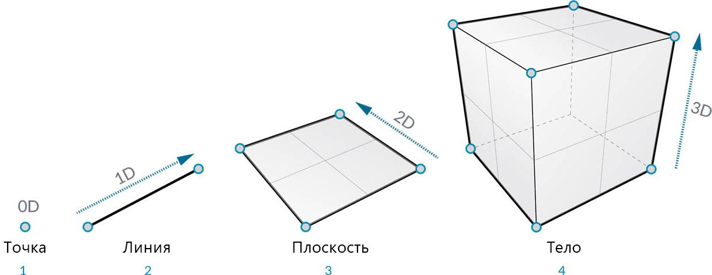
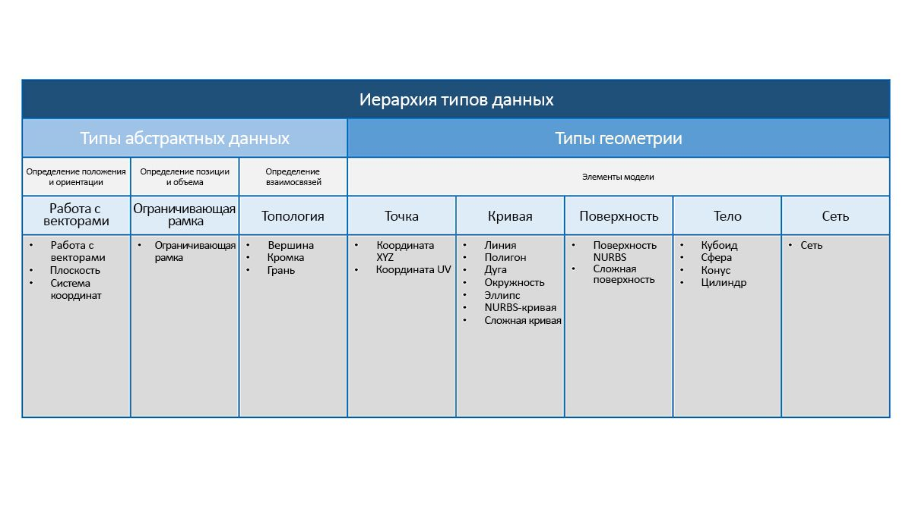

## Обзор концепции геометрии

**Геометрия** — это язык, на котором осуществляется разработка. Если в основе языка или среды программирования лежит геометрия, это открывает широкие возможности для создания точных и надежных моделей, автоматизации процессов разработки и итерации проектов на основе алгоритмов.

### Основы

В обычном понимании геометрия — это исследование формы, размера, относительного положения фигур и свойств пространства. Эта дисциплина имеет богатую историю, берущую свое начало тысячи лет назад. Благодаря появлению компьютеров мы получили мощный инструмент для описания, изучения и генерирования геометрических объектов. В настоящее время можно с легкостью рассчитать сложнейшие геометрические взаимосвязи, и ни для кого не секрет, что мы активно используем эти возможности.

> Если вы хотите узнать, насколько разнообразной и сложной может быть геометрия, разрабатываемая с помощью компьютеров, введите словосочетание «стенфордский кролик» в любой поисковой системе. Это каноническая модель, которая используется для тестирования алгоритмов.

Перспектива применения геометрии в контексте алгоритмов, компьютерных вычислений и повышенной сложности может показаться пугающей. Однако есть несколько относительно простых ключевых принципов, освоив которые, мы сможем приступить к изучению более сложных вариантов применения геометрии.

1. Геометрия —это **данные**, поэтому с точки зрения компьютера и приложения Dynamo геометрический кролик практически ничем не отличается от обычного числа.
2. Геометрия основана на **абстракции**: по сути, все геометрические элементы определяются с помощью чисел, отношений и формул в заданной пространственной системе координат.
3. Геометрия имеет **иерархию**: точки образуют линии, линии образуют поверхности и т. д.
4. Геометрия одновременно описывает **часть и целое**: если есть кривая, то она представляет собой и форму, и все возможные точки вдоль нее.

На практике эти принципы означают, что пользователи должны понимать, над чем они работают (тип геометрии, как она была создана и т. д.). Это понимание позволит нам с легкостью конструировать, разбирать и снова собирать различные геометрические объекты в ходе разработки сложных моделей.

### Перемещение между уровнями иерархии

Давайте рассмотрим геометрию с точки зрения принципов абстракции и иерархии. Хоть это и не всегда очевидно, эти принципы тесно взаимосвязаны, и если в этом не разобраться, то при разработке детализированных рабочих процессов и моделей можно столкнуться с серьезным препятствием. Для начала давайте воспользуемся понятием пространственным измерений в качестве основной характеристики моделируемых нами объектов. Зная количество измерений, необходимых для описания формы, мы сможем приблизиться к пониманию иерархического устройства геометрии.

> 1. **Точка** (определяемая координатами) не имеет измерений. Она представлена только числами, соответствующими каждой из координат.
2. **Отрезок** (определяемый двумя точками), в свою очередь, имеет *одно* измерение: мы можем перемещаться вдоль отрезка вперед (положительное направление) и назад (отрицательное направление).
3. **Плоскость** (определяемая двумя линиями) имеет *два* измерения: мы можем перемещаться не только вперед и назад, но и влево или вправо.
4. **Параллелепипед** (определяемый двумя плоскостями) имеет *три* измерения: в дополнение к указанному выше, мы можем перемещаться вверх и вниз.

Пространственные измерения — это удобный способ классификации геометрический объектов, но не всегда самый лучший. В конце концов, при моделировании используются не только точки, отрезки, плоскости и параллелепипеды. Что если нужен изогнутый объект? Кроме этого, существует другая категория типов геометрических объектов, которые являются полностью абстрактными: они определяют такие свойства, как ориентация, объем или связи между отдельными частями объекта. Такой объект, как вектор, например, абсолютно неосязаем, так как же описать его относительно того, что мы видим в пространстве? Нужна более подробная классификация иерархии геометрических объектов, которая должна отражать разницу между абстрактными типами (вспомогательными средствами), которые можно сгруппировать по выполняемой ими функции, и типами, которые используются для описания формы элементов модели.

### Геометрия в Dynamo Studio

Каким образом все это работает применительно к Dynamo? Зная типы геометрии и то, как они связаны друг с другом, мы сможем с легкостью ориентироваться в наборе **узлов Geometry**, доступных в основной библиотеке. Узлы Geometry располагаются в библиотеке в алфавитном порядке, а не по иерархическому принципу. Здесь они отображаются примерно так же, как и в интерфейсе Dynamo.

Кроме этого, эти знания позволят упростить и сделать более понятым процесс создания моделей в Dynamo, а также соотнесение потока данных в графике с изображением в области предварительного просмотра.

> 1. Обратите внимание на предполагаемую систему координат, представленную сеткой и цветными осями.
2. Выбранные узлы визуализируют соответствующую геометрию (если узел создает геометрию) в фоновом режиме.
> Скачайте файл примера, прилагаемый к данному изображению (щелкните правой кнопкой мыши и выберите «Сохранить ссылку как...»): [Geometry for Computational Design - Geometry Overview.dyn](datasets/5-1/Geometry for Computational Design - Geometry Overview.dyn). Полный список файлов примеров можно найти в приложении.

### Дальнейшая работа с геометрией

Создание моделей в Dynamo не ограничено объектами, которые можно создать с помощью узлов. Есть несколько способов расширить возможности использования геометрии.

1. Dynamo позволяет импортировать файлы: используйте файлы CSV для создания облаков точек или файлы SAT для добавления поверхностей.
2. При работе с Revit можно ссылаться на элементы Revit, чтобы использовать их в Dynamo.
3. Менеджер пакетов Dynamo содержит дополнительные функции, поддерживающие расширенный набор типов геометрии и операций. Изучите возможности пакета [Mesh Toolkit](https://github.com/DynamoDS/Dynamo/wiki/Dynamo-Mesh-Toolkit).

