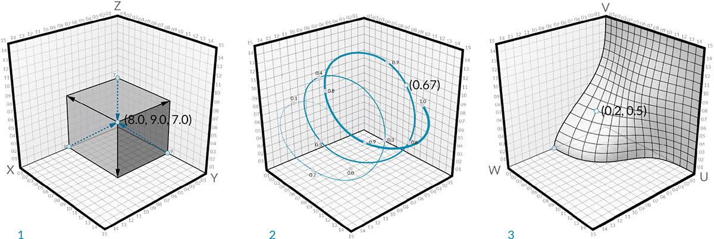

## Точки

Если геометрия — это язык модели, то точки — ее алфавит. Точки являются основой для создания всех прочих объектов геометрии. Для создания кривой требуется не менее двух точек, для создания полигона или грани сети — не менее трех и т. д. Определение положения, порядка и отношений между точками (например, с помощью функции синуса) позволяет работать с геометрией более высокого порядка, в том числе с такими элементами, как окружности или кривые.


> 1. Окружность, построенная с помощью функций ```x=r*cos(t)``` и ```y=r*sin(t)```
2. Синусоидальная кривая, построенная с помощью функций ```x=(t)``` и ```y=r*sin(t)```

### Что такое точка

Точка определяется одним или несколькими значениями, которые называются координатами. Количество необходимых для определения точки значений координат зависит от системы координат или пространства, в котором она находится. Самый распространенный тип точки в Dynamo существует в трехмерной мировой системе координат и имеет три координаты: [X,Y,Z].


### Точка в системе координат

Точки также могут существовать в двумерной системе координат. В зависимости от типа рабочего пространства могут использоваться различные буквенные обозначения — [X,Y] на плоскости и [U,V] на поверхности.



> 1. Точка в евклидовой системе координат: [X,Y,Z]
2. Точка в системе координат параметров кривой: [t]
3. Точка в системе координат параметров поверхности: [U,V]

Хотя это сложно представить, параметры кривых и поверхностей являются непрерывными и выходят за границы заданной геометрии. Поскольку формы, определяющие параметрическое пространство, находятся в трехмерной мировой системе координат, параметрическую координату легко можно преобразовать в мировую. Например, точка [0.2, 0.5] на поверхности соответствует точке [1.8, 2.0, 4.1] в мировой системе координат.


> 1. Точка в предполагаемой мировой системе координат XYZ.
2. Точка, представленная относительно заданной системы координат (цилиндрической).
3. Точка, представленная координатами UV на поверхности.
> Скачайте файл примера, прилагаемый к данному изображению (щелкните правой кнопкой мыши и выберите «Сохранить ссылку как...»): [Geometry for Computational Design - Points.dyn](datasets/5-3/Geometry for Computational Design - Points.dyn). Полный список файлов примеров можно найти в приложении.

