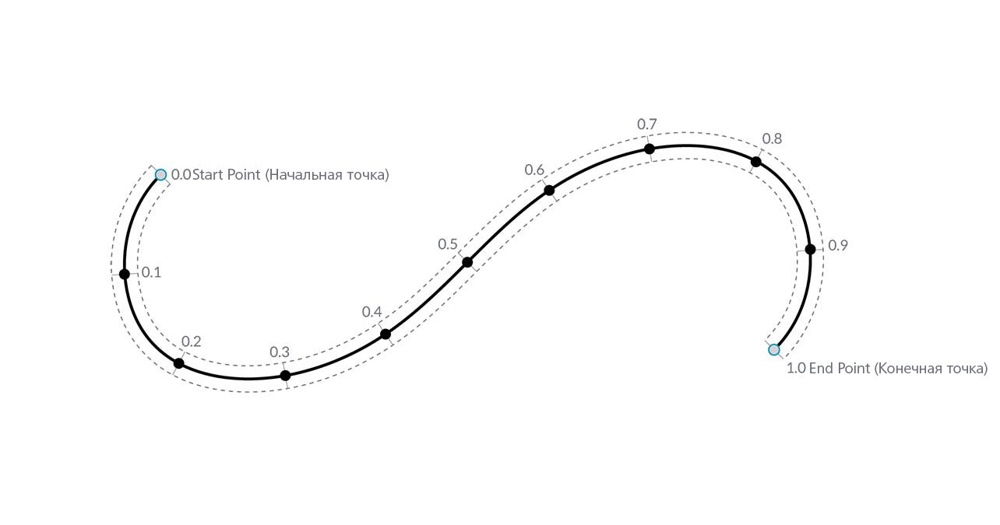
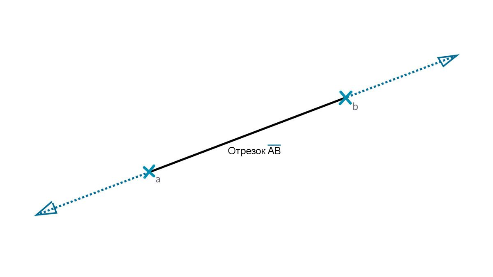
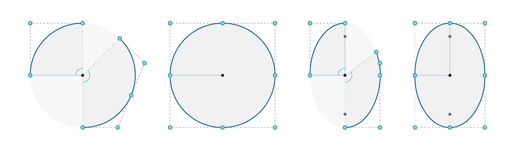

## Кривые

Кривые — это первый из рассматриваемых здесь типов геометрических данных, обладающий привычным набором свойств, определяющих форму объекта (степень изгиба, длина и т. д.). Помните, что основной единицей при построении любых объектов — от отрезка до сплайна и всех прочих типов кривых — остаются точки.


> 1. Линия
2. Полилиния
3. Дуга
4. Окружность
5. Эллипс
6. NURBS-кривая
7. Сложная кривая

### Что такое кривая

Под термином **кривая** обычно понимаются все типы криволинейных форм (даже если они являются прямыми). Таким образом, кривая — это родительская категория, в которую входят все эти типы форм: отрезки, окружности, сплайны и т. д. В техническом плане кривая включает в себя все возможные точки, которые можно найти путем ввода параметра «t» в набор простых (```x = -1.26*t, y = t```) или высших математических функций. Независимо от типа кривой, искомым свойством является данный **параметр**, условно обозначаемый как «t». Кроме этого, все кривые, независимо от своей формы, также имеют начальную и конечную точки, которые соответствуют минимальным и максимальным значениям t, используемым для создания кривой. Это также помогает определить направленность кривой.



> Важно помнить, что в Dynamo область значений t кривой охватывает диапазон от 0,0 до 1,0.

Все кривые также имеют ряд свойств или характеристик, которые можно использовать для их описания или анализа. Если расстояние между начальной и конечной точками равно нулю, кривая будет замкнутой. Кроме этого, каждая кривая имеет несколько управляющих точек. Если все эти точки расположены в одной плоскости, то кривая будет плоской. Некоторые свойства применяются ко всей кривой, другие — только к определенным точкам на кривой. Например, планарность является глобальным свойством, а вектор касательной при заданном значении — локальным.

### Отрезки

**Отрезки** — это простейшая форма кривых. Хотя они могут не выглядеть изогнутыми, на самом деле это кривые, у которых просто отсутствует кривизна. Существует несколько способов создания отрезков, наиболее простым из которых является создание отрезка от точки A до точки B. Форма отрезка AB заключена между этими точками, но математически она бесконечно продолжается в обоих направлениях.



При соединении двух отрезков создается **полилиния**. На этом изображении наглядно показывается, что представляет собой управляющая точка. При изменении положения любой из этих точек изменится и форма полилинии. Если полилиния замкнута, получится полигон. Если длина всех ребер полигона одинакова, он будет правильным.


### Дуги, окружности, эллиптические дуги и эллипсы

Постепенно усложняя параметрические функции, определяющие форму, можно построить не просто отрезок, а **дугу**, **окружность**, **эллиптическую дугу** или **эллипс**, задав один или два радиуса. Отличие между дугой и окружностью или эллипсом состоит только в том, что последние две формы являются замкнутыми.



### NURBS-кривые и сложные кривые

**NURBS** (неоднородные сплайны с рациональной основой ) — это математические представления, которые позволяют точно смоделировать любую форму: от простого двумерного отрезка, окружности, дуги или прямоугольника до сложнейшей трехмерной кривой произвольной формы. Благодаря своей гибкости (плавной интерполяции в зависимости от заданной степени при относительно небольшом количестве управляющих точек) и точности (достигаемой за счет сложных математических вычислений) модели NURBS можно использовать в любом процессе, будь то презентация, анимация или производство.


**Степень**: степень кривой определяет диапазон влияния управляющих точек на кривую (чем выше степень, тем больше диапазон). Степень — положительное целое число. Обычно это число 1, 2, 3 или 5, но вместо него может использоваться любое другое положительное целое число. NURBS-отрезки и полилинии обычно имеют степень 1, а кривые произвольной формы — степени 3 или 5.

**Управляющие точки**: набор точек в количестве не меньшем, чем «степень + 1». Одним из самых простых способов изменения формы NURBS-кривой является перемещение ее управляющих точек.

**Вес**: с управляющими точками связано определенное число, которое называется весом. Обычно вес является положительным числом. Если для управляющих точек кривой установлен одинаковый вес (обычно 1), кривая называется нерациональной. В противном случае она считается рациональной. Большинство NURBS-кривых являются нерациональными.

**Узлы**: список чисел (степень+N-1), где N — количество управляющих точек. Узлы используются вместе со значениями веса для управления влиянием контрольных точек на итоговую кривую. Одной из функций узлов является создание точек излома в определенных точках кривой.


> 1. Степень = 1
2. Степень = 2
3. Степень = 3

Обратите внимание, что чем выше значение степени, тем больше управляющих точек используется для интерполяции полученной кривой.

Создадим синусоидальную кривую в Dynamo с помощью двух различных методов создания NURBS-кривых и сравним результаты.


> 1. Узел *NurbsCurve.ByControlPoints* в качестве управляющих точек использует список точек.
2. Узел *NurbsCurve.ByPoints* создает кривую по списку точек.
> Скачайте файл примера, прилагаемый к данному изображению (щелкните правой кнопкой мыши и выберите «Сохранить ссылку как...»): [Geometry for Computational Design - Curves.dyn](datasets/5-4/Geometry for Computational Design - Curves.dyn). Полный список файлов примеров можно найти в приложении.

