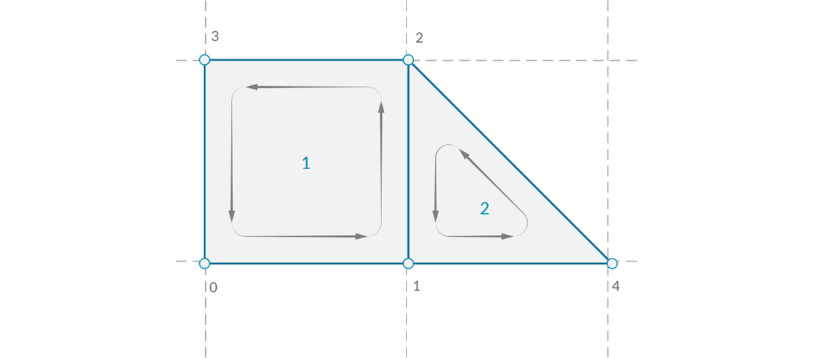

## Сети

В сфере вычислительного моделирования сети представляют собой одну из наиболее распространенных форм представления 3D-геометрии. Геометрия сети может служить более простой и гибкой альтернативой NURBS-поверхностям. Сети используются везде: от визуализации до цифрового производства и 3D-печати.

### Что такое сеть

Сеть — это набор четырехугольников и треугольников, образующих геометрию поверхности или тела. Как и в случае с телами, структура объекта-сети включает в себя вершины, ребра и грани. Существуют свойства, которыми обладают только сети, например нормали.


> 1. Вершины сети
2. Ребра сети (ребра, у которых только одна прилегающая грань, называются открытыми; все остальные ребра являются закрытыми)
3. Грани сети

### Элементы сети

Приложение Dynamo определяет сети, используя структуру данных «грань—вершина». На элементарном уровне эта структура представляет собой набор точек, сгруппированных по полигонам. Точки сети называются вершинами, а полигоны, похожие на поверхности, — гранями. Для создания сети требуется список вершин и система, позволяющая группировать эти вершины в грани, называемая группой индексов.


> 1. Список вершин
2. Список групп индексов для определения граней

#### Вершины и нормали вершин

Вершины сети представляют собой обычный список точек. Индекс вершин очень важен при создании сети или получении информации о структуре сети. У каждой вершины также есть нормаль (вектор), задающая усредненное направление прилегающих граней и позволяющая определить ориентацию сети «внутрь» или «наружу».


> 1. Вершины
2. Нормали вершин

#### Грани

Грань представляет собой упорядоченный список из трех или четырех вершин. Таким образом, представление грани сети зависит от положения индексируемых вершин. Благодаря наличию списка вершин, образующих сеть, вместо указания отдельных точек для определения грани достаточно использовать индекс вершин. Это также позволяет использовать одну и ту же вершину в нескольких гранях.



> 1. Квадратная грань, созданная на основе индексов 0, 1, 2 и 3
2. Треугольная грань, созданная на основе индексов 1, 4 и 2 (обратите внимание, что очередность групп индексов может быть изменена: если очередность следует направлению против часовой стрелки, то грань будет определена правильно)

### Сети и NURBS-поверхности

В чем отличие геометрии сети от геометрии NURBS? Когда следует использовать геометрию каждого из этих типов?

#### Параметризация

В предыдущей главе мы узнали, что NURBS-поверхности определяются набором NURBS-кривых, идущих в двух направлениях. Эти направления обозначаются как ```U``` и ```V``` и позволяют осуществлять параметризацию NURBS-поверхности в соответствии с областью определения двумерной поверхности. Сами кривые хранятся на компьютере в виде формул, что позволяет рассчитывать итоговые поверхности с произвольно малой степенью точности. Тем не менее скомбинировать несколько NURBS-поверхностей достаточно сложно. Объединение двух NURBS-поверхностей приведет к созданию сложной поверхности, причем различные сегменты геометрии будут иметь различные параметры UV и определения кривых.


> 1. Поверхность
2. Изопараметрическая кривая
3. Управляющая точка поверхности
4. Управляющей полигон поверхности
5. Изопараметрическая точка
6. Рамка поверхности
7. Сеть
8. Открытое ребро
9. Сетка сети
10. Ребра сети
11. Нормаль вершины
12. Грань сети/нормаль грани сети

Сети состоят из дискретного количества точно заданных вершин и граней. Сетка вершин, как правило, не может быть определена простыми координатами ```UV```, а так как грани дискретны, степень точности уже встроена в сеть, и ее можно изменить только путем уточнения сети и добавления дополнительных граней. Отсутствие математических описаний у сетей обеспечивает гибкость при работе со сложными геометрическими объектами в пределах одной сети.

### Локальное и глобальное влияние

Еще одно важное отличие заключается в том, насколько локальные изменения геометрии сети или геометрии NURBS влияют на всю форму. Перемещение одной вершины сети влияет только на грани, прилегающие к этой вершине. В NURBS-поверхностях механизм влияния более сложен и зависит от степени, а также веса и узлов управляющих точек. Однако в целом при перемещении одной управляющей точки на NURBS-поверхности изменения в геометрии будут более сглаженными и масштабными.


> 1. NURBS-поверхность: перемещение управляющей точки влияет на всю форму.
2. Геометрия сети: перемещение влияет только на прилегающие элементы.

В качестве аналогии можно сравнить векторное изображение (состоящее из отрезков и кривых) с растровым изображением (состоящим из отдельных пикселей). При увеличении векторного изображения кривые остаются плотными и четкими, а при увеличении растрового изображения увеличивается размер отдельных пикселей. В этом случае NURBS-поверхности можно сравнить с векторным изображением, так как здесь работает плавная математическая связь, а сеть ведет себя так же, как растровое изображение с заданным разрешением.

### Mesh Toolkit

Возможности работы с сетями в Dynamo можно расширить за счет установки пакета [Mesh Toolkit](https://github.com/DynamoDS/Dynamo/wiki/Dynamo-Mesh-Toolkit). Dynamo Mesh Toolkit содержит инструменты для импорта сетей из внешних файлов в других форматах, создания сетей из геометрических объектов Dynamo и построения сетей вручную по вершинам и индексам. В библиотеке также содержатся инструменты для изменения сетей, восстановления сетей или извлечения горизонтальных срезов для использования в производстве.

Пример использования Mesh Toolkit см. в главе 10.2.


