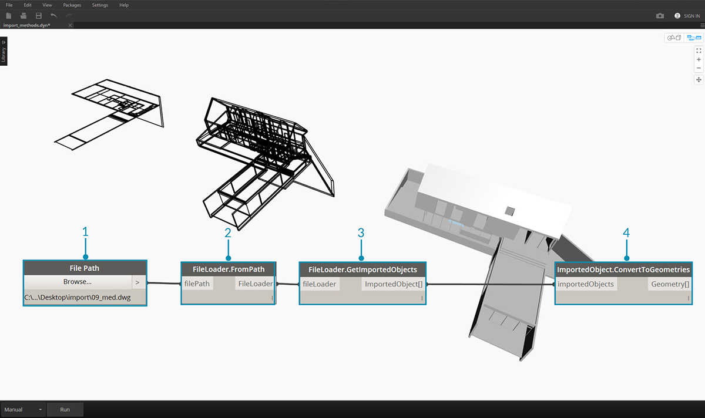

## Импорт геометрии

Существует несколько способов импорта геометрии в Dynamo. В предыдущем разделе был рассмотрен импорт сетей с помощью *Mesh Toolkit*. Кроме того, можно импортировать твердотельные модели из файлов SAT. Эти процессы позволяют разрабатывать геометрию на других платформах, загружать ее в Dynamo и применять к ней параметрические операции с помощью средств визуального программирования.

Еще один способ импорта геометрии — *перенос данных в формате ATF*. Этот процесс позволяет импортировать не только геометрию, но и структуру файла. Например, можно выбрать слои для импорта из файла DWG вместо того, чтобы импортировать всю модель целиком. Эта возможность будет подробнее рассмотрена далее.

### Импорт геометрии из файла DWG

Узлы для импорта файла DWG в среду Dynamo можно найти на вкладке *Преобразование*. (Примечание. Эти инструменты доступны только в [Dynamo Studio](http://www.autodesk.com/products/dynamo-studio/overview).) В следующих примерах показаны компоненты, используемые для поиска файла, импорта его содержимого и последующего преобразования в геометрию Dynamo. Dynamo также предоставляет возможность фильтровать и выбирать конкретные объекты для импорта из файла DWG. Она также будет рассмотрена далее. Подробную информацию об импорте геометрии из файла DWG см. в блоге Бен Го (Ben Goh) [здесь](http://dynamobim.org/dwg-import-in-dynamo-studio-0-9-1/).

### Получение импортированных объектов

Самый простой способ импортировать файл DWG в Dynamo Studio — это импортировать весь файл в рабочее пространство.

> 1. Используйте узел File Path, чтобы найти файл DWG, который требуется импортировать в Dynamo.
2. Подключитесь к узлу **FileLoader.FromPath**, чтобы прочитать файл.
3. Используйте компонент **FileLoader.GetImportedObjects** для анализа геометрии в Dynamo Studio.
4. Узел **ImportedObject.ConvertToGeometry** преобразует объекты в пригодную к использованию геометрию в рабочем пространстве Dynamo.

Как показано на изображении выше, все типы геометрии в файле DWG, включая поверхности, сети, кривые и отрезки, импортируются в Dynamo.

### Фильтр объектов

Для указания конкретных геометрических объектов, импортируемых из файла DWG, в определение можно добавить дополнительные узлы **ObjectFilter**. Узел **ObjectFilter** можно подключить либо к узлу **FileLoader**, либо к списку узла **ImportedObject**. На выходе этот узел выводит список **ImportedObject**.

На следующих изображениях показаны условные выражения в каждом из узлов **ObjectFilter**. В список отфильтрованных объектов будут включены все объекты **ImportedObject**, удовлетворяющие хотя бы одному из перечисленных условий. Объекты можно фильтровать по метке слоя (т. е. его имени), типу геометрии, диффузному цвету и другим свойствам. Для уточнения выбора можно использовать сразу несколько фильтров.

> 1. Замените узел **FileLoader.GetImportedObjects** на узел **ObjectFilter**, чтобы выполнить поиск определенных условий в файле DWG. В этом случае импортируется только геометрия поверхностей, а вся геометрия кривых и отрезков из предыдущего изображения будет удалена.
2. Подключите узел фильтра к узлу **ImportedObject.ConvertToGeometries**, чтобы импортировать отфильтрованные геометрические объекты.

Добавив два фильтра с различными условными выражениями, можно разделить список геометрических объектов на несколько потоков:

> 1. Замените узел **FileLoader.GetImportedObjects** двумя модулями **ObjectFilter** с разными условными выражениями. Это позволит развести геометрию из одного файла по двум разным потокам.
2. Подключите узел фильтра к узлу **ImportedObject.ConvertToGeometries**, чтобы импортировать отфильтрованные геометрические объекты.
3. Подключите узел **ImportedObject.ConvertToGeometry** к узлу **Display.ByGeometryColor** для визуализации каждого потока в отдельном цвете.

### Непосредственный выбор объектов

Узел **ObjectSelector** предоставляет альтернативный способ импорта объектов из файла DWG. С его помощью можно указать объекты и слои, которые требуется импортировать в Dynamo, без использования фильтров.

> 1. Замените узел **FileLoader.GetImportedObjects** на узел **ObjectSelector** для вызова определенных слоев и объектов в файле DWG.
2. Подключите узел фильтра к узлу **ImportedObject.ConvertToGeometries**.

