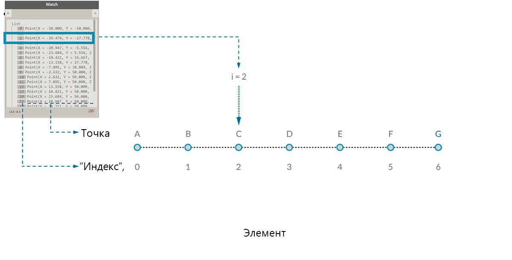
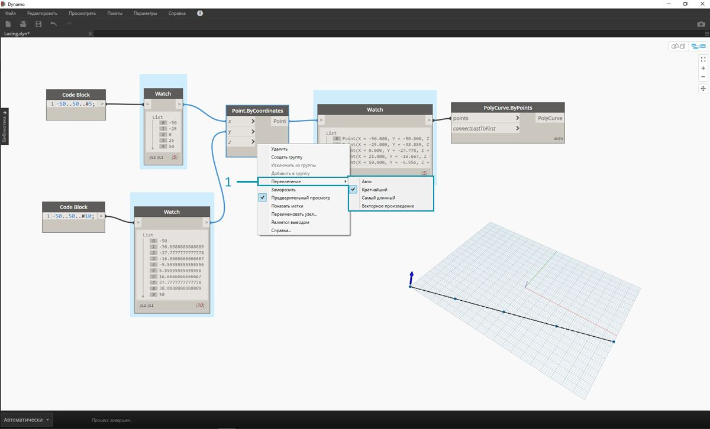
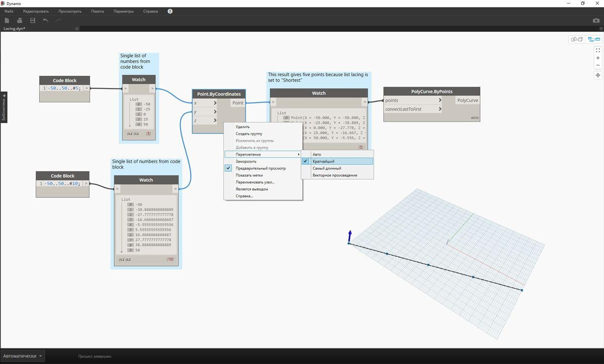
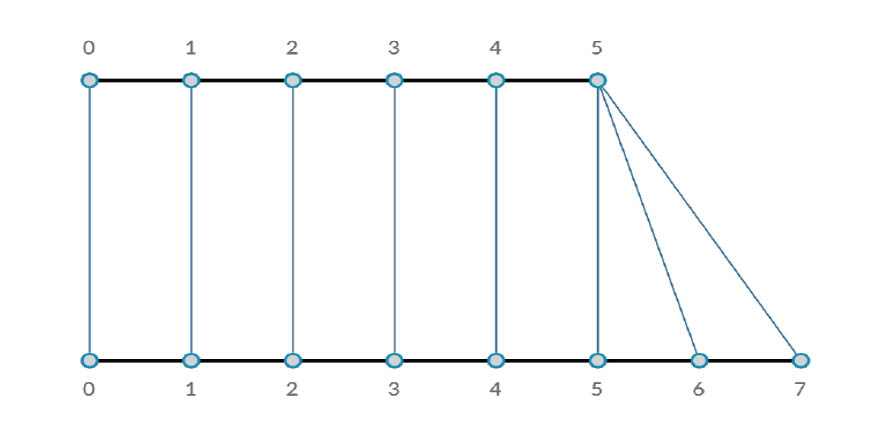
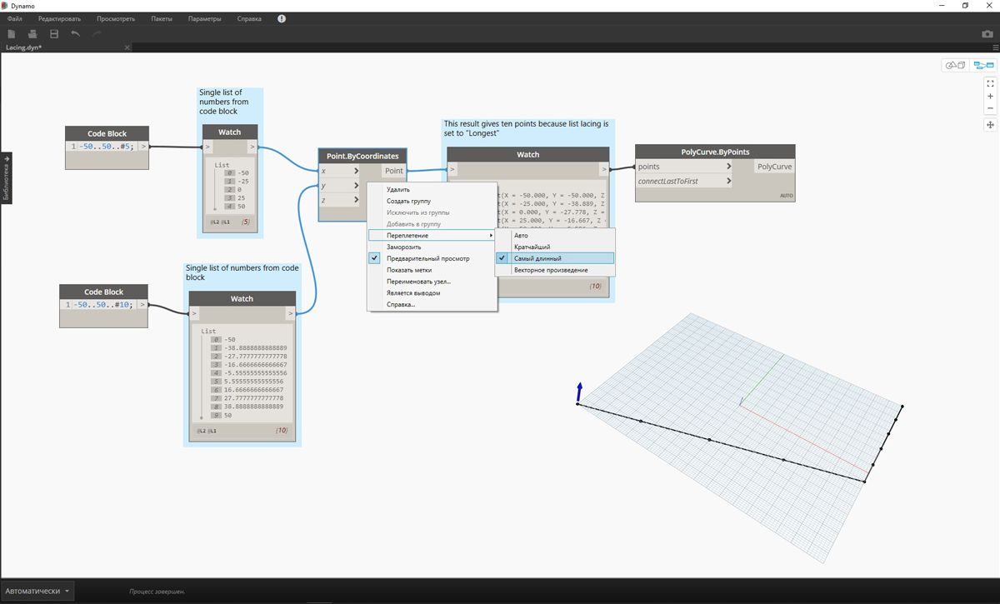

## Что такое список

Список — это набор элементов или компонентов. Возьмем, к примеру, связку бананов. Каждый банан является элементом списка (или связки). Проще взять в руки связку бананов, чем брать бананы по одному. Точно так же работать с элементами, сгруппированными по параметрическим связям в структуре данных, проще, чем с отдельными элементами.

> Фотография предоставлена [Августусом Бину (Augustus Binu)](https://commons.wikimedia.org/wiki/File:Bananas_white_background_DS.jpg?fastcci_from=11404890&c1=11404890&d1=15&s=200&a=list).

Когда мы идем в магазин, мы кладем все, что купили, в пакет. Этот пакет также является списком. Мы хотим испечь банановый кекс, и нам нужно три связки бананов (мы печем *очень большой* кекс). Пакет представляет собой список связок, а каждая связка представляет собой список бананов. Пакет — это список списков (двумерный), а банан — это просто список (одномерный).

В Dynamo данные в списках упорядочиваются, и первому элементу в каждом списке присваивается индекс 0. Ниже мы рассмотрим то, как задать список в Dynamo, а также то, как разные списки могут быть связаны друг с другом.

## Индексы, отсчитываемые от нуля

Первому элементу в списке всегда назначается индекс 0, а не 1, и поначалу это может показаться странным. Поэтому запомните, что, если речь идет о первом элементе в списке, подразумевается элемент с индексом 0.

Например, если бы вам потребовалось посчитать количество пальцев на правой руке, то вы бы начали считать с 1 до 5. Однако если бы вам потребовалось внести ваши пальцы в список, то приложение Dynamo назначило бы им индексы от 0 до 4. Это может показаться странным тем, кто только начинает заниматься программированием, однако индекс, отсчитываемые от нуля, является стандартным для большинства вычислительных систем.

Обратите внимание, что такой список по-прежнему включает пять элементов, просто в нем используется система отсчета от нуля, а не от единицы. Элементы списка не обязательно должны быть числами. Это могут быть данные любого типа, который поддерживается Dynamo, например точки, кривые, поверхности, семейства и т. д.

Зачастую самым простым способом узнать тип данных в списке является подключение узла Watch к порту вывода другого узла. По умолчанию узел Watch автоматически отображает все индексы в левой части списка, а элементы данных — в правой.

Эти индексы играют ключевую роль при работе со списками.

### Входные и выходные данные

При работе со списками требуемые входные и выходные данные различаются в зависимости от используемого узла Dynamo. Для примера возьмем список из пяти точек и соединим его порт вывода с двумя разными узлами Dynamo: *PolyCurve.ByPoints* и *Circle.ByCenterPointRadius*:

> 1. Порт ввода *points* узла *PolyCurve.ByPoints* выполняет поиск элемента *Point[]*. Этот элемент представляет собой список точек.
2. Выходные данные узла *PolyCurve.ByPoints* — это элемент PolyCurve, созданный на основе списка пяти точек.
3. Порт ввода *centerPoint* узла *Circle.ByCenterPointRadius* запрашивает элемент *Point*.
4. Выходные данные *Circle.ByCenterPointRadius* представляют собой список из пяти окружностей, центры которых соответствуют точкам из исходного списка.

Узлы *PolyCurve.ByPoints* и *Circle.ByCenterPointRadius* используют одни и те же входные данные, однако узел Polycurve на выходе дает одну сложную кривую, а узел Circle — пять окружностей для каждой точки из списка. На интуитивном уровне это кажется понятным, так как сложная кривая строится путем соединения всех пяти точек, а при создании окружностей каждая точка используется в качества центра отдельной окружности. Что же происходит с данными?

При наведении указателя мыши на порт ввода *points* узла *Polycurve.ByPoints* можно увидеть, что этому порту требуется элемент *Point[]*. Обратите внимание на скобки в конце. Этот элемент представляет список точек, и чтобы создать сложную кривую, в качестве входных данных этому узлу требуется отдельный список точек для каждой кривой. В результате узел объединяет каждый полученный на вводе список в одну сложную кривую.

Порт ввода *centrePoint* узла *Circle.ByCenterPointRadius* запрашивает элемент *Point*. Этому узлу требуется одна точка, являющаяся отдельным элементом, которую он будет использовать в качестве центра окружности. Поэтому на основе тех же входных данных мы получаем пять отдельных окружностей. Знание различий в использовании входных данных в Dynamo помогает лучше понимать, как узлы распоряжаются данными.

### Переплетение

Сопоставление данных является проблемой, для которой не существует четкого решения. Это происходит, когда узел получается доступ к входным данных разных размеров. Изменение алгоритма сопоставления данных может привести к существенным различиям в результатах.

Рассмотрим в качестве примера узел, который создает линейные сегменты между точками (Line.ByStartPointEndPoint). У него два входных параметра, которые используются для представления координат точек:

Как мы видим, прочертить линию через эти наборы точек можно разными способами. Параметры переплетения можно просмотреть, щелкнув центр узла правой кнопкой мыши и выбрав меню «Переплетение».

### Базовый файл

> Скачайте файл примера для этого упражнения (щелкните правой кнопкой мыши и выберите «Сохранить ссылку как...»): [Lacing.dyn](datasets/6-1/Lacing.dyn). Полный список файлов примеров можно найти в приложении.

Для изучения операций переплетения ниже мы воспользуемся этим базовым файлом, чтобы определить самый короткий и длинный списки, а также декартово произведение.

> 1. Измените настройку переплетения узла *Point.ByCoordinates* в графике выше, оставив остальные элементы без изменений.

#### Самый короткий список

Самый простой способ — попарно соединять входные данные с одинаковыми индексами, пока один из списков не закончится. Это алгоритм по самому короткому списку. Узлы Dynamo используют этот алгоритм по умолчанию.

> Изменив способ переплетения на *Декартово произведение*, вы получите базовую диагональную линию из пяти точек. Пять точек — это длина наименьшего списка. Таким образом, переплетение по самому короткому списку прекращается по достижении конца этого списка.

#### Самый длинный список

Алгоритм переплетения по самому длинному списку соединяет все входные элементы, используя некоторые элементы повторно, пока не закончатся оба списка:

> При изменении способа переплетения на *Самый длинный* вы получите диагональную линию, которая имеет продолжение по вертикали. Аналогично схематическому изображению выше, пятый элемент короткого списка используется повторно, пока не будет достигнут конец более длинного списка.

#### Декартово произведение

Наконец, при использовании метода «Декартово произведение» создаются все возможные соединения:

> Изменив способ переплетения на *Декартово произведение*, вы получите все возможные соединения между списками, в результате чего создается сетка 5 х 10 точек. Эта структура данных эквивалентна декартову произведению, показанному в схематическом изображении выше, однако данные теперь являются списком списков. Путем соединения сложной кривой можно увидеть, что каждый список определяется значением X, в результате чего образуется ряд вертикальных линий.

