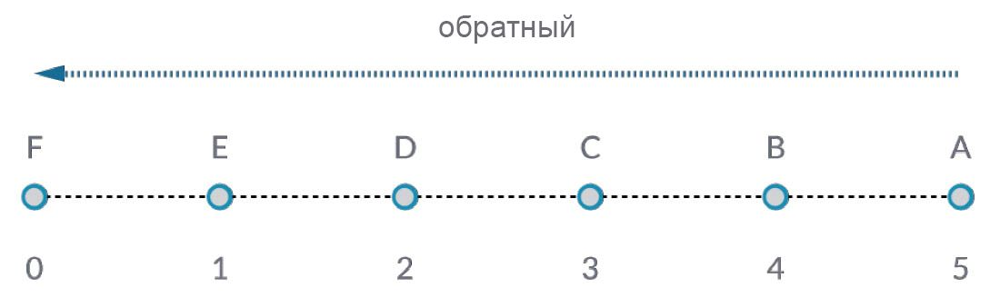
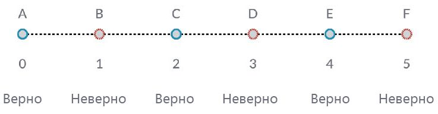
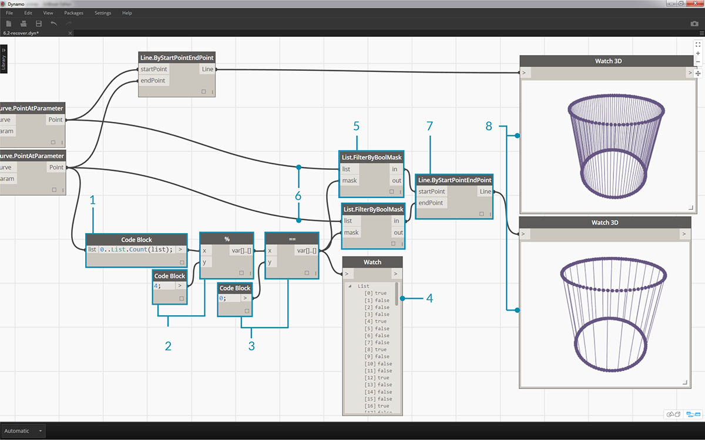

## Работа со списками

Определившись с тем, что такое список, поговорим о том, какие операции можно выполнять с ним. Представим список в виде колоды карт. Колода — это список, а каждая карта — элемент.


> Фото предоставлено [Кристианом Гидлефом (Christian Gidlöf)](https://commons.wikimedia.org/wiki/File:Playing_cards_modified.jpg)

Какие **запросы** доступны в списке? Это возможность вызова существующих свойств.

* Сколько карт в колоде? 52.
* Количество мастей? 4.
* Из какого материала они изготовлены? Бумага.
* Какова их длина? 3,5 дюйма, или 89 мм.
* Какова их ширина? 2,5 дюйма, или 64 мм.

Какие **действия** можно выполнять со списком? Это изменения списка в зависимости от конкретной операции.

* Колоду можно перемешать.
* Колоду можно отсортировать по значению.
* Колоду можно отсортировать по масти.
* Колоду можно разделить.
* Колоду можно раздать отдельным игрокам.
* Можно выбрать отдельную карту из колоды.

У всех перечисленных выше операций есть аналогичные узлы Dynamo для работы со списками типовых данных. В уроке ниже будут рассмотрены основные операции, которые можно выполнять со списками.

## Операции со списками

На изображении показан исходный график, который будет использоваться для иллюстрации основных операций со списками. Мы рассмотрим управление данными в списке и представим наглядные результаты.

#### Упражнение «Операции со списком»

> Скачайте файл примера, прилагаемый к этому упражнению (щелкните правой кнопкой мыши и выберите «Сохранить ссылку как...»): [List-Operations.dyn](datasets/6-2/List-Operations.dyn). Полный список файлов примеров можно найти в приложении.


> 1. Начнем с *блока кода* со значением ```500;```
2. Соединим его с входным параметром *x* узла *Point.ByCoordinates*.
3. Соединим узел из предыдущего шага с входным параметром origin узла *Plane.ByOriginNormal*.
4. Соединим узел из предыдущего шага с входным параметром plane узла *Circle.ByPlaneRadius*
5. С помощью *блока кода* укажем ```50;``` в качестве значения для *radius*. Это будет первая окружность.
6. С помощью узла *Geometry.Translate* переместим окружность вверх на 100 единиц в направлении Z.
7. С помощью узла *Code Block* зададим диапазон из десяти чисел от 0 до 1, используя строку кода ```0..1.#10;```
8. Соединим блок кода из предыдущего шага с входным значением *param* двух узлов *Curve.PointAtParameter*. Соединим узел *Circle.ByPlaneRadius* с входным параметром curve верхнего узла, а узел *Geometry.Translate* с входным параметром curve узла под ним.
9. С помощью узла *Line.ByStartPointEndPoint* соединим два узла *Curve.PointAtParameter*.


> 1. Узел *Watch3D* показывает результаты операции *Line.ByStartPointEndPoint*. Итак, были созданы линии между двумя окружностями. Данный график Dynamo будет использован для демонстрации действий со списками далее.

### List.Count


> Узел *List.Count* сравнительно прост: он подсчитывает количество значений в списке и возвращает это число. При работе со списками списков в использовании этого узла появляются дополнительные нюансы. О них мы поговорим в следующих разделах.

#### Упражнение List.Count

> Скачайте файл примера, прилагаемый к этому упражнению (щелкните правой кнопкой мыши и выберите «Сохранить ссылку как...»): [List-Count.dyn](datasets/6-2/List-Count.dyn). Полный список файлов примеров можно найти в приложении.


> 1. Узел *List.Count* возвращает количество линий в узле *Line.ByStartPointEndPoint*. В данном случае значение равно 10, что соответствует количеству точек, созданных с помощью исходного узла *Code Block*.

### List.GetItemAtIndex


> *List.GetItemAtIndex* — основной способ запроса элементов в списке. На изображении выше для запроса точки с меткой *C* используется индекс *2*.

#### Упражнение List.GetItemAtIndex

> Скачайте файл примера, прилагаемый к этому упражнению (щелкните правой кнопкой мыши и выберите «Сохранить ссылку как...»): [List-GetItemAtIndex.dyn](datasets/6-2/List-GetItemAtIndex.dyn). Полный список файлов примеров можно найти в приложении.


> 1. С помощью узла *List.GetItemAtIndex* выбираем индекс *0* или первый элемент в списке линий.
2. Узел *Watch3D* показывает, что выбрана одна линия. Примечание. Чтобы видеть это изображение, отключите предварительный просмотр узла *Line.ByStartPointEndPoint*.

### List.Reverse



> Узел *List.Reverse* располагает все элементы в списке в обратном порядке.

#### Упражнение List.Reverse

> Скачайте файл примера, прилагаемый к этому упражнению (щелкните правой кнопкой мыши и выберите «Сохранить ссылку как...»): [List-Reverse.dyn](datasets/6-2/List-Reverse.dyn). Полный список файлов примеров можно найти в приложении.


> 1. Для правильной визуализации обращенного списка линий создайте дополнительные линии, задав в блоке кода новое значение ```0..1..#100;```.
2. Вставьте узел *List.Reverse* между узлами *Curve.PointAtParameter* и *Line.ByStartPointEndPoint* для одного из списков точек.
3. Узлы *Watch3D* показывают два различных результата. Первый узел показывает результат без обращенного списка. Линии соединяются вертикально с точками напротив. Второй узел показывает результат обращения списка, где все точки соединяются с точками напротив в обратном порядке.

### List.ShiftIndices


> *List.ShiftIndices* — это удобный инструмент для создания скручиваний или спиралей и других подобных манипуляций с данными. Этот узел смещает элементы в списке на заданное количество индексов.

#### Упражнение List.ShiftIndices

> Скачайте файл примера, прилагаемый к этому упражнению (щелкните правой кнопкой мыши и выберите «Сохранить ссылку как...»): [List-ShiftIndices.dyn](datasets/6-2/List-ShiftIndices.dyn). Полный список файлов примеров можно найти в приложении.


> 1. В том же сценарии, где был создан обращенный список, вставьте узел *List.ShiftIndices* между узлами *Curve.PointAtParameter* и *Line.ByStartPointEndPoint*.
2. С помощью узла *Code Block* укажите значение*1* для сдвига списка на один индекс.
3. Изменение незначительное, но все линии в нижнем узле *Watch3D* сместились на один индекс при соединении с другим набором точек.


> 1. Если увеличить значение в узле *Block Code*, например, до *30*, в диагональных линиях появляется существенное различие. В данном случае сдвиг работает аналогично диафрагме камеры, закручивая исходную цилиндрическую форму.

### List.FilterByBooleanMask



> Узел *List.FilterByBooleanMask* удаляет определенные элементы на основе списка логических операций или значений «Истина»/«Ложь».

#### Упражнение List.FilterByBooleanMask

> Скачайте файл примера, прилагаемый к этому упражнению (щелкните правой кнопкой мыши и выберите «Сохранить ссылку как...»): [List-FilterByBooleanMask.dyn](datasets/6-2/List-FilterByBooleanMask.dyn). Полный список файлов примеров можно найти в приложении.



> Чтобы создать список значений «Истина» или «Ложь», необходимо выполнить несколько дополнительных действий.

> 1. C помощью узла *Code Block* зададим выражение с синтаксисом ```0..List.Count(list);```. Соединим узел *Curve.PointAtParameter* с входным параметром *list*. Этот процесс будет рассмотрен подробнее в главе о блоках кода, но в данном случае строка кода дает список, где представлены все индексы узла *Curve.PointAtParameter*.
2. С помощью узла *%* (коэффициент) соединим выходной параметр узла *Code Block* с входным параметром *x*, а значение *4* с входным параметром *y*. Это позволит вычислить остаток при делении списка индексов на 4. Узел «Коэффициент» очень полезен при создании массивов. Все значения будут представлять собой возможный остаток от 4: 0, 1, 2, 3.
3. Благодаря узлу *коэффициент* мы знаем, что значение 0 означает делимость индекса на 4 (0, 4, 8 и т. д.). С помощью узла *==* можно проверить делимость по значению *0*.
4. Узел *Watch* выводит лишь следующий результат: массив истинных и ложных значений в виде * true,false,false,false....*.
5. Соедините этот массив с входным параметром mask обоих узлов *List.FilterByBooleanMask*.
6. Соедините узел *Curve.PointAtParameter* с входными параметрами list узлов *List.FilterByBooleanMask*.
7. Выходными данными *Filter.ByBooleanMask* будут*in* и *out*. *In* — это значения, которым было присвоено значение маски *true*, а *out* — значения, которым было присвоено значение *false*. Соедините выходные параметры *in* с входными параметрами *startPoint* и *endPoint* узла *Line.ByStartPointEndPoint*, создав тем самым отфильтрованный список линий.
8. Узел *Watch3D* показывает, что количество линий меньше, чем количество точек. Отфильтровав только истинные значения, мы выбрали 25 % узлов.

