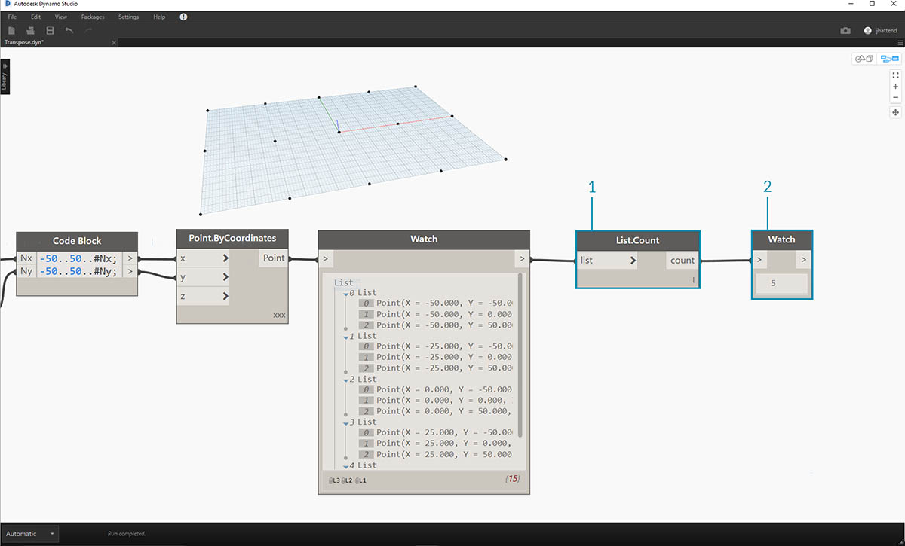
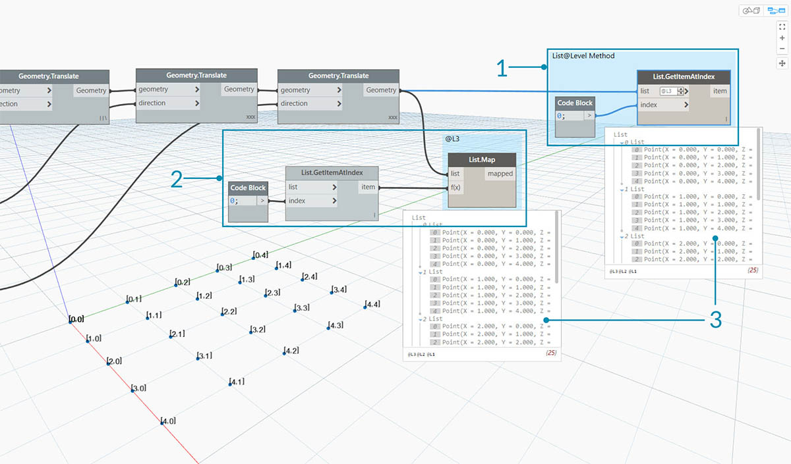
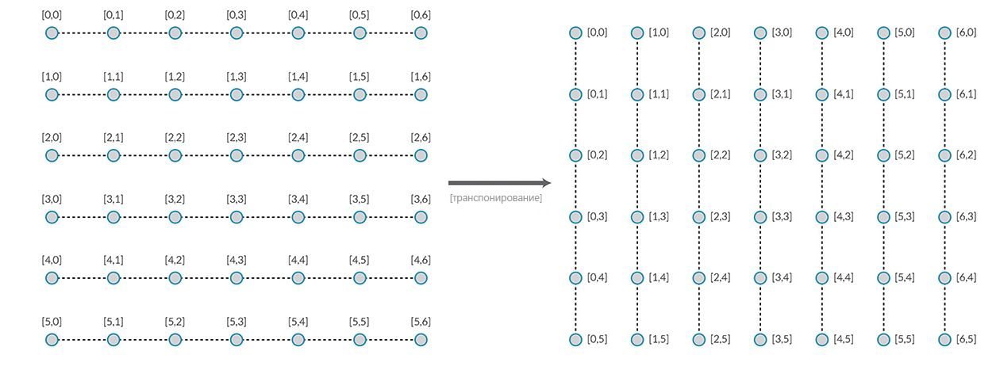
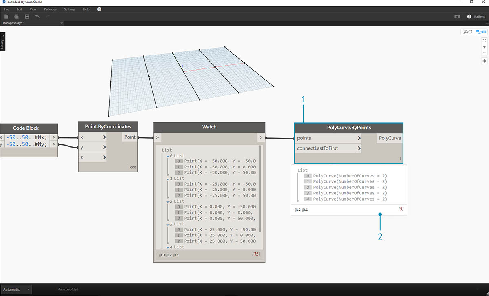

## Списки списков

Добавим еще один уровень в иерархию. Если взять колоду карт из первого примера и создать рамку, в которой будет находиться несколько колод, то эта рамка будет представлять собой список колод, а каждая колода — список карт. Это и есть список списков. В качестве аналогичного примера для этого раздела в красной рамке ниже представлен список столбиков монет, каждый из которых содержит список монет.


> Фото предоставлено [Dori](https://commons.wikimedia.org/wiki/File:Stack_of_coins_0214.jpg).

Какие **запросы** доступны в таком списке списков? Таким образом можно вызвать существующие свойства.

* Сколько всего типов монет? 2.
* Какова ценность типов монет? 0,01 долл. США и 0,25 долл. США.
* Какие материалы используются для изготовления монет номиналом 0,25 долл. США? 75 % меди и 25 % никеля.
* Какие материалы используются для изготовления цента? 97,5 % цинка и 2,5 % меди.

Какие **действия** можно выполнять со списком списков? Они приведут к изменению списка списков в зависимости от конкретной операции.

* Выбрать один столбик из монет номиналом 1 или 25 центов.
* Выбрать одну монету номиналом 1 или 25 центов.
* Переупорядочить столбики.
* Перемешать столбики.

Для каждой из перечисленных выше операций в Dynamo имеется отдельный узел. Поскольку мы работаем с абстрактными данными, а не с физическими объектами, необходимо установить набор правил, определяющих порядок перемещения вверх и вниз по иерархии данных.

При работе со списками списков данные располагаются по слоям и имеют сложную структуру, но это дает возможность выполнять ряд уникальных параметрических операций. Остановимся подробнее на основных операциях, оставив другие для последующих занятий.

## Нисходящая иерархия

В данном разделе необходимо усвоить один базовый принцип: **Dynamo рассматривает списки как объекты самих себя, расположенные в самих себе**. Эта нисходящая иерархия разработана с учетом объектно-ориентированного программирования. Вместо выбора вложенных элементов с помощью команды вроде List.GetItemAtIndex в Dynamo будет выбран индекс основного списка в структуре данных. Этот объект, в свою очередь, может быть другим списком. Рассмотрим этот вопрос подробнее на примере изображения ниже.

#### Упражнение «Нисходящая иерархия»

> Скачайте файл примера, прилагаемый к этому упражнению (щелкните правой кнопкой мыши и выберите «Сохранить ссылку как...»): [Top-Down-Hierarchy.dyn](datasets/6-3/Top-Down-Hierarchy.dyn). Полный список файлов примеров можно найти в приложении.


> 1. С помощью *блока кода* было задано два диапазона: ``` 0..2; 0..3; ``
2. Эти диапазоны соединены с узлом *Point.ByCoordinates*, а в качестве переплетения выбран вариант *Cross Product* (векторное произведение). При этом создается сетка точек, а в качестве выходных данных возвращается список списков.
3. Обратите внимание, что узел *Watch* содержит 3 списка с 4 элементами в каждом.
4. При использовании функции *List.GetItemAtIndex* с индексом 0, Dynamo выберет первый список и все его содержимое. Другие программы могут выбрать первый элемент каждого списка в структуре данных, но в Dynamo при работе с данными используется иерархия «сверху вниз».

### Flatten и List.Flatten

Функция Flatten удаляет все уровни в структуре данных. Это удобно, если для выполнения операции не требуется наличие иерархий данных, но имеются определенные риски, так как удаляется информация. В примере ниже показан результат выравнивания списка данных.

#### Упражнение «Flatten (выравнивание)»

> Скачайте файл примера, прилагаемый к этому упражнению (щелкните правой кнопкой мыши и выберите «Сохранить ссылку как...»): [Flatten.dyn](datasets/6-3/Flatten.dyn). Полный список файлов примеров можно найти в приложении.


> 1. Вставьте одну строку кода для определения диапазона в *блоке кода*:``` -250..-150..#4; ```
2. При вставке *блока кода* во входные данные *x* и *y* узла *Point.ByCoordinates* в качестве варианта переплетения укажем *Cross Product* (векторное произведение), чтобы получить сетку точек.
3. Узел *Watch* показывает наличие списка списков.
4. Узел *PolyCurve.ByPoints* создаст ссылки для каждого списка и построит соответствующую сложную кривую. Обратите внимание, что в области предварительного просмотра Dynamo отобразятся четыре сложные кривые, представляющие каждый ряд сетки.


> 1. После вставки функции *Flatten* перед узлом сложной кривой был создан один список для всех точек. Узел Polycurve создает ссылку для списка, чтобы создать одну кривую, а так как все точки находятся в одном списке, получается одна зигзагообразная сложная кривая, которая проходит по всему списку точек.

Можно также выровнять изолированные уровни данных. С помощью узла List.Flatten можно указать определенное количество уровней данных, выравниваемых от верхнего уровня иерархии. Это очень полезный инструмент при работе со сложными структурами данных, которые могут быть не нужны в рабочем процессе. Еще один вариант — использовать узел Flatten в качестве функции в List.Map. Далее функция [List.Map](#listmap-and-listcombine) будет рассматриваться подробнее.

### Chop

При параметрическом моделировании бывает необходимо расширить структуру данных в существующем списке. С этой целью можно использовать множество других узлов, из которых Chop — самая базовая версия. С помощью функции Chop можно разделить список на вложенные списки с заданным количеством элементов.

#### Упражнение List.Chop

> Скачайте файл примера, прилагаемый к этому упражнению (щелкните правой кнопкой мыши и выберите «Сохранить ссылку как...»): [Chop.dyn](datasets/6-3/Chop.dyn). Полный список файлов примеров можно найти в приложении.


> Команда *List.Chop с длиной вложенного списка *, равной 2, создает 4 списка с 2 элементами в каждом.

Команда Chop (обрезка) делит списки на основе заданной длины списка. В некотором смысле обрезка обратна выравниванию: вместо упрощения структуры данных она добавляет в нее новые уровни. Это удобный инструмент для геометрических операций, таких как в примере ниже.


### List.Map и List.Combine

List.Map и List.Combine позволяют применить заданную функцию к списку входных данных, но на один шаг вниз по иерархии. Набор комбинаций аналогичен команде Maps, за исключением наличия нескольких наборов входных данных, соответствующих входным данным заданной функции.

#### Упражнение List.Map

*Примечание. Это упражнение было создано в предыдущей версии Dynamo. Большая часть функциональных возможностей List.Map была упразднена с добавлением функции List@Level. Дополнительные сведения см. в разделе [List@Level](#listlevel) ниже.*

> Скачайте файл примера, прилагаемый к этому упражнению (щелкните правой кнопкой мыши и выберите «Сохранить ссылку как...»): [Map.dyn](datasets/6-3/Map.dyn). Полный список файлов примеров можно найти в приложении.

В качестве краткого введения рассмотрим узел List.Count из предыдущего раздела.


> Узел *List.Count* подсчитывает все элементы в списке. Мы воспользуемся этим для демонстрации работы *List.Map*.


> 1. Вставьте следующие две строки кода в *блок кода*:

```
-50..50..#Nx;
-50..50..#Ny;
```

После ввода этих данных блок кода создаст два набора входных данных для Nx и Ny.

2. С помощью двух узлов *Integer Slider* задайте значения *Nx* и *Ny* путем их присоединения к *блоку кода*.
3. Соедините каждую строку блока кода с соответствующими входными данными *X* и *Y* узла *Point.ByCoordinates*. Щелкните узел правой кнопкой мыши, выберите Lacing(переплетение), а затем *Cross Product* (векторное произведение). Будет создана сетка точек. Так как мы определили диапазон от -50 до 50, он охватывает сетку Dynamo по умолчанию.
4. Созданные точки отображаются в узле *Watch*. Обратите внимание на структуру данных. Мы создали список списков. Каждый список представляет собой ряд точек сетки.



> 1. Вставьте узел *List.Count* в выходные данные узла Watch из предыдущего шага.
2. Соедините узел *Watch* с выходными данными List.Count.

Обратите внимание, что узел List.Count выдает значение 5. Это значение равно переменной Nx, заданной в блоке кода. Почему?

* Во-первых, в качестве основного входного элемента для создания списков в узле Point.ByCoordinates используется входное значение x. Если Nx равно 5, а Ny — 3, получается список, состоящий из 5 списков, в каждом из которых содержится 3 элемента.
* Так как Dynamo рассматривает списки как объекты самих себя, расположенные в самих себе, то узел List.Count применяется к основному списку в иерархии. В результате получается значение 5 (количество списков в главном списке).


> 1. С помощью узла *List.Map* спустимся на один шаг вниз по иерархии и на этом уровне выполним *функцию*.
2. Обратите внимание, что узел *List.Count* не имеет входных данных. Так как узел *List.Count* используется в качестве функции, он будет применен к каждому отдельному списку на один шаг вниз по иерархии. Пустые входные данные узла *List.Count* соответствуют входным данным списка в узле *List.Map*.
3. Результаты *List.Count* теперь выдают список из 5 элементов, в каждом из которых имеется значение 3. Это соответствует длине каждого вложенного списка.

#### Упражнение List.Combine

*Примечание. Это упражнение было создано в предыдущей версии Dynamo. Большая часть функциональных возможностей List.Combine была упразднена с добавлением функции List@Level. Дополнительные сведения см. в разделе *[*List@Level*](#listlevel)* ниже.*

> Скачайте файл примера, прилагаемый к этому упражнению (щелкните правой кнопкой мыши и выберите «Сохранить ссылку как...»): [Combine.dyn](datasets/6-3/Combine.dyn). Полный список файлов примеров можно найти в приложении.

В этом упражнении используется та же логическая схема, как в случае с List.Map, но с несколькими элементами. В данном случае необходимо разделить список кривых на уникальное количество точек.


> 1. С помощью *блока кода* задайте диапазон, используя синтаксис ```..20..#4; ```и значение```20; ``` под строкой.
2. Соедините *блок кода* с двумя узлами *Point.ByCoordinates*.
3. Создайте узел *Line.ByStartPointEndPoint* из узлов *Point.ByCoordinates*.
4. В узле *Watch* отображается четыре строки.


> 1. Под графиком для создания линии потребуется использовать блок кода, позволяющий создать четыре различных диапазона для уникального разделения линий. Для этого используем следующие строки кода:
```
0..1..#3;
0..1..#4;
0..1..#5;
0..1..#6;
```

2. С помощью узла *List.Create* четыре строки из *блока кода* объединяются в один список.
3. В узле *Watch* отобразится список списков.


> 1. Узел *Curve.PointAtParameter* не работает, если соединить линии непосредственно со значениями *параметров*. Необходимо опуститься на один уровень вниз по иерархии. Для этого используем команду *List.Combine*.


> Используя команду *List.Combine*, можно успешно разделить каждую линию на заданный диапазон. Это непростая операция, поэтому разберем ее подробнее.

> 1. Сначала добавьте узел *Curve.PointAtParameter* в рабочую область. Это будет *функция или *комбинатор*, применяемые к узлу List.Combine*. Подробнее рассмотрим этот момент позже.
2. Добавьте узел *List.Combine* в рабочую область. Нажмите *«+»* или *«-»*, чтобы сложить или вычесть входные данные. В данном случае в узле используется два набора входных данных по умолчанию.
3. Необходимо встроить узел *Curve.PointAtParameter* в набор входных данных *comb* в узле *List.Combine*. Есть еще один важный узел. Правой кнопкой мыши щелкните *набор входных данных param узла Curve.PointAtParameter* и снимите флажок *use default value* (использовать значение по умолчанию). При запуске узла в качестве функции необходимо удалить значения, присвоенные входным данным в Dynamo по умолчанию. Другими словами, необходимо считать, что у значений по умолчанию имеются подсоединенные к ним дополнительные узлы. Поэтому в данном случае необходимо удалить значения по умолчанию.
4. Итак, имеется два набора входных данных: линии и параметры для создания точек. Но как и в каком порядке соединить их с входными данными *List.Combine*?
5. Пустые входные данные узла *Curve.PointAtParameter* необходимо заполнить в комбинаторе в том же порядке — сверху вниз. Итак, линии встраиваются во входные данные *list1* узла *List.Combine*.
6. Аналогичным образом значения параметров встраиваются во входные данные *list2* узла *List.Combine*.
7. Узел *Watch* и область предварительного просмотра Dynamo демонстрируют, что имеется 4 линии, каждая из которых разделена на основе диапазонов, заданных в *блоке кода*.

### List@Level

В отличие от List.Map функция List@Level позволяет выбрать необходимый уровень списка непосредственно на входном порте узла. Эту функцию можно применять ко всем поступающим входным данным узлов и получать доступ к уровням списков быстрее, чем при использовании других методов. Просто сообщите узлу, какой уровень списка требуется использовать в качестве входных данных, и он сам сделает все необходимое.

#### Упражнение List@Level

В этом упражнении с помощью функции List@Level необходимо изолировать определенный уровень данных.

> Скачайте файл примера, прилагаемый к этому упражнению (щелкните правой кнопкой мыши и выберите «Сохранить ссылку как...»): [List@Level](datasets/6-3/Listatlevel.dyn). Полный список файлов примеров можно найти в приложении.


> 1. Начнем с простой 3D-сетки точек.
2. Поскольку сетка создается с диапазоном для X, Y и Z, структура данных будет иметь 3 уровня: список X, список Y и список Z.
3. Эти уровни расположены на разной высоте (**уровнях**). Они указаны в нижней части марки предварительного просмотра. Столбцы уровня списка соответствуют данным списка выше, что позволяет быстрее найти нужный уровень.
4. Уровни списка располагаются в обратном порядке, так что данные самого низкого уровня всегда находятся на высоте L1. Благодаря этому графики будут функционировать запланированным образом, даже если что-то изменится в предыдущем алгоритме.


> 1. Чтобы использовать функцию List@Level, нажмите кнопку «>». В меню отобразятся два флажка.
2. **Используйте уровни**: включение функции List@Level. После выбора этого параметра можно с помощью мыши выбрать уровни списка входных данных, которые будут использованы узлом. С помощью этого меню можно быстро проверить различные конфигурации уровней, щелкая мышью выше или ниже.
3. **Сохранить структуру списков**: если установить этот флажок, можно будет сохранить структуру уровней этих входных данных. Иногда данные бывают сознательно разделены по вложенным спискам. Если установить этот флажок, можно сохранить структуру списка неизменной без какой-либо потери информации.

Благодаря этой простой 3D-сетке можно получить доступ к структуре списка и визуализировать ее, переключаясь между уровнями списка. Любая комбинация уровня списка и индекса возвращает свой собственный набор точек из исходного 3D-набора.


> 1. С помощью элемента @L2 в DesignScript можно выбрать только список на уровне 2.
2. Список на уровне 2 с индексом 0 включает в себя только первый набор точек Y и возвращает только сетку XZ.
3. Если задать фильтр уровней L1, можно увидеть все содержимое первого уровня списка. Список на уровне 1 с индексом 0 включает в себя все 3D-точки в одноуровневом списке.
4. В аналогичном случае с L3 будут видны только точки третьего уровня списка. Список на уровне 3 с индексом 0 включает в себя только первый набор точек Z и возвращает только сетку XY.
5. В аналогичном случае с L4 будут видны только точки третьего уровня списка. Список на уровне 4 с индексом 0 включает в себя только первый набор точек X и возвращает только сетку YZ.

Хотя данный конкретный пример можно воссоздать с помощью List.Map, функция List@Level существенно упрощает операцию и доступ к данным узла. Ниже представлено сравнение методов List.Map и List@Level.



> 1. Хотя оба метода предоставляют доступ к одним и тем же точкам, метод List@Level позволяет легко переключаться между слоями данных в одном узле.
2. Для доступа к сетке точек с помощью List.Map требуется добавить узел List.GetItemAtIndex в дополнение к List.Map. Для каждого нижестоящего уровня списка необходимо использовать дополнительный узел List.Map. При наличии сложных списков для доступа к нужному уровню информации может потребоваться добавить в график значительное количество узлов List.Map.
3. В этом примере узел List.GetItemAtIndex с узлом List.Map возвращает тот же набор точек и ту же структуру списка, что и List.GetItemAtIndex с выбором @L3.

### Transpose

Transpose (транспонирование) — это одна из основных функций при работе со списками списков. Как и в электронных таблицах, при транспонировании происходит перестановка столбцов и строк в структуре данных. Продемонстрируем это с помощью следующей базовой матрицы, а в следующем разделе покажем, как с помощью функции транспонирования создавать геометрические взаимосвязи.



#### Упражнение List.Transpose

> Скачайте файл примера, прилагаемый к этому упражнению (щелкните правой кнопкой мыши и выберите «Сохранить ссылку как...»): [Transpose.dyn](datasets/6-3/Transpose.dyn). Полный список файлов примеров можно найти в приложении.



> Удалите узлы *List.Count* из предыдущего упражнения и перенесите их на геометрические объекты, чтобы увидеть, как структурированы данные.

> 1. Соедините узел *PolyCurve.ByPoints* с выходными данными узла Watch от узла *Point.ByCoordinates*.
2. На выходе отобразятся 5 сложных кривых, которые можно видеть в области предварительного просмотра Dynamo. Узел Dynamo выполняет поиск списка точек (в данном случае — списка списков точек) и создает из них одну сложную кривую. По сути, каждый список в структуре данных преобразован в кривую.


> 1. Если требуется изолировать один ряд кривых, используется узел *List.GetItemAtIndex*.
2. С помощью значения 2 *блока кода* запросите третий элемент в главном списке.
3. В узле *PolyCurve.ByPoints* отображается одна кривая, так как к нему подсоединен только один список.


> 1. Узел *List.Transpose* переставляет все элементы со всеми списками в списке списков. Это может показаться сложным, но в Microsoft Excel используется точно такая же логическая схема транспонирования данных: перестановка столбцов со строками в структуре данных.
2. Обратите внимание на изменение в списках: после транспонирования структура, состоявшая из 5 списков с 3 элементами, изменилась на 3 списка с 5 элементами в каждом.
3. Кроме того, обратите внимание на изменение в геометрии: использование узла *PolyCurve.ByPoints* привело к появлению 3 сложных кривых в перпендикулярном направлении к исходным кривым.

### Создание блока кода

Для определения списка в сокращенном языке блока кода используются квадратные скобки ([]). Это гораздо более быстрый и простой способ создания списков, чем с помощью узла List.Create. Более подробно блок кода рассматривается в главе 7. На изображении ниже показано, как можно задать список с несколькими выражениями с помощью блока кода.


### Запрос блока кода

Для упрощенного выбора определенных элементов, которые требуется извлечь из сложной структуры данных, в сокращенном языке блока кода используются квадратные скобки ([]). Более подробно блоки кода рассматриваются в главе 7. На изображение ниже показано, как запросить список с несколькими типами данных с помощью блока кода.


### Упражнение «Запрос и вставка данных»

> Скачайте файл примера, прилагаемый к этому упражнению (щелкните правой кнопкой мыши и выберите «Сохранить ссылку как...»): [ReplaceItems.dyn](datasets/6-3/ReplaceItems.dyn). Полный список файлов примеров можно найти в приложении.

В этом упражнении для редактирования поверхности используется логическая схема из предыдущего упражнения. Эту задачу можно решить интуитивным способом, однако при этом потребуется дополнительная навигация по структуре данных. Необходимо определить поверхность путем перемещения контрольной точки.


> 1. Начните со строки узлов выше. Создайте базовую поверхность, которая охватывает всю сетку Dynamo по умолчанию.
2. С помощью *блока кода* вставьте следующие две строки кода и соедините их с входными данными *u* и *v* узла *Surface.PointAtParameter* соответственно:
```
-50..50..#3;
-50..50..#5;
```

3. Убедитесь, что для параметра Lacing (переплетение) узла *Surface.PointAtParameter* задано значение *Cross Product* (векторное произведение).
4. Узел *Watch* показывает, что имеется список из 3 списков, каждый из которых содержит 5 элементов.


> На этом этапе следует запросить центральную точку созданной сетки. Для этого выберите центральную точку в списке посередине. Логично, не так ли?

> 1. Чтобы убедиться в правильности выбора точки, можно щелкнуть элементы узла Watch для проверки правильности выбора элемента.
2. При помощи *блока кода* создайте базовую строку кода для запроса списка списков:<br xmlns="http://www.w3.org/1999/xhtml"/>```points[1][2];```
3. С помощью функции *Geometry.Translate* переместите выбранную точку вверх в направлении оси *Z* на *20* единиц.


> 1. Кроме того, выберите ряд точек посредине с помощью узла *List.GetItemAtIndex*. Примечание. Как и при выполнении предыдущего шага, можно запросить список с помощью *блока кода*, используя строку ```points[1];```.


> Итак, мы успешно запросили центральную точку и переместили ее вверх. Теперь необходимо вставить эту перемещенную точку обратно в исходную структуру данных.

> 1. Сначала замените элемент списка, который был изолирован при выполнении предыдущего шага.
2. С помощью узла *List.ReplaceItemAtIndex* замените центральный элемент с помощью индекса *2* на замещающий элемент, соединенный с перемещенной точкой (*Geometry.Translate*).
3. Выходные данные показывают, что перемещенная точка была вставлена в набор входных данных элемента в середине списка.


> После изменения списка необходимо вставить его обратно в исходную структуру данных — список списков.

> 1. Используя ту же логическую схему, заменим список в середине на измененный список с помощью узла *List.ReplaceItemAtIndex*.
2. Обратите внимание, что индекс для этих двух узлов определяется *блоками кодов* 1 и 2, что соответствует исходному запросу из *блока кода* (*points[1][2]*).
3. Если выбрать список с помощью *index 1*, то структура данных будет выделена в области предварительного просмотра Dynamo. Итак, мы успешно встроили перемещенную точку в исходную структуру данных.


> Существует множество способов создания поверхности из этого набора точек. В данном случае необходимо создать поверхность за счет лофтинга кривых.

> 1. Создайте узел *NurbsCurve.ByPoints* и присоедините новую структуру данных для создания трех NURBS-кривых.


> 1. Соедините узел *Surface.ByLoft* с выходными данными из узла *NurbsCurve.ByPoints*. Получится модифицированная поверхность. Можно изменить исходное значение *Z* геометрии. Выполните преобразование и посмотрите, как изменится геометрия.

