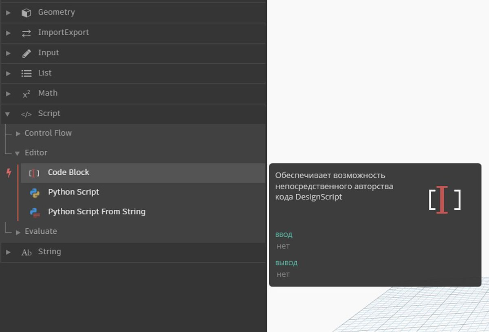

## Что такое Code Block

Блоки кода — это своеобразные окна, позволяющие заглянуть в самую глубь языка DesignScript, лежащего в основе Dynamo. DesignScript — это язык программирования, созданный специально для использования в рамках рабочих процессов проектирования. Это понятный и удобный для чтения язык, который позволяет моментально получать обратную связь при работе с небольшими частями кода, а также поддерживает масштабирование для работы с большими и сложными функциями. Кроме того, DesignScript — это основа мощного вычислительного «мотора» Dynamo. Поскольку почти все функциональные возможности узлов и операций Dynamo имеют прямые аналоги в языке создания сценариев, пользователи получают уникальную возможность свободно переходить от работы с узлами к работе со сценарием.  Для удобства начинающих пользователей узлы можно автоматически преобразовать в текстовый синтаксис, чтобы упростить обучение работе с DesignScript
или просто уменьшить слишком большие разделы графиков. Это делается с помощью процедуры, называемой «от узла к коду», которая подробно описана в разделе [Синтаксис DesignScript](7-2_Design-Script-syntax.md). Опытные пользователи могут применять узлы Code Block для создания уникальных комбинаций существующих функций и пользовательских связей на основе разнообразных стандартных парадигм работы с кодом. Все без исключения пользователи, от начинающих до опытных, могут воспользоваться широким спектром упрощенных методов и фрагментов кода, позволяющих ускорить процесс проектирования. Хотя термин «блок кода» может вызывать робость у пользователей, не занимающихся программированием, на деле эта функция столь же проста в использовании, сколь и эффективна. Начинающий пользователь может работать с блоками кода, практически не прибегая к программированию, а опытный — задавать определения на основе сценариев для вызова из других разделов определения Dynamo.

### Code Block: краткий обзор

Говоря простым языком, блоки кода — это интерфейс для текстовой работы со сценарием в среде визуального программирования. Эти блоки можно использовать для задания чисел, строк, формул и других типов данных. Поскольку блоки кода разработаны специально для использования в Dynamo, пользователи могут задавать переменные в блоках кода, и эти переменные будут автоматически добавлены к портам ввода узла.

При работе с блоками кода пользователю предоставляется возможность определить, каким образом будут заданы входные данные. Ниже приведены способы построения базовой точки с координатами *(10, 5, 0)*: 

По мере изучения различных функций, доступных в библиотеке, вы можете обнаружить, что ввести в поле поиска Point.ByCoordinates гораздо быстрее, чем искать нужный узел по разделам библиотеки вручную. При вводе запроса *Point.*, например, в Dynamo отобразится список подходящих функций, которые можно применить к объекту Point. Это делает процесс работы со сценариями интуитивно понятным и упрощает использование функций в Dynamo.

### Создание узлов Code Block

Для доступа к блокам кода перейдите в раздел *Core >Input >Actions >Code Block*. Есть и более быстрый способ: просто дважды щелкните в рабочей области, и в ней появится блок кода. Поскольку этот узел используется крайне часто, его вызов привязан к двойному щелчку.

### Числа, строки и формулы

Блоки кода поддерживают использование разных типов данных. Пользователи могут быстро задавать числа, строки и формулы, а блок кода предоставит требуемый результат.

На изображении ниже представлен традиционный способ работы с узлами, который отнимает у пользователей больше времени: сначала нужно найти требуемый узел в библиотеке, затем добавить его в рабочую область и, наконец, ввести входные данные. В случае с блоками кода пользователям достаточно дважды щелкнуть в рабочей области и ввести в появившийся узел нужный тип данных с использованием базового синтаксиса. 

> Узлы *number*, *string* и *formula* можно привести в качестве примеров узлов Dynamo, которые являются устаревшими по сравнению с *блоками кода*.

