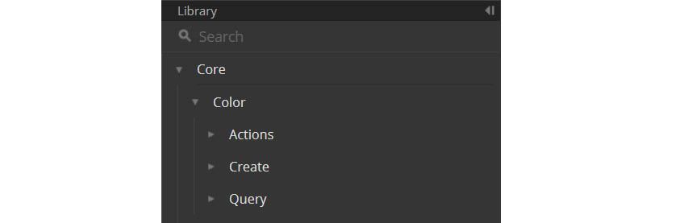
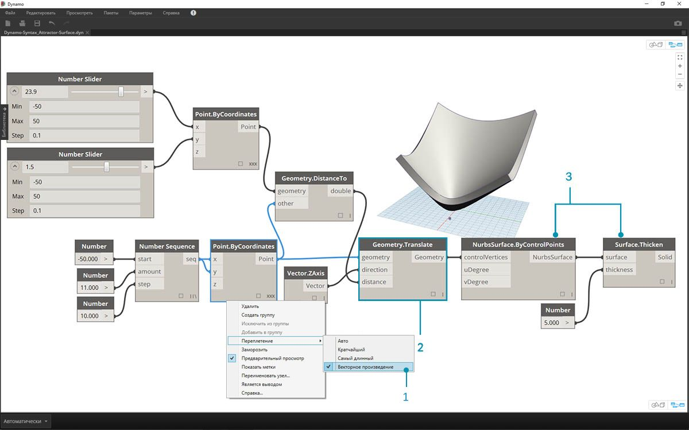
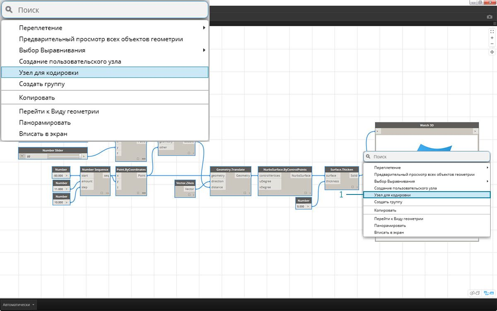

## Синтаксис DesignScript

Возможно, вы уже заметили закономерность в именах узлов Dynamo: каждое из них состоит из слов, разделенных точкой (*«.»*) без пробелов. Это связано с тем, что текст в верхней части каждого узла представляет собой фактический синтаксис для создания сценариев, а символ *«.»* (или *запись через точку*) отделяет элемент от доступных методов, которые можно вызвать. Это позволяет легко переходить от визуальных сценариев к текстовым.


В качестве примера использования записи через точку рассмотрим возможные действия с параметрическим яблоком в Dynamo. Ниже представлены несколько методов, которые можно применить к яблоку, перед тем как съесть (разумеется, на самом деле этих методов в Dynamo не существует, не ищите).

|На языке пользователя|Запись через точку|Вывод|
| -- | -- | -- |
|Какого цвета яблоко?|Apple.color|Красный|
|Яблоко зрелое?|Apple.isRipe|true|
|Сколько весит это яблоко?|Apple.weight|170 г|
|Откуда взялось это яблоко?|Apple.parent|дерево|
|Что останется после яблока?|Apple.children|семена|
|Это яблоко выращено недалеко отсюда?|Apple.distanceFromOrchard|96,5 км|

Судя по данным в таблице выше, это очень вкусное яблоко. Я бы его с удовольствием *Apple.eat()*.

### Запись через точку в узлах Code Block

Помня про аналогию с яблоком, рассмотрим узел *Point.ByCoordinates* и процесс создания точки с помощью узла Code Block:


> Синтаксис *Code Block* ( ```Point.ByCoordinates(0,10);```) позволяет получить тот же результат, что и узел *Point.ByCoordinates* в Dynamo, но его преимущество заключается в том, что он позволяет создать точку с помощью одного узла. Это проще и эффективнее, чем соединять отдельный узел с портами ввода *X* и *Y*.

> 1. Используя синтаксис *Point.ByCoordinates* в узле Code Block, нужно указать входные данные в том же порядке, что и в готовом узле *(X,Y)*.

### Вызов узлов

С помощью узла Code Block можно вызвать любой стандартный узел библиотеки, если он не является *узлом пользовательского интерфейса*, обладающим специфическими для пользовательского интерфейса функциями. Например, можно вызвать узел *Circle.ByCenterPointRadius*, а вот вызывать узел *Watch 3D* не стоит.

Стандартные узлы, которых в библиотеке большинство, обычно делятся на три типа.

* **Create** — узлы, позволяющие создавать или конструировать что-либо.
* **Action** — узлы для выполнения действий с чем-либо.
* **Query** — узлы для получения свойства существующего объекта.

Как вы видите, вся библиотека упорядочена с учетом этих категорий. Методы (или узлы) этих трех типов обрабатываются иначе при вызове с помощью Code Block.



#### Create

Категория Create позволяет создавать геометрию с нуля. Значения вводятся в Code Block слева направо. Они располагаются в том же порядке, что и порта ввода узла, если смотреть сверху вниз: 

> При сравнении узла *Line.ByStartPointEndPoint* и соответствующего синтаксиса в узле Code Block мы получаем один и тот же результат.

#### Action

Действие — это операция, выполняемая с объектами определенного типа. Для применения действий к объектам в Dynamo используется *запись через точку*, что является распространенным принципом для многих языков программирования. Если у вас есть объект, введите его название, затем точку, а затем название действия, которое с этим объектом нужно выполнить. Входные данные для метода этого типа помещаются в скобки, как и при использовании методов Create, однако для него не требуется указывать первые входные данные, которые отображаются в соответствующем узле. Вместо этого требуется указать элемент, с которым будет выполняться действие:


> 1. Поскольку узел *Point.Add* представляет собой узел типа Action, его синтаксис работает несколько иначе.
2. Входные данные включают (1) *точку* и (2) *вектор*, который требуется к ней добавить. В синтаксисе узла *Code Block* точка (объект) обозначена как *pt*. Чтобы добавить вектор (*vec*) к точке (*pt*), нужно ввести *pt.Add(vec)*, то есть «объект, точка, действие». Для операции добавления используются все порты ввода узла *Point.Add*, кроме первого. Первый порт ввода узла *Point.Add* — это сама точка.

#### Query

Методы типа Query позволяют получить свойство объекта. Указывать какие-либо входные данные в этом случае не требуется, так как входными данными является сам объект. Скобки также не нужны.


### Использование переплетения

Переплетение при использовании узлов отличается от переплетения с помощью Code Block. В первом случае пользователь щелкает узлы правой кнопкой мыши и выбирает параметр переплетения, который требуется применить. При работе с Code Block у пользователя есть гораздо больше возможностей для управления структурой данных. При объединении нескольких одномерных списков в пары с помощью собирательного метода Code Block используются *руководства по репликации*. Цифры в угловых скобках «<>» определяют уровень иерархии для итогового вложенного списка: <1>, <2>, <3> и т. д. 


> 1. В этом примере мы используем собирательный метод для определения двух диапазонов (подробнее о собирательном методе можно узнать в следующем разделе этой главы). По сути, значение ```0..1;``` эквивалентно ```{0,1}```, а значение ```-3..-7``` эквивалентно ```{-3,-4,-5,-6,-7}```. В результате мы получаем список из двух значений X и пяти значений Y. Если работать с этими несогласованными списками без руководств по репликации, то будет получен список, содержащий две точки, что соответствует длине кратчайшего списка. Использование руководств по репликации позволяет найти все возможные сочетания двух и пяти значений координат (а точнее, их **декартово произведение**).
2. Синтаксис ```Point.ByCoordinates(x_vals<1>,y_vals<2>);``` позволяет получить **два** списка с **пятью** элементами в каждом.
3. Синтаксис ```Point.ByCoordinates(x_vals<2>,y_vals<1>);``` позволяет получить **пять** списков с **двумя** элементами в каждом.

Такой способ записи позволяет указать, какой список будет основным: два списка из пяти элементов или пять списков из двух. В этом примере результат будет представлять собой список строк точек или список столбцов точек в сетке в зависимости от изменения порядка руководств по репликации.

### Узел для кодировки

Чтобы овладеть описанными выше методами работы с Code Block, требуется определенное время. Функция «Узел для кодировки» Dynamo значительно упрощает этот процесс. Чтобы использовать эту функцию, выберите массив узлов в графике Dynamo, щелкните правой кнопкой мыши в рабочей области и выберите «Узел для кодировки». Программа Dynamo объединяет эти узлы в единый узел Code Block, содержащий все входные и выходные данные. Это не только отличный инструмент для изучения принципов работы узлов Code Block, но также он позволяет создавать с более эффективные параметрические графики Dynamo. Рекомендуем выполнить упражнение ниже, так как в нем используется функция «Узел для кодировки».


### Упражнение

> Скачайте файл примера для этого упражнения (щелкните правой кнопкой мыши и выберите «Сохранить ссылку как...»). Полный список файлов примеров можно найти в приложении. [Dynamo-Syntax_Attractor-Surface.dyn](datasets/7-2/Dynamo-Syntax_Attractor-Surface.dyn)

Для демонстрации возможностей узла Code Block преобразуйте существующее определение поля притяжения в форму Code Block. Использование существующего определения позволяет продемонстрировать связь Code Block с визуальным программированием, а также помогает в изучении синтаксиса DesignScript. 

> Для начала повторно создайте определение, показанное на изображении выше (или просто откройте файл примера).

> 1. Обратите внимание, что для параметра переплетения узла *Point.ByCoordinates* задано значение *Декартово произведение*.
2. Каждая точка сетки перемещена вверх по оси Z в соответствии с расстоянием от опорной точки.
3. Поверхность создана повторно и утолщена, что создает прогиб в геометрии относительно расстояния до опорной точки.


> 1. Для начала определите опорную точку: ```Point.ByCoordinates(x,y,0);```. Используйте синтаксис *Point.ByCoordinates*, указанный в верхней части узла опорной точки.
2. Переменные *x* и *y* вставляются в Code Block, чтобы их можно было динамически обновлять с помощью регуляторов.
3. Присоедините *регуляторы* к портам ввода узла *Code Block* и задайте для них значения в диапазоне от *-50* до *50*. Это позволит работать по всей сетке Dynamo по умолчанию.


> 1. Во второй строке окне *Code Block* определите собирательный метод, заменяющий узел с числовой последовательностью: ```coordsXY = (-50..50..#11);```. Мы рассмотрим эту тему подробнее в следующем разделе. Обратите внимание, что этот собирательный метод эквивалентен узлу визуального программирования *Number Sequence*.


> 1. Теперь нужно создать сетку из точек последовательности *coordsXY*. Для этого необходимо использовать синтаксис *Point.ByCoordinates*. Кроме того, требуется запустить *декартово произведение* списка так же, как вы делали это при визуальном программировании. Чтобы это сделать, введите строку: ```gridPts = Point.ByCoordinates(coordsXY<1>,coordsXY<2>,0);```. Угловые скобки обозначают ссылку на декартово произведение.
2. Обратите внимание на узел *Watch3D*, который отображается сетку точек на сетке Dynamo.


> 1. Теперь самое сложное: нужно переместить сетку точек вверх в соответствии с расстоянием от опорной точки. Для начала присвоим этому новому набору точек имя *transPts*. Так как преобразование выполняется для уже существующего элемента, вместо узла ```Geometry.Translate...``` используйте ```gridPts.Translate```.
2. Считывая данные из этого узла в рабочей области, мы видим, что он содержит три порта ввода. Преобразуемая геометрия уже определена, так как действие выполняется с текущим элементом (с использованием *gridPts.Translate*). Названия двух оставшихся портов следует поместить в скобки функции: *direction* и *distance*.
3. Определить значение direction несложно, так как для перемещения по вертикали используется ```Vector.ZAxis()```.
4. Нам все еще нужно рассчитать расстояние между опорной точкой и каждой точкой сетки. Выполните это действие с опорной точкой аналогичным образом: ```refPt.DistanceTo(gridPts)```.
5. Последняя строка кода создает преобразованные точки: ```transPts = gridPts.Translate(Vector.ZAxis(),refPt.DistanceTo(gridPts));```.


> 1. Теперь у вас есть сетка точек, структура данных которой позволяет создать поверхность NURBS. Создайте поверхность с помощью синтаксиса ```srf = NurbsSurface.ByControlPoints(transPts);```.


> 1. Чтобы придать поверхности глубину, создайте тело с помощью синтаксиса ```solid = srf.Thicken(5).``` Данный код увеличивает толщину поверхности на пять единиц, однако толщину всегда можно сделать переменной (например, с именем *thickness*), а затем изменять ее значение с помощью регулятора.

### Упрощение графика с помощью функции «Узел для кодировки»

Функция «Узел для кодировки» позволяет автоматизировать все действия, которые вы выполнили в предыдущем упражнении, и применять их одним нажатием кнопки. Этот мощный инструмент не только позволяет создавать пользовательские определения и узлы Code Block для многократного использования, но и помогает в изучении процесса создания сценариев в Dynamo.



> 1. Для начала откройте существующий визуальный сценарий из первого шага упражнения. Выберите все узлы, щелкните правой кнопкой мыши в рабочей области и выберите *Узел для кодировки*. Проще простого.


> Приложение Dynamo позволяет автоматизировать текстовую версию визуального графика, включая переплетение и прочие операции. Поэкспериментируйте с использованием этой функции при работе с другими визуальными сценариями и откройте все возможности Code Block.

