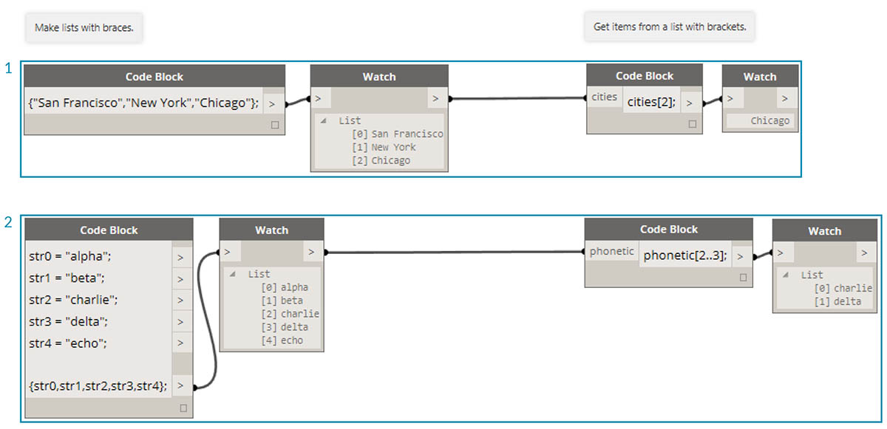
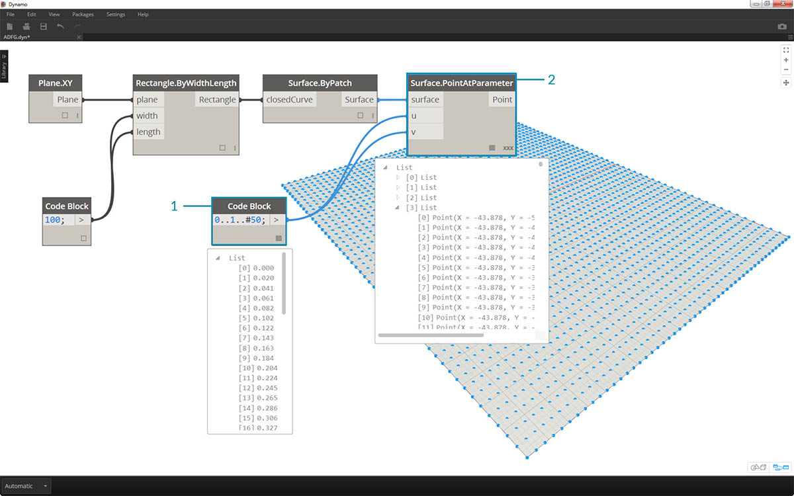
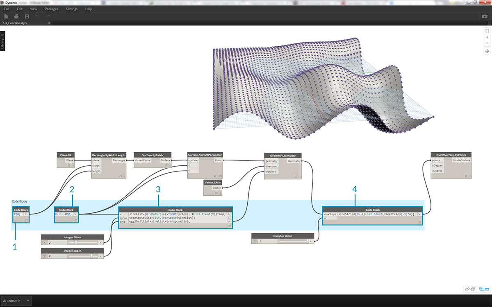

<style>
table{box-shadow: 2px 2px 2px #BBBBBB;max-width:75%;display:block;margin-left: auto;   margin-right: auto }
img{display:block;margin-left: auto;   margin-right: auto }
</style>

## Сокращение

Существует несколько основных способов сокращенной записи команд в блоке кода, что *существенно* упрощает управление данными. Далее мы подробно рассмотрим, как использовать подобные сокращенные записи для создания и запроса данных.

<table>
    <tr>
    <td width="50%"><b>Тип данных</b></td>
    <td width="25%"><b>Стандартный код Dynamo</b> </td>
    <td width="25%"><b>Аналог в блоке кода</b></td>
  </tr>
  <tr>
    <td> Цифры</td>
    <td></img> </td>
    <td></img></td>
  </tr>
  <tr>
    <td>Строки</td>
    <td></img> </td>
    <td></img></td>
  </tr>
  <tr>
    <td>Последовательности</td>
    <td></img> </td>
    <td></img></td>
  </tr>
  <tr>
    <td>Диапазоны</td>
    <td></img> </td>
    <td></img></td>
  </tr>
  <tr>
    <td>Получение элемента по индексу</td>
    <td></img> </td>
    <td></img></td>
  </tr>
  <tr>
    <td>Создание списка</td>
    <td></img> </td>
    <td></img></td>
  </tr>
  <tr>
    <td>Объединение строк</td>
    <td></img> </td>
    <td></img></td>
  </tr>
  <tr>
    <td>Условные выражения</td>
    <td></img> </td>
    <td></img></td>
  </tr>
</table>

### Дополнительный синтаксис

|Узлы|Аналог в блоке кода|Примечание|
| -- | -- | -- |
|Любой оператор (+, &&, >=, Not и т. д.)|+, &&, >=, !, и т. д.|Обратите внимание, что Not заменяется на «!», однако узел называется Not для отличия от Factorial.|
|Boolean True|true;|Все в нижнем регистре|
|Boolean False|false;|Все в нижнем регистре|

### Диапазоны

Метод определения диапазонов и последовательностей можно заменить обычной сокращенной записью. Приведенное ниже изображение можно рассматривать как руководство по использованию синтаксиса «..» для определения списка числовых данных с помощью блока кода. Освоение этой системы записи позволит более эффективно формировать числовые данные: 

> 1. В этом примере числовой диапазон заменяется элементарной синтаксической конструкцией в блоке кода, определяющей ```начало..конец..размер шага;```. В числовом выражении получаем: ```0..10..1;```
2. Обратите внимание на то, что синтаксис ```0..10..1;``` эквивалентен синтаксису ```0..10;```. При сокращенной записи размер шага 1 является значением по умолчанию. Таким образом, значение ```0..10;``` соответствует последовательности от 0 до 10 с размером шага 1.
3. Похожий пример наблюдаем с *последовательностью чисел*. Единственное исключение — знак *#*, указывающий на список из 15 значений, а не на список, увеличивающийся до 15. В данном случае задаются значения ```начало..кол-во шагов..размер шага:```. Окончательный синтаксис последовательности — ```0..#15..2```
4. Разместим символ *#* из предыдущего шага в компоненте *размер шага* синтаксической конструкции. Теперь у нас есть *диапазон чисел*, идущий от *начала* к *концу*, а *размер шага* равномерно распределяет несколько значений между этими двумя точками: ```начало..конец..кол-во шагов```.

### Дополнительные диапазоны

Создание дополнительных диапазонов упрощает работу со списками списков. В примерах ниже переменная изолируется от обозначений основного диапазона и создается другой диапазон этого списка. 

> 1. При создании вложенных диапазонов сравните запись с символом *#* и без него. Действует тот же принцип, что и в случае с основными диапазонами, но в усложненном варианте.
2. Вложенный диапазон может находиться в любом месте основного диапазона. Обратите внимание на возможность наличия двух вложенных диапазонов.
3. Используя различные значения *конца* диапазона, можно создавать дополнительные диапазоны с различной длиной.


> В качестве упражнения сравните две сокращенные записи на изображении выше и попытайтесь проанализировать, как *вложенные диапазоны* и символ *#* влияют на конечный результат.

### Создание списков и получение элементов из списка

С помощью сокращений можно не только создавать списки, но и делать это динамически. Эти списки могут содержать множество типов элементов и поддерживают запросы (помните, что списки — это объекты в объектах). Наконец, в блоке кода для создания списков используются фигурные скобки, а для запроса элементов из списка — квадратные скобки.



> 1. Быстрое создание списков с помощью строк и запрос содержимого списков с помощью индекса элементов.
2. Создание списков с переменными и запрос содержимого с помощью сокращенной записи диапазонов.

Аналогичным образом можно работать с вложенными списками. Учитывайте порядок расположения списков, а для вызова используйте несколько наборов квадратных скобок:


> 1. Определение списка списков.
2. Запрос содержимого списка с помощью одного набора квадратных скобок.
3. Запрос содержимого списка с помощью двух наборов квадратных скобок.

### Упражнение

> Скачайте файл примера для этого упражнения (щелкните правой кнопкой мыши и выберите «Сохранить ссылку как...»). Полный список файлов примеров можно найти в приложении. [Obsolete-Nodes_Sine-Surface.dyn](datasets/7-3/Obsolete-Nodes_Sine-Surface.dyn)

В этом упражнении мы применим навыки сокращенной записи для создания оригинальной яйцевидной поверхности, которая будет определяться диапазонами и формулами. При выполнении упражнения обратите внимание на одновременное использование блока кода и существующих узлов Dynamo. Блок кода используется для обработки больших данных, а узлы Dynamo для наглядности.


> Начните с создания поверхности путем соединения узлов, представленных на изображении выше. Вместо использования узла Number для определения ширины и длины поверхности дважды щелкните в рабочей области в блоке кода введите ```100;```.



> 1. Создайте диапазон от 0 до 1 с 50 делениями. Для этого введите ```0..1..#50``` в блоке кода.
2. Соедините диапазон с узлом *Surface.PointAtParameter*, который извлекает значения *u* и *v* в диапазоне от 0 до 1 по всей поверхности. Не забудьте в качестве режима *Переплетение* выбрать *Декартово произведение*, щелкнув правой кнопкой мыши узел *Surface.PointAtParameter*.


> На этом этапе с помощью первой функции переместим сетку точек вверх по оси Z. Эта сетка будет управлять поверхностью на основе базовой функции.

> 1. Добавьте визуальные узлы в рабочую область, как показано на изображении выше.
2. Вместо узла Formula воспользуемся блоком кода с строкой ```(0..Math.Sin(x*360)...#50)*5;```. Для быстроты мы определяем диапазон с помощью формулы внутри него. Эта формула представляет собой функцию синуса. Функция синуса получает входные данные в градусах в Dynamo, поэтому для получения полной синусоиды необходимо умножить значения *x* (диапазон входных значений от 0 до 1) на *360*. Далее необходимо получить количество делений, соответствующее количеству точек управляющей сетки для каждого ряда, поэтому зададим пятьдесят подразделов, введя *#50*. Наконец, с помощью множителя 5 просто увеличим амплитуду преобразования, чтобы увидеть результат в области предварительного просмотра Dynamo.


> 1. Хотя предыдущие блоки кода работали нормально, процесс был не полностью параметрическим. Так как необходимо динамически изменять параметры, заменим строку из предыдущего шага на ```(0..Math.Sin(x*360*cycles)..#List.Count(x))*amp;```. Это позволит задавать значения на основе входных данных.


> 1. Изменим положение регуляторов (в диапазоне от 0 до 10) и получим интересный результат.


> 1. Транспонируем диапазон чисел, чтобы обратить направление волны: ```transposeList = List.Transpose(sineList);```.


> 1. Добавим элементы sineList и TransitionList, чтобы получить деформированную яйцевидную поверхность: ```eggShellList = sineList+transposeList;```.


> 1. Снова изменим положение регуляторов, чтобы сбалансировать алгоритм.


> 1. Осталось запросить отдельные элементы данных с помощью блока кода. Чтобы сформировать поверхность с определенным диапазоном точек, добавим блок кода, который показан на изображении выше, между узлами *Geometry.Translate* и *NurbsSurface.ByPoints*. В нем содержится строка текста: ```sineStrips[0..15..1];```. С помощью нее будут выбраны первые 16 рядов точек (из 50). Если снова сгенерировать поверхность, можно увидеть, что была создана отдельная часть сетки точек.


> 1. Наконец, чтобы сделать этот блок кода более параметрическим, для запроса воспользуемся регулятором с диапазоном от 0 до 1. Для этого введем следующую строку кода: ```sineStrips[0..((List.Count(sineStrips)-1)*u)];```. Для большей ясности — данная строка кода позволяет представить длину списка в виде множителя с диапазоном от 0 до 1.


> 1. Значение *.53* регулятора позволяет создать поверхность сразу за центром сетки.


> 1. Как и ожидалось, если с помощью регулятора указать значение*1*, поверхность будет создана из всей сетки точек.



> На полученном графике можно выделить блоки кода и увидеть их функции.

> 1. Первый блок кода заменяет узел *Number*.
2. Второй блок кода заменяет узел *Number Range*.
3. Третий блок кода заменяет узел *Formula* (а также *List.Transpose*, *List.Count* и *Number Range*).
4. Четвертый блок кода запрашивает элементы в списке списков, заменяя узел *List.GetItemAtIndex*.

