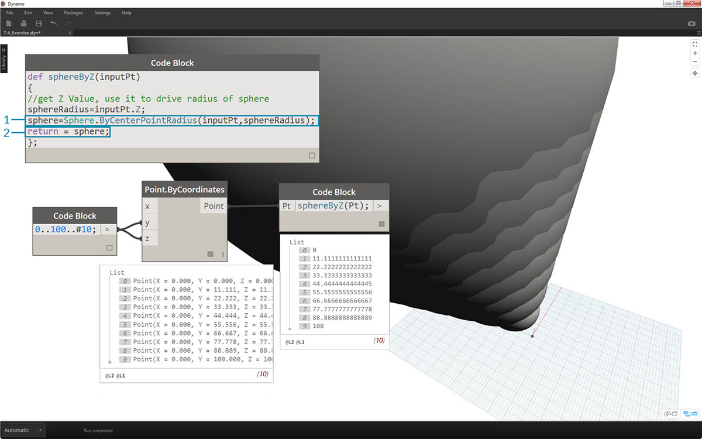

## Функции в узлах Code Block

Узлы Code Block позволяют вставлять в график функции, к которым смогут обращаться другие компоненты программы Dynamo. При этом в параметрическом файле создается еще один слой управления, который можно рассматривать как текстовую версию пользовательского узла. При этом «родительский» узел Code Block легко доступен и может находиться в любом месте графика. И никаких проводов!

### Родительский узел Code Block

Первая строка содержит ключевое слово «def», затем название функции и наименования входных данных в скобках. Тело функции заключено в фигурные скобки. Значение возвращается с помощью оператора «return =». В узлах Code Block, определяющих функцию, отсутствуют порты ввода и вывода, так как они вызываются из других блоков кода. 

```
/*This is a multi-line comment,
which continues for
multiple lines*/
def FunctionName(in1,in2)
{
//This is a comment
sum = in1+in2;
return sum;
};
```

### Дочерние узлы Code Block

Функцию можно вызвать с помощью другого узла Code Block в том же файле, указав имя и такое же число аргументов. Этот процесс аналогичен использованию готовых узлов из библиотеки.


```
FunctionName(in1,in2);
```

### Упражнение

> Скачайте файл примера для этого упражнения (щелкните правой кнопкой мыши и выберите «Сохранить ссылку как...»). Полный список файлов примеров можно найти в приложении. [Functions_SphereByZ.dyn](datasets/7-4/Functions_SphereByZ.dyn)

В этом упражнении мы создадим типовую программу, которая будет генерировать сферы на основе вводимого списка точек. Радиус сфер определяется свойством Z каждой точки.


> Для начала зададим десять числовых значений в диапазоне от 0 до 100. Соединим этот узел с узлом *Point.ByCoordinates* для создания диагональной линии.


> 1. Создайте *Code Block* и введите в него следующую строку кода:
```
def sphereByZ(inputPt){
};
```

*inputPt* — это имя, заданное для точек, которые будут определять функцию. В настоящее время эта функция не выполняет никаких действий, но она будет дополнена по ходу работы.


> 1. Дополним функцию *Code Block*, разместив комментарий и переменную *sphereRadius*, которая запрашивает положение каждой точки по оси *Z*. Напомним, что метод *inputPt.Z* не нужно заключать в скобки. Это *запрос* свойств существующего элемента, поэтому указывать входные данные не требуется.
```
def sphereByZ(inputPt,radiusRatio)
{
//get Z Value, use it to drive radius of sphere
sphereRadius=inputPt.Z;
};
```


> 1. Вызовем функцию, созданную в другом узле *Code Block*. Если дважды щелкнуть в активном окне для создания нового узла *Code Block* и ввести *sphereB*, то вы увидите, что Dynamo предложит использовать созданную выше функцию *sphereByZ*. Функция была добавлена в библиотеку IntelliSense! Неплохо.


> 1. Теперь вызовем функцию и создадим переменную *Pt*, чтобы использовать созданные ранее точки.
```
sphereByZ(Pt)
```

2. Обратите внимание, что на выходе мы получили нулевые значения. С чем это связано? При определении функции был задан расчет переменной *sphereRadius*, но не было указано, что именно функция должна *возвращать* в качестве *выходных данных*. Наших следующим шагом будет исправление этого упущения.


> 1. Это важный шаг: необходимо задать выходные данные функции, добавив строку ```return = sphereRadius``` в функцию *sphereByZ*.
2. Теперь *Code Block* выводит координаты Z каждой точки.



> Создадим сферы, отредактировав *родительскую* функцию.

> 1. Сначала определим сферу с помощью следующей строки кода: ```sphere=Sphere.ByCenterPointRadius(inputPt,sphereRadius);```.
2. Затем изменим возвращаемое значение на *sphere* вместо *sphereRadius*: ```return = sphere;```. В области предварительного просмотра Dynamo появились огромные сферы.


> 1. Чтобы отрегулировать размер этих сфер, изменим значение *sphereRadius*, добавив делитель: ```sphereRadius = inputPt.Z/20;```. Теперь можно различить отдельные сферы и проследить связь между радиусом и значением Z.


> 1. В узле *Point.ByCoordinates* изменим режим переплетения с *Кратчайший* на *Векторное произведение*, в результате чего будет создана сетка точек. Функция *sphereByZ* все еще действует, поэтому все точки создают сферы с радиусами, основанными на значениях Z.


> 1. Для проверки соединим исходный список чисел с входным портом X узла *Point.ByCoordinates*. Мы получили куб из сфер.
2. Примечание. Если для расчета компьютеру требуется много времени, попробуйте уменьшить значение *#10* и задать вместо него, например, *#5*.


> 1. Поскольку созданная нами функция *sphereByZ* является типовой, можно вызвать спираль из предыдущего урока и применить эту функцию к ней.


> И последний шаг: настройка коэффициента радиуса с помощью пользовательских параметров. Для этого необходимо создать новый входной порт для функции и заменить делитель *20* параметром.

> 1. Изменим определение *sphereByZ* на следующее:
```
def sphereByZ(inputPt,radiusRatio)
{
//get Z Value, use it to drive radius of sphere
sphereRadius=inputPt.Z/radiusRatio;
//Define Sphere Geometry
sphere=Sphere.ByCenterPointRadius(inputPt,sphereRadius);
//Define output for function
return sphere;
};
```

2. Обновим дочерние узлы Code Block, добавив переменную *ratio* к входным данным: ```sphereByZ(Pt,ratio);```. Добавим регулятор к только что созданному узлы Code Block. Теперь можно изменять размер радиусов на основе коэффициента.

