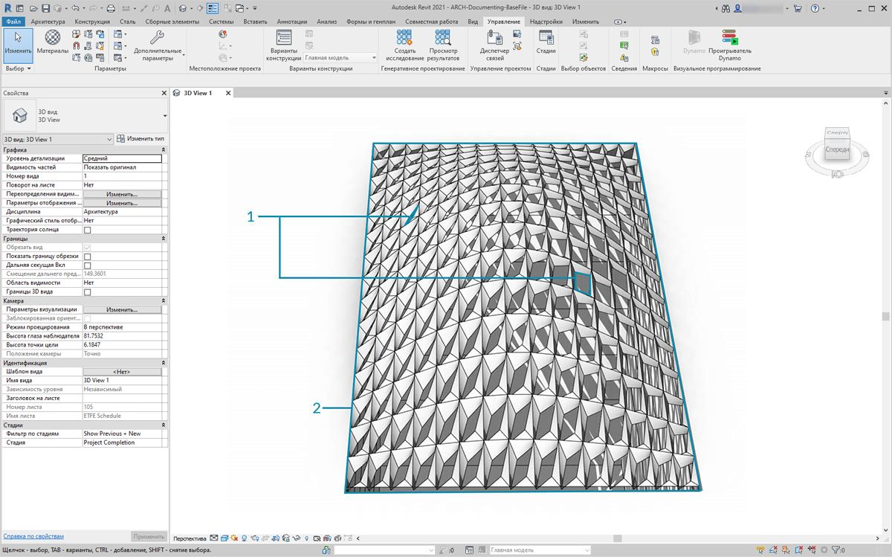
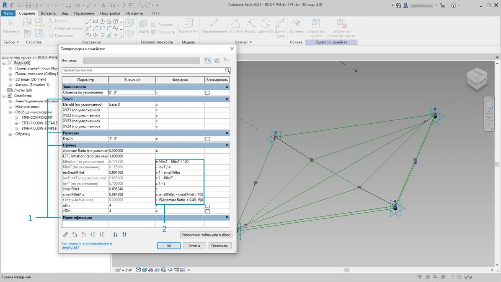
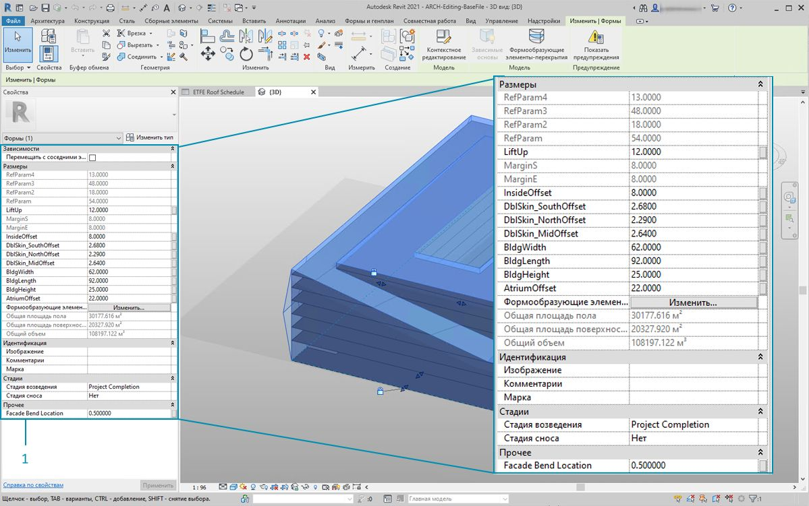
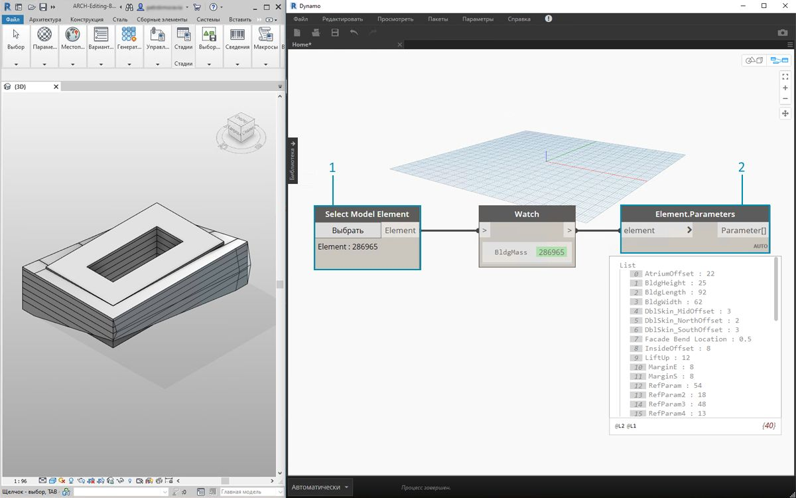
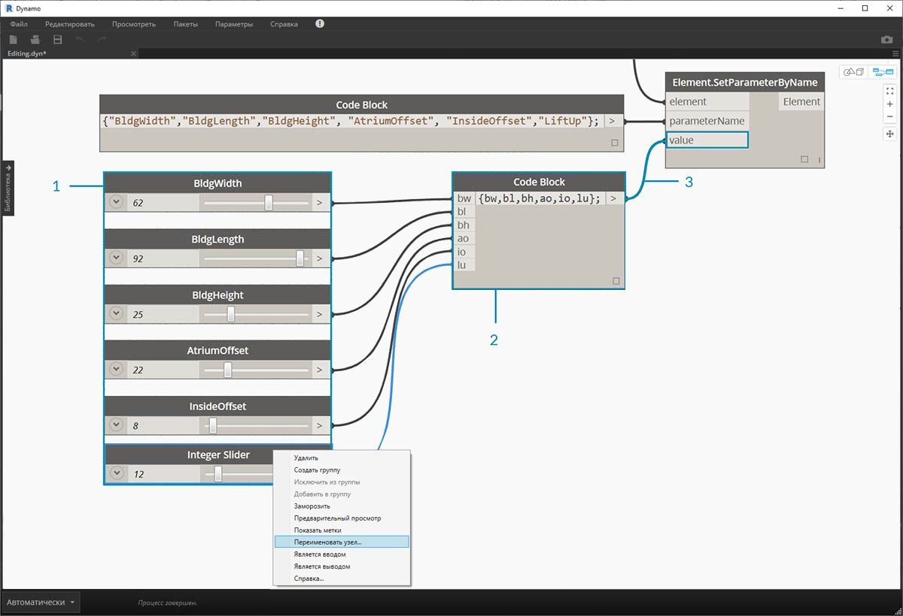
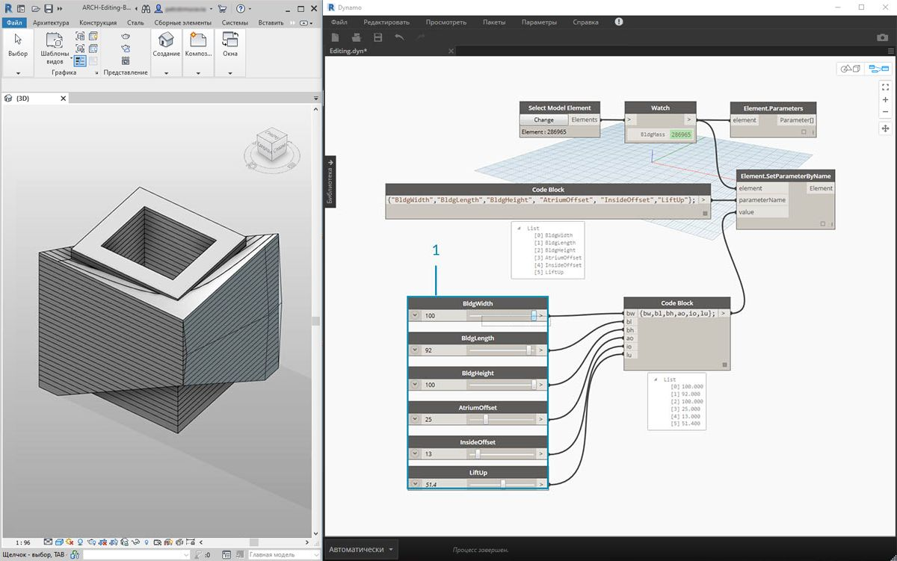
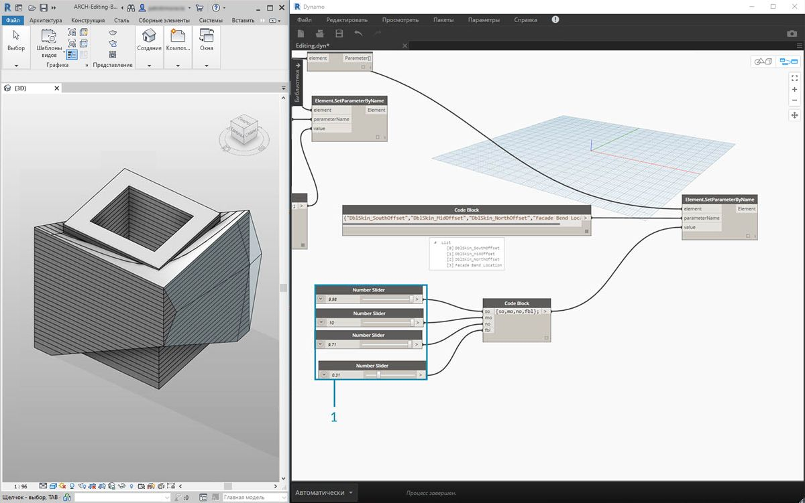

## Редактирование

Одной из мощнейших возможностей Dynamo является редактирование параметров на параметрическом уровне. Например, для управления параметрами массива элементов можно использовать генеративный алгоритм или результаты моделирования. Таким образом, в проекте Revit набору экземпляров из одного семейства можно присвоить пользовательские свойства.

### Параметры типов и экземпляров



> 1. Параметры экземпляра определяют апертуру панелей на поверхности крыши в диапазоне значений коэффициента апертуры от 0,1 до 0,4.
2. Параметры на основе типа применяются к каждому элементу на поверхности, так как они относятся к одному и тому же типоразмеру в семействе. Например, материал каждой панели может определяться параметром на основе типа.



> 1. Если вы уже настраивали семейства Revit, то должны помнить, что необходимо назначить тип параметра (строка, номер, размер и т. д.). При назначении параметров в Dynamo убедитесь, что выбран правильный тип данных.
2. Dynamo можно также использовать в сочетании с параметрическими зависимостями, определенными в свойствах семейства Revit.

Напоминаем, что в Revit существуют параметры типа и параметры экземпляра. Их все можно редактировать в Dynamo, но в данном упражнении рассматриваются параметры экземпляра.

Примечание. По мере открытия новых возможностей, которые обеспечивают параметры редактирования, будет увеличиваться и количество элементов Revit, которые можно изменить с помощью Dynamo. Это может потребовать *дополнительных вычислительных ресурсов*, что, естественно, повлияет на скорость работы. При редактировании большого количества элементов можно воспользоваться узлом заморозки, чтобы приостановить выполнение операций Revit во время создания графика. Для получения дополнительных сведений об узлах заморозки ознакомьтесь с разделом, посвященным заморозке, в [главе о твердых телах](../05_Geometry-for-Computational-Design/5-6_solids.md#freezing).

#### Единицы измерения

Начиная с версии 0.8, в Dynamo практически не используются единицы измерения. Это позволяет модулю оставаться абстрактной средой визуального программирования. Узлы Dynamo, которые взаимодействуют с размерами Revit, будут ссылаться на единицы измерения проекта Revit. Например, если в Revit с помощью Dynamo задается параметр длины, число, указанное в качестве значения в Dynamo, будет соответствовать единицам измерения по умолчанию в проекте Revit. В приведенном ниже упражнении используются метры.


> Для быстрого преобразования единиц измерения используйте узел *Convert Between Units*. Это удобный инструмент для динамического преобразования единиц измерения длины, площади и объема.

### Упражнение

> Скачайте файлы примера для этого упражнения (щелкните правой кнопкой мыши и выберите «Сохранить ссылку как...»). Полный список файлов примеров можно найти в приложении.

> 1. [Editing.dyn](datasets/8-3/Editing.dyn)
2. [ARCH-Editing-BaseFile.rvt](datasets/8-3/ARCH-Editing-BaseFile.rvt)

В этом упражнении основное внимание уделяется редактированию элементов Revit без выполнения геометрических операций в Dynamo. В данном случае геометрия Dynamo не импортируется, а просто редактируются параметры в проекте Revit. Это упражнение базового уровня. Опытным пользователям Revit следует обратить внимание на то, что хотя речь идет о параметрах экземпляров формообразующего элемента, тот же принцип можно применить и к целому массиву элементов. Все действия выполняются с помощью узла Element.SetParameterByName.



> Начнем с файла Revit, используемого в этом разделе в качестве примера. Несущие элементы и адаптивные фермы из предыдущего раздела были удалены. В этом упражнении мы рассмотрим параметрическую оснастку в Revit и манипуляции в Dynamo.

> 1. При выборе здания в разделе «Формообразующий элемент» в Revit на панели «Свойства» отображается массив параметров экземпляра.



> 1. Выберите формообразующий элемент здания с помощью узла *Select Model Element*.
2. Можно запросить все параметры этого формообразующего элемента с помощью узла *Element.Parameters*. Сюда входят параметры типа и экземпляра.


> 1. Для поиска нужных параметров используйте узел *Element.Parameters*. Кроме того, можно выбрать имена параметров для редактирования, изучив панель свойств из предыдущего шага. В данном случае необходимы параметры, которые влияют на большие геометрические перемещения формообразующего элемента здания.
2. Внесем изменения в элемент Revit, используя узел *Element.SetParameterByName*.
3. С помощью *блока кода* зададим список этих параметров, заключая каждый элемент в кавычки, чтобы обозначить его как строку. Можно также использовать узел List.Create с последовательностью узлов *string*, соединенных с несколькими входными параметрами. Работать с блоками кода быстрее и проще. Необходимо лишь убедиться, что строка точно соответствует имени в Revit с учетом регистра: ```{"BldgWidth","BldgLength","BldgHeight", "AtriumOffset", "InsideOffset","LiftUp"};```.



> 1. Кроме того, необходимо указать значения для каждого параметра. Добавьте шесть узлов *Integer Slider* в рабочую область и переименуйте их в соответствии с параметром в списке. Для каждого регулятора установите значение, показанное на изображении выше (сверху вниз — ```62,92,25,22,8,12```).
2. Создайте другой *блок кода*, содержащий список той же длины, что и имена параметров. В этом случае мы присваиваем имена переменным (без кавычек), которые создают входные данные для *блока кода.*Соедините *регуляторы* с соответствующими входными параметрами: ```{bw,bl,bh,ao,io,lu};```.
3. Соедините *блок кода* с узлом *Element.SetParameterByName**. Если установлен флажок «Автоматическое выполнение процесса», результаты отобразятся автоматически.

** Примечание. В этом примере рассматриваются параметры экземпляра, а не параметры типа.*


Как и в Revit, многие параметры зависят друг от друга. Существует множество комбинаций, когда геометрия может нарушаться. Эту проблему можно решить с помощью формул, заданных в свойствах параметров. Кроме того, аналогичный алгоритм можно воспроизвести с помощью математических операций в Dynamo (можно выполнить в дополнение к этому упражнению).
> 1. С помощью следующей комбинации можно придать оригинальный дизайн формообразующему элементу здания: 
```100,92,100,25,13,51.4```


> 1. Скопируем график и рассмотрим остекление фасада, где будет находиться ферма. В данном случае изолируем четыре параметра: ```{"DblSkin_SouthOffset","DblSkin_MidOffset","DblSkin_NorthOffset","Facade Bend Location"};```.
2. Кроме того, создадим *регуляторы чисел* и присвоим им имена соответствующих параметров. Первые три регулятора (сверху вниз) необходимо перенастроить на область [0,10], а последний (*Facade Bend Location*) — на область [0,1]. Эти значения в нисходящем порядке должны начинаться со следующих чисел (хотя сами они произвольные): ```2.68,2.64,2.29,0.5```.
3. Создайте новый *блок кода* и соедините регуляторы: ```{so,mo,no,fbl};```.



> 1. Изменяя *регуляторы* в этой части графика, можно сделать остекление фасада значительно более прочным: ```9,98,10,0,9.71,0,31```.

