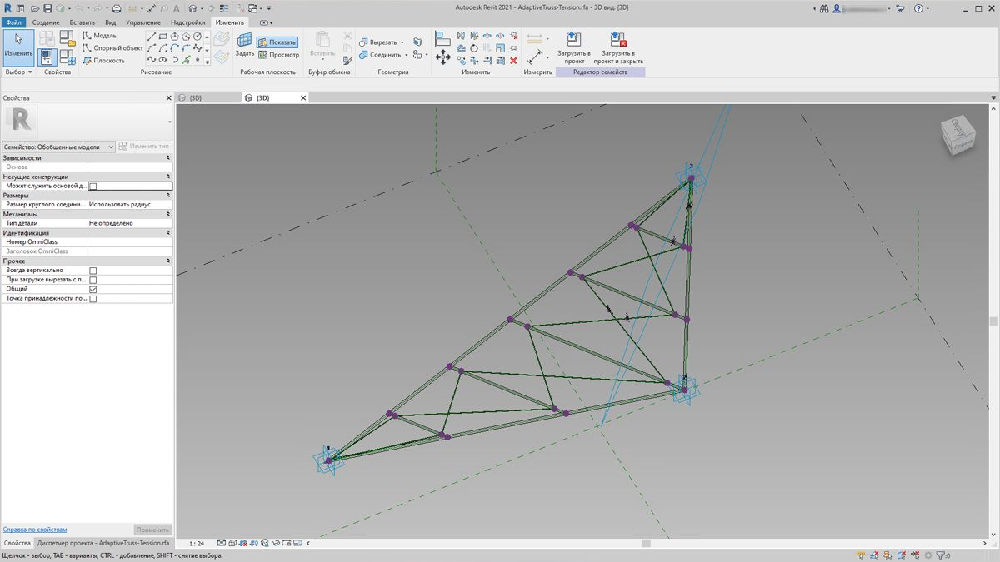
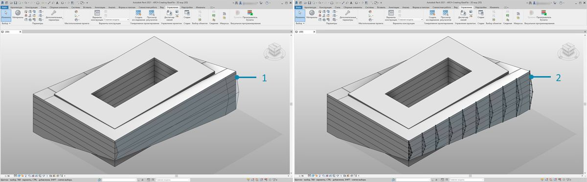
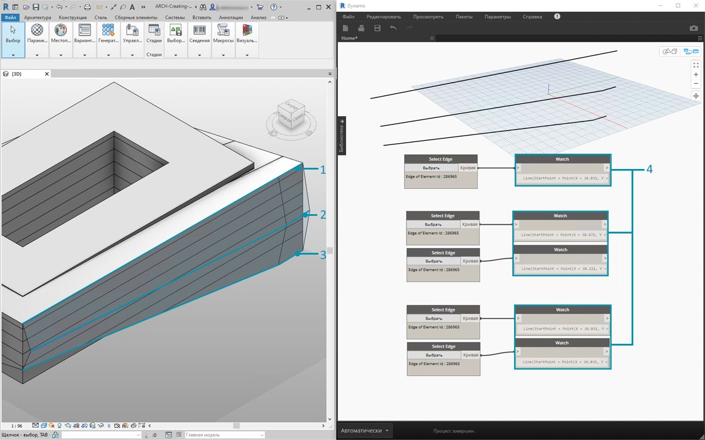
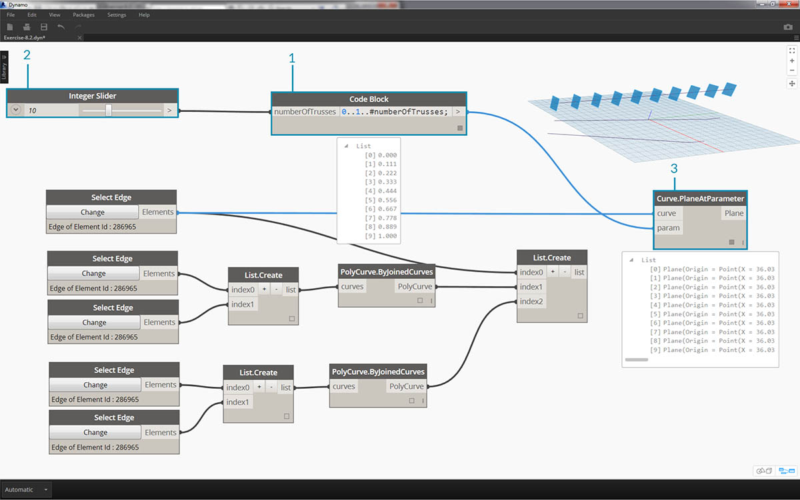
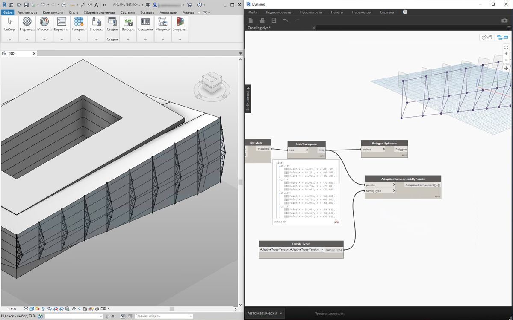
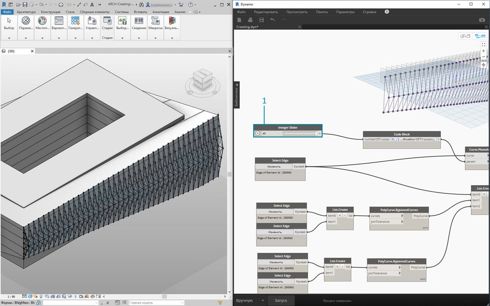
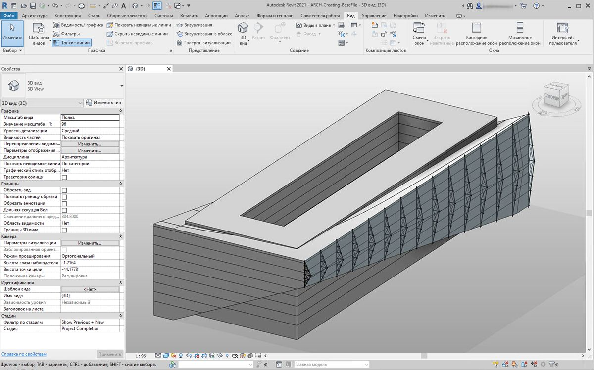
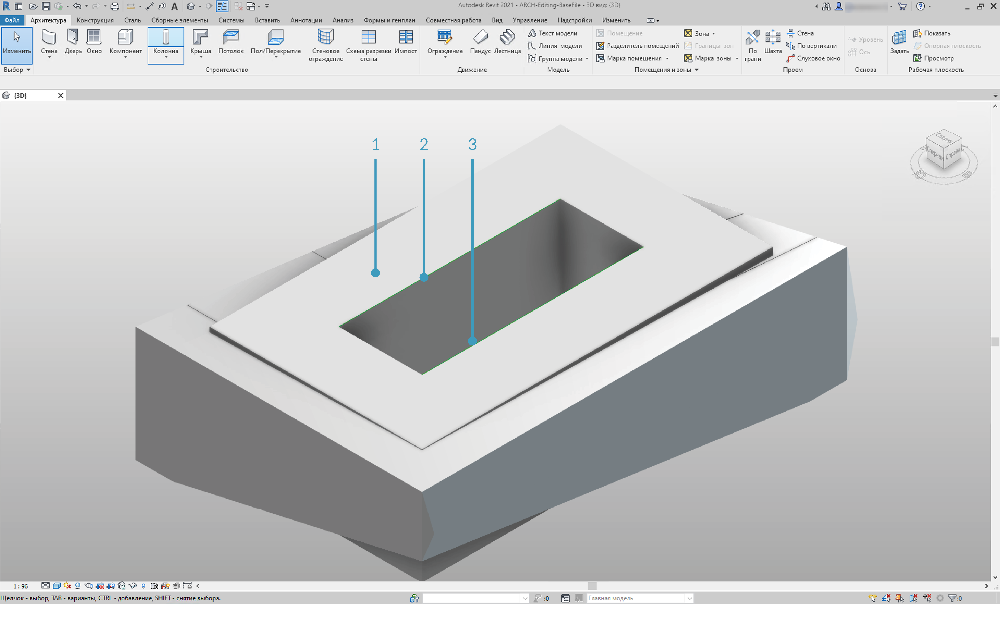
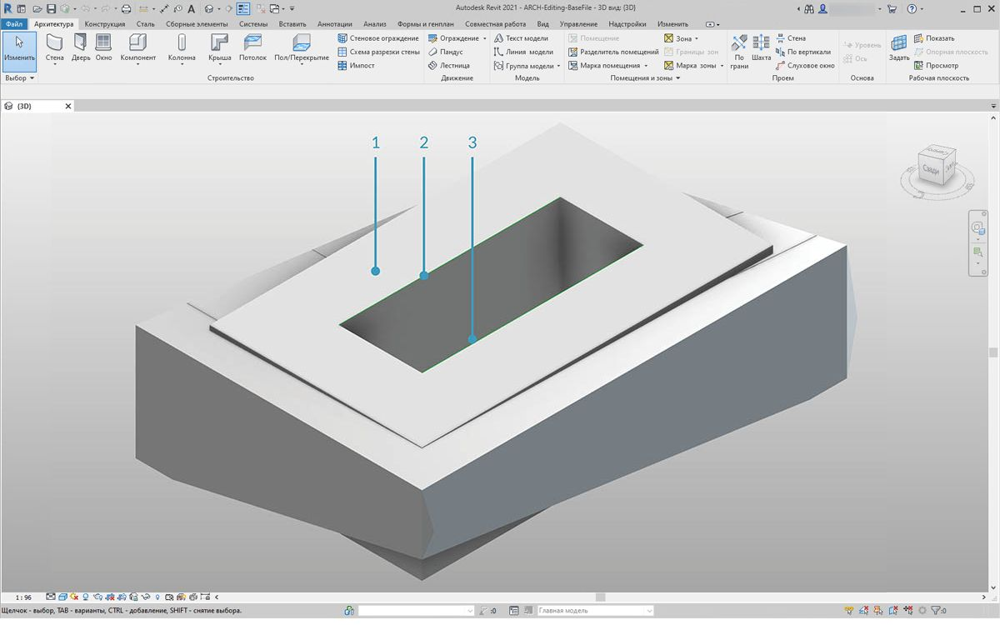
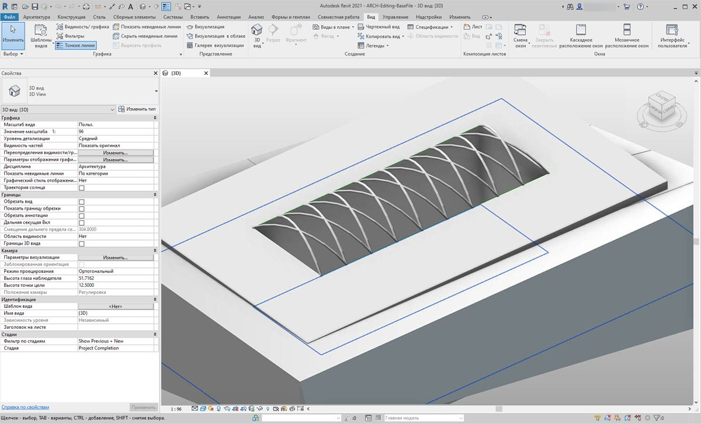

## Создание

В Dynamo можно создать массив элементов Revit с полным параметрическим управлением. Узлы Revit в Dynamo позволяют импортировать элементы из типовых геометрических объектов в категории определенных типов (например, стены и перекрытия). В этом разделе рассматривается импорт параметрически гибких элементов с адаптивными компонентами.


### Адаптивные компоненты

Адаптивный компонент — это гибкая категория семейства, которая хорошо подходит для генеративных приложений. После создания экземпляра можно построить сложный геометрический элемент, который определяется исходным положением адаптивных точек.



> Пример адаптивного компонента на основе трех точек в редакторе семейств. Создается ферма, определяемая положением каждой адаптивной точки. В упражнении ниже с помощью этого компонента будет создана серия ферм по ширине фасада.

#### Принципы взаимодействия

Адаптивный компонент — хороший пример применения взаимодействия. Задав опорные адаптивные точки, можно создать массив адаптивных компонентов. В свою очередь, при переносе этих данных в другие программы есть возможность свести геометрию к простым данным. Примерно такая же логическая схема используется при импорте и экспорте в программе Excel.

Предположим, что консультант по фасадным работам хочет узнать местоположение элементов фермы без разбиения готовой геометрии. При подготовке к производству консультант может указать местоположение адаптивных точек для регенерации геометрии в такой программе, как Inventor.

Рабочий процесс, который будет рассмотрен в упражнении ниже, позволяет получить доступ ко всем этим данным во время создания определения формирования элементов Revit. Благодаря этому можно объединить этапы создания концепции, разработки документации и производства в единый рабочий процесс. В результате формируется более интеллектуальный и эффективный механизм взаимодействия.

#### Несколько элементов и списков


В упражнении ниже описывается, каким образом в Dynamo создаются ссылки на данные для создания элементов Revit. Для формирования нескольких адаптивных компонентов необходимо создать список списков, где в каждом списке будет три точки, соответствующие трем точкам адаптивного компонента. Это будет необходимо учитывать при управлении структурой данных в Dynamo.

### Упражнение

> Скачайте файлы примера для этого упражнения (щелкните правой кнопкой мыши и выберите «Сохранить ссылку как...»). Полный список файлов примеров можно найти в приложении.

> 1. [Creating.dyn](datasets/8-4/Creating.dyn)
2. [ARCH-Creating-BaseFile.rvt](datasets/8-4/ARCH-Creating-BaseFile.rvt)



> Возьмите файл примера из этого раздела (или продолжите работу с файлом Revit из предыдущего сеанса). В файле есть знакомый формообразующий элемент Revit.

> 1. После открытия файл выглядит следующим образом.
2. А в данном случае видна система ферм, созданная при помощи Dynamo и интеллектуально связанная с формообразующим элементом Revit.



> Применив узлы *Select Model Element* и *Select Face*, опустимся на одну ступень вниз по иерархии геометрии и воспользуемся узлом *Select Edge*. Если решатель Dynamo находится в *автоматическом* режиме, то при внесении изменений в файл Revit график будет постоянно обновляться. Кромка, которую необходимо выбрать, динамически привязана к топологии элементов Revit. Пока топология* остается неизменной, связь между Revit и Dynamo не прерывается.

> 1. Выберите самую верхнюю кривую остекленного фасада. Она проходит по всей длине здания. Если выбрать кромку не удается, в Revit можно навести на нее курсор и нажимать клавишу *TAB* до тех пор, пока этот объект не будет выделен.
2. С помощью двух узлов *Select Edge* выберите кромки, представляющие скос в центре фасада.
3. Проделайте то же самое с нижними кромками фасада в Revit.
4. Узлы *Watch* теперь демонстрируют наличие линий в Dynamo. Данные автоматически преобразуются в геометрию Dynamo, так как сами кромки не являются элементами Revit. Эти кривые будут использоваться в качестве опорных элементов для создания экземпляров адаптивных ферм по ширине фасада.

** Примечание. Чтобы сохранить единообразную топологию, используется модель, в которую не были включены дополнительные грани или кромки. Параметры могут изменять ее форму, однако способ ее построения остается неизменным.*


> Сначала нужно соединить кривые и объединить их в общем списке. Это позволит *«сгруппировать»* кривые для выполнения операций с геометрией.

> 1. Создайте список для двух кривых в центре фасада.
2. Объедините две кривые в сложную кривую, встроив компонент *List.Create* в узел *Polycurve.ByJoinedCurves*.
3. Создайте список для двух кривых в нижней части фасада.
4. Объедините эти две кривые в сложную кривую, встроив компонент *List.Create* в узел *Polycurve.ByJoinedCurves*.
5. Наконец, объедините три основные кривые (одну линию и две сложные кривые) в один список.



> Воспользуйтесь верхней кривой, которая представляет собой линию, расположенную по всей ширине фасада. Создайте плоскости вдоль этой линии для пересечения с набором кривых, которые были сгруппированы в списке.

> 1. С помощью *блока кода* задайте диапазон, используя синтаксис ```0..1..#numberOfTrusses;```
2. Встройте узел *Integer Slider* в набор входных данных для блока кода. Как можно догадаться, он будет задавать количество ферм. Обратите внимание, что регулятор контролирует количество объектов в диапазоне от *0* до *1*.
3. Встройте *блок кода* в набор входных данных *param* узла *Curve.PlaneAtParameter*, а верхнюю кромку — в набор входных данных *curve*. Будет создано десять плоскостей, равномерно распределенных по ширине фасада.


> Плоскость — это абстрактный элемент геометрии, представляющий собой бесконечное двумерное пространство. Плоскости отлично подходят для создания контуров и пересечений, что и требуется на данном этапе.

> 1. Используя узел *Geometry.Intersect* (обратите внимание на режим переплетения «Декартово произведение»), встройте компонент *Curve.PlaneAtParameter* в набор входных данных *entity* узла *Geometry.Intersect*. Встройте основной узел *List.Create* в набор входных данных *geometry*. Теперь на видовом экране Dynamo можно увидеть точки, обозначающие пересечение кривых с заданными плоскостями.


> Обратите внимание, что выходные данные содержат список, в который вложен список с еще одним вложенным списком. Слишком большое число списков для решаемой задачи. Необходимо частично выровнять их. Спустимся на шаг вниз по списку и применим к результату функцию выравнивания. Для этого используем операцию *List.Map*, описанную в главе о списках.

> 1. Встройте узел *Geometry.Intersect* в набор входных данных List узла *List.Map*.
2. Встройте узел *Flatten* в набор входных данных f(x) узла *List.Map*. В результате получится 3 списка с количеством элементов, соответствующим количеству ферм.
3. Необходимо изменить эти данные. Для создания экземпляра фермы следует использовать такое же количество адаптивных точек, какое определено в семействе. Так как адаптивный компонент состоит из трех точек, вместо трех списков, содержащих по 10 элементов (numberOfTrusses), необходимо получить 10 списков с тремя элементами в каждом. Так можно создать 10 адаптивных компонентов.
4. Встройте узел *List.Map* в узел *List.Transpose*. Теперь получены нужные данные.
5. Чтобы убедиться в правильности данных, добавьте узел *Polygon.ByPoints* в рабочую область и проверьте результат в области предварительного просмотра Dynamo.


> Массив адаптивных компонентов создается так же, как полигоны.

> 1. Добавьте узел *AdaptiveComponent.ByPoints* в рабочую область, встройте узел *List.Transpose* в набор входных данных *points*.
2. С помощью узла *Family Types* выберите семейство *AdaptiveTruss* и встройте его в набор входных данных *familySymbol* узла *AdaptiveComponent.ByPoints*.



> Если проверить результаты в Revit, можно увидеть десять ферм, равномерно размещенных по ширине фасада.



> 1. Для «зондирования» графика увеличим значение *numberOfTrusses* до *40* с помощью *Integer Slider*. В итоге получилось слишком большое и нереальное количество ферм, но при этом параметрическая связь действует.


> 1. Чтобы упростить систему ферм, уменьшим их количество (*numberOfTrusses*) до *15*.



> В качестве финальной проверки выберем формообразующий элемент в Revit и отредактируем параметры экземпляра. После изменения формы здания ферма должна тоже измениться. Обратите внимание, что это изменение можно наблюдать, только если график Dynamo открыт. Сразу после закрытия связь будет разорвана.

### Элементы DirectShape

Еще одним способом импорта параметрической геометрии Dynamo в Revit является DirectShape. В целом элемент DirectShape и связанные классы отвечают за хранение созданных во внешних программах геометрических форм в документах Revit. Геометрия может включать в себя замкнутые тела или сети. Основной задачей DirectShape является импорт форм из других форматов данных, например IFC или STEP, когда недостаточно информации для создания реального элемента Revit. Как и при работе с форматами IFC и STEP, функция DirectShape подходит для импорта созданных в Dynamo геометрических объектов в проекты Revit в качестве реальных элементов.

Рассмотрим импорт геометрии Dynamo в проект Revit с помощью DirectShape. С помощью этого метода можно назначить категорию, материал и имя импортированной геометрии, сохранив при этом параметрическую связь с графиком Dynamo.

### Упражнение

> Скачайте файлы примера для этого упражнения (щелкните правой кнопкой мыши и выберите «Сохранить ссылку как...»). Полный список файлов примеров можно найти в приложении.

> 1. [DirectShape.dyn](datasets/8-4/DirectShape.dyn)
2. [ARCH-DirectShape-BaseFile.rvt](datasets/8-4/ARCH-DirectShape-BaseFile.rvt)



> Сначала откройте файла примера для этого урока — ARCH-DirectShape-BaseFile.rvt.

> 1. На 3D-виде отображается формообразующий элемент здания из предыдущего урока.
2. Вдоль кромки атриума имеется одна базовая кривая. Она будет использоваться в Dynamo в качестве опорной.
3. Вдоль противоположной кромки атриума проходит еще одна базовая кривая. Она также будет использоваться в Dynamo в качестве опорной.


> 1. Чтобы установить связь с геометрией в Dynamo, используем узел *Select Model Element* для каждого элемента в Revit. Выберите формообразующий элемент в Revit и импортируйте геометрию в Dynamo с помощью функции *Element.Faces*. Формообразующий элемент должен отображаться в области предварительного просмотра Dynamo.
2. Импортируйте первую базовую кривую в Dynamo с помощью функций *Select Model Element* и *CurveElement.Curve*.
3. Импортируйте вторую базовую кривую в Dynamo с помощью функций *Select Model Element* и *CurveElement.Curve*.


> 1. Если уменьшить масштаб графика и панорамировать его вправо, можно увидеть большую группу узлов. Это геометрические операции, которые создают решетчатую конструкцию на крыше в области предварительного просмотра Dynamo. Эти узлы генерируются с помощью функции *Node to Code*, описанной в [разделе о блоках кода](../07_Code-Block/7-2_Design-Script-syntax.md#Node) данного учебника.
2. Конструкция определяется тремя основными параметрами: Diagonal Shift, Camber и Radius.


> Увеличьте масштаб отображения параметров этого графика. Можно выполнить их зондирование, чтобы получить другие выходные данные геометрии.



> 1. Если поместить узел *DirectShape.ByGeometry* в рабочую область, можно увидеть, что он имеет четыре набор входных данных: **geometry, category, material** и **name**.
2. Геометрия представляет собой твердое тело, созданное на базе части графика, с помощью которой формируется геометрия.
3. Входные данные категории выбираются с помощью узла *Categories*. В данном случае используется значение Structural Framing.
4. Входные данные материала выбираются с помощью вышеупомянутого массива узлов, хотя в данном случае проще задать значение по умолчанию.



> Вернитесь в Revit после выполнения сценария Dynamo. Импортированную геометрию можно видеть на крыше в проекте. Это скорее не обобщенная модель, а элемент несущего каркаса. Параметрическая связь с Dynamo сохраняется.


